<div align="center">

# 💧 FLOW

### Finance Intelligence OS · 可追溯、确定性、可复核的财务分析平台

**企业内部 AI 财务分析工作台为最终产品 · 公开财报分析模块先行成熟共享底座（D052–D054）**

**Languages / 语言**: [简体中文](./README.md) · [English (planned)](./README.en.md)（规划中，欢迎 PR）

[](https://github.com/davyzhong/FLOW/actions/workflows/ci.yml)


**版本化数据** · **确定性指标** · **证据复核** · **冻结报告**

    

[快速开始](#-快速开始) · [界面导览](#%EF%B8%8F-界面导览) · [真实财报分析](#-真实财报图形化分析) · [知识治理](#-静态知识治理项目自己的知识生产线) · [系统架构](#%EF%B8%8F-系统架构) · [当前进度](#-当前进度与边界) · [文档中心](docs/README.md)

> **📚 v2 适配说明**：本 README 按 readme-craft v3.0.0-alpha.0 方法论（[16 铁律 + 10 反模式 + 80 分量表](https://github.com/davyzhong/readme-craft/blob/main/METHODOLOGY.md)）适配。**保留全部原有内容**——mermaid 架构图、截图、详细章节不删改；**新增** YAML 元数据、5 路启动、i18n 链接、Built by、Roadmap v2、收尾五件套与同行对照视角。

</div>

---

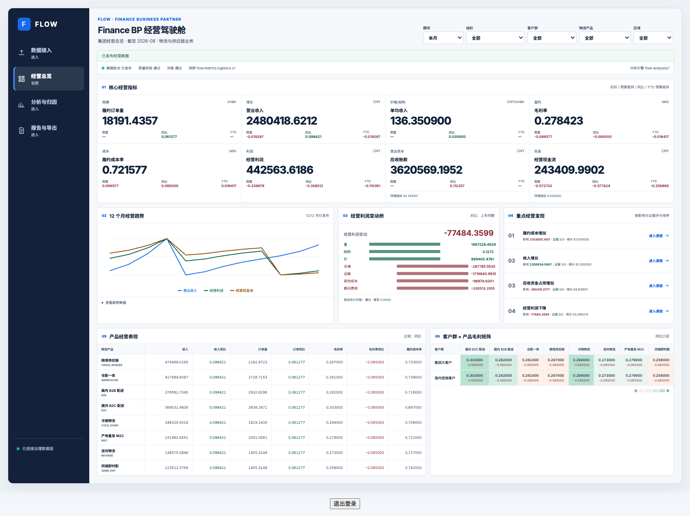

> 截图来自 `c1a59d1` 的真实页面和确定性物流演示数据，不是客户数据或设计效果图。文档核对日期：**2026-09-08**，读取基线 `861acad`。截图保留原拍摄日期，不代表本次最新界面。当前产品方向已由 2026-09-13 战略重构（[D052–D054](docs/10_governance/DECISION_INDEX.md)）重新定义为**三层两模块**：企业内部月度财务经营分析工作台是最终目标产品，公开财报分析是先行成熟共享底座的独立模块；功能实现与生产部署验收分别记录。

## 🏛️ 三层两模块：产品结构一图

项目的目标结构（[D053](docs/10_governance/decisions/D053--三层两模块边界与执行顺序.md)）——**可见的专业治理底座 + 共享分析底座，支撑两个面向不同受众的模块**：

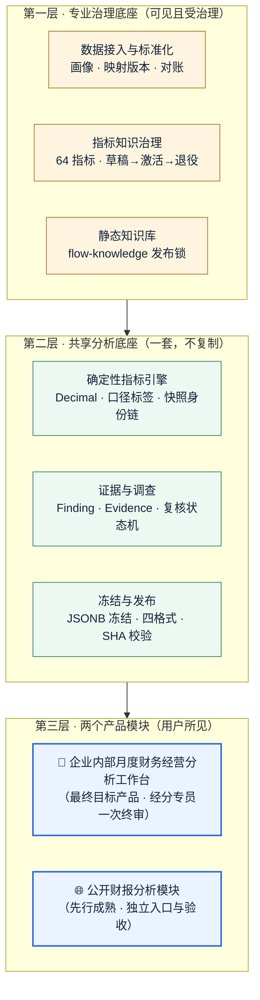
```mermaid
flowchart TB
    subgraph L3["第三层 · 两个产品模块（用户所见）"]
        direction LR
        M1["🏢 企业内部月度财务经营分析工作台<br/>（最终目标产品 · 经分专员一次终审）"]
        M2["🌐 公开财报分析模块<br/>（先行成熟 · 独立入口与验收）"]
    end
    subgraph L2["第二层 · 共享分析底座（一套，不复制）"]
        direction LR
        S1["确定性指标引擎<br/>Decimal · 口径标签 · 快照身份链"]
        S2["证据与调查<br/>Finding · Evidence · 复核状态机"]
        S3["冻结与发布<br/>JSONB 冻结 · 四格式 · SHA 校验"]
    end
    subgraph L1["第一层 · 专业治理底座（可见且受治理）"]
        direction LR
        G1["数据接入与标准化<br/>画像 · 映射版本 · 对账"]
        G2["指标知识治理<br/>64 指标 · 草稿→激活→退役"]
        G3["静态知识库<br/>flow-knowledge 发布锁"]
    end
    L1 --> L2 --> L3
    classDef module fill:#eaf3ff,stroke:#2463eb,color:#14243a,stroke-width:2px
    classDef shared fill:#ecf8f1,stroke:#2e8562,color:#14243a
    classDef gov fill:#fff4df,stroke:#ac761f,color:#14243a
    class M1,M2 module
    class S1,S2,S3 shared
    class G1,G2,G3 gov
```

> 两模块**共享同一底座与数字身份链**，区别只在数据定义与验收口径；公开模块先行成熟（14 份真实财报已验证），内部工作台待数据授权与四级验证。

## 🎯 FLOW 解决什么问题

财务经营分析专员（经分专员）的月度工作通常横跨多份 Excel：业务量、收入与履约成本、财务实际、预算、应收和现金。FLOW 将这些文件转换为有版本、有质量检查、有血缘的数据，再由确定性引擎与 AI 角色协同完成标准扫描、调查、Finding 和双版本报告；经分专员一次终审后正式发布（[D052](docs/10_governance/decisions/D052--内部月度财务经营分析工作台成为核心产品.md)、[D054](docs/10_governance/decisions/D054--AI生产链与证据计算学习原则.md)）。

项目长期方向是 Finance Intelligence OS。目标结构为**三层两模块**（[D053](docs/10_governance/decisions/D053--三层两模块边界与执行顺序.md)）：可见的专业治理底座 + 共享分析底座，支撑**企业内部分析工作台**（最终目标产品）与**公开财报分析模块**（先行成熟底座、独立入口与验收）。U8 已完成并冻结，当前执行主线为 S01 战略边界、Financial Facts Contract V2 与安全/RBAC/审计门禁；旧 U9/U10 任务重新裁决。固定产品原则见 [PRODUCT_PRINCIPLES](docs/20_product/PRODUCT_PRINCIPLES.md)。

<details open>
<summary><strong>六类工作问题 → 可复核的结果</strong></summary>

| 工作问题 | FLOW 的处理方式 | 可复核的结果 |
| --- | --- | --- |
| 工作表名称、列顺序、字段格式不一致 | 工作簿画像、别名映射、人工覆盖、版本化转换 | 映射版本、源文件 SHA、原始值与转换事件 |
| 业务收入与财务收入对不上 | 发布前质量检查与跨域对账 | 阻断项、警告确认原因、对账结果 |
| 页面数字与报告数字不一致 | 指标口径版本 + 指标快照 + 冻结报告内容 | 同一身份链、精确数值和计算轨迹 |
| 异常解释缺少证据 | 驱动贡献、公式、源记录、证据复核 | Finding、Evidence、Conclusion、追加式审阅事件 |
| AI 文字难以审计 | 受约束上下文、对象引用、数字一致性检查 | 结构化回答、降级原因、持久化交互记录 |
| 原报告重导出后内容发生变化 | 冻结完整 JSONB 视图，导出仅读冻结内容 | 稳定报告版本、独立发布尝试与下载校验 |

</details>

## 🗺️ 一张图理解工作流

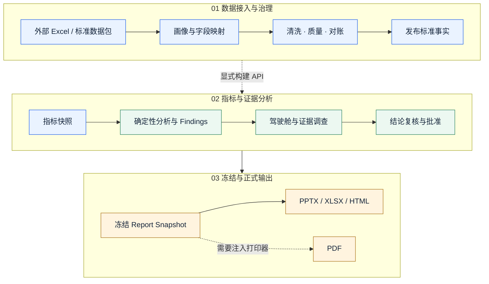
```mermaid
flowchart TB
    subgraph Intake["01 数据接入与治理"]
        direction LR
        A[外部 Excel / 标准数据包] --> B[画像与字段映射]
        B --> C[清洗 · 质量 · 对账]
        C --> D[发布标准事实]
    end
    subgraph Analysis["02 指标与证据分析"]
        direction LR
        E[指标快照] --> F[确定性分析与 Findings]
        F --> G[驾驶舱与证据调查]
        G --> H[结论复核与批准]
    end
    subgraph Publishing["03 冻结与正式输出"]
        direction LR
        I[冻结 Report Snapshot] --> J["PPTX / XLSX / HTML"]
        I -. 需要注入打印器 .-> K[PDF]
    end
    Intake -. 显式构建 API .-> Analysis
    Analysis --> Publishing
    classDef data fill:#eaf3ff,stroke:#2463eb,color:#14243a
    classDef review fill:#ecf8f1,stroke:#2e8562,color:#14243a
    classDef output fill:#fff4df,stroke:#ac761f,color:#14243a
    class A,B,C,D,E data
    class F,G,H review
    class I,J,K output
```

实线表示已有领域处理关系；虚线标出尚需显式编排或部署集成的环节。当前“发布导入版本”只发布标准事实，**不会自动启动该批次的指标计算与分析运行**。已提供 `POST /api/v1/orchestration/batches/{id}/build`，按批次期间同步构建并保留任务状态；公开财报浏览器闭环仍按下一阶段验收。

## 🖥️ 界面导览

当前浏览器入口：`/`（驾驶舱）、`/data`、`/investigations`、`/reports`、`/statements`、`/metric-library`、`/operations`、`/login`。现有页面仍按历史双轨结构（D045，已被 [D053](docs/10_governance/decisions/D053--三层两模块边界与执行顺序.md) 取代）组织：**「数据层」两轨共用**；**「财务分析」轨**（驾驶舱、归因、报告、报表分析、指标库）；**「经营分析」轨**（`/operations` 只读演示页）。全部功能页共享同一左侧工作流导航。主导航与工作流的大规模改造由当前 S01 按三层两模块目标结构推进。

### 1. Finance BP 驾驶舱

首页汇集八个核心指标卡、12 个月趋势、经营利润变动桥、重点 Findings、产品表现表和客户群 × 产品毛利矩阵。筛选维度包括期间、组织、客户群、物流产品和区域；进入调查时携带批次、指标快照和分析运行身份。

> 物流执行子集原有 15 项、首页八项；财务知识库现有 **64 项**定义（指标库 v1.1），登记数不等于任意财报可算数。

### 2. 数据工作台：把文件转换为可发布数据

流程为 **准备 → 上传与画像 → 映射确认 → 清洗与校验 → 发布**。

- 支持标准工作簿与非标准物流示例工作簿；
- 人工覆盖提交真实源文件 SHA，确认后继续使用已持久化的映射版本；
- 清洗结果显示转换、质量问题和财务对账；警告必须填写确认原因，阻断项和未通过的对账必须处理；
- 发布后可下载标准化 XLSX，用于核对与交换。

<details>
<summary><strong>展开：字段映射与清洗校验界面</strong></summary>

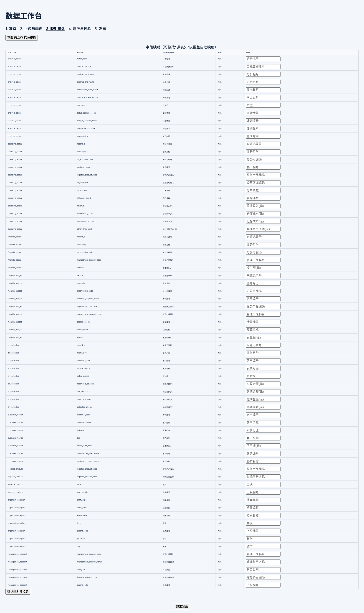

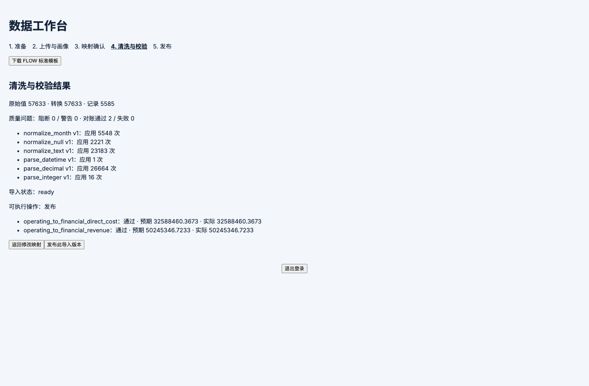

</details>

### 3. Investigation：从发现回到证据

调查页提供异常定义、影响金额、驱动桥、计算明细、对账与质量状态、源记录、公式和数据血缘。结论分为**已验证事实、分析判断、待确认问题、建议行动**；批准由状态机控制。

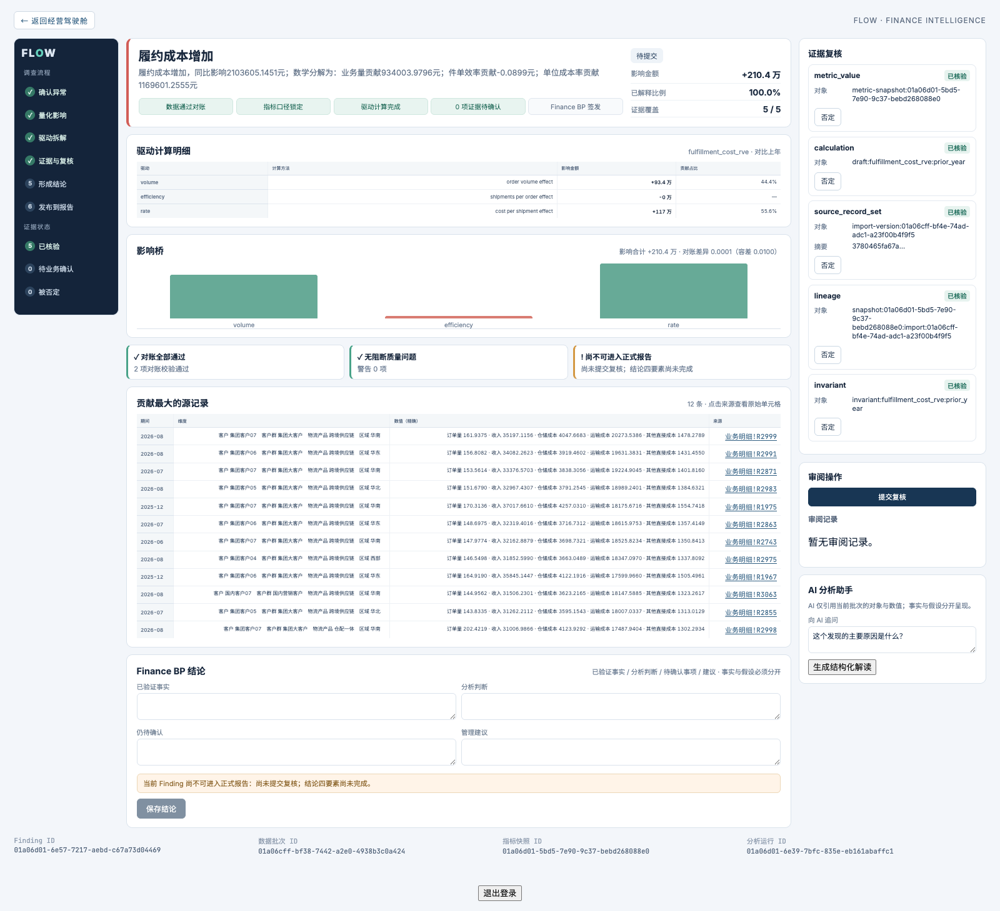

**四问工作台的回答闭环**（U7 已交付，方法论权威见知识卡 METHOD-QA-001）——每个异动都走完同一条可审计的递进链：

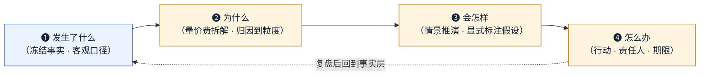
```mermaid
flowchart LR
    Q1["❶ 发生了什么<br/>（冻结事实 · 客观口径）"] --> Q2["❷ 为什么<br/>（量价费拆解 · 归因到粒度）"]
    Q2 --> Q3["❸ 会怎样<br/>（情景推演 · 显式标注假设）"]
    Q3 --> Q4["❹ 怎么办<br/>（行动 · 责任人 · 期限）"]
    Q4 -. 复盘后回到事实层 .-> Q1
    classDef fact fill:#eaf3ff,stroke:#2463eb,color:#14243a
    classDef infer fill:#fff4df,stroke:#ac761f,color:#14243a
    class Q1 fact
    class Q2,Q3,Q4 infer
```

批准后的证据若被拒绝，或结论被修改，Finding 会退回复核并留下事件记录；没有证据的 Finding 不能批准。已冻结报告保留签发时内容，新的报告版本重新检查当前资格。

### 4. 报告中心：冻结、生成、追踪与下载

报告中心可以冻结已发布指标快照中的批准 Findings，选择报告版本和输出格式，查看各次生成尝试并下载成功产物。冻结表单已提供可视化快照候选选择器；下图为较早版本，不能用于判断最新交互。

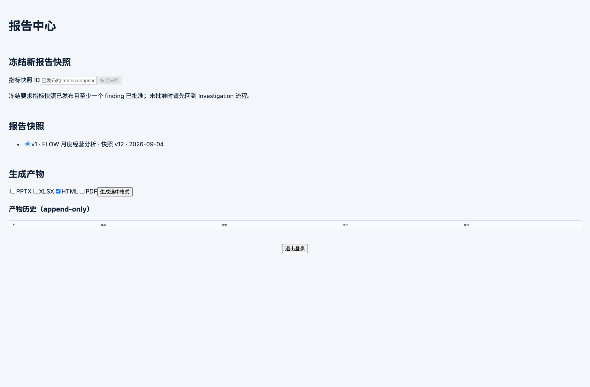

<details>
<summary><strong>展开：登录入口与移动端工作台</strong></summary>

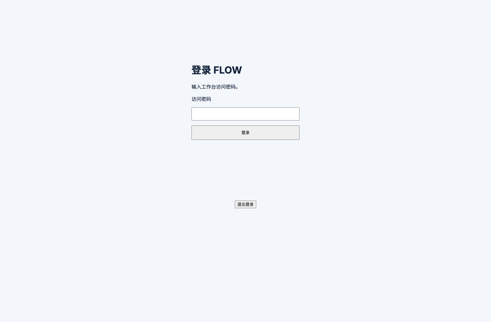

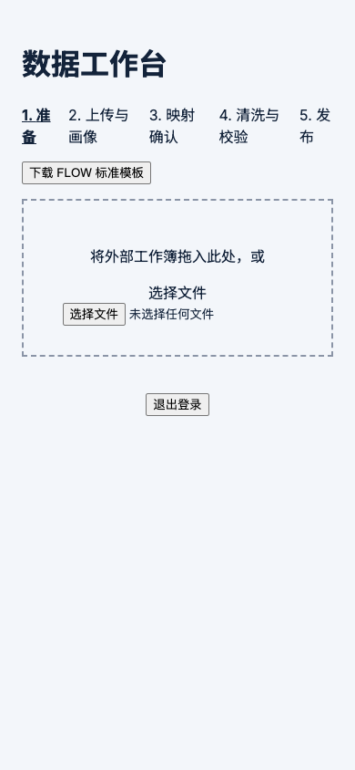

</details>

截图环境、数据来源和操作记录见 [界面截图说明](docs/assets/screenshots/README.md)。

## 📊 真实财报图形化分析

项目用真实公开财报验证「准确性承诺」（[D041/D042](docs/knowledge-base/04_decisions/DECISION_LOG.md)）：管道自动抽取财报 PDF 中的报表行项目，经勾稽与跨文档比对后重建四表一注，并以同一批冻结数据生成图形化分析。**所有图表在生成期做闭合校验，数字零手工调整；口径差异与披露缺失显式标注，不推测填补。**

目前已完成 **5 家公司、14 份报告**的反向解析并全部导入系统（`statement_report` / `statement_line_item`），在 **`/statements` 报表分析页**按报告切换呈现 KPI 卡、利润形成瀑布、资产/资本结构环形、现金流三活动柱状、现金桥与四表全量行项目；数值保持披露原值与单位，展示层只做单位缩放，溯源到原文 SHA-256：

| 公司 | 报告 | 准则 | 行项目 | 勾稽验证 |
| --- | --- | --- | --- | --- |
| 顺丰控股 002352.SZ | 2026 一季报 | CAS | 163 | 报表内 20/20；跨文档 12/12 |
| 腾讯控股 0700.HK | 2026 Q2 业绩公告 | IFRS + Non-IFRS | 20 | 分部加总、毛利链、IFRS→Non-IFRS 调节链全闭合 |
| 京东物流 2618.HK | FY2025 年报 | IFRS | 118 | IFRS 勾稽 24/24（两期全验） |
| 阿里巴巴 9988.HK | FY2019–FY2026 八份年报 | IFRS（US GAAP 口径披露） | 52–53 × 8 | 八年连续期间序列 |
| 菜鸟集团（未上市） | FY2021–FY2023 招股书申报稿 | IFRS | 105 × 3 | 招股书三期连续 |

重建数据库后执行 `bash scripts/seed_p5_statements.sh` 即可幂等恢复全部 14 份报告（同时幂等补齐本地开发所需的 service_account 身份绑定，否则启用 `AUTH_TOKEN` 后 API 一律 401）。抽取产物与验证记录见 [docs/implementation/p5](docs/implementation/p5/P5-validation-summary.md)。

### 指标覆盖矩阵与事实库（P5 Facts V1）

14 份报告的抽取行项目经 [item_alias_map](docs/implementation/p5/item_alias_map_v1.yaml)（CAS/IFRS 行名 → 标准科目，含 `#n` 重名消歧与组合映射）归一化为 **670 条科目事实**（[statement_facts.yaml](docs/implementation/p5/statement_facts.yaml)，670 事实 / 630 条有意未映射的口径不纯行全部留痕），并由 `python3 scripts/p5_query_facts.py` 计算 **40 个通用指标 × 15 个公司期间快照**的可计算覆盖矩阵（[metric_coverage_matrix.md](docs/implementation/p5/metric_coverage_matrix.md) + 机读数据集 [p5_metric_coverage_v1.yaml](config/metrics/p5_metric_coverage_v1.yaml)）：顺丰 2026Q1 35/40、京东物流 FY2025 29/40、菜鸟 FY2022–23 26/40、阿里巴巴多数年度 22/40、腾讯单季 7/40；每个缺口格子都带首个缺失科目原因（如「缺 bs.ar(end)」），口径约定（avg=（期末+期初）/2、单季未年化、绝对额已换算亿元）随数据集下发。在线入口：`/metric-library` 页的「真实财报覆盖」tab（只读端点 `GET /api/v1/metric-library/coverage`）。

### 静态资料库：离线浏览全部静态内容（零服务器 / 零数据库）

所有版本化静态数据集打包为单文件离线站点 **[docs/library/index.html](docs/library/index.html)**（约 485 KB，双击即可用浏览器打开，file:// 直开、无需任何服务）：左侧菜单、右侧内容，覆盖 数据集总览、通用指标 49 项、物流行业指标 15 项、勾稽与分解关系、CAS↔IFRS 取数映射 28 项、会计科目 167 个、准则登记册与分录模板 32 套、指标覆盖矩阵、14 份财报原文表格浏览器（公司/期间切换）、670 条事实库（按公司/报表筛选）、经营指标字典。数据集更新后重新生成：

```bash
python3 scripts/build_static_library_site.py
```

### 顺丰控股 2026Q1：四表可视化分析

从 2026 一季报原文抽取 **163 个报表行项目**（报表内勾稽 20/20、与 FY2025 年报跨文档比对 12/12 一致），生成十个板块的分析视图：

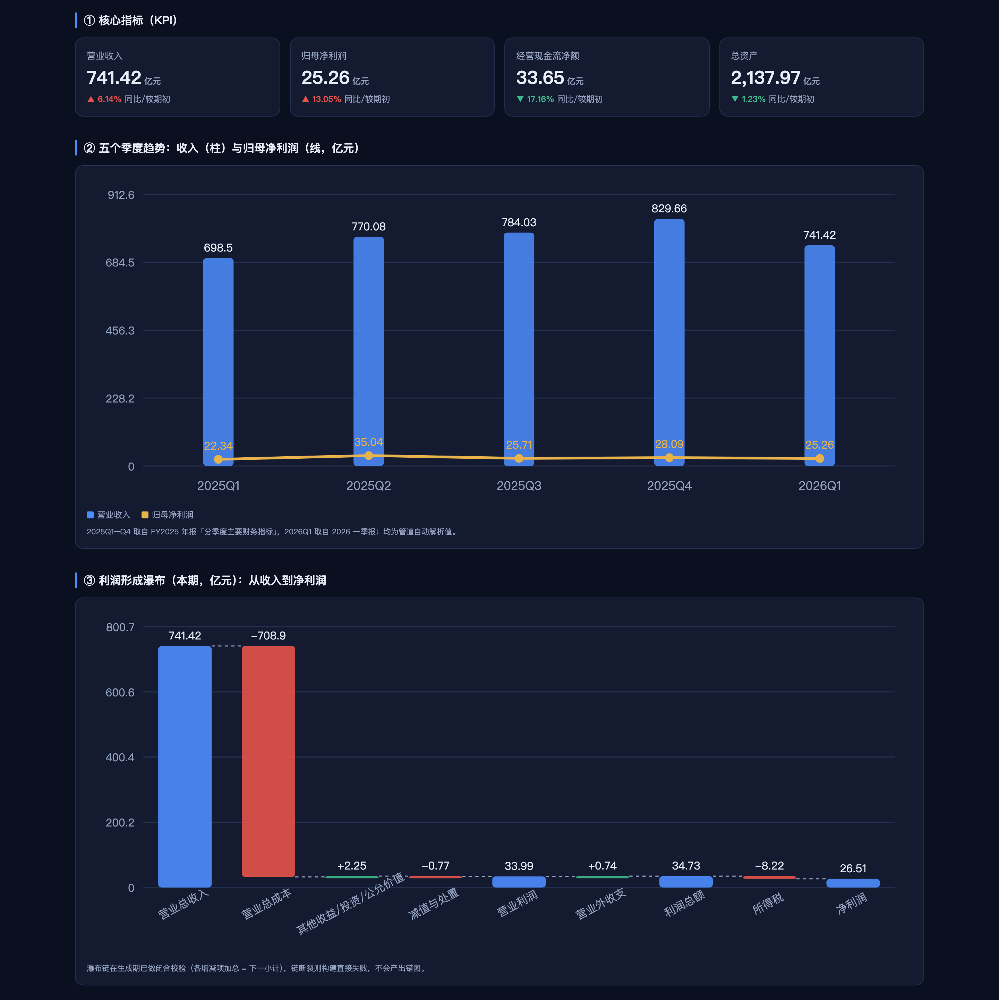

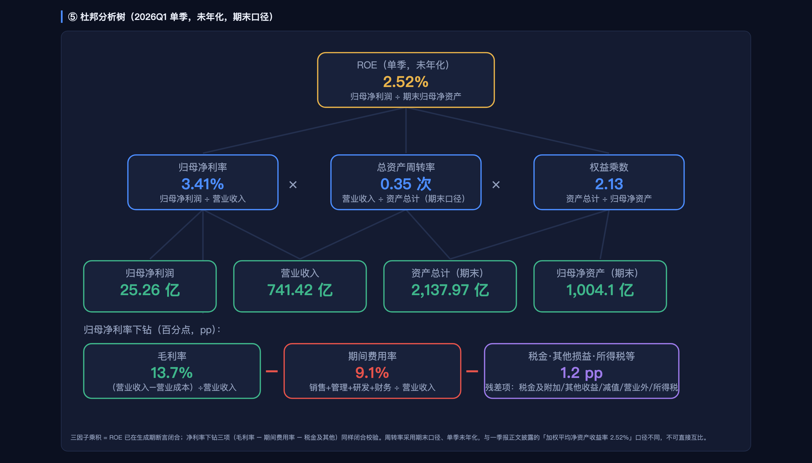

<details>
<summary><strong>展开：结构堆叠、同业对比与现金流板块</strong></summary>

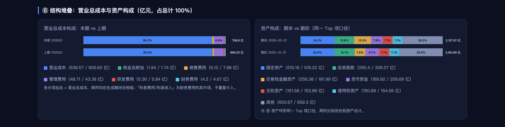

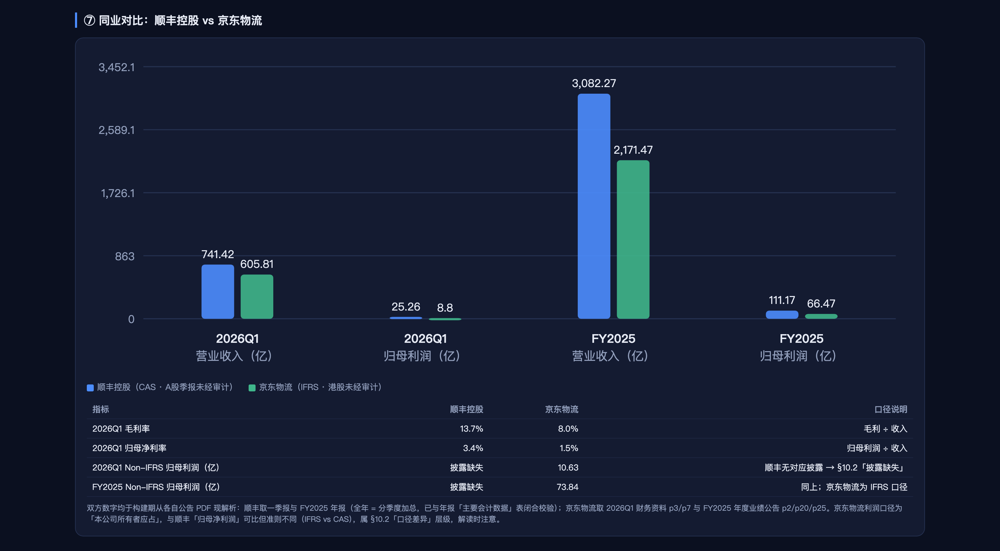

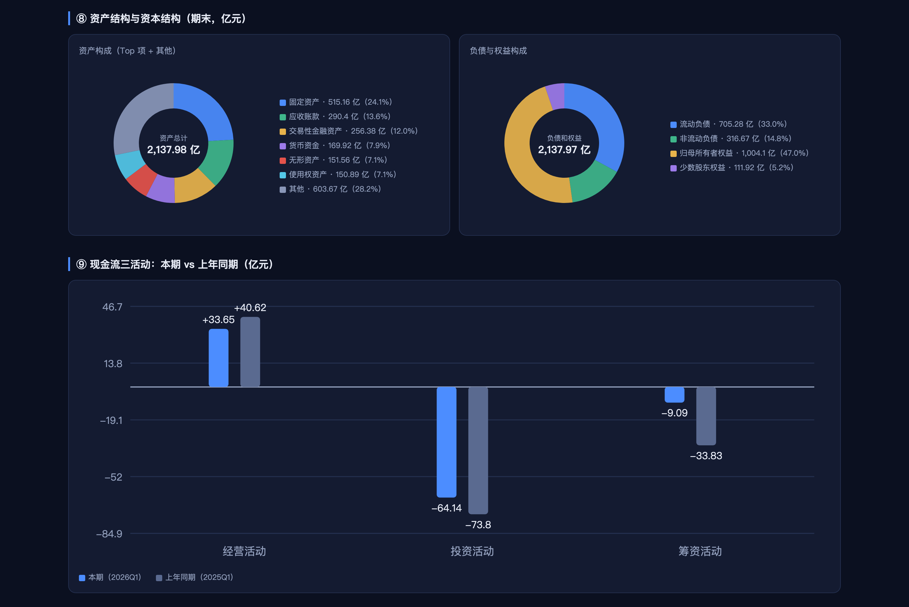

</details>

完整交互页面：[sf_2026q1_report_view.html](docs/implementation/p5/sf_2026q1_report_view.html)；差异比对记录：[sf_2026q1_diff_report.md](docs/implementation/p5/sf_2026q1_diff_report.md)；验证证据：[P5 首次抽取验证记录](docs/implementation/2026-09-05-p5-first-extraction.md)。

### 腾讯控股 2Q2026：IFRS → Non-IFRS 调节分析

同一生成器复用于港股 IFRS 样本：从业绩公告抽取三期数据，重建简明综合收益表，并把 IFRS 归母盈利到 Non-IFRS 归母盈利的七项调节做成闭合瀑布（调节链与公告披露值交叉勾稽一致）。

> **2026-09-08 修复**：利润表归一化映射补入「投资收益净额及其他」等三行后，逐行加总与除税前盈利 **696.90 亿**完全闭合，并有守恒锁定测试守护（`08cfa5c`）。

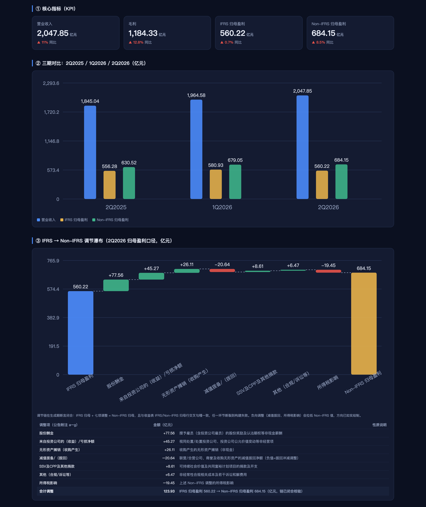

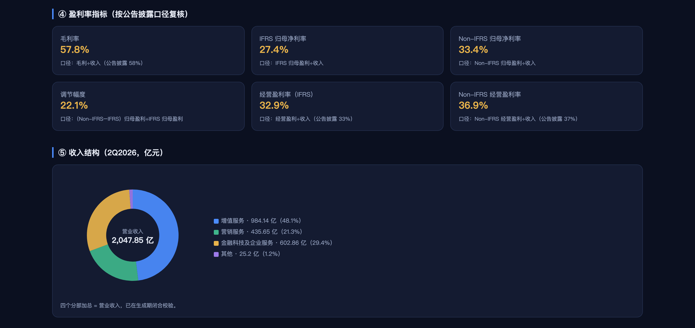

完整交互页面：[tencent_2026q2_report_view.html](docs/implementation/p5/tencent_2026q2_report_view.html)。

### 京东物流、阿里巴巴与菜鸟：IFRS 样本扩展

同一条「抽取 → 勾稽 → 落库 → 图形化」链路复用到更多 IFRS 样本：京东物流 FY2025 年报 118 个行项目（IFRS 勾稽 24/24）；阿里巴巴 FY2019–FY2026 连续八份年报（每年 52–53 行，构成八年期间序列）；菜鸟集团招股书申报稿 FY2021–FY2023 三期（每年 105 行）。这些报告全部可在 `/statements` 页面切换查看；IFRS 繁体/简体行名与千元/百万元单位差异由视图层按披露单位缩放与命名适配处理，缺失关键行的报告不伪造图形。

### 指标库 v0 评审台

配合 [D040 指标库立项](docs/superpowers/specs/2026-09-05-flow-metric-dictionary-design.md) 的可视化评审工具：通用 40 指标 + 物流行业 15 指标 + 会计基础数据（164 科目、28 项 CAS↔IFRS 取数映射）逐项「纳入/待定/剔除」评审，勾稽关系与杜邦分解树内置展示。

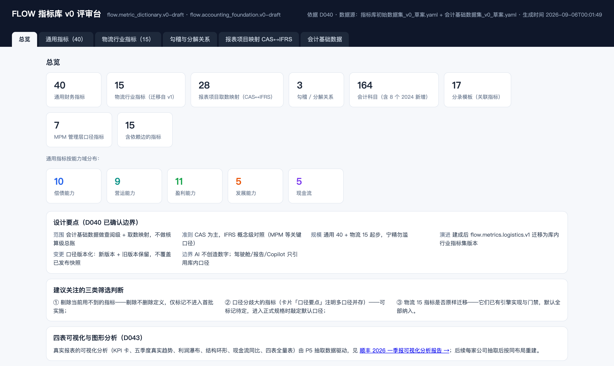

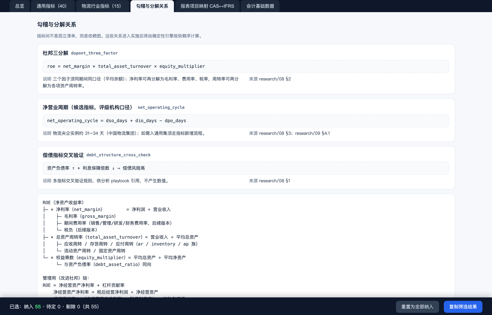

**指标治理生命周期**（C01–C06 已交付）——每个指标定义从登记到退役全程可追溯，目标值与预警阈值同版本管理：

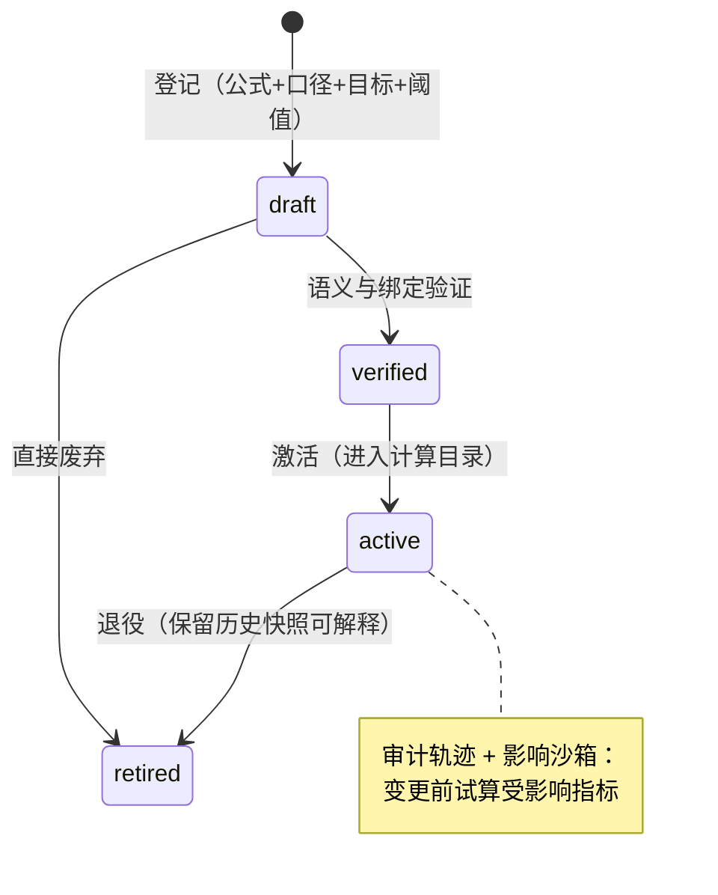
```mermaid
stateDiagram-v2
    [*] --> draft: 登记（公式+口径+目标+阈值）
    draft --> verified: 语义与绑定验证
    verified --> active: 激活（进入计算目录）
    active --> retired: 退役（保留历史快照可解释）
    draft --> retired: 直接废弃
    note right of active
        审计轨迹 + 影响沙箱：
        变更前试算受影响指标
    end note
```

评审台页面：[metric-library-v0-review.html](docs/knowledge-base/03_assets/visual_prototypes/metric-library-v0-review.html)。以上截图由 [capture_p5_report_screenshots.mjs](scripts/capture_p5_report_screenshots.mjs) 从报告页面机械截取，未做拼接或修饰；图片来源与采集方式见[截图说明](docs/assets/screenshots/README.md)。

## 📚 静态知识治理：项目自己的知识生产线

产品口径不依赖动态外部笔记——**全部正式知识以版本化发布锁定在仓库内**（`flow-knowledge-2026-09-12.1`，31 项资产逐项 SHA-256）：

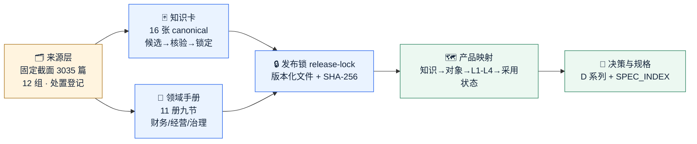
```mermaid
flowchart LR
    SRC["🗂️ 来源层<br/>固定截面 3035 篇<br/>12 组 · 处置登记"] --> CARD["🃏 知识卡<br/>16 张 canonical<br/>候选→核验→锁定"]
    SRC --> HB["📖 领域手册<br/>11 册九节<br/>财务/经营/治理"]
    CARD --> LOCK["🔒 发布锁 release-lock<br/>版本化文件 + SHA-256"]
    HB --> LOCK
    LOCK --> MAP["🗺️ 产品映射<br/>知识→对象→L1-L4→采用状态"]
    MAP --> SPEC["📐 决策与规格<br/>D 系列 + SPEC_INDEX"]
    classDef src fill:#fff4df,stroke:#ac761f,color:#14243a
    classDef know fill:#eaf3ff,stroke:#2463eb,color:#14243a
    classDef prod fill:#ecf8f1,stroke:#2e8562,color:#14243a
    class SRC src
    class CARD,HB,LOCK know
    class MAP,SPEC prod
```

- **来源登记**：12 组来源与冻结截面声明完全对账；篇级按需登记，不伪造路径；
- **转换门禁**：外部文章不得直接成为需求——必须经知识卡 → 产品映射 → 正式决策三道门（CI 强制校验）；
- **离线资料库**：全部静态数据集打包为单文件站点（双击即开、零服务器）：

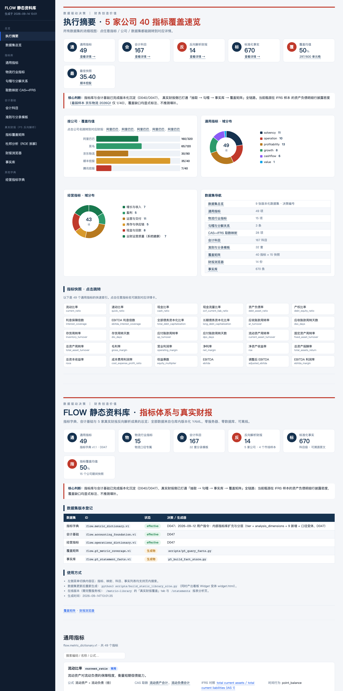

信息架构与界面设计的可交互原型（设计期产物，见 `03_assets/visual_prototypes/`）：

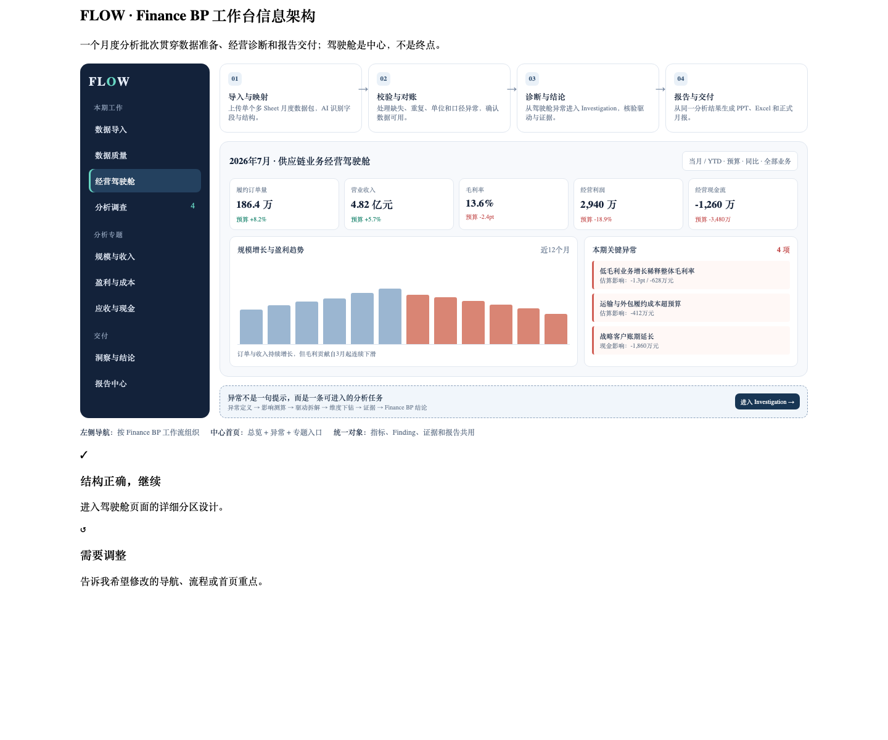

## 📍 当前进度

执行入口以 [CURRENT_ROADMAP](docs/50_plans/CURRENT_ROADMAP.md) 为唯一权威（[统一执行计划 U1–U10](docs/superpowers/plans/2026-09-07-unified-next-plan.md) 仅保留历史任务细节与证据）。战略方向见 [战略重构设计](docs/superpowers/specs/2026-09-13-flow-strategic-reset-design.md)（D052–D054）：U8 已冻结，当前执行 S01；旧 U9/U10 不自动续跑。

| 阶段 | 任务 | 状态 |
| --- | --- | --- |
| 奠基 | Phase 1–10 窄切片 + Pilot + 双轮审查修复（R1–R9/N1–N3） | ✅ 已完成 |
| 真实验证 | P5 财报反向解析（顺丰 + 腾讯 + 京东物流 + 阿里巴巴八年 + 菜鸟三期，14 份报告已落库至 `/statements`） | ✅ 已交付 |
| 基线 | P00–P02 基线刷新、口径订正、主题/比较合同 | ✅ 已完成 |
| U1–U3 | 主题/比较合同、确定性拆解、同源证据与快照投影 | ✅ 已完成（U2 剩 2 项外部依赖登记中） |
| U4 | 独立全行验证与留出泛化（依赖 oracle 人工录入） | ⬜ 外部到料即并行 |
| U5–U7 | 客观报告门禁、统一冻结、四问工作台 | ✅ 已交付 |
| **U8** | 生产就绪收口（真实存储旅程、HTTPS 拓扑、统一部署验收） | ✅ completed；严格冻结门禁通过 |
| **S01** | 战略边界、Financial Facts V2、安全/RBAC/审计门禁 | 🚧 active（当前：三份实施子规格） |
| U9–U10 | 内部试点、V1.1 证据决策 | ⬜ 待授权，且 U8 后按 [D053](docs/10_governance/decisions/D053--三层两模块边界与执行顺序.md) 重新裁决 |

已登记的确定性原语：CAGR（n−1 间隔）、可加和守恒桥（残差显式）、经验阈值提示（无普适判定）、口径标签值（登记制）、应收-收入增速联看提示。

## ⚙️ 能力与实现状态

| 模块 | 当前已实现 | 需要区分的边界 |
| --- | --- | --- |
| 数据接入 | 上传、画像、映射覆盖、清洗、警告确认、版本发布、标准化导出 | 任意新批次的指标/分析自动编排尚未接通 |
| 标准数据 | `flow.excel.v1`，10 张交换工作表，公共维度与主题事实 | Excel 是交换格式，PostgreSQL 是标准关系数据层 |
| 指标引擎 | 物流 15 指标 + 知识库 64 指标定义（v1.1）、Decimal、月/YTD/预算/同比/T12 窗口 | 登记数不等于任意财报可算数 |
| 指标治理 | 定义、绑定、语义、草稿/验证/激活/退役、审计、影响沙箱和界面（迁移头 `0018_metric_governance`） | 既有字段审计不能证明所有会计分类正确 |
| 客观分析引擎 | `objective_finance_v1`：净现比、杜邦三分解（全链口径标注）等条目 + 五个确定性原语 | 数学分解不冒充业务因果；报告门禁在 U5 建设 |
| 分析引擎 | 5 个 typed Playbook、驱动对账、Finding 与 Evidence | 确定性政策与阈值，非自动学习模型 |
| 驾驶舱与调查 | 多维浏览、身份交接、证据复核、四要素结论、审阅历史 | 演示数据通过不替代真实客户试点 |
| Copilot | 上下文绑定、引用和数字校验、降级与持久审计 | 默认是离线 `DeterministicProvider`，尚无现成在线大模型适配器 |
| 报告发布 | JSONB 冻结内容、版本幂等、独立尝试、下载头与字节校验 | API 默认没有 PDF 打印器；PPTX/XLSX/HTML 仍依赖可用对象存储 |
| 认证 | 单用户密码、会话、服务端 Bearer、同源代理与 HTTPS 拓扑 | 非多租户/角色权限/SSO；生产部署需替换真实 CA，RBAC 在 S01 实施 |
| 异步基础设施 | Celery、Redis、任务身份与 Worker 健康检查 | Worker 示例任务仅返回 accepted，核心业务未全面接入队列 |

## 🏗️ 系统架构

### 运行组件

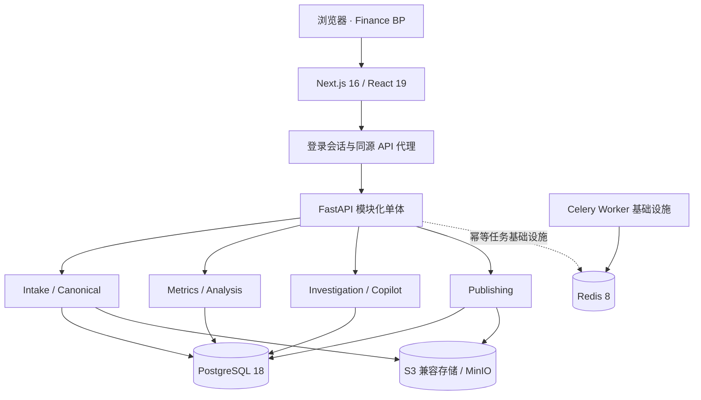
```mermaid
flowchart TB
    Browser[浏览器 · Finance BP] --> Web[Next.js 16 / React 19]
    Web --> Session[登录会话与同源 API 代理]
    Session --> API[FastAPI 模块化单体]
    API --> Intake[Intake / Canonical]
    API --> Metrics[Metrics / Analysis]
    API --> Review[Investigation / Copilot]
    API --> Publish[Publishing]
    Intake --> PG[(PostgreSQL 18)]
    Metrics --> PG
    Review --> PG
    Publish --> PG
    Intake --> S3[(S3 兼容存储 / MinIO)]
    Publish --> S3
    Worker[Celery Worker 基础设施] --> Redis[(Redis 8)]
    API -. 幂等任务基础设施 .-> Redis
```

| 层 | 技术与职责 |
| --- | --- |
| Web | Next.js 16.3.3、React 19.2、TypeScript、服务端同源代理 |
| API | Python 3.13、FastAPI、Pydantic、SQLAlchemy、Alembic |
| 计算 | Python Decimal、数据库版本化指标目录与治理（D048 库内权威 + YAML 兼容），YAML 配置 |
| 文件 | openpyxl、python-pptx、HTML 渲染、可注入 PDF 打印器 |
| 存储 | PostgreSQL NUMERIC、S3 内容寻址对象、Redis |
| 工程 | pnpm 10.17.1、uv 锁文件、pytest、Vitest、Playwright、GitHub Actions |

版本以锁文件为准；系统是模块化单体加 Worker 基础设施，没有把每个领域拆成微服务。详见[运行架构](docs/architecture/flow-v1-runtime.md)。

### 身份、血缘与冻结边界

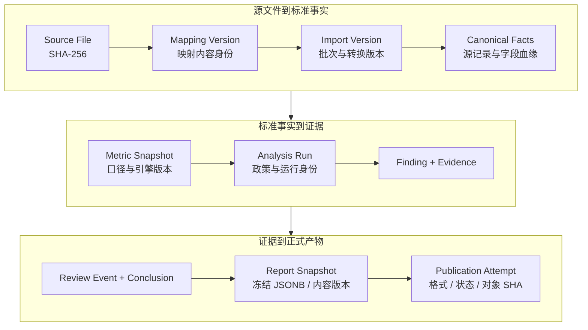
```mermaid
flowchart TB
    subgraph Data[源文件到标准事实]
        direction LR
        SF[Source File<br/>SHA-256] --> MV[Mapping Version<br/>映射内容身份]
        MV --> IV[Import Version<br/>批次与转换版本]
        IV --> CF[Canonical Facts<br/>源记录与字段血缘]
    end
    subgraph Analysis[标准事实到证据]
        direction LR
        MS[Metric Snapshot<br/>口径与引擎版本] --> AR[Analysis Run<br/>政策与运行身份]
        AR --> F[Finding + Evidence]
    end
    subgraph Report[证据到正式产物]
        direction LR
        RV[Review Event + Conclusion] --> RS[Report Snapshot<br/>冻结 JSONB / 内容版本]
        RS --> PA[Publication Attempt<br/>格式 / 状态 / 对象 SHA]
    end
    Data --> Analysis --> Report
```

三个关键约束：

1. **源文件与原始值保留。** 映射和转换产生版本，修订不覆盖旧数据。
2. **财务数字由确定性引擎产生。** AI 与渲染器引用结果，不另算一套数字；同一指标不同口径必须携带口径标签（如杜邦分解「净利润总额口径·期末权益·未年化」）。
3. **正式报告读取冻结内容。** 内容不变复用报告版本；变化生成新版本；失败重试使用原冻结视图。

### 复核状态与报告资格

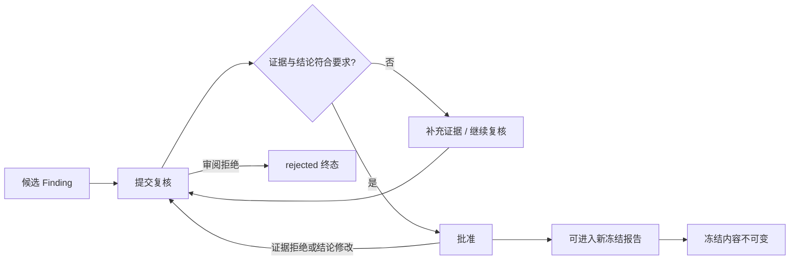
```mermaid
flowchart LR
    A[候选 Finding] --> B[提交复核]
    B --> C{证据与结论符合要求?}
    C -- 否 --> D[补充证据 / 继续复核]
    D --> B
    B -- 审阅拒绝 --> R[rejected 终态]
    C -- 是 --> E[批准]
    E --> F[可进入新冻结报告]
    E -- 证据拒绝或结论修改 --> B
    F --> G[冻结内容不可变]
```

此图展示业务约束，精确状态和事件表见[领域对象](docs/architecture/flow-v1-domain-objects.md)。冻结与复核变更共享行锁，避免并发请求绕过资格检查。

## 📦 数据契约与分析口径

### 一个工作簿，十张标准工作表

| 工作表 | 内容 | 工作表 | 内容 |
| --- | --- | --- | --- |
| `00_填写说明` | 填写规则、口径和示例 | `05_应收回款` | 应收、回款、现金相关事实 |
| `01_分析批次` | 分析窗口、币种、实际和预算情景 | `06_客户主数据` | 客户与客户群 |
| `02_经营实际` | 订单、件量、收入、直接成本 | `07_物流产品` | 物流产品维度 |
| `03_财务实际` | 管理科目对应的财务实际 | `08_组织与区域` | 组织和区域共用维度 |
| `04_月度预算` | 月度预算与业务维度 | `09_管理科目` | 管理科目与财务映射 |

稳定字段 ID 决定语义，不依赖列顺序和展示名称。正式机器契约为 [flow_v1_contract.yaml](templates/excel/flow_v1_contract.yaml)，解释见[数据契约说明](docs/data-contract/flow-v1.md)。

仓库提供两份**带演示数据**的工作簿：[标准示例](fixtures/workbooks/flow_standard_v1.xlsx)、[非标准示例](fixtures/workbooks/external_logistics_nonstandard_v1.xlsx)。面向填写的治理模板可从数据工作台下载；不要把演示数据误当作空模板或真实业务账。

### 两套指标目录，一个确定性内核

| 目录 | 规模 | 配置 |
| --- | --- | --- |
| 物流窄切片（历史驾驶舱） | 15 指标、14 条依赖边 | [`flow.metrics.logistics.v1`](config/metrics/flow_v1_metrics.yaml) |
| 财务知识库（客观分析主线） | 64 指标（v1.1）、167 科目、48 准则登记、32 分录模板 | 库内版本化文档（D048），YAML 兜底 |
| 客观分析条目 | 净现比、杜邦三分解、经验阈值提示等 11 条目 + 五原语 | [`objective_finance_v1`](config/analysis/objective_finance_v1.yaml) |

金额和比率使用 Decimal/NUMERIC，区分流量与余额、比较窗口、允许维度和预算粒度。五个分析 Playbook 覆盖收入增长、毛利恶化、经营利润恶化、履约成本增加、应收与现金恶化；政策配置见 [flow-logistics-v1.yaml](services/api/config/analysis/flow-logistics-v1.yaml)。

## 🚀 快速开始

### 五路启动方式（v2 适配）

按你的使用场景选最合适的一条：

| 路径 | 命令（详见下文） | 适用场景 |
|---|---|---|
| **1. 推荐 · 容器基础设施 + 本机应用** | `make bootstrap && make infra-up && make dev-api && make dev-web` | 日常开发，调试方便 |
| **2. 全容器运行** | `make stack-up` | 演示 / 评审 / 一次性起停 |
| **3. 从源码编译（纯本机）** | `pnpm install && (cd services/api && uv sync)` | 无 Docker 时的回退 |
| **4. 一键验收（Phase 1–10 七组组合）** | `make acceptance` | 发版前严格门禁 |
| **5. Docker Compose 最小启动** | `docker compose -f infra/compose.yml up -d` | 仅验证基础设施连通 |

### 依赖

- Docker Desktop 或可用的 Docker Engine + Compose；
- Python **3.13** 与 `uv`；
- Node.js **24**；Make 和 Git；
- pnpm 由 Makefile 使用 `npx --yes pnpm@10.17.1` 调用，无需全局安装。

### 推荐：基础设施在容器，应用在本机

从一个新的开发数据库开始。以下命令不包含验收脚本的数据库清空动作。

```bash
git clone https://github.com/davyzhong/FLOW.git
cd FLOW
cp .env.example .env
make bootstrap

# 在当前 shell 导出刚复制的本地配置
set -a
. ./.env
set +a

make infra-up
(cd services/api && uv run alembic upgrade head)

# 可选：初始化确定性演示数据、12 个月指标快照和分析运行
(cd services/api && uv run python ../../scripts/seed_dashboard_demo.py)

# 可选：导入 P5 反向解析的真实财报（5 家公司 14 份报告，幂等）
bash scripts/seed_p5_statements.sh

make dev-api
```

另开一个终端，在仓库根目录加载同一份配置后启动 Web：

```bash
set -a
. ./.env
set +a
make dev-web
```

| 入口 | 地址 | 用途 |
| --- | --- | --- |
| Web 驾驶舱 | [localhost:3000](http://localhost:3000) | 演示数据浏览与调查 |
| 数据工作台 | [localhost:3000/data](http://localhost:3000/data) | 模板、上传、映射和发布 |
| 报告中心 | [localhost:3000/reports](http://localhost:3000/reports) | 冻结、生成和下载 |
| API 文档 | [localhost:8000/docs](http://localhost:8000/docs) | FastAPI 交互式接口文档 |
| API 健康检查 | [localhost:8000/api/v1/health](http://localhost:8000/api/v1/health) | 进程健康状态 |
| MinIO Console | [localhost:9001](http://localhost:9001) | 开发对象存储管理 |

`seed_dashboard_demo.py` 默认复用已有演示批次；加 `--fresh-batch` 会创建一个新的演示批次。它直接编排领域服务，不代表原始文件已实际上传到 S3。使用自己的工作簿时，先通过 `/data` 完成数据接入。

<details>
<summary><strong>全容器运行</strong></summary>

在完成依赖、基础设施和数据库迁移后，可用 `make stack-up` 构建并启动 API、Worker、Web；`make stack-down` 停止 Compose 栈。不要与占用相同端口的本机应用同时启动。

当前 Compose 是开发基线。API 镜像的资源打包、真实存储与业务路径仍需要按目标部署验证，不能仅凭容器健康检查认定全部页面和发布路径已可用。迁移命令不由 `make stack-up` 自动执行。

</details>

## 🔐 登录与部署配置

默认两项凭据为空时是本地开发模式。启用认证时：API 和 Web 使用相同 `AUTH_TOKEN`；Web 额外设置独立的 `FLOW_WEB_PASSWORD`，并在生产环境设置 `FLOW_WEB_ORIGIN` 为真实公开访问地址。

<details>
<summary><strong>认证时序与环境变量</strong></summary>

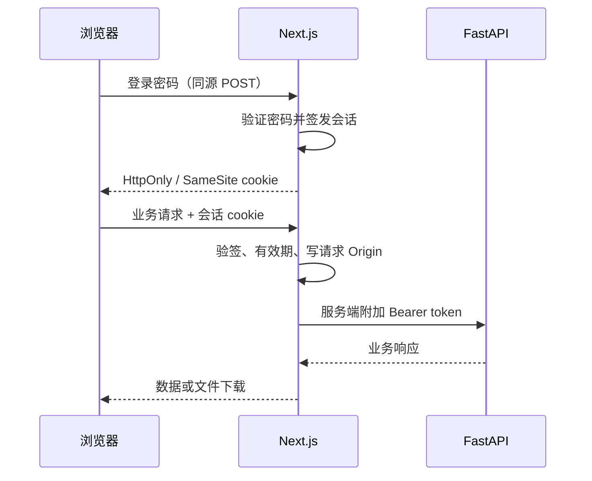
```mermaid
sequenceDiagram
    participant U as 浏览器
    participant W as Next.js
    participant A as FastAPI
    U->>W: 登录密码（同源 POST）
    W->>W: 验证密码并签发会话
    W-->>U: HttpOnly / SameSite cookie
    U->>W: 业务请求 + 会话 cookie
    W->>W: 验签、有效期、写请求 Origin
    W->>A: 服务端附加 Bearer token
    A-->>W: 业务响应
    W-->>U: 数据或文件下载
```

| 变量 | 设置位置 | 说明 |
| --- | --- | --- |
| `DATABASE_URL` | API / Worker / 迁移进程 | PostgreSQL 连接 |
| `REDIS_URL` | API / Worker | Redis 连接 |
| `S3_ENDPOINT_URL`、`S3_BUCKET` | API / Worker | 对象存储地址与桶 |
| `S3_ACCESS_KEY`、`S3_SECRET_KEY` | API / Worker | 对象存储凭据 |
| `S3_USE_SYSTEM_PROXY` | API / Worker | 默认 `false`：S3 客户端绕过系统/环境代理（防止本机代理未运行时请求挂起）；经代理访问外部对象存储时设 `true` |
| `FLOW_API_INTERNAL_URL` | Web 服务端 | 内部 API 地址 |
| `AUTH_TOKEN` | API + Web | 相同的服务端共享 token |
| `FLOW_WEB_PASSWORD` | Web 服务端 | 单用户访问密码 |
| `FLOW_WEB_ORIGIN` | Web 服务端 | 如 `https://flow.example.com`，不含路径 |

密码与 token 不得放入 `NEXT_PUBLIC_*`。浏览器业务访问统一经同源代理，旧 `NEXT_PUBLIC_FLOW_API_URL` 配置已停用。会话有效期八小时，生产 cookie 使用 Secure；仅配置部分凭据会拒绝访问。详见[认证与会话说明](docs/operations/authentication.md)。

</details>

### 从旧版本升级

当前数据库迁移头为 **`0018_metric_governance`**（指标知识与治理轮）：

```bash
(cd services/api && uv run alembic upgrade head)
```

迁移不会为历史报告伪造冻结内容。没有 `frozen_view` 的旧快照仍可下载已经生成的产物，但不能重新渲染；需要从当前符合审批条件的数据重新冻结。数据库触发器阻止已冻结 payload 被改写。

## ✅ 开发、测试与验证

### 日常检查

```bash
make lint
make typecheck
make test-web
make contracts-check
```

修改 API schema 后执行 `make contracts`，检查生成的 OpenAPI/TypeScript 差异，再运行 `make contracts-check`。仅验证漂移时直接运行 check，不要先生成来掩盖未提交的差异。

### 分层门禁

| 命令 | 覆盖范围 | 环境与注意事项 |
| --- | --- | --- |
| `make test-web` | Vitest 组件、代理与会话测试 | 不需数据库 |
| `make test-api` | 全部 Python 测试 | 包含迁移和数据库清理，使用独立测试库及所需存储 |
| `make test-data-contract` | 工作簿与数据库语义往返 | 会启动开发基础设施 |
| `make test-intake-e2e` | 映射、质量、对账、发布与血缘 | 独立数据库 / S3 环境 |
| `make test-metrics-known-answers` | 指标精确已知答案 | 独立数据库 |
| `make test-analysis-invariants` | 分析政策与驱动不变量 | 独立数据库 |
| `make test-dashboard` | 页面、筛选、身份交接 | PostgreSQL + Playwright Chromium |
| `make test-investigation-e2e` | 调查与复核流程 | PostgreSQL + Playwright Chromium |
| `make test-copilot-evals` | 引用、数字、降级与审计 | 按脚本准备数据库 |
| `make test-publishing-golden` | 四格式关键值一致性 | Playwright Chromium 与领域测试环境 |
| `make test-user-closure-e2e` | 本地组合回归与用户入口冒烟 | 会启动服务；监督器仅清理本次启动的进程组，数据库仍须隔离。CI 由独立 job 覆盖前置门禁后仅运行闭环专属部分 |
| `make acceptance` | Phase 1–10 的七组组合验收 | **会清空 Compose `flow` 库的 public schema，不可用于业务库** |

需要浏览器门禁时安装仓库对应的 Chromium：

```bash
npx --yes pnpm@10.17.1 exec playwright install chromium
```

CI 定义见 [FLOW CI](.github/workflows/ci.yml)。无数据库 unit job 与需要基础设施的 integration job 已分开；本地定向验证、历史阶段验收、远端 CI 三种证据应分别阅读。最新运行请查看 [GitHub Actions](https://github.com/davyzhong/FLOW/actions)，不要把某次历史成功当作当前全量通过。

## 🤖 Built by

**FLOW 团队** — 兼管产品（战略 / 边界 / 价值门槛 / 量化验收）与工程（worktree / SHA / 门禁 / 提交纪律）的双线团队。

工程实践（v2 视角摘录，完整治理见 [`AGENTS.md`](AGENTS.md)）：

- 🏛️ **三层两模块架构**（[D053](docs/10_governance/decisions/D053--三层两模块边界与执行顺序.md)）—— 治理底座 + 共享分析底座 + 两个产品模块
- 🔐 **证据复核状态机** —— Finding → Evidence → Conclusion → 状态机批准
- ❄️ **冻结报告与发布** —— JSONB 冻结视图，导出仅读冻结内容
- 🤖 **多 Agent 协作纪律**（[HANDOFF.md](HANDOFF.md)）—— 串行集成 + 逐 Gate 验证 + commit → 自动 push
- 🧪 **六道门禁矩阵**（`make test-web` / `test-api` / `test-data-contract` / `test-intake-e2e` / `test-metrics-known-answers` / `test-analysis-invariants` / `test-dashboard` / `test-investigation-e2e` / `test-publishing-golden` / `test-user-closure-e2e`）
- 📦 **工程栈**：Python 3.13 + FastAPI + Pydantic + SQLAlchemy + Next.js 16 + React 19 + TypeScript + PostgreSQL 18 + Redis 8 + S3 + Celery + pnpm + uv + Playwright + GitHub Actions

## 💖 致谢

- [FastAPI](https://fastapi.tiangolo.com/) — 高性能 Python Web 框架
- [Next.js](https://nextjs.org/) — React 全栈框架
- [PostgreSQL](https://www.postgresql.org/) — 标准关系数据层
- [Redis](https://redis.io/) — 异步任务基础设施
- [Pydantic](https://docs.pydantic.dev/) — 数据契约与运行时校验
- [SQLAlchemy](https://www.sqlalchemy.org/) + [Alembic](https://alembic.sqlalchemy.org/) — ORM 与数据库迁移
- [openpyxl](https://openpyxl.readthedocs.io/) + [python-pptx](https://python-pptx.readthedocs.io/) — 工作簿与演示文档
- [Playwright](https://playwright.dev/) — 端到端浏览器测试
- [GitHub Actions](https://github.com/features/actions) — 持续集成
- [pnpm](https://pnpm.io/) + [uv](https://docs.astral.sh/uv/) — 依赖管理

## 🆚 同行对照（v2 视角）

> FLOW 不是通用 BI 工具，不是 LLM 包装，也不是 Agent 平台——它是面向经分专员的**可复核财务经营分析工作台**。下表说明差异：

| 维度 | FLOW | 通用 BI（Tableau / PowerBI） | 通用 LLM Chat（ChatGPT Enterprise） | Agent 平台（LangGraph 等） |
|---|---|---|---|---|
| **数据契约** | `flow.excel.v1` 十张工作表强校验 + 映射版本化 | 用户自由建模 | 不适用 | 不适用 |
| **指标定义** | 64 指标库 + 草稿/验证/激活/退役生命周期 | 计算字段 | 不适用 | 不适用 |
| **数字来源** | 确定性引擎唯一，AI 引用不重算 | 表达式 | LLM 估算 | LLM 估算 |
| **证据链** | Finding + Evidence + Conclusion 状态机 | 无 | 无 | 弱 |
| **报告冻结** | JSONB 不可变 + 字节校验 | 重导出可能改变 | 不适用 | 不适用 |
| **可复核性** | SHA-256 全链路（文件/映射/导入/分析/报告） | 无 | 无 | 弱 |
| **领域适配** | 物流 / 财务知识库内置 167 科目 + 28 CAS↔IFRS 映射 | 通用 | 通用 | 通用 |
| **离线可跑** | Ollama 离线 `DeterministicProvider` | 离线 | 在线 | 在线 |

## 📁 仓库导航

```text
FLOW/
├── apps/web/                 # Next.js 页面、组件、同源代理与浏览器测试
├── services/api/             # FastAPI、领域服务、模型、迁移和 Python 测试
├── packages/contracts/       # OpenAPI 与生成式 TypeScript 合约
├── config/                   # Intake 别名/转换、指标目录、客观分析条目
├── templates/excel/          # flow.excel.v1 机器契约
├── fixtures/                 # 标准/非标准工作簿与确定性参考数据
├── infra/                    # Compose、容器构建文件
├── scripts/                  # 生成器、演示初始化与分层验收
└── docs/
    ├── README.md                 # 全部文档导航与当前阅读路径
    ├── 00_start_here/            # 唯一入口：PROJECT_STATE / READING_ORDER / DOCUMENT_MAP
    ├── 10_governance/            # 决策索引 D001–D054 + 单项决策 + 治理规则 + legacy 豁免锁
    ├── 20_product/               # 产品定义六件套（愿景/范围/用户/能力/边界/发布）
    ├── 30_architecture/          # 架构聚合五文档（系统/数据/领域/指标/安全部署）
    ├── 40_specs/                 # SPEC_INDEX + 九个规格域
    ├── 50_plans/                 # CURRENT_ROADMAP（唯一路线图）+ 稳定工作包 + 视图
    ├── 60_delivery/              # 实施/验证/发布记录 + 生成式状态视图
    ├── 70_operations/            # 认证与部署运行手册
    ├── 80_reviews/               # 审查与无上下文接续测试
    ├── 90_archive/               # 历史计划与会话归档（do_not_execute）
    ├── architecture/             # 运行架构、领域对象与血缘（原位）
    ├── data-contract/            # Excel 数据契约（机器消费，原位）
    ├── knowledge-base/           # 静态知识库：10_sources 来源层 / 20_cards 知识卡 /
    │                             #   30_handbooks 领域手册 / 50_mappings 产品映射 +
    │                             #   不可变档案（会话/研究/原图/微信）
    └── assets/screenshots/       # 当前真实页面截图与来源说明
```

| 你想了解什么 | 推荐入口 |
| --- | --- |
| 全部文档与哪份是最新 | [文档中心](docs/README.md)、[文档状态登记](docs/documentation-status.md) |
| 产品为什么这样设计 | [战略重构设计（D052–D054）](docs/superpowers/specs/2026-09-13-flow-strategic-reset-design.md)、[固定产品原则](docs/20_product/PRODUCT_PRINCIPLES.md)、[正式 V1 规格](docs/superpowers/specs/2026-08-29-flow-v1-design.md)、[决策索引 D001–D054](docs/10_governance/DECISION_INDEX.md) |
| 当前完成到哪一步 | [项目状态](docs/00_start_here/PROJECT_STATE.md)、[当前路线图](docs/50_plans/CURRENT_ROADMAP.md) |
| 新 Agent 接续 | [Agent 起点](docs/knowledge-base/00_start_here/AGENT_START_HERE.md)、[交接指南](docs/knowledge-base/07_handoff/CONTINUATION_GUIDE.md) |
| API 方法、路径与类型 | [API 路径索引](docs/api-reference.md)、[OpenAPI](packages/contracts/openapi.json) |
| 文件如何进入标准数据层 | [Intake 说明](docs/intake/flow-v1-intake.md) |
| 数字从哪里来 | [指标口径](docs/metrics/flow-v1-metrics.md)、[领域身份](docs/architecture/flow-v1-domain-objects.md) |

## 🧭 当前进度与边界

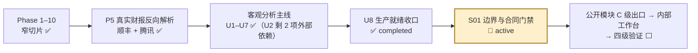
```mermaid
flowchart LR
    A["Phase 1–10<br/>窄切片 ✅"] --> B["P5 真实财报反向解析<br/>顺丰 + 腾讯 ✅"]
    B --> C["客观分析主线<br/>U1–U7 ✅（U2 剩 2 项外部依赖）"]
    C --> D["U8 生产就绪收口<br/>✅ completed"]
    D --> E["S01 边界与合同门禁<br/>🚧 active"]
    E --> F["公开模块 C 级出口 → 内部工作台<br/>→ 四级验证 ⬜"]
    style E fill:#fff0cd,stroke:#aa7918,stroke-width:2px
```

下一阶段按 [CURRENT_ROADMAP](docs/50_plans/CURRENT_ROADMAP.md) 推进：U1–U8 已交付并冻结，当前主线为 S01 战略边界、Financial Facts Contract V2 与安全/RBAC/审计门禁；三份实施子规格 approved 前不进入代码重构。U2 仍有外部核验项（rnd_exp 科目编号待准则原文）；旧 U9/O5、U10 按 [D053](docs/10_governance/decisions/D053--三层两模块边界与执行顺序.md) 重新裁决，内部真实数据仍需另行授权。

本仓库尚未提供独立的 LICENSE 文件；使用与分发授权请向项目维护者确认。贡献与协作遵循 [AGENTS.md](AGENTS.md)：先读项目状态和正式决策，保护原始档案，按风险验证，每个完整任务只提交相关文件并推送规范远端。

---

## 🗓️ Roadmap（v2 视角）

> 战略方向以 [战略重构设计（D052–D054）](docs/superpowers/specs/2026-09-13-flow-strategic-reset-design.md) 为唯一权威；执行入口以 [CURRENT_ROADMAP](docs/50_plans/CURRENT_ROADMAP.md) 为唯一执行入口。

- [x] **Phase 1–10** — 窄切片 + Pilot + 双轮审查修复（R1–R9 / N1–N3） ✅
- [x] **P5 真实财报反向解析** — 5 家公司 / 14 份报告 / 670 科目事实 ✅
- [x] **P00–P02 基线** — 基线刷新 + 口径订正 + 主题/比较合同 ✅
- [x] **U1–U3** — 主题/比较合同 + 确定性拆解 + 同源证据与快照投影（U2 剩 2 项外部依赖登记中） ✅
- [x] **U5–U7** — 客观报告门禁 + 统一冻结 + 四问工作台 ✅
- [x] **U8** — 生产就绪收口（真实存储旅程 + HTTPS 拓扑 + 统一部署验收） ✅ completed；严格冻结门禁通过
- [🚧] **S01** — 战略边界 + Financial Facts Contract V2 + 安全/RBAC/审计门禁（当前：三份实施子规格）
- [ ] **U4** — 独立全行验证与留出泛化（依赖 oracle 人工录入）⬜ 外部到料即并行
- [ ] **公开模块 C 级出口** — Go/No-Go 裁决（前置人工项不变）
- [ ] **U9–U10** — 内部试点 + V1.1 证据决策（⬜ 待授权；按 [D053](docs/10_governance/decisions/D053--三层两模块边界与执行顺序.md) 重新裁决）

## 🔒 安全

> **本仓库尚未提供独立的 SECURITY.md**（v2 适配建议新增）；漏洞披露流程占位：

- 漏洞披露流程（建议）：通过 GitHub Private Vulnerability Reporting 提交，或邮件至项目维护者。
- 治理铁律（已实现，详见 [`AGENTS.md`](AGENTS.md)）：原始档案保护、来源登记门禁、CI 强制校验、未提交证据不得批准 Finding。
- 生产部署注意事项：见 [`docs/70_operations/`](docs/70_operations/) 中的认证与部署运行手册；`AUTH_TOKEN` + `FLOW_WEB_PASSWORD` 不入 `NEXT_PUBLIC_*`；会话 cookie Secure + SameSite。

## 🤝 贡献与 Code of Conduct

- 贡献流程：见 [`AGENTS.md`](AGENTS.md)（治理铁律与工作流硬约束）。
- 提交纪律：`commit` 后立即 `git push`（无需询问；force push 是红线需先问）。
- Code of Conduct：见 [`AGENTS.md`](AGENTS.md) § 治理铁律章节；本项目计划采用 [Contributor Covenant](https://www.contributor-covenant.org/version/2/1/code_of_conduct/) v2.1（v2 适配建议新增 `CODE_OF_CONDUCT.md`）。
- 仓库协作原则（v2 摘要）：先读项目状态和正式决策 → 保护原始档案 → 按风险验证 → 每个完整任务只提交相关文件并推送规范远端。

## 📜 License

**License：未授权发布** — 详见顶部 Badge "未授权发布"。本仓库尚未提供独立的 `LICENSE` 文件；使用与分发授权请向项目维护者确认。v2 适配建议：发版前明确 LICENSE 类型（推荐内部商业项目使用 Proprietary / 项目特定 EULA；如需开源则建议 AGPLv3 以保证衍生作品同样可复核）。

---

<div align="center">

<sub>🤖 [FLOW 团队](https://github.com/davyzhong) 用 ❤️ 维护 · [⭐ Star 我们](https://github.com/davyzhong/FLOW) · [🐛 报告 Bug](https://github.com/davyzhong/FLOW/issues)</sub>
<br>
<sub>📜 本 README 按 readme-craft v3.0.0-alpha.0（16 铁律 + 10 反模式 + 80 分量表）适配，原文核心内容 100% 保留。</sub>
<br>
<sub>📸 Screenshots auto-generated by GitHub Actions（<a href=".github/workflows/screenshot.yml">view workflow</a>）— readme-craft v3.0.0-alpha.0 T18</sub>

</div>
