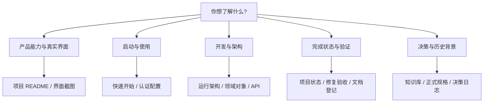

# FLOW 文档中心

核对日期：2026-09-04。当前工程基线 `c1a59d1`：V1 功能窄切片、导入与报告页面、两轮代码审查修复和单用户认证已落地；当前继续完成 Pilot Readiness 的运行链路、部署和真实数据验收。

[返回项目 README](../README.md) · [当前项目状态](knowledge-base/00_start_here/PROJECT_STATE.md) · [文档适用性登记](documentation-status.md)

## 从你的问题开始

## 当前可执行说明

| 文档 | 回答的问题 |
| --- | --- |
| [项目 README](../README.md) | 做什么、真实界面、架构、快速开始、实现边界 |
| [运行架构](architecture/flow-v1-runtime.md) | 服务如何启动，领域模块、存储和 Worker 实际如何连接 |
| [领域对象](architecture/flow-v1-domain-objects.md) | 批次/导入/快照/运行/报告身份、血缘和不可变边界 |
| [数据契约](data-contract/flow-v1.md) | 十张工作表、稳定字段、校验、演示工作簿 |
| [Intake](intake/flow-v1-intake.md) | 上传、映射覆盖、质量、确认、发布与导出 |
| [指标与快照](metrics/flow-v1-metrics.md) | 15 个指标、14 条依赖、比较窗口、精确计算 |
| [API 路径索引](api-reference.md) | 当前业务方法、路径、输入输出契约入口 |
| [认证与会话](operations/authentication.md) | token、访问密码、公开 origin、反代与环境加载 |
| [真实界面截图](assets/screenshots/README.md) | 截图版本、数据来源、浏览器及存储替身边界 |

## 当前状态与验收

优先读[项目状态](knowledge-base/00_start_here/PROJECT_STATE.md)和[最新修复验收](implementation/2026-09-04-review-repairs.md)。文档、测试和运行时各有不同证据：

| 证据类型 | 阅读方式 |
| --- | --- |
| 当前说明 | 与代码 `c1a59d1` 核对后的操作和技术文档 |
| 本地修复验证 | 按分组和环境读取，不能将重叠测试数相加 |
| 历史 Phase 验收 | 保留当时的命令、数量和结果，不自动代表当前提交 |
| 远端 CI | 查看具体提交和 job，不将单个成功门禁视为全量通过 |
| 真实业务验收 | 仍需脱敏客户数据与目标部署环境的证据 |

2026-09-04 对 [`c1a59d1` 的 CI](https://github.com/davyzhong/FLOW/actions/runs/33888190706)进行核对：unit、contracts、static-web、static-python、intake-e2e、dashboard、investigation-e2e、publishing-golden 等已通过；`user-closure-e2e` 已失败，其日志显示组合脚本启动 Investigation 门禁时已有 Next dev 进程占用同一应用目录，随后浏览器连接被拒绝。该记录属于修复前状态；后续[CI 修复](implementation/2026-09-05-ci-repair.md)已补进程组监督与回归，并补回数据契约阶段说明。记录时 integration 仍在运行，整个 workflow 不能标为绿色；实时状态以链接为准。

本次全量文档整理的范围、验证和保留规则见[更新记录](implementation/2026-09-04-documentation-refresh.md)。

## 按阶段查找历史证据

| 阶段 | 历史验收 | 后续变化 |
| --- | --- | --- |
| Phase 1 基础架构 | [验收](implementation/phase-1-verification.md) | 当前迁移头已到 0010，早期三层迁移描述按历史阅读 |
| Phase 2 数据契约 | [验收](implementation/phase-2-verification.md) | 数据契约仍为 flow.excel.v1 |
| Phase 3 数据接入 | [验收](implementation/phase-3-verification.md) | 人工映射、警告确认已补修 |
| Phase 4 指标 | [验收](implementation/phase-4-verification.md) | 当前目录和引擎版本见机器配置 |
| Phase 5 分析 | [验收](implementation/phase-5-verification.md) | 后续调查和签发资格进一步补强 |
| Phase 6 驾驶舱 | [验收](implementation/phase-6-verification.md)、[视觉保真](implementation/phase-6-dashboard-fidelity.md) | 当前页面另有真实截图 |
| Phase 7 调查 | [验收](implementation/phase-7-verification.md) | 证据拒绝/结论变更会退回复核 |
| Phase 8 Copilot | [验收](implementation/phase-8-verification.md) | 成功审计持久化和批次大纲选择已修复 |
| Phase 9 发布 | [验收](implementation/phase-9-verification.md) | 报告 JSONB 冻结、PPT 排版和下载头已修复 |
| Phase 10 组合门禁 | [验收](implementation/phase-10-acceptance.md) | 生产部署与真实试点仍单独验收 |
| Pilot Phase 1 用户入口 | [验收](implementation/phase-pilot-1-user-closure.md) | 页面已落地，组合 CI 仍有运行问题 |
| 代码审查修复 | [当前修复证据](implementation/2026-09-04-review-repairs.md) | R1–R9、N1–N3 已处理；不意味着所有其他缺口均关闭 |

## 规格、决策与接续

- [V1 正式设计](superpowers/specs/2026-08-29-flow-v1-design.md)：产品与系统边界；
- [主路线图](superpowers/plans/2026-08-30-flow-v1-master-roadmap.md)：原始 Phase 1–10 分期；
- [最小安全部署计划](superpowers/plans/2026-09-03-flow-pilot-readiness-phase-2-security-deployment.md)：A/B 已落地，其他部署任务仍待执行；
- [决策日志](knowledge-base/04_decisions/DECISION_LOG.md)、[变更影响图](knowledge-base/04_decisions/CHANGE_IMPACT_MAP.md)：变更前核对；
- [Agent 起点](knowledge-base/00_start_here/AGENT_START_HERE.md)、[交接指南](knowledge-base/07_handoff/CONTINUATION_GUIDE.md)、[重启提示](knowledge-base/07_handoff/RESTART_PROMPTS.md)：后续工作入口；
- [两轮审查及逐份登记](documentation-status.md)：历史发现与当前修复的对应关系。

## 档案不按“最新事实”重写

[知识库](knowledge-base/README.md)中的原始会话、研究原文、原始图片和批准规格快照用于还原历史。原件保持不变；更新的是索引、当前状态与后续解释。公众号知识库的移交材料仍按其记录日期阅读，本次未访问或修改外部 Obsidian/DavyBase 内容。

[AGENTS.md](../AGENTS.md)持续有效。修改知识库衍生文档时需同步生成 inventory 和 SHA-256 清单；未经证据支持，不把“计划”改成“已完成”，也不删掉已经发生的失败记录。
