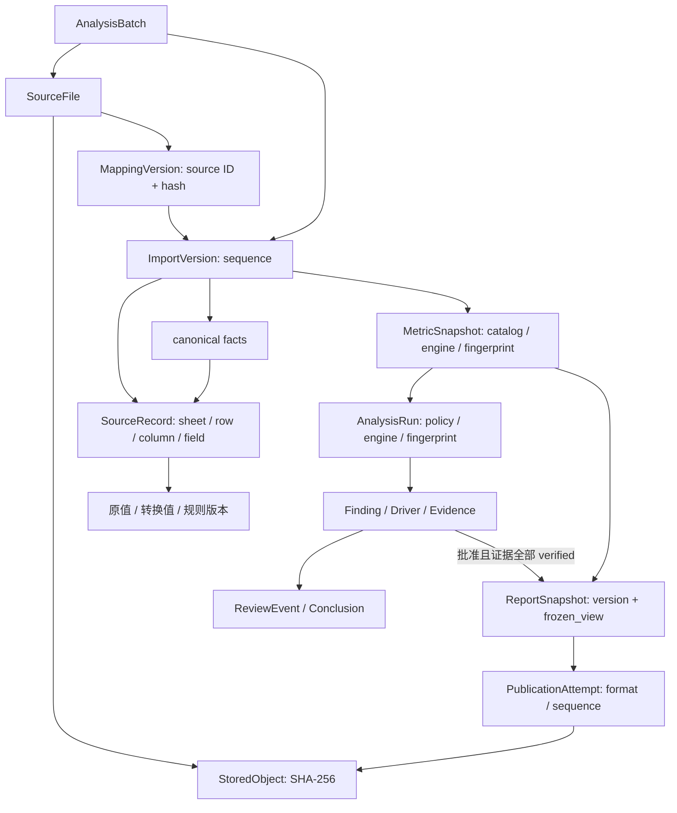
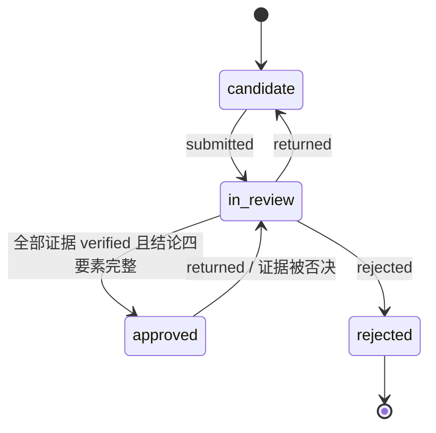

# FLOW V1 领域对象

核对基线：2026-09-04，代码 `c1a59d1`。对象契约遵循 D028、D033、D037，金额使用 PostgreSQL `NUMERIC` 与 Python `Decimal`；API 财务数值以精确字符串传递。

## 标识与版本

聚合实体一般使用 UUIDv7；canonical 交换层以稳定业务编码和确定性 ID 保持语义往返。指标另有 `(metric_code, version)`，目录、引擎与分析策略都参与计算身份。不能以日期、页面当前选择或文件名替代不可变 ID。

| 聚合 | 主要对象 | 所有者 / 版本边界 |
|---|---|---|
| 数据接入 | AnalysisBatch、StoredObject、SourceFile、MappingVersion、ImportVersion | Intake；映射或数据变化创建新版本 |
| 质量与血缘 | QualityIssue、WarningAcknowledgement、ReconciliationResult、TransformationEvent、SourceRecord | 原值、源位置、规则版本与具名确认 |
| 标准数据 | 8 个共用维度、4 个事实表 | canonical；事实按导入版本保留 |
| 指标 | MetricDefinition、MetricDefinitionDependency、MetricSnapshot、MetricValue | 完整输入身份与计算轨迹 |
| 分析调查 | AnalysisRun、AnalysisResult、Finding、DriverContribution、Evidence、Conclusion、ReviewEvent | 确定性分析不可变；复核按受控状态机变更 |
| AI | CopilotInteraction | 追加交互审计，记录请求、provider/model、引用、结果与拒绝原因 |
| 报告 | ReportSnapshot、ReportSnapshotItem、PublicationAttempt | 冻结内容与格式尝试分离 |

## 身份与血缘

一个批次可保留多个曾发布的 ImportVersion，但只有一个 `is_published=true` 当前指针。切换指针不会删除旧事实；`status=published` 与“当前版本”不是同一概念。SourceRecord 保存字段级血缘，canonical 事实另保留 `import_version_id` 与 `source_record_id`。

## 复核状态机

结论四要素是 `verified_facts`、`analysis_judgment`、`open_questions`、`recommendation`，都需非空。Evidence 的有效迁移为 pending → verified/rejected，以及 verified ↔ rejected；没有退回 pending 的操作。已批准 Finding 的证据被否决时，事务内先退回 `in_review`，同时追加退回和证据决策事件。审计不改写历史，审阅变动也不改写已冻结报告。

## 冻结报告与发布尝试

迁移 `0010_frozen_reports` 增加 `ReportSnapshot.frozen_view` JSONB，封装 `schema_version=1` 与序列化 ReportView。冻结时锁定指标快照及 Findings，再复核批准状态、证据与结论。相同内容复用最新报告；内容变化创建新版本。比较摘要排除报告 ID、报告版本与生成时间。

| 边界 | 保证与限制 |
|---|---|
| 源对象 | `raw/{sha256前两位}/{sha256}` 内容寻址；已有对象必须通过长度及哈希校验 |
| MetricSnapshot / AnalysisRun | 已发布计算内容不可变，新输入或策略形成新身份 |
| Finding / Evidence | 可按状态机复核；分析事实与人工审阅生命周期分开 |
| ReportSnapshot | 渲染只读取冻结载荷；ORM 防护及数据库 UPDATE trigger 防止覆盖已有载荷报告 |
| ReportSnapshotItem | 保留引用索引；历史渲染的权威内容是 frozen_view，不从当前引用对象重新拼装 |
| 历史 NULL 载荷 | 迁移不补造历史；旧产物可下载，新渲染需重新冻结 |
| PublicationAttempt | 同一报告每次每格式一个新序号；实现直接 running → succeeded/failed，queued 仅是模型允许状态 |

当前迁移链：0001 接入基础 → 0002 canonical → 0003 分析发布 → 0004 接入审计与发布 → 0005 版本化事实 → 0006 指标身份 → 0007 AnalysisRun → 0008 调查复核 → 0009 Copilot 审计 → 0010 冻结报告。

核对入口：[模型](../../services/api/src/flow_api/infrastructure/models)、[迁移](../../services/api/migrations/versions)、[复核状态机](../../services/api/src/flow_api/investigation/state_machines.py)、[冻结服务](../../services/api/src/flow_api/publishing/service.py)。
