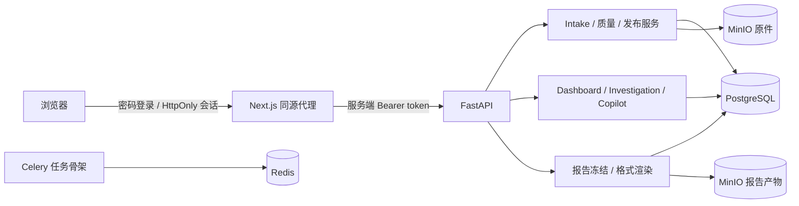
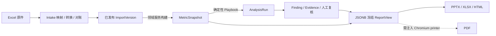

# FLOW 运行架构与部署边界｜2026-09-07

核对基线：2026-09-07，代码 `04ba4d7`。本文记录实际运行边界；正式方向按 D049，领域约束按有效规格，功能验收不等于生产就绪。

## 进程与责任

| 进程 | 当前责任 | 依赖 |
|---|---|---|
| Next.js Web | 登录、同源代理、导入工作台、驾驶舱、Investigation、报告中心 | FastAPI |
| FastAPI API | `/api/v1` 合约与同步领域用例；校验、发布、渲染在请求进程执行 | PostgreSQL、MinIO |
| Celery Worker | Broker 与任务骨架；`flow.jobs.execute` 目前仅返回 `accepted` | Redis |
| PostgreSQL 18 | canonical、版本、血缘、指标、分析、复核、冻结报告与审计 | 持久卷 |
| Redis 8 | Celery broker/backend 与幂等任务基础设施 | 无 |
| MinIO | 内容寻址原件与渲染产物 | 持久卷 |

**当前业务没有由 Celery 实际调度执行。** Worker 存在不代表导入、指标、分析和发布已异步化。Intake 发布 API 只发布 canonical 导入版本，不自动调用指标或分析服务；指标与分析可由显式构建 API `/api/v1/orchestration/batches/{id}/build` 按批次期间同步构建，BuildJob 保留状态、失败与重试查询。API 已有编排不等于 Celery 已实际承载业务，也不等于新客观报告浏览器旅程已经验收。

## 请求与数据边界

公开财报另由 `statements` 来源/抽取/归一/勾稽/复核模块处理，已提交指标治理使用数据库定义版本、执行绑定及影响沙箱，YAML 按 D048 保留兼容。只有接入模块可以读取原始 Excel。指标和分析服务读取受治理 canonical 数据；Dashboard 读取已发布快照/运行的投影；Investigation 展示数值、源记录与审计；Copilot 使用绑定对象的上下文和输出校验。各模块不能自行创造数字或绕过复核签发。

## 发布能力与恢复

`publishing/publication.py` 同步逐格式创建 `running` 尝试，成功后登记对象，失败记录 `error_message`，最后提交尝试历史。数据库允许 `queued`，但现服务并未实现排队执行。

| 格式/动作 | 当前实现 |
|---|---|
| PPTX / XLSX / HTML | 默认 API 服务已连接确定性渲染器，产物写入配置的对象存储 |
| PDF | 冻结 HTML + 可注入 printer 的路径及黄金测试存在；默认 API `PublicationService()` 没有 printer，PDF 尝试会失败 |
| 失败重试 | 对同一冻结报告新建尝试，不重算或修改报告 |
| 下载 | 读取成功尝试的存储字节，核对 SHA-256，使用服务端文件名与 `no-store` / `nosniff` |
| 历史无载荷报告 | 已有产物仍可下载；重新渲染返回 `freeze_blocked`，需按当前合格对象重新冻结 |

不能用四格式黄金测试通过来宣称默认部署已提供 PDF 下载。MinIO 端口健康也不能替代真实上传、读取与下载验收；2026-09-06 已定位并修复系统代理导致的超时，真实上传/发布/下载证据见[修复记录](../implementation/2026-09-06-shell-metric-library-s3-proxy.md)；本次只核对文档，目标环境仍须回归。

## 启动、迁移与配置

| 命令 | 实际作用与边界 |
|---|---|
| `make bootstrap` | 安装锁定的 pnpm / uv 依赖 |
| `make infra-up` | 启动 PostgreSQL、Redis、MinIO，运行一次性 `minio-init` 建桶并等待端口 |
| `make stack-up` | 在基础设施之上构建启动 API、Worker、Web；不自动执行数据库迁移 |
| `cd services/api && uv run alembic upgrade head` | 使用实际加载的数据库配置升级，当前头为 `0018_metric_governance` |
| `make dev-api` / `make dev-web` | 分别运行宿主 API / Web，不自动互相传递凭据 |
| `make contracts` / `make contracts-check` | 生成并检查 OpenAPI 与 TypeScript 漂移 |
| `make acceptance` | 七道功能门禁；脚本先删除并重建本地 `public` schema，只能用于隔离演示/测试库 |
| `make test-user-closure-e2e` | 回归加浏览器闭环；监督器清理本次启动的进程组，仍须使用隔离测试库与端口 |

Compose 是开发栈，包含开发凭据与暴露端口；并非已加固部署。API/Web 有容器健康检查，Worker 可另用 Celery `inspect ping` 检查；`stack-up` 本身没有 Worker 业务验收。环境变量的加载方式和单用户认证见[认证配置](../operations/authentication.md)。备份恢复、网络边界、深度可观测性及真实数据试点仍需独立验收。

源码入口：[Compose](../../infra/compose.yaml)、[Makefile](../../Makefile)、[API 路由](../../services/api/src/flow_api/api/routes)、[Worker](../../services/api/src/flow_api/worker.py)、[发布服务](../../services/api/src/flow_api/publishing/publication.py)。
