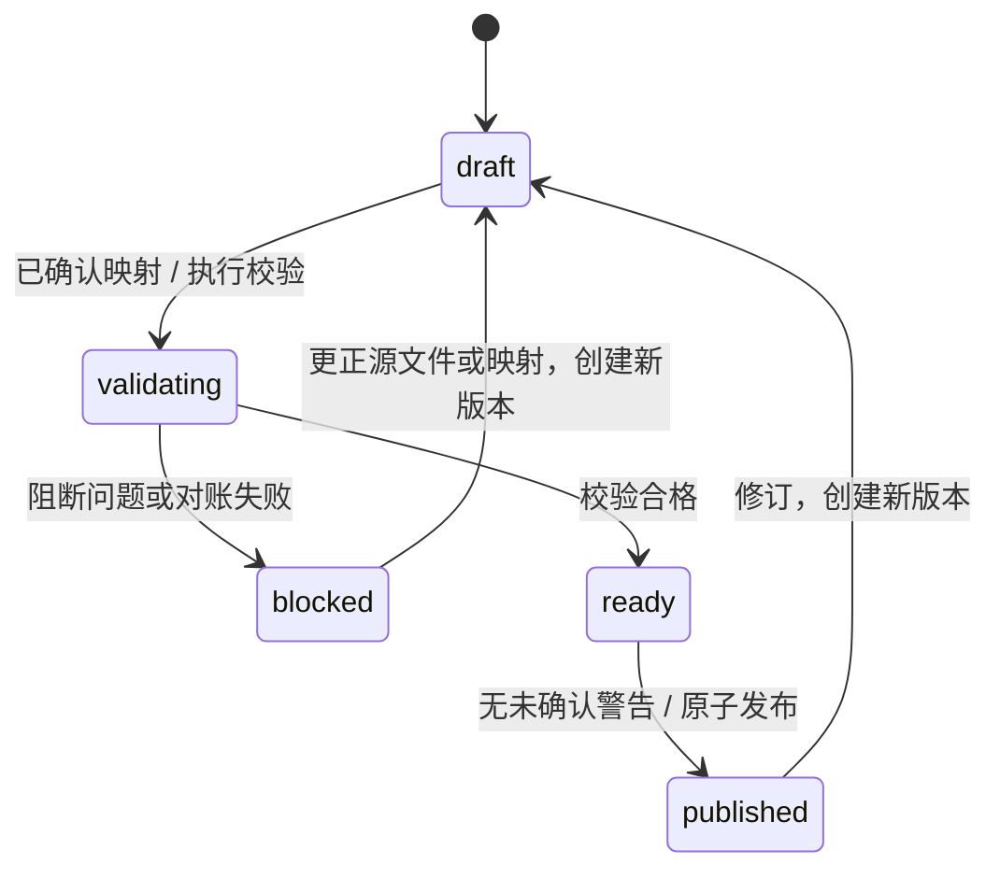

# FLOW V1 Excel 接入、映射、质量与发布

核对基线：2026-09-04，代码 `c1a59d1`。

## 1. 目标与边界

FLOW V1 的接入边界把外部 Excel 转换为冻结的 `flow.excel.v1` 数据中间层。驾驶舱、指标、分析、AI 解读和正式报告只能读取已发布的 canonical 导入版本，不直接依赖源工作簿的工作表名称、列位置或中文表头。

V1 接受无宏 `.xlsx` 文件。标准模板和外部非标准工作簿走同一条接入链路：

`上传 → 原件固化 → 结构识别 → 字段映射 → 映射确认 → 类型转换 → 质量检查 → 经营财务对账 → 预警确认 → 原子发布`

## 2. 操作流程

1. 创建分析批次，获得 `batch_id`；
2. 上传 Excel。系统按 SHA-256 内容寻址保存原始字节，相同内容复用同一对象，禁止覆盖；
3. 查看工作簿 Profile，包括工作表、表头行、数据范围、字段类型和样本统计；
4. 生成映射建议。优先级依次为稳定字段 ID、显示名称、登记别名、唯一兼容类型；AI 只能补充建议，不能改变契约、公式、粒度或发布状态；
5. Finance BP 查看置信度、方法、分数和理由；需要修正时保存人工 override 新版本，携带原 source ID 与 SHA-256，再确认新版本；
6. 执行校验。系统生成不可变导入版本、canonical 候选事实、字段级血缘、质量问题和对账结果；
7. 阻断问题必须通过新源文件或新映射创建更正版本，不能人工越权忽略；非阻断预警必须记录确认人和原因；
8. 只有 `ready` 且无阻断问题、无失败对账、无未确认预警的版本才能发布；
9. 发布在单一数据库事务中切换当前版本。失败会完整回滚；更正导入不会覆盖旧事实或旧血缘。

## 3. 生命周期

| 状态 | 含义 | 允许动作 |
|---|---|---|
| `draft` | 批次或导入草稿 | 上传、映射、校验 |
| `validating` | 正在构建候选数据 | 等待校验完成 |
| `blocked` | 存在阻断质量或对账问题 | 修复源数据并创建更正版本 |
| `ready` | 数据可发布，但可能仍需确认预警 | 确认预警、发布 |
| `published` | 当前正式版本 | 分析、导出、创建更正版本 |

同一批次任意时刻只有一个 `is_published=true` 的版本。历史版本仍保留完整事实、映射、问题和血缘，可按版本读取和复核。



图中返回 draft 表示创建下一版本，不表示覆盖已发布记录。发布 API 仅切换 canonical 当前版本，尚未自动构建指标快照和 AnalysisRun；页面跳转 Dashboard 不等于新数据已有分析结果。

## 4. HTTP API

所有接口位于 `/api/v1/intake`：

| 方法与路径 | 用途 |
|---|---|
| `GET /templates/{template_id}` | 下载空白标准模板 |
| `POST /batches` | 创建分析批次 |
| `POST /batches/{batch_id}/sources` | 以 multipart 字段 `workbook` 上传 XLSX |
| `GET /sources/{source_file_id}/profile` | 查看结构识别结果 |
| `POST /sources/{source_file_id}/mapping-proposals` | 生成并保存映射版本 |
| `POST /mappings/{mapping_version_id}/overrides` | 保存人工修正，创建新映射版本 |
| `POST /mappings/{mapping_version_id}/confirm` | 记录具名映射确认 |
| `POST /sources/{source_file_id}/validate` | 转换、校验并生成导入版本 |
| `POST /issues/{quality_issue_id}/acknowledge` | 确认非阻断预警 |
| `POST /imports/{import_version_id}/publish` | 原子发布 ready 版本 |
| `GET /batches/{batch_id}/versions` | 查询版本、质量问题及 acknowledged 状态 |
| `GET /imports/{import_version_id}/cleaning-summary` | 查看清洗摘要 |
| `GET /imports/{import_version_id}/standardized-workbook` | 导出标准化工作簿 |

OpenAPI 位于 `packages/contracts/openapi.json`，TypeScript 类型位于 `packages/contracts/src/schema.d.ts`。修改接口后必须运行 `make contracts` 并通过 `make contracts-check`。

确认与校验使用持久化 `mapping_spec`，不重新生成自动建议覆盖人工选择。服务同时核对源文件 ID、批次、源字节哈希与映射哈希；失败不能静默回落到旧映射。工作台显示待确认警告并提交 `actor` / `reason`；确认后重新读取状态，只有所有门槛满足才可发布。

## 5. 稳定错误代码

| HTTP | `detail.code` | 含义与处理 |
|---:|---|---|
| 413 | `source_too_large` | 超过 `INTAKE_MAX_UPLOAD_BYTES`；拆分或压缩业务数据 |
| 422 | `invalid_source` | 空文件、非 XLSX、宏或旧版 Excel；转换为无宏 XLSX |
| 422 | `workbook_profile_failed` | 文件损坏、公式输入、加密或结构超限；修复源文件 |
| 422 | `workbook_mapping_failed` | 无法安全识别映射输入；补充清晰表头或使用标准模板 |
| 422 | `candidate_extraction_failed` | 某个值无法无歧义转换；按失败数量和源位置修复 |
| 422 | `request_validation_failed` | API 参数类型、必填项或长度不合法 |
| 404 | `batch_not_found` / `source_not_found` / `mapping_not_found` / `import_not_found` | 资源不存在或 ID 错误 |
| 409 | `cross_batch_source` / `stale_source` | 人工修正引用错误源身份或哈希；重新读取当前来源 |
| 409 | `mapping_source_mismatch` | 映射不属于该不可变源文件；重新生成映射 |
| 409 | `issue_not_acknowledgeable` | 尝试确认阻断问题；必须创建更正版本 |
| 409 | `publication_blocked` | 状态错误、阻断项、失败对账或未确认预警仍存在 |

## 6. 审计与数据血缘

系统保留：

- 源对象 SHA-256、对象键、原文件名、字节数和类型；
- 映射版本序号、哈希、源/目标字段、方法、置信度、分数、理由和确认人；
- 每次导入的版本序号、状态、发布时间和当前发布身份；
- 每个源单元格的位置、原始值、转换值、目标字段、规则 ID、规则版本和转换原因；
- 每个质量问题的级别、代码、消息、证据、修复建议和源位置；
- 每次预警确认的人员、原因和时间；
- 每个经营财务对账的期望值、实际值、差异、阈值和结论；
- 每条 canonical 事实的业务记录 ID、导入版本和源记录血缘。

原始值和源工作簿不能被更新；任何修正都必须生成新的 Source、Mapping 或 ImportVersion。

## 7. 恢复规则

- 结构识别或转换失败：原始对象仍保留，修复 Excel 后重新上传；
- 映射错误：保存新映射版本后重新校验，不修改旧映射；
- 阻断质量或对账失败：创建更正导入，禁止确认或强制发布；
- 发布过程异常：事务自动回滚，原当前发布版本保持不变；
- 已发布数据需要修正：新源文件生成下一序号版本，通过全部门禁后替换当前发布指针，旧版本继续可查询；
- 对象哈希或字节冲突：停止处理并升级为存储完整性事件，不复用可疑对象。

## 8. 验收命令

在 PostgreSQL、Redis 和 MinIO 可用时运行：

```bash
make test-intake-e2e
```

该门禁同时检查标准与非标准工作簿语义一致性、已知答案、版本历史、字段血缘、质量/对账、发布回滚、更正版本、迁移往返、OpenAPI 漂移以及 Phase 1/2 回归。

## 9. 验证范围

导入工作台和人工映射/警告确认已有 API 与组件回归；运行时使用真实 MinIO 保存原件。本次文档核对的真实上传验证遭遇环境超时，不能以 mock 存储测试或容器健康代替真实上传通过记录。阶段历史证据见[审查修复验收](../implementation/2026-09-04-review-repairs.md)。
