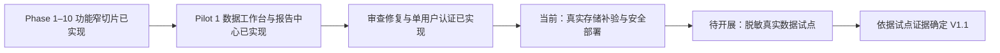

# FLOW 项目当前状态与时间线

## 当前状态摘要

截至 **2026-09-04（代码基线 `c1a59d1`）**，产品设计、Phase 1–10 功能窄切片和 Pilot Phase 1 用户界面已落地。用户可从 `/data` 上传工作簿、修正映射、确认质量警告并发布，进入驾驶舱与证据复核，再在 `/reports` 冻结报告并生成/下载四格式产物。API Bearer 认证、单用户 Web 登录会话及受保护代理已实现，数据库迁移头为 `0010_frozen_reports`。原审查 R1–R9 与追加 N1–N3 已修复。

当前仍是 **Pilot Readiness（试点就绪建设中）**，不等于生产就绪。最新浏览器导入验证使用存储替身；独立 MinIO 可建桶/列桶，但 PutObject 探针超时，真实网络存储的完整上传与发布链路尚未验收。备份恢复、HTTPS 部署、网络加固、结构化日志和脱敏真实数据试点仍待完成。最新证据见[审查修复验收](../../implementation/2026-09-04-review-repairs.md)，阶段历史记录不应被当作当前提交全量验收。规范仓库：<https://github.com/davyzhong/FLOW>。

## 阶段时间线

### 阶段 0：参考材料研究

用户最初围绕财务驾驶舱、经营分析、Excel 数据分析 Skill 和报告生成展开讨论，并提供五篇微信公众号资料。原始网页、正文、图片和研究笔记保存在研究目录中。

这一阶段形成的早期判断：

- 产品不应只是财务驾驶舱；
- 驾驶舱、Excel 分析和报告生成应是同一系统的不同界面；
- 产品需要数据、指标、分析、洞察和发布能力；
- 分析能力必须从描述和对比提升到诊断、预测和决策；
- Driver Model 比单纯图表模板更重要；
- 长期方向可以被描述为 Finance Intelligence OS。

### 阶段 1：产品目标收敛

用户明确：

- 不强求纯本地离线，Web、应用或其他部署均可；
- 工程名称候选包括 FLOW 和 FI 开头名称；
- 产品首先需要落到真实行业场景，而不是继续停留在抽象平台概念。

### 阶段 2：首个垂直场景

选择物流企业供应链业务，并以六张供应链规模日报截图作为经营结构参考。

关键场景决策：

- 使用高度拟真的模拟数据；
- 12 个月月度实际 + 年度月度预算；
- 核心故事是规模增长但盈利与现金恶化；
- 采用客户群 × 物流产品双维度；
- 保留组织、区域、客户和月份等辅助维度。

### 阶段 3：用户体验收敛

最初讨论过管理层和 Finance BP 双角色，用户随后明确撤回双角色首版，改为只做 Finance BP 视角的经营驾驶舱。

已确认：

- 首页采用“总览 + 异常 + 专题下钻”；
- 当月 + YTD 双视角；
- 经营和财务指标联动；
- 确定性计算 + AI 解读；
- 异常点击进入独立 Investigation；
- Investigation 以证据、公式、数据血缘和复核为核心；
- 驾驶舱采用高信息密度设计。

### 阶段 4：数据中间层确立

数据导入最初曾考虑只使用内置模拟数据，用户后来明确 Excel 上传、字段映射和数据清洗是 V1 必需能力。

进一步确立：

- 所有外部数据必须先转换到统一数据中间层；
- 标准 Excel 模板用于直接填写和外部数据转换核对；
- 数据库标准表是真正的数据中间层；
- 采用主题事实表 + 共用维度表；
- 标准 Excel 数据包采用一个多工作表文件；
- 模板采用“核心必需 + 财务扩展 + 物流扩展”的模块化结构。

### 阶段 5：统一输出层

用户明确 PPT、Excel 和正式月报不是后续附加能力，而是 V1 的重要组成。

已确认：

- 专业模板 + AI 编排；
- PPT 面向汇报和决策；
- 分析 Excel 面向复核和二次分析；
- HTML/PDF 月报面向签发和归档；
- 三种输出共享同一分析快照；
- AI 不重新计算数字；
- 未批准 Finding 不能进入正式报告。

### 阶段 6：完整设计批准

通过浏览器可视化原型依次确认：

- 信息架构；
- 高密度 Finance BP 驾驶舱；
- 证据优先的 Investigation；
- Excel 导入流程；
- 标准数据中间层；
- 模块化标准 Excel 数据包；
- 统一发布中心；
- FLOW V1 完整产品蓝图。

正式规格位于：

`docs/superpowers/specs/2026-08-29-flow-v1-design.md`

### 阶段 7：知识库归档

已保留全部有效原始资料并建立适合 Agent 接续的索引、决策日志和变更导航。历史研究源目录中除 `.mimosa` 运行状态外的 89 个文件，已与知识库归档逐文件核对一致。

### 阶段 8：规范仓库与持续交付约定

- 规范 GitHub 仓库：<https://github.com/davyzhong/FLOW>；
- 本地规范远程名：`origin`；
- 每个完整任务必须在验证后创建范围明确的提交并推送；
- 禁止强制推送和夹带无关用户文件。

### 阶段 9：详细实施计划

- 已建立 FLOW V1 主实施路线图，覆盖基础架构、数据契约、接入、指标、分析、驾驶舱、Investigation、AI、统一发布和运维验收十个阶段；
- 已完成 Phase 1“基础架构与对象契约”的可执行测试先行计划；
- 实施基线采用 Next.js Web + FastAPI 模块化单体 + Celery Worker + PostgreSQL + S3 兼容对象存储 + Redis；
- Phase 1 按测试先行计划开始实施。

### 阶段 10：Phase 1 基础架构与对象契约

- 建立 pnpm + uv 锁定依赖的 Next.js/FastAPI/Celery 工程；
- 建立 PostgreSQL、Redis、MinIO、API、Worker 和 Web 的 Compose 运行栈；
- 建立接入、版本、质量、血缘、8 个公共维度、4 个核心事实表；
- 建立指标快照、Finding、证据、评审、结论和统一发布身份；
- 发布 Workspace OpenAPI 与生成式 TypeScript 契约；
- 实现内容寻址对象存储和 Redis 幂等任务键；
- 迁移头达到 `0003_analytics_and_publishing`；
- 干净 worktree 验收通过，GitHub Actions 的 7 个 jobs 全部通过；
- 详细证据见 `docs/implementation/phase-1-verification.md`。

### 阶段 11：Phase 2 标准 Excel 数据契约与高拟真 fixture

- 冻结 `flow.excel.v1` 机器可读 YAML 契约，覆盖 10 张标准工作表；
- 生成可直接填写和导入的 `flow_standard_v1.xlsx`，以稳定字段 ID 而不是列位置或显示名称识别语义；
- 建立 24 个月、客户群 × 物流产品 × 组织 × 区域粒度的确定性物流供应链参考数据；
- 冻结收入、利润、现金、预算差额、应收与跨域对账的精确已知答案；
- 实现有类型的工作簿解析、空值语义、外键/粒度校验和错误报告；
- 实现 Excel → canonical package → PostgreSQL → canonical package → Excel 的零差异语义往返；
- 新增 `make test-data-contract` 与 GitHub Actions `data-contract` 门禁；
- 干净 worktree 完整回归通过，GitHub Actions 的 8 个 jobs 全部通过；
- 详细证据见 `docs/implementation/phase-2-verification.md`。

### 阶段 12：Phase 3 Intake、Mapping & Quality

- 建立非标准物流工作簿 fixture，包含重命名/乱序工作表、偏移表头、中文别名、格式变化和无关说明列；
- 以 SHA-256 内容寻址保存不可变源文件，并验证已存在对象的长度与校验和；
- 实现安全工作簿画像、确定性映射优先级、受约束 AI 候选接口和稳定映射哈希；
- 实现版本化纯转换、原始值保留和精确到 sheet/row/column 的字段级血缘；
- 实现分层质量问题、财务对账、警告确认和发布阻断；
- 实现 draft → validating → blocked/ready → published 生命周期、事务发布、失败回滚和修订版本；
- 发布 9 个有类型的 Intake API 路径以及同步生成的 TypeScript 合约；
- 新增 `make test-intake-e2e` 与 GitHub Actions `intake-e2e` 门禁；
- 标准与外部工作簿均精确匹配已知答案、语义差异为零，并各保留 57,633 个字段级血缘值；
- 干净 worktree 完整回归和 GitHub Actions 的 9 个 jobs 全部通过；
- 详细证据见 `docs/implementation/phase-3-verification.md`。

### 阶段 13：Phase 4 Metric Snapshots

- 冻结 `flow.metrics.logistics.v1` 指标目录，包含 15 个物流经营/财务指标和 14 条显式依赖边；
- 建立严格 Decimal、统一舍入、维度安全 grain、流量/余额时间行为和月/YTD/预算/同比/T12 窗口；
- 只允许质量、警告确认和对账均合格的 Phase 3 已发布 import 成为指标来源；
- 建立版本化 `metric_definition`、依赖图、完整快照身份、精确值和计算轨迹；
- 实现 `building → published` 原子发布、完整身份幂等、修订/目录/引擎新版本和旧快照不可变保护；
- 标准与外部工作簿经过完整链路后，拥有不同 import 身份但产生相同定义哈希、值指纹和全部精确业务值；
- 新增 `make test-metrics-known-answers` 与 GitHub Actions `metrics-known-answers` 门禁；
- 本地、干净检出和 GitHub Actions 十个 jobs 全部通过；
- 详细证据见 `docs/implementation/phase-4-verification.md`，完整口径见 `docs/metrics/flow-v1-metrics.md`。

### 阶段 14：Phase 5 Analysis & Findings

- 冻结 `flow.analysis.logistics.v1` 策略集和 typed playbook 共同协议；
- 实现 Revenue V/P/M、履约成本 R/V/E、毛利桥、经营利润桥和 AR 现金影响 5 个分析结果；
- 所有金额使用 Decimal，Driver Contributions 与影响金额在 `0.01 CNY` 内严格对账并保留计算轨迹；
- 建立 materiality、persistence、证据完整性和管理相关性四项透明评分，生成 4 个确定性 Finding；
- 每个 Finding 保存 5 个已验证 Evidence，对缺字段和无法匹配的 mix cell 明确降级且不生成推测性 Finding；
- 建立 `building → published` 原子发布、完整身份幂等、发布后不可变和故障回滚；
- 新增 `make test-analysis-invariants` 与 GitHub Actions `analysis-invariants` 门禁；
- 本地全量 API 202 个测试和 GitHub Actions 11 个 jobs 全部通过；
- 详细证据见 `docs/implementation/phase-5-verification.md`，设计边界见 `docs/superpowers/specs/2026-09-01-flow-v1-phase-5-analysis-design.md`。

### 阶段 15：Phase 6 Finance BP Dashboard

- 发布只读 `GET /api/v1/dashboard/overview`，以已发布 Metric Snapshot 和 Analysis Run 为唯一经营数字边界；
- Dashboard Projection 固定暴露完整 batch/import/snapshot/run、指标定义和分析策略身份，所有 Decimal 以精确字符串跨越 JSON；
- 实现当月/YTD 及组织、客户群、物流产品、区域筛选，明确拒绝不支持组合，面板缺失或降级不以零填补；
- 以同一发布 lineage 提供 12 个月趋势、八个经营财务指标、T12 经营利润桥、排名 Findings、产品表和客户群×产品毛利矩阵；
- 完成高密度 Finance BP 页面、完整 loading/empty/error/retry/stale/degraded 状态和 Investigation 不可变身份回执；
- 浏览器经同源代理只访问 typed Dashboard API，不读取原始文件、canonical 明细、Metric Value 或 Analysis 持久化接口；
- Playwright 覆盖真实数据、筛选、身份交接、网络边界、axe 无障碍和 1440/1920 截图基线；
- 详细证据见 `docs/implementation/phase-6-verification.md`，视觉对比见 `docs/implementation/phase-6-dashboard-fidelity.md`。

### 阶段 16：Phase 7 Evidence-first Investigation & Review

- 冻结 Finding 状态机（candidate → in_review → approved/rejected，含退回路径）与 Evidence 决策迁移（pending/verified/rejected），每次决策追加序列化 ReviewEvent，迁移 0008 扩展 evidence_verified/evidence_rejected；
- 发布 typed Investigation API：身份绑定读取（404/409 语义）、证据决策、结论保存与状态迁移，错误码稳定（evidence_pending/evidence_rejected/conclusion_incomplete/invalid_transition）；
- 完成证据优先工作台：调查流程栏、复核流程条、影响桥与驱动明细、公式与计算引擎版本、对账与质量检查、文件/工作表/行级源记录血缘、结论四要素编辑、证据复核与审阅历史；
- 审批资格硬约束：任一证据非 verified 或结论不完整即阻断批准；记录级表格只展示 canonical 数值与血缘，不重算分析金额；
- `make test-investigation-e2e` 与 GitHub Actions `investigation-e2e` 门禁落地；Playwright 4 个用例覆盖交接、复核、阻断批准、签发与审计历史；
- 本地与 CI 全部门禁通过；详细证据见 `docs/implementation/phase-7-verification.md`。

### 阶段 17：Phase 8 AI Copilot

- 冻结 provider 中立 `CopilotProvider` 协议，落地确定性 `ScriptedProvider` 与基于上下文包模板的 `DeterministicProvider`；live provider 保持 opt-in 且永不进入 CI；
- 上下文包只含身份绑定对象（批次、快照、运行、指标定义与公式、Finding、Driver、Evidence），由 Phase 7 同一仓库层构建；
- 结构化输出强制分离事实/判断/假设/追问并引用对象 ID；验证器拒绝未引用数字、未知引用、未验证事实与未批准 Finding 的报告大纲，数据不足时显式降级；
- 每次交互持久化 `CopilotInteraction` 审计行（迁移 0009）：模板版本、provider/model、请求引用、响应、结论与拒绝原因、操作者；
- 发布 typed Copilot API（investigations/ask、explain-mapping、report-outline）；工作台新增 AI 分析助手面板（引用徽章、降级提示）；
- `make test-copilot-evals` 与 GitHub Actions `copilot-evals` 门禁落地；6 个固定评估用例全部通过，详见 `docs/implementation/phase-8-verification.md`。

### 阶段 18：Phase 9 Unified Publishing

- Report Snapshot 冻结：仅接受 approved Finding（状态机签发产物），按 (metric_snapshot_id, version) 幂等版本化，条目引用 evidence/finding 对象；
- 四格式渲染：PPTX（结论先行 + 指标页 + 证据索引）、分析 Excel（指标/发现/驱动/质量对账/版本血缘工作表）、语义 HTML（表格 + 证据脚注 + 身份页脚）、PDF（冻结 HTML 经固定 Chromium 打印）；
- 发布尝试逐次持久化（queued→running→succeeded/failed），失败可独立重试而无需重建快照；存储可注入以便快速测试；
- `make test-publishing-golden` 与 `publishing-golden` CI 门禁：从四个产物中提取规范关键值（报告版本、批次/快照/运行 ID、全部指标本期值、发现影响精确金额）并验证跨格式一致；
- 详见 `docs/implementation/phase-9-verification.md`。

### 阶段 19：Phase 10 Acceptance Suite

- 建立 `make acceptance` 总验收命令：串联合同往返、指标已知答案、分析不变量、接入端到端、发布黄金、调查端到端与驾驶舱端到端七道门禁；
- CI 与本地验收共用同一套门禁脚本，Phase 1–10 的 V1 验收标准全部自动化；
- 备份演练与深度可观测性按未决的部署拓扑顺延（见 `docs/implementation/phase-10-acceptance.md`）。

### 阶段 20：外部素材管道与公众号素材库

- 建立公众号素材库 `docs/knowledge-base/08_wechat_sources/`（数据熊、数研复盘狮、花叔三来源），与阶段 0 研究资料同源（经原始链接复核：阶段 0 五篇中 4 篇来自数据熊、1 篇来自花叔），作为下一阶段方向验证的外部参照；
- 数据熊按公众号官方 4 个合集分类归档为 4 个知识库合集：01_财务分析 84 篇、02_财务管理 138 篇、03_财务报表 26 篇、04_经营分析 191 篇（清单存 `albums/`，跨合集文章取主归属、meta 记全部归属）；
- 落地抓取流水线 `scripts/wechat_kb/`：文章发现（合集公开接口 / seed 队列 / 收件箱自动归类 / 微信公众平台接口 / RSS 五通道）、正文与图片抓取、Markdown 转换、大图压缩、财经相关性筛选、索引与 99_manifest 自动重建，出站请求带 host 白名单与内网地址防护；
- 沉淀 `wechat-kb-sync` 技能与每周一 09:00 定时同步；通用引擎另沉淀为跨项目 `wechat-article-harvest` 技能；
- 2026-09-03 架构变更：Obsidian vault（多机同步）成为知识内容唯一仓库（`sources.yaml: content_root` 指向 `/Users/qiming/ObsidianWiki/Clippings/微信知识库/`）；仓库 08_wechat_sources 只保留流水线、来源配置、队列/状态/日志与链接引用索引（INDEX.md 含每篇 vault 笔记 `obsidian://` 链接），同步流水线改为 staging 中转后直写 vault；
- 合集之外的散篇可按 wechat-kb-sync 技能第 5 节的慢节奏流程补齐（浏览器页面内 fetch，受公众平台 200013 频率限制约束）；
- 2026-09-03 移交决定：公众号→Obsidian 知识库能力整体移交 DavyBase 项目（多渠道知识抓取 → Obsidian 知识库，定位重合）；标准化工具沉淀于用户技能 `wechat-article-harvest`（wxkb CLI）；每周一定时任务已删除；**流水线与配置先恢复保留（自 e5919b4 恢复，提交 c681067），待 DavyBase 确认接收后再删除**，届时仅保留 `08_wechat_sources/` 的引用入口（INDEX.md + HANDOFF.md）；交接清单见 `08_wechat_sources/HANDOFF.md`。

### 阶段 21：Pilot Phase 1 用户闭环与基线

- `/data` 五阶段工作台、标准模板下载、映射人工覆盖、清洗摘要与标准化 XLSX 导出已落地；
- `/reports` 报告中心、冻结快照列表、四格式生成、产物状态及带 SHA 校验的下载已落地；
- `make test-user-closure-e2e` 有历史 exit=0 记录，CI 独立 `user-closure` job 已加入；详见[阶段证据](../../implementation/phase-pilot-1-user-closure.md)。该阶段证据早于后续正确性修复，不能替代最新代码或真实对象存储验收。

### 阶段 22：2026-09-04 审查修复与单用户认证

- `fa171ec` 修复冻结、证据审批一致性与人工映射三项 P1；`e688f1b` 完成六项 P2 及契约更新；`c1a59d1` 完成登录会话、代理保护与 CI 单元测试隔离；
- 迁移 `0010_frozen_reports` 持久化完整 JSONB 冻结内容并保护不可变性；历史无 payload 快照不伪造旧内容，已有产物保留，重新渲染需重新冻结；
- 真实 Chrome 已验证启用认证的生产 Next.js 构建到 FastAPI：匿名 401、错误密码拒绝、登录后 workspace 200、退出后 401；单用户边界不等于企业角色权限体系；
- 本轮分组验收包含前端 42 passed、认证独立复核 11 passed、生产构建和契约检查；API 集成测试收集 150 项不等于全部运行通过。各组测试有重叠，不累计为全量总数。

### 阶段 23：会计基础数据与财务分析指标库立项（D040）

- 归档调研资料 07–10 号：CAS 准则体系与 2006 版 156 科目 / 2024 汇编 171 科目、四大能力与杜邦体系、评级机构口径、四大方法论与物流行业口径；10 号增补完成来源逐项验证（财政部准则通知原文、维基文库科目全表、国资委 22 项逐项公式、CPA 口径差异与管理用报表推导链、四大资料可得性结论）；
- 形成设计草案与初始数据集 v0 草案：`flow.metric_dictionary.v0-draft` 含通用 40 指标（偿债 10 / 营运 9 / 盈利 11 / 发展 5 / 现金流 5）+ 物流行业 15 指标（与 `flow.metrics.logistics.v1` 全量对齐），结构化公式、显式依赖边、CAS↔IFRS 报表项目取数映射、caliber 与 provenance 字段齐备，YAML 校验通过；
- D040 立项（2026-09-05 用户逐项确认）：会计基础数据做查阅级 + 取数映射（不做核算级总账）；CAS + IFRS 对照；通用 40 + 物流 15 起步；`flow.metrics.logistics.v1` 建成后迁移为库内行业指标集版本；与 Pilot Phase 2 并行推进；
- 详见[设计草案](../02_research/synthesis/会计与财务指标知识库_设计草案.md)、[初始数据集 v0](../02_research/synthesis/指标库初始数据集_v0_草案.yaml) 与决策日志 D040；正式工程规格与实施计划待编写并经用户批准。

## 当前尚未完成

- 解决真实 MinIO PutObject 超时并补验实际对象存储的上传、发布和下载链路；
- 最小安全部署剩余工作：密钥与网络边界、备份恢复演练、HTTPS 与回滚、结构化日志及统一部署验收；
- 脱敏真实物流企业月度数据试点及可复核的业务价值证据；
- 指标阈值和预警规则的完整明细、企业报告模板品牌规范；
- 正式品牌命名和 FLOW 的最终英文释义。

## 当前下一步

按 D038 继续 Pilot Phase 2：[最小安全部署计划](../../superpowers/plans/2026-09-03-flow-pilot-readiness-phase-2-security-deployment.md)。先核对已交付认证配置与剩余任务，补齐真实存储及部署验证，再开展脱敏真实数据试点；只依据试点证据确定 V1.1。不要重新从 Phase 1 基础架构开工，也不要把导入/报告页面或单用户登录列为尚无实现。D040 会计知识与指标库工作流按其决策第 5 点与 Pilot Phase 2 并行推进：下一步是依据设计草案编写正式规格与实施计划，经用户批准后实施。

## 2026-09-04 审查修复补充

原审查 R1–R9 已按三项 P1、六项 P2 顺序完成：冻结报告内容持久化及不可变约束、审批与证据一致性、人工映射恢复、工作台警告确认、Copilot 审计与批次范围、PPT 正文和下载名称。OpenAPI 再生成同时消除最新审查 N2；用户随后要求继续修复，N1 已补齐登录会话、代理认证及反代公开 origin，N3 已移除认证单测迁移并修正 CI 分组。新增迁移 0010，历史无 payload 快照需要重新冻结才能重新渲染。上述为本次缺陷修复验收，不取代真实数据试点和生产部署验收。参见[修复验收](../../implementation/2026-09-04-review-repairs.md)。

## 本轮文档核对发现的剩余运行问题

2026-09-04 查询 c1a59d1 的[远端 CI](https://github.com/davyzhong/FLOW/actions/runs/33888190706)：独立 unit/contracts 等门禁已通过，但组合 user-closure-e2e 因前一子门禁残留 Next dev 进程而启动冲突，随后浏览器连接拒绝；该历史失败已定位，后续[CI 修复](../../implementation/2026-09-05-ci-repair.md)补齐自有进程组清理与回归；完整远端状态按对应提交核对。当前还没有面向任意新上传批次的一键指标/分析入口；PDF 默认无打印器，Copilot 默认离线确定性提供器。详见[文档核对记录](../../implementation/2026-09-04-documentation-refresh.md)。
