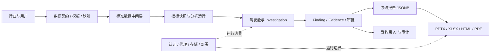

# 变更影响图与可重启节点

## 2026-09-13 战略重构（D052–D054）的影响入口

| 决策 | 直接影响 | 下游必须同步验证 |
|---|---|---|
| D052（内部工作台成为核心产品；取代 D002/D010，修订 D039） | 产品定义六份 + PRODUCT_PRINCIPLES、README 定位、角色边界 | 用户/权限模型、Finance BP 入口设计、20% 人工工作量验收口径 |
| D053（三层两模块与执行顺序；取代 D045/D046，修订 D049/D050） | 路线图（U8→边界重构门禁→公开模块 C 级→内部工作台→四级验证）、模块边界、U9/U10 重新裁决 | 主导航、规格索引、工作包 depends_on、公开模块独立入口 |
| D054（AI 生产链与证据/计算/学习原则） | 报告生产链、证据分层、确定性计算边界、候选假设池 | AI 发布门禁、复算机制、模型调用审计、历史学习存储分层 |

## 2026-09-07 规划候选的影响入口

本次仅新增[参考订正总册](../02_research/synthesis/2026-09-07-reference-and-improvement-master.md)和[详细计划](../../90_archive/plans/2026-09-07-next-stage-upgrade-plan.md)，不改变运行行为。未来获准执行时重点检查：

| 候选改造 | 下游必须同步验证 | 任务 |
|---|---|---|
| MPM/利润/现金指标语义订正 | 词典版本、执行绑定、说明、旧快照和报告 | P01/P03/P08 |
| 主题、比较、期间和粒度合同 | API、图表、下钻、预算联接、不可用状态 | P02–P04/P07 |
| 客观报告独立资格 | 原主观证据门禁、权限、冻结、导出兼容 | P06/P08/P09 |
| 独立答案和留出重划 | 样本声明、准确性报告、支持范围 | P00/P05/P11 |
| 内部经营接口 | 主数据有效期、权限、独立试点、数据保密 | P12，另行授权 |

## 目的

本文件帮助后续 Agent 从任意历史节点修改设计，而不遗漏下游影响。修改任何核心决定时，应先定位对应节点，再检查所有受影响对象。

## 核心依赖链

## 变更影响表

| 变更点 | 直接影响 | 必须同步复核 |
|---|---|---|
| 主用户从 Finance BP 改为管理层 | 首页密度、导航、分析权限 | Finding 表达、Investigation 入口、报告叙事 |
| 行业或业务从物流供应链改变 | 数据模板、维度、模拟故事 | KPI、Driver Model、专题页面、报告章节 |
| 月度改为日度/实时 | 数据粒度、批次和性能 | 趋势、异常规则、刷新机制、存储和成本 |
| 客户群 × 产品维度改变 | 核心事实表粒度 | 交叉矩阵、下钻、预算表、利润桥 |
| Excel 单文件改为多文件 | 接入和关联策略 | 批次、错误恢复、文件血缘和对账流程 |
| 标准数据字段或主键改变 | 数据契约和历史版本 | Excel 模板、映射器、迁移、指标依赖、源行追溯 |
| 指标公式改变 | Metric Snapshot | 驾驶舱、Finding、历史比较和所有报告 |
| Driver Model 改变 | Analysis Engine | Investigation、证据需求、AI 解释和报告结论 |
| AI 权限扩大 | 风险与可信机制 | 数字一致性测试、审阅、引用和发布规则 |
| 证据发布门槛改变 | Finding 生命周期 | 报告编排、审阅状态和审计记录 |
| Investigation 审批资格规则改变（D037） | 状态机与迁移 0008 | Investigation API/工作台、Phase 8 AI 上下文、Phase 9 报告资格判定 |
| 产品定位收敛为准确财务分析（D039） | 路线图排序、叙事与品牌约束 | 经营判断相关远期项、试点验证重点（准确性承诺）、报告章节结构、正式品牌释义 |
| 会计基础数据与财务分析指标库立项（D040） | 新增语义知识层（准则/科目/分录/指标卡片与取数映射），后续 `flow.metrics.logistics.v1` 迁移为库内行业指标集 | D016/D028/D031/D033/D037 不可变与确定性边界复核、指标口径变更的版本化流程、驾驶舱/报告/Copilot 的口径引用来源、已发布快照不受目录演进影响 |
| 四表一注标准输出与反向解析验证（D041） | 对象模型新增报表项目（StatementLineItem），取数链延伸至「科目 → 报表项目 → 指标」；新增 P5 真实财报反向解析验证实验 | 报告输出结构（四表一注为基准输出物）、科目映射须闭合到报表项目、验证证据归档与差异分级流程、与 Pilot Phase 2 试点证据的合并判定、样本财报来源（公开披露，PDF/XBRL） |
| 输出格式增加 Word | Publishing Renderer | 模板、分页、字体、回归测试和版本记录 |
| 冻结报告载荷或渲染规则改变（D028，迁移 0010） | JSONB 冻结内容、版本判定、不可变触发器 | 四格式黄金值、并发冻结/审批锁、事务提交；旧无 payload 快照需重新冻结，不能补造历史 |
| 人工映射与质量警告确认改变 | MappingVersion、源 SHA/批次身份、发布资格 | `/data` 状态刷新、失败恢复、标准化导出、Intake API 与生成契约 |
| 单用户登录与代理认证改变 | AUTH_TOKEN、签名会话、公开 origin | 匿名拒绝、会话到期/轮换、Origin 检查、HTTPS cookie、下载头与同源浏览器链路 |
| 对象存储配置或传输改变 | 原始文件、内容寻址、发布产物 | 真实 PutObject/GetObject、SHA 校验、下载、重试、备份恢复；存储替身不能替代真实链路验收 |
| 部署方式确定 | 技术架构 | 鉴权、存储、文件安全、模型接入和运维 |
| 试点数据字段或口径改变 | Intake Mapping、canonical 与指标目录 | 对账、Driver、Finding、Dashboard、报告及脱敏规则 |
| 依据试点调整 V1.1 范围（D038） | 产品优先级与验收标准 | 决策日志、实施计划、数据契约、用户旅程和发布说明 |
| 双轨产品结构（D045） | 信息架构与导航分组、受众叙事、指标/契约按轨道版本化 | D010/D039 被取代部分的引用点、经营分析轨数据定义设计、报告章节结构、试点验证范围（财务轨优先） |
| Obsidian 常驻内部知识源与取用门禁（D051） | 每个计划/规格/功能任务的研究入口、候选来源、敏感边界与回写记录 | 默认引用 `obsidian-2026-09-12T15:46+08:00`；仅显式维护时建新截面；按 K1–K8 定向读取；记录采用/拒绝/待核；官方原文校准；内部值授权；统一计划 KG-1–KG-5；知识库索引与 manifest |

## D051 知识来源变更的影响入口

Obsidian 新增或更新内容本身不触发代码、指标或合同变更。只有当具体 U/O 任务完成“来源→候选→正式决策”的转换后，才沿对应节点复核下游：

| 素材类型 | 首先检查 | 获批后同步复核 |
|---|---|---|
| 指标/公式/阈值 | 官方定义、数据可得性、重复项、适用主体与期间 | 指标版本、执行绑定、快照、图表、报告和历史兼容 |
| 看板/报告模板 | 是否只属展示建议；是否消费同一冻结事实 | 页面、四格式黄金值、可追溯字段、无障碍与视觉回归 |
| 预算/预测/情景 | 预算/预测版本、假设、实际回填和误差复盘是否真实可得 | U9/O5 事实合同、不可用态、冻结发布；U10 范围决策 |
| 因果/行动建议 | 证据等级、责任人、期限、反事实与效果口径 | U5 主观门禁、Investigation、审计、Action/Outcome（若 U10 批准） |
| 内部企业资料 | 授权、脱敏、权限、用途与退出方式 | 仅 U9/O5 试点；不得进入公开演示、对外材料或无权限日志 |

若 vault 不可访问，任务记录该限制并在恢复后补做差异检查；不得把未读取的内部材料写成“已复核”。

## 可从头重启

适用场景：改变产品定位、行业、首要用户或 V1 目标。

建议读取：

1. 历史 ChatGPT 完整会话；
2. 五份研究资料和综合研究结论；
3. 决策日志 D001–D009；
4. 原始行业截图。

重启时应创建新的设计规格，不直接修改已批准 V1 规格而不留版本。

## 从用户体验节点重启

适用场景：保留数据和行业设计，只重做驾驶舱、Investigation 或角色视角。

建议读取：

1. 决策日志 D010–D018；
2. `dashboard-density-v2.html`；
3. `investigation-evidence-v2.html`；
4. 外部财务驾驶舱参考图。

需要同步复核导航、信息密度、Finding 表达和报告叙事。

## 从数据架构节点重启

适用场景：修改标准模板、数据库模型、批次或数据接入。

建议读取：

1. 决策日志 D019–D024；
2. `canonical-data-layer.html`；
3. `standard-excel-package-v2.html`；
4. 正式规格第 6–8 章。

修改后必须重新验证指标、血缘、对账和全部下游页面。

## 从分析方法节点重启

适用场景：新增指标、Driver Model、Finding 类型或分析 Playbook。

建议读取：

1. 综合研究结论；
2. 正式规格第 9–10 章；
3. Investigation 原型；
4. 报告资料中的瀑布图、因果链和利润漏损页面。

当前可执行分析基线还应读取：

5. `docs/superpowers/specs/2026-09-01-flow-v1-phase-5-analysis-design.md`；
6. `docs/90_archive/plans/2026-09-01-flow-v1-phase-5-analysis.md`；
7. `docs/implementation/2026-09-01-phase-5-verification.md`。

修改 Playbook、比较窗口、策略阈值或评分权重后，必须生成新的 policy hash，并重新验证 Driver 对账、Finding 硬门槛、排名、Evidence 和下游快照消费边界。

## 从 Dashboard / Investigation 交接节点重启

适用场景：修改驾驶舱信息密度、筛选、可视化、状态、Dashboard API，或 Phase 7 Investigation 的进入身份。

建议读取：

1. `docs/superpowers/specs/2026-09-01-flow-v1-phase-6-dashboard-design.md`；
2. `docs/90_archive/plans/2026-08-30-flow-v1-phase-6-dashboard.md`；
3. `docs/implementation/2026-09-02-phase-6-verification.md`；
4. `docs/implementation/2026-09-02-phase-6-dashboard-fidelity.md`；
5. 决策日志 D033–D036；
6. `dashboard-density-v2.html` 和最新 1440/1920 截图基线。

修改 Dashboard Projection 时必须同步复核 OpenAPI/TypeScript 合约、完整身份、Decimal 表示、筛选能力矩阵、降级状态、网络边界和截图基线。修改 Investigation 跳转时必须保证 Finding、batch、Metric Snapshot 和 Analysis Run 四个身份仍共同传递，且与 Phase 7 的证据查询边界一致。

## 从发布节点重启

适用场景：修改报告结构、增加格式或企业模板。

建议读取：

1. 决策日志 D025–D028；
2. `unified-publishing.html`；
3. 两份 PPT 研究资料；
4. 正式规格第 13 章；
5. `docs/implementation/2026-09-04-review-repairs.md` 与迁移 `0010_frozen_reports`。

当前冻结内容已完整持久化为 JSONB，渲染只能消费冻结内容；审批、冻结与证据变更需要一致的锁和事务边界。改变已批准结论或拒绝证据会退回复核，不能依靠旧 approved 状态继续冻结。

## 从 Pilot Readiness 节点重启

适用场景：维护已实现的 Excel 导入/报告下载闭环、完成安全部署和真实对象存储补验、开展脱敏真实数据试点或据此调整 V1.1。状态基线为 2026-09-04 的 `c1a59d1`。

建议读取：

1. 决策日志 D038；
2. `docs/implementation/2026-09-02-phase-10-acceptance.md`；
3. `docs/90_archive/plans/2026-09-03-flow-pilot-readiness-phase-2-security-deployment.md`；
4. `docs/operations/authentication.md` 与 `docs/implementation/2026-09-04-review-repairs.md`；
5. `docs/implementation/2026-09-04-phase-pilot-1-user-closure.md` 与 Phase 3/6/7/9 历史验证记录。

当前已完成单用户认证，但备份恢复、HTTPS 部署、结构化日志及真实试点仍待完成。独立 MinIO 建桶/列桶成功不等于上传链路成功；PutObject 超时须独立解决并补验，不得以历史门禁或存储替身替代。

试点修改不得绕过数据中间层或重新定义已发布历史；新增字段、指标或 Driver 必须版本化，并重新运行全部受影响门禁。只有试点中的可复核证据才能改变 V1.1 优先级。

## 变更记录要求

任何重新设计都应记录：

- 被修改的决策 ID；
- 修改原因；
- 原方案为何不再适用；
- 新方案的生效范围；
- 受影响的文档、数据对象、页面和测试；
- 是否需要迁移历史数据或重新生成报告。

## D049 客观基础优先的变更影响

公开财报/内部数据入口 → 统一事实契约 → 可执行指标版本 → 分析快照 → 客观结论 → 冻结报告；依次验收来源、口径、计算、追溯、独立验证。旧 WS-5 延后至事实/语义契约确定；P5 独立答案与全行 diff 提前；部署与公开版本验收、内部真实试点分为不同出口。D049 方向仍有效；自 2026-09-07 起当前执行入口为[统一执行计划 U1–U10](../../superpowers/plans/2026-09-07-unified-next-plan.md)，旧 M/P 计划仅作历史证据。
