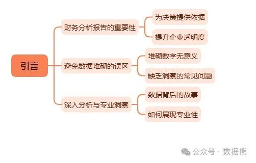
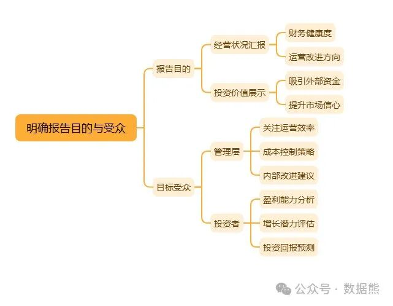
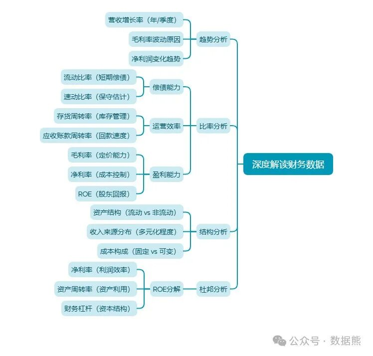
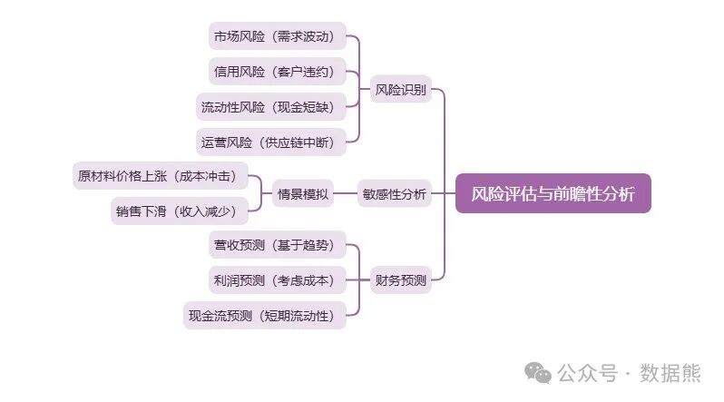
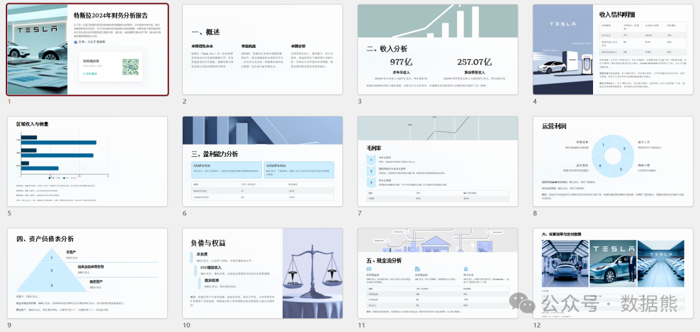

# 财务分析报告，这样写，更专业（思维导图、案例、模板）

> 来源：微信公众号「数据熊」 · 作者 Data Bear · 发布于 2025-03-08 07:00
> 原文链接：http://mp.weixin.qq.com/s?__biz=Mzg2MTg5OTgzNA==&mid=2247487584&idx=1&sn=b31874f065ef29f532a093aa27cfe9dd&chksm=ce114d35f966c4237d5fe87d07e2882a57a9838fbb4951513d51c4353296f92bad3b6f6e3b18
> 摘要：撰写一份专业的财务分析报告需要系统的方法和深入的洞察力。

> 注：因公众号平台更改推送规则，如不想错过数据熊的文章，请将我们设为星标，让数据熊的每一篇文章第一时间到达您的订阅列表。
>
> 方法：点文章左上角蓝色财管笔记进入主页，点击主页右上角"…",然后选择设为星标

> 点击文末
>
> 阅读原文
>
> 获取特斯拉财务分析报告及PPT模板、思维导图。

许多人在撰写财务分析报告时，容易陷入

简单堆砌数据

的误区，缺乏深入的分析和专业的洞察。本文将为你详细讲解如何撰写一份

既有数据支撑又有深度洞察

的财务分析报告，让你的报告不仅内容详实，还能真正助力企业决策。

一、明确报告目的与受众

在动笔之前，首先要明确报告的目的和目标受众。你的报告是写给管理层汇报经营状况，还是面向投资者展示企业的投资价值？不同的目的和受众决定了报告的侧重点和表达方式。例如：

-管理层：

更关注运营效率、成本控制和内部改进建议。

-投资者

：

更在意盈利能力、增长潜力和投资回报。

明确这一点后，你才能有的放矢，确保报告内容切中需求。

二、构建清晰的报告结构

一份专业的财务分析报告需要逻辑清晰、层次分明，通常包括以下几个部分：

1.执行摘要

开篇用简洁的语言概述报告的核心发现和建议，帮助读者快速抓住重点。

2.公司概况

简要介绍公司的基本情况、业务模式和市场定位，为后续分析奠定背景基础。

3.财务数据分析

这是报告的核心，包含财务报表的横向和纵向分析，以及关键指标的解读。

4.行业与竞争分析

将公司置于行业环境中，分析其竞争优势和市场地位。

5.风险评估

识别公司面临的内外部风险，并评估其潜在影响。

6.结论与建议

基于分析结果，提出具体的战略建议或投资意见。

清晰的结构能让读者轻松跟随你的思路，提升报告的可读性。

三、深度解读财务数据

数据是财务分析的基础，但仅仅罗列数字远远不够，关键在于如何解读数据。以下是几个实用方法：

1.趋势分析

通过比较历史数据，揭示财务指标的变化趋势，例如营收增长率、毛利率波动等，找出企业发展的规律或问题。

2.比率分析

使用财务比率（如流动比率、资产负债率、净利率等）评估企业的偿债能力、运营效率和盈利能力。

3.结构分析

分析财务报表的构成比例，如资产结构、收入来源分布等，揭示企业的经营特点。

4.杜邦分析

将净资产收益率（ROE）分解为盈利能力、运营效率和财务杠杆三个部分，深入剖析ROE的驱动因素。

通过这些方法，你可以从数据中挖掘出更有意义的结论，而非停留在表面。

四、结合行业与宏观环境

财务数据不能脱离背景单独存在，必须结合行业和宏观经济环境进行分析：

-行业比较：

将公司的财务指标与行业平均水平或主要竞争对手对比，判断其相对竞争力。

-宏观影响：

分析经济周期、利率变化、政策调整等外部因素对公司财务的影响。

例如，如果行业整体利润率下降，而公司利润率逆势上升，这可能反映了其独特的市场优势。

五、风险评估与前瞻性分析

专业报告不仅要回顾过去，还要展望未来。以下是关键步骤：

1.风险识别

从市场风险、信用风险、流动性风险等角度，梳理公司可能面临的挑战。

2.敏感性分析

模拟不同情景（如原材料价格上涨、销售下滑），评估对财务状况的影响。

3.财务预测

基于历史数据和行业趋势，预测未来的营收、利润等指标，为决策提供参考。

这种前瞻性分析能让报告更具战略价值。

六、图表与可视化

图表是提升报告专业度的利器，可以直观呈现数据趋势和分析结果。常用类型包括：

-柱状图/折线图：

展示时间序列数据的变化。

-饼图：

呈现结构比例。

-散点图：

揭示变量间的关系。

-雷达图：

多维度对比分析。

例如，用折线图展示过去五年的营收增长趋势，用饼图展示收入来源分布，既直观又专业。

七、语言与表达

财务分析报告的语言应做到专业、客观、简洁：

-避免主观词汇（如“非常好”“很差”），用数据和事实支撑结论。

-保持逻辑流畅，确保分析思路清晰易懂。

-使用专业术语，但避免过于晦涩，确保受众能理解。

例如，与其说“公司表现很好”，不如写“公司2023年净利率达15%，高于行业平均水平5个百分点”。

八、案例分析：以特斯拉为例

为了让理论更具实践性，我们以特斯拉（Tesla,Inc.）为例。假设你要为特斯拉撰写财务分析报告：

-财务数据：

分析其营收增长、毛利率提升及高研发投入的回报。

-行业地位：

对比传统车企，突出其在电动车市场的领先优势。

-风险评估：

指出供应链波动和政策依赖的风险。

-建议：

提出优化成本结构、扩大产能的策略。

通过具体案例，你可以更直观地掌握报告的写作方法。

结语

撰写一份专业的财务分析报告需要系统的方法和深入的洞察力。从明确目的、构建结构，到深度解读数据、结合行业背景，再到风险评估和图表呈现，每一步都至关重要。

点击

阅读原文

下载下图特斯拉财务分析案例及PPT模板、思维导图。

