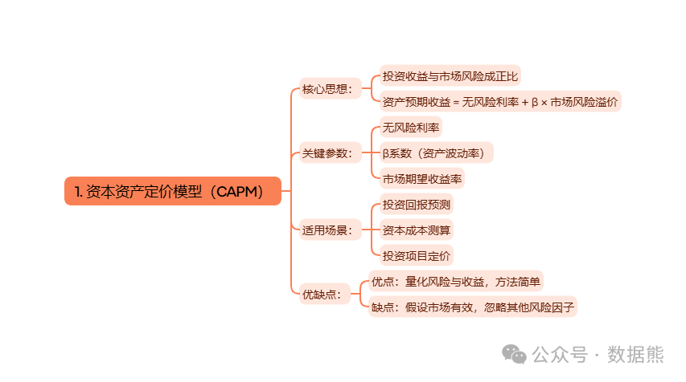
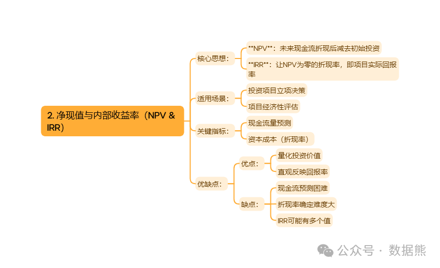
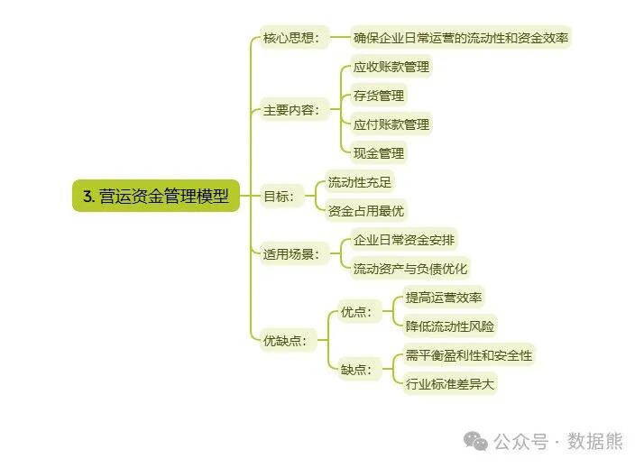
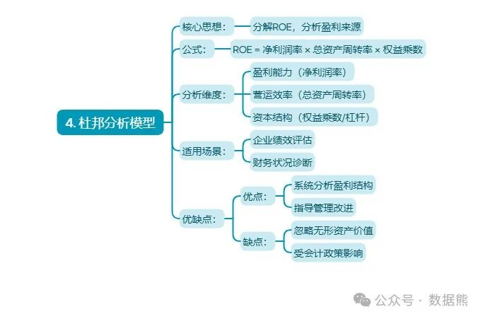
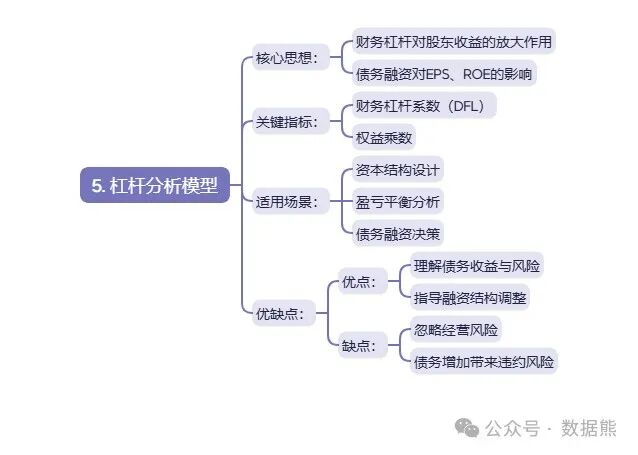
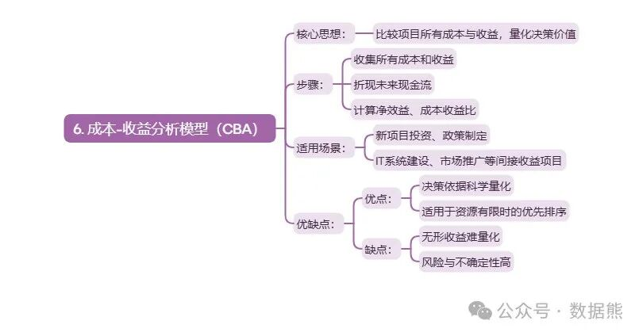
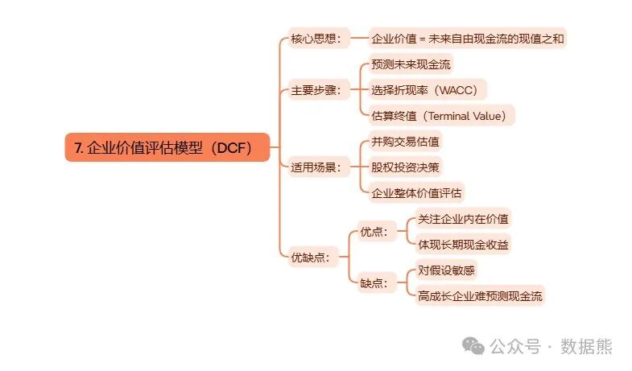

# 财务人必须掌握的7个经典财务模型：思维导图、案例

> 来源：微信公众号「数据熊」 · 作者 Data Bear · 发布于 2025-03-11 07:00  
> 原文链接：http://mp.weixin.qq.com/s?__biz=Mzg2MTg5OTgzNA==&mid=2247487673&idx=1&sn=e2043fe8eb5c90ce66e349f52586e603&chksm=ce114decf966c4fa2255f4db561d6d11438a49df501c4bbc58f294d1a09db7b8cd75a3fe7b95
> 摘要：用数据说话，用模型决策，让财务真正成为企业战略的引擎！

> 注：因公众号平台更改推送规则，如不想错过数据熊的文章，请将我们设为星标，让数据熊的每一篇文章第一时间到达您的订阅列表。
>
> 方法：点文章左上角蓝色财管笔记进入主页，点击主页右上角"…",然后选择设为星标

> 私信数据熊获取更多案例。

企业财务管理，远不只是记账报表那么简单。一个优秀的财务人，必须像驾驶员掌控汽车仪表盘一样，精准掌握企业经营的各项财务指标，才能为企业提供科学的决策支持。今天，给大家系统梳理

企业财务管理中7个经典实用的模型

，帮助大家快速提升财务管理的专业度。

---

## 一、资本资产定价模型（CAPM）：给投资风险定价

CAPM模型告诉我们，

投资的预期收益应与承担的市场风险相匹配

。CAPM用贝塔系数（β）衡量资产相对市场的波动性，结合无风险利率和市场风险溢价，算出投资的合理回报率。

应用场景：

- 评估股权资本成本（贴现率）
- 判断项目或股票的合理预期收益

优点：

 简单、实用，能量化风险，辅助企业投资决策。

缺点：

 基于市场有效等假设，实际情况中部分假设难以成立，建议结合其他模型综合判断。

---

## 二、净现值（NPV）与内部收益率（IRR）：投资决策“金标准”

NPV和IRR是

评估项目投资价值的核心工具

。

- NPV

    反映投资未来现金流的折现值减去投资成本，NPV大于0说明项目值得做。
- IRR

    是让项目NPV等于0的收益率，IRR高于资本成本才有投资价值。

应用场景：

- 投资立项决策、项目可行性分析
- 资本预算制定

优点：

 量化现金流，科学评估投资回报。

缺点：

 依赖准确的折现率和现金流预测，数据质量影响决策效果。

---

## 三、营运资金管理模型：企业“血液循环”优化法

营运资金 = 流动资产 - 流动负债，关系着企业的流动性和短期偿债能力。

管理核心：

- 保证企业日常运营的流动性
- 提升资金使用效率，减少不必要占用

应用场景：

- 应收账款、库存、应付账款的周转管理
- 现金流预测，避免资金链断裂

优点：

 提升企业短期安全性，释放闲置资金。

缺点：

 过度压缩营运资金可能影响业务扩展。

---

## 四、杜邦分析模型：全面解剖企业盈利的秘密

杜邦模型将

净资产收益率（ROE）

分解为：

> ★
>
> ROE = 净利润率 × 总资产周转率 × 财务杠杆（权益乘数）

应用场景：

- 分析盈利水平、资产利用效率、资本结构
- 指导经营改进，提升盈利

优点：

 一图读懂企业盈利的来源，快速定位问题。

缺点：

 只关注财务数据，忽略无形资产、长期价值。

---

## 五、杠杆分析模型：债务带来的收益和风险

财务杠杆 = 负债融资的放大效应

，适度借债能提升股东回报，但过度举债则增加破产风险。

核心指标：

 财务杠杆系数（DFL）

> ★
>
> 每1%的营业利润变动带来多少比例的股东收益变动。

应用场景：

- 资本结构设计，权衡股权与债务融资
- 盈亏平衡点分析

优点：

 明确债务对股东收益的影响。

缺点：

 忽视经营风险与市场不确定性。

---

## 六、成本-收益分析模型（CBA）：看清投入与回报的平衡

核心：

 比较所有成本与收益，计算净效益或成本-收益比，决策是否实施。

应用场景：

- 项目投资评估、IT系统建设
- 市场营销、培训等非直接收益项目评估

优点：

 量化收益与成本，辅助科学决策。

缺点：

 无法完全量化的无形收益难纳入，预测不确定性大。

---

## 七、企业价值评估模型（DCF）：企业“内在价值”评估法

折现现金流模型（DCF）

，通过预测未来现金流并折现，计算企业现值，反映其真实价值。

应用场景：

- 并购重组、股权交易估值
- 企业战略评估

优点：

 立足企业自身，反映长期价值。

缺点：

 对未来现金流、折现率敏感，假设不同差异巨大。

---

## 结语：学会模型，更要灵活应用

财务管理的7个模型就像“企业财务管理的工具箱”。每个模型都有自己的适用场景和价值，但也有局限。关键在于

结合企业实际情况，灵活组合应用

，为企业的经营、投融资决策保驾护航。

---

如果你觉得这篇文章有帮助，记得
【点赞】【在看】

和

【分享】
，关注我，带你继续学懂财务那些难题！
