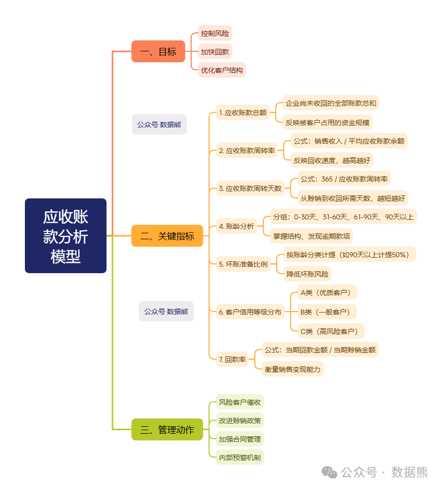

# 应收账款分析模型：关键指标、思维导图

> 来源：微信公众号「数据熊」 · 作者 Data Bear · 发布于 2025-03-16 07:00  
> 原文链接：http://mp.weixin.qq.com/s?__biz=Mzg2MTg5OTgzNA==&mid=2247487702&idx=1&sn=f7465d3f08d5dbf97da87e8a9c653d64&chksm=ce114d83f966c4952544cf97394bbac3fa527ffb6a5bebe567529bb49e3a4a1c03b7036e89a8

在企业经营中，

应收账款

就像一把“双刃剑”：做得好，可以帮助企业扩大销售、赢得市场；做不好，钱收不回来，最后只能“白忙活”。今天，跟大家聊一聊

企业财务人员必须掌握的“应收账款分析模型”

，并附上

思维导图

，让你一图看懂，轻松掌握。

---

## 一、为什么要做应收账款分析？

很多企业财务都会遇到这些问题：

- 客户欠款多、账期长，资金链吃紧？
- 销售部门一味冲业绩，忽略回款风险？
- 不知道哪些客户风险大，坏账概率高？
- 管理层问起来：“哪些客户欠款最多？”却答不上来？

这些问题，其实都可以通过

一套系统的应收账款分析模型

来解决！

---

## 二、应收账款分析的**三大核心问题**

1. 收得回来吗？

     ——分析账款的安全性、客户的信用状况。
2. 什么时候能收回？

     ——分析账龄结构、预测回款周期。
3. 收回成本是多少？

     ——评估账款管理的效率和成本。

---

## 三、应收账款分析模型：关键指标（务必掌握！）

### 1. **应收账款总额**

- 定义

   ：企业在某一时点尚未收回的全部账款总和。
- 意义

   ：企业被客户“占用”的资金规模。

### 2. **应收账款周转率**

- 公式

   ：销售收入 / 平均应收账款余额
- 用途

   ：反映应收账款的回收速度，越高越好。

### 3. **应收账款周转天数**

- 公式

   ：365 / 应收账款周转率
- 用途

   ：账款从赊销到收回所需天数，越短越好。

### 4. **账龄分析**

- 分组

   ：如 0-30 天、31-60 天、61-90 天、90 天以上
- 用途

   ：掌握账款结构，及时发现逾期款项，识别高风险客户。

### 5. **坏账准备比例**

- 公式

   ：按账龄分类计提比例（如 90 天以上计提 50%）
- 意义

   ：预计收不回的部分，提前准备，降低财务报表风险。

### 6. **客户信用等级分布**

- 分类

   ：A（优质客户）、B（一般客户）、C（高风险客户）
- 用途

   ：制定差异化的收款策略，聚焦高风险客户。

### 7. **回款率**

- 公式

   ：当期回款金额 / 当期赊销金额
- 意义

   ：衡量销售变现能力，预防虚假销售。

---

## 四、应收账款分析的**经典思维导图**（建议收藏）

为了帮助大家更系统理解，我特别整理了一份

应收账款分析思维导图

，涵盖从分析目标到关键指标的全链条逻辑。

👇

思维导图逻辑一览（简版）

完整版思维导图

可在私信数据熊【应收模型】获取高清下载版。

---

## 五、如何应用这套模型？（实操建议）

| 目的 | 推荐指标 | 管理动作 |
|---|---|---|
| 分析整体账款水平 | 应收账款总额、周转天数 | 提高回款意识、优化账款结构 |
| 判断回款速度 | 周转率、账龄分析 | 针对逾期账款启动催收 |
| 识别风险客户 | 账龄分布、信用等级 | 优化客户授信，暂停赊销 |
| 评估坏账风险 | 坏账准备比例 | 加强法务、制定回收预案 |
| 提升现金流 | 回款率 | 建立奖励机制，推动快速回款 |

---

## 六、结语：学会这套模型，账款管理不再头疼！

应收账款管理，绝不是财务一个部门的事情，而是

财务、销售、法务、领导

共同发力的系统工程。掌握好这套应收账款分析模型，你不仅能清晰看到公司钱在哪，更能主动推动业务改变，成为老板眼中的“得力助手”。

---

> “你不去盯应收账款，就会有人来盯你的现金流。”

管理好应收账款，就是守护企业的生命线。让我们从今天开始，做账款的掌舵人！

---

如果你觉得本文有用，欢迎

点赞、在看、转发

，让更多财务朋友一起进步！

往期推荐

如何通俗的看懂财务三大报表？

财务分析报告，这样写，更专业（思维导图、案例、模板）

高手是这样分析毛利率的（思维导图、关键指标与案例）
