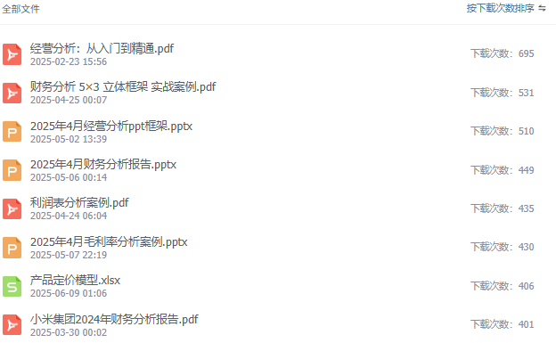

# 35岁的财务，就不要迷恋CPA了

> 来源：微信公众号「数据熊」 · 作者 Data Bear · 发布于 2025-06-26 07:00
> 原文链接：http://mp.weixin.qq.com/s?__biz=Mzg2MTg5OTgzNA==&mid=2247488455&idx=2&sn=fa6481c87dcfa7b53a5cd04d68f956da&chksm=ce114e92f966c784449e6f5871df9ded10321c5a5f28db68927bf5d1355d513b52a08140230f
> 摘要：35 岁以后，你的核心资产是跨学科的复合能力 + 行业化的深度洞察 + 影响他人的软实力。

> 注：因公众号平台更改推送规则，如不想错过数据熊的文章，请点文章左上角蓝色「数据熊」进入主页，再点击右上角“ … ”设为星标。这样，每一篇干货都能第一时间送达你的订阅列表。

“35 岁焦虑”，在财务圈里最典型的表现就是：

“再不考下 CPA，就彻底没有核心竞争力了！”

听上去很有道理，但真相是：到了 35 岁，你最需要投资的不一定是 CPA，而是

让自己在职场“可替代性”降到最低

的那股综合实力。今天，数据熊就来陪你算一笔“隐形 ROI”账。

---

## 一、CPA 的价值 VS. 你此刻的机会成本

| 维度 | 初入职场（0-5 年） | 成熟期（35 岁左右） |
|---|---|---|
| **时间投入** | 下班和周末都能挤出整块时间 | 上有业务 KPI，下有家庭琐事，碎片化严重 |
| **收益显性化** | 招聘门户明确要求 / 加分项 | 拿到证书 ≠ 加薪晋升，更多看综合贡献 |
| **竞争赛道** | 证书稀缺，财报编制是刚需 | 自动化 / 共享中心普及，**业务洞察力**更稀缺 |
| **沉没成本** | 学习成本低，精力充沛 | “越学越累”且机会成本高——错过业务历练 |

> 结论很扎心：在 35 岁的职业分水岭，CPA 只是“锦上添花”，远非“雪中送炭”。

---

## 二、35 岁财务真正稀缺的三种能力

### 1. 读懂业务：从“算账”到“算生意”

- 业务模型

   ：搞清楚公司钱从哪来、花到哪去、利润如何驱动。
- 关键指标

   ：财务数据要能对接到运营 KPI，而不是停在报表里。
- 价值场景

   ：库存经营理念落地、投后管理闭环、融资节奏安排……

### 2. 数据与科技：让自己成为“工具升级”而非“工具被替代”

- Power BI + AI

   ：5 分钟搞定动态可视化，领导用图表即可决策。
- 自动化

   ：RPA、脚本、低代码——把重复搬砖交给机器人，把人脑用来思考。
- 数据治理

   ：搭“口径 + 流程 + 质量”三位一体框架，让分析有公信力。

### 3. 影响力：把专业语言翻译成商业语言

- 沟通

   ：向上说“战略”，横向说“价值”，向下说“方法”。
- 领导力

   ：带项目、带团队、带跨部门协作。
- 故事化

   ：把复杂结论讲成 3 分钟故事，老板听得懂，业务愿意改。

---

## 三、如果不考 CPA，该怎么把职业杠杆撬到最大？

1. 选定行业赛道

    深入研究 1-2 个细分行业的盈利模式，用“懂业务”碾压“会做账”。
2. 做 1 个跨部门项目

    供应链效率提升、智能资金预测、业财融合指标体系……任选其一，做出成果。
3. 每季度输出一次“CEO 读得懂”的分析报告

    把冷冰冰的数字，变成经营决策的指南针。
4. 学习 1 门 IT 语言或 BI 工具

    熟练掌握 DAX、M 语言或 Python 中任选其一，提高 10 倍分析效率。
5. 培养 1 项副业 / 副技能

    讲课、写作、咨询，都是为你的个人品牌溢价充值。

---

## 结语：证书是门票，认知才是护城河

> “把时间花在增长式任务上，而不是证明式任务上。”
>
>  —— 数据熊

别让证书焦虑偷走你对未来的主动权。35 岁以后，你的核心资产是

跨学科的复合能力 + 行业化的深度洞察 + 影响他人的软实力

。

如果你已在 CPA 之路坚持，就继续，一鼓作气考下来，我之前有个同事每年花5W报面授班，每天学习到12点，最终三年通过，因为她知道她的时间到底值多少钱；如果正犹豫，不妨把目光投向更能提升“不可替代性”的地方，。

点击
阅读原文
获取完整版《

财务分析PPT模板

》。

加入

数据熊的财务精进营

，与1400+财务精英共同成长。后台点击
「经典文章」阅读数据熊10W+爆文。

点赞和转发就是最大的支持，关注数据熊，工作更轻松。

