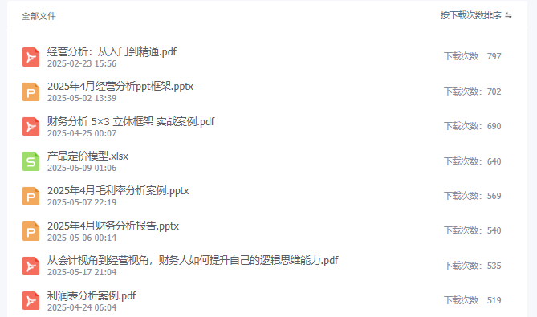

# 财务各岗位如何做好年中复盘

> 来源：微信公众号「数据熊」 · 作者 Data Bear · 发布于 2025-07-12 07:00  
> 原文链接：http://mp.weixin.qq.com/s?__biz=Mzg2MTg5OTgzNA==&mid=2247488586&idx=1&sn=d2906bc69bc8892fa177508411b13132&chksm=ce11491ff966c0095999d9142587c65108dc3a750932dffa76910a5e4f97a06c0adbe63eb062
> 摘要：复盘不是为了总结过去，而是为了更好地赢得未来。

> 由于公众号推送机制调整，如您不想错过「数据熊」的文章，请务必
>
> 把我们设为星标
>
> ：点文章左上角
>
> 蓝色“数据熊”
>
>  → 主页右上角
>
> “…”
>
>  → 设为星标，这样每篇干货都能第一时间抵达你的订阅列表！

---

大家好，我是数据熊！财务的人生就像一个又一个按月归档的文件夹，眨眼间，上半年已经归档完毕。感觉才刚忙完决算没几天，就要写年中总结了。

年中，是财务人“回望来时路、校准新航向”的黄金时机。很多同学一说复盘就是“总结+展望”，但真正能落到实处、指导下半年行动的复盘并不多。尤其在我们财务条线中，各岗位的职责不同，关注的视角也应各有侧重。

那财务部各个岗位，该如何做好年中复盘？今天，数据熊就带大家分岗位讲清楚。

---

## 一、总账岗：聚焦“报表质量+事项闭环”

总账岗的复盘重点是两个字：

闭环

。

- 月结是否顺利？

   是否存在跨月分录滞后、数据追溯困难的问题？建议梳理月结流程，看是否能在流程优化、系统集成上进一步提效。
- 会计估计是否准确？

   比如坏账准备、存货跌价准备、折旧摊销等政策是否和实际偏离过大？建议结合业务数据重新检视合理性。
- 往来科目是否干净？

   有无长期挂账项目？应付账款是否存在实质未付但仍未冲销？建议在复盘中做一次彻底梳理。

---

## 二、成本岗：关注“制造效率+成本结构”

年中是成本岗对“前半年产出成果”进行深入解析的窗口。

- 单位成本是否下降？

   是否有原材料价格上涨带来的成本转嫁压力？制造效率是否提升？建议绘制单位成本走势图，和去年同期对比。
- 成本结构有无优化？

   人工占比、制造费用、外协费用等是否合理？可结合工艺路线、产能瓶颈来分析结构改进空间。
- 标准成本与实际偏差？

   是否经常偏离较大？建议针对偏差高的物料或工序，建立专项台账，推动持续改善。

---

## 三、费用岗：聚焦“控费成果+费用效率”

很多公司今年的关键词是“降本增效”，费用岗的复盘必须从两个角度出发：

- 控费目标达成了吗？

   与预算比、与去年同期比，是否实现降本？哪些部门执行较差？建议做一张“费用预算执行雷达图”，让问题一目了然。
- 费用是否花得值？

   哪些费用是支出多但产出不明显？建议从“投入产出”角度，对市场费、差旅费、培训费等进行ROI复盘。

---

## 四、税务岗：强化“风险识别+政策对标”

税务的复盘关键在两个词：

合规性

 和

筹划性

。

- 风险点暴露了吗？

   有无未缴或滞后的税项？是否存在发票风险、收入确认不一致问题？建议定期做一次税负率分行业对标。
- 筹划是否合规？

   各类优惠是否应享尽享？年度筹划策略是否在年中就已落地？不要等年底才来做账务调整，年中就是关键节点。

---

## 五、资金岗：审视“现金质量+收支匹配”

资金岗年中复盘，建议把关注点放在两个核心：

- 现金流质量怎么样？

   是否存在利润增长但现金流为负的情况？建议用“经营活动现金净流量/净利润”来衡量稳定性。
- 资金是否高效使用？

   有无“资金闲置+贷款利息”的双重浪费？建议结合资金池、信用额度、银行授信等做系统梳理。

---

## 六、财务经理/总监岗：统筹“目标对标+团队建设”

作为财务管理者，年中复盘要拉高视角，聚焦三个关键词：

- 是否支撑业务战略？

   是否用数据和分析赋能业务决策？是否参与了关键项目的投资测算、风险评估？
- 是否有全局视角？

   是否对毛利、净利、现金流形成了整体把控？是否能快速识别核心指标异动？
- 是否在带团队成长？

   团队是否有学习机制？新人是否得到培养？是否有轮岗、跨部门协同的机制？

---

## 七、年中复盘，关键是“落地”

真正好的复盘，最终要“落”到

问题清单

和

行动计划

上：

- 哪些问题是“旧病复发”？哪些是“新病暴露”？
- 哪些可以短期解决？哪些需要长期机制设计？
- 每项问题谁负责？什么时候推进？如何跟踪？

这些，才是复盘的真正价值。

---

> “真正厉害的财务人，不是年底总结做得漂亮，而是能用年中复盘推动下半年更好地跑起来。”

---

如果你是财务人，这篇文章就是你年中复盘的参考框架。如果你是财务经理，也可以转给团队每个人看，照着这个结构写一写各自的年中小结。

点击
阅读原文
获取完整版《

财务分析报告PPT模板

》。

加入

数据熊的财务精进营

，与1800+财务精英共同成长。后台点击
「经典文章」阅读数据熊10W+爆文，数据熊微信：

Daniel-songyq。

点赞

、

转发和在看

就是最大的支持，关注数据熊，工作更轻松。

