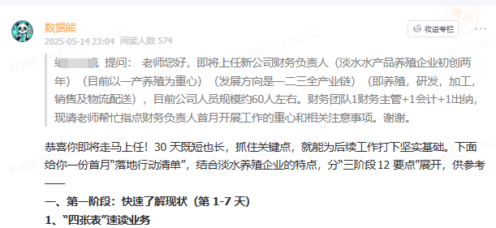
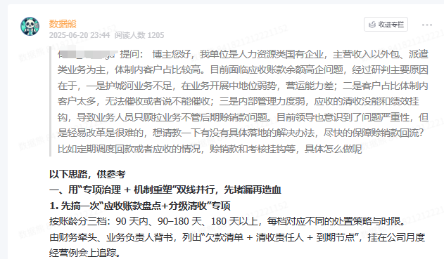

# 第一性原理在财务管理中的五个应用场景

> 来源：微信公众号「数据熊」 · 作者 Data Bear · 发布于 2025-07-22 07:00  
> 原文链接：http://mp.weixin.qq.com/s?__biz=Mzg2MTg5OTgzNA==&mid=2247488673&idx=1&sn=d41bec1622d4c94ac2d9d45ef0424f7b&chksm=ce1149f4f966c0e25bd4cc9135c65e1c79b10bbecf46f6db60bf179c1cc5e6ec16e8e5de1908
> 摘要：把复杂问题拆解到不能再拆的最小单位（底层真理），再从这些基础单元出发，重新构建解决方案。

什么是第一性原理？简单来说就是：

把复杂问题拆解到不能再拆的最小单位（底层真理），再从这些基础单元出发，重新构建解决方案。

这个王阳明心学倡导的“回归本源”本质上是一个意思。

对于我们财务人来说，底层真理永远绕不开两个字：

现金

 与

风险

。

今天我们通过五个财务典型场景，来聊聊第一性原理到底怎么用？

（文末可获取财务分析ppt模板，数据熊微信：

Daniel-songyq）

---

## 场景一：预算编制 —— 别再陷在表格里打转

### 常见误区：

打开Excel，复制去年的模板，“增长10%”，然后反复修改，还是拍脑袋。

### 第一性原理应用：

预算 =

业务假设 × 行动计划 × 单位经济模型

我们真正要抓的，是那几个对结果影响最大的变量，比如：销量、单价、毛利率。

### 落地建议：

- 确认最关键的3个假设，重点追踪；
- 其他指标用推导公式生成，简化预算表；
- 开预算会时，只讨论核心假设，别让Excel牵着鼻子走。

---

## 场景二：现金流管理 —— 利润好看，不如现金到账

### 常见误区：

“利润都上来了，现金怎么还紧张？”

### 第一性原理应用：

现金流 =

钱进来 - 钱出去

影响现金流速度的关键因素只有三项：

1. 回款周期
2. 付款条款
3. 投资支出节奏

### 落地建议：

- 优化回款速度比提升利润更紧急；
- 缩短账期或引入保理来缓解现金压力；
- 每周盯“逾期账款TOP10”，盯紧慢变量。

---

## 场景三：成本优化 —— 别再“按科目砍费用”了

### 常见误区：

“差旅砍20%、办公费减10%”，砍掉的都是容易动刀的，真正浪费的反而保留下来。

### 第一性原理应用：

成本的底层逻辑不是“账务分类”，而是“

是否为客户创造价值

”。

### 落地建议：

- 将成本拆分为“客户可感知”和“不可感知”两类；
- 优先砍掉客户不在乎的成本（如内部低效流程）；
- 用“0基预算”方式思考：这笔钱今天还会花吗？

---

## 场景四：投资决策 —— 别被“纸面收益率”骗了

### 常见误区：

报表一堆数据，IRR、回本期、净利润率看起来都很漂亮，结果落地就踩坑。

### 第一性原理应用：

投资价值 =

未来可得现金流 / 折现率 - 初始投入

看懂这句话，你就知道：

1. 最重要的是现金流有没有真的回来；
2. 风险高，就得上调折现率。

### 落地建议：

- 优先评估现金流真实性，别只看报表模型；
- 风险大就别低估成本，别被“行业标准”忽悠；
- 投资前先试点，10%资金做实验，再决策是否全投。

---

## 场景五：风险管理 —— 别什么都想控，重点才最重要

### 常见误区：

“什么风险都要管、都不能出错”，结果效率低，团队疲于应付。

### 第一性原理应用：

风险 =

发生概率 × 损失程度

### 落地建议：

- 用二维象限图分析风险（高概率/低概率 × 高损失/低损失）；
- 高概率 × 小损失 → 建立流程应对；
- 低概率 × 大损失 → 上保险、做兜底方案；
- 小概率 × 小损失 → 直接忽略，别浪费精力。

---

## 数据熊说

第一性原理给财务工作的启示，不是让我们放弃经验，而是鼓励我们

回到问题的底层逻辑

，看清那些真正影响决策的核心因素。

当你能用“现金 × 风险”两个词解释99%的财务问题，说明你已经从“财务技师”迈入“财务思考者”。

---

点击
阅读原文
获取

《

财务分析模板.ppt

x

》。

加入

数据熊的财务精进营

，与2000+财务精英共同成长、更有高质量问答解决你工作中的疑惑，早加入早受益
。
#财务分析

