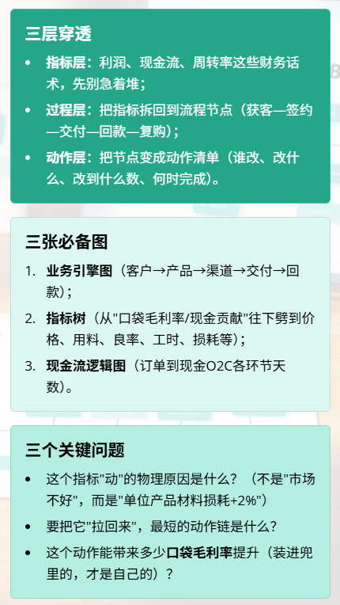
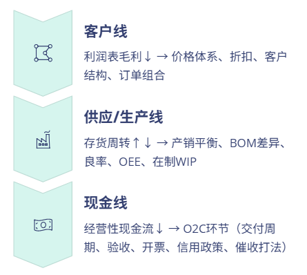
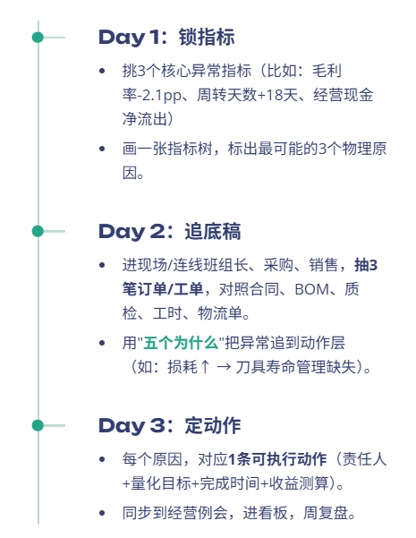
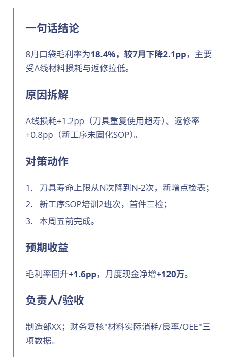
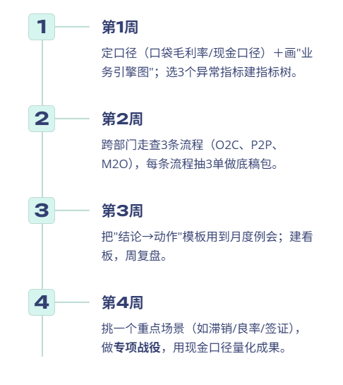

# 真正有效的财务分析，必须穿透到业务（附PPT模板）

> 来源：微信公众号「数据熊」 · 作者 数据熊 · 发布于 2025-09-04 07:44  
> 原文链接：http://mp.weixin.qq.com/s?__biz=Mzg2MTg5OTgzNA==&mid=2247489640&idx=1&sn=730155fc97e10f1235a7b7475e1f51af&chksm=ce11453df966cc2b06f9031863f97bf212b9633ad63f3389a3d9d26cfc04b68bd865719a88db
> 摘要：财务分析如果不穿透到业务，最多是“数字播报”

由于公众号推送机制调整，如您不想错过「数据熊」的文章，请务必 把我们设为星标：点文章左上角 蓝色
“数据熊”
 → 主页右上角
“…”
 →
设为星标
，这样每篇干货都能第一时间抵达你的订阅列表！

又到月初开始写财务分析报告的时候了，我们财务写报告经常会遇到一个头疼的问题：抓破头皮写出来的分析报告，总是被高管说没用，很是受伤。

其实真正能让高层点赞的财务分析，都有一个共性：从财务报表穿透到了业务——能把"问题"翻译成"动作"，把"动作"对应到
"人、钱、货、单、产线、客户"
。

下面这套思路，拿去就能用。
配套PPT模板获取方式见文末。

01

1｜什么叫“穿透到业务实际”

02

2｜从“三表”到“三线”：别停在财务室

三表互穿只是起点，更重要是把它接到三条业务线：

做法：每个异常指标，追溯到一张底稿（订单清单、工单台账、质量报表、客户合同），让数字和单据“对上眼”。

03

3｜五个常见业务场景的“指标映射表”

制造业（多品少量or多品小批）

- 业务指标：
   良率、OEE、一次交付率、材料损耗率、标准工时达成。
- 财务落点：
   单位产品材料成本差异、生产费用分摊、公摊与批次成本偏差。
- 动作示例：
   把“良率-2%”翻译成“关键工序返修率-1pp、抽检频次+1、治工具补强X项”。

零售/连锁

- 业务指标：
   客流—转化—客单—复购、SKU动销、缺货率、滞销龄。
- 财务落点：
   毛利结构、折扣侵蚀、存货跌价准备。
- 动作示例：
   对“滞销SKU>60天”的门店做“价盘—陈列—组合”三件套。

工程/项目制

- 业务指标：
   WBS进度偏差、变更签证率、资金计划达成。
- 财务落点：
   项目毛利偏差、成本预估调整、现金回款节奏。
- 动作示例：
   对“签证未落地”的项目建立“每周三清单”，锁定现金节点。

SaaS/平台

- 业务指标：
   ARR、净留存NRR、流失率、付费转化、交付上线周期。

- 财务落点：
   获取成本CAC、回本周期、口袋毛利率（扣除交付/售后服务真实消耗）。

- 动作示例：
   把“上线周期缩短1周”量化成“同月口袋毛利率+1.5pp”。

贸易/分销

- 业务指标：
   铺货/动销、赊销政策执行、渠道库存周转。
- 财务落点：
   价差毛利与返利净额、坏账风险、现金折扣。
- 动作示例：
   对“赊销>60天”的客户改用“货押+现金折扣”结构化回款。

04

4｜72小时“报表到现场”穿透法

05

5｜“结论→动作”呈现模板（直接照抄）

06

6｜常见五个坑与纠偏

- 只讲同比环比：
   纠偏→讲结构、单价×数量、过程指标。

- 口径混乱：
   纠偏→统一“口袋毛利率/现金口径”，所有业务按同一口径复盘。

- 颗粒度过粗：
   纠偏→按“客户/产品/渠道/区域/班组”细到能落人。

- 只提问题不配动作：
   纠偏→每个问题最少配1条可落地动作。

- 系统与现场脱节：
   纠偏→财务每周抽单走流程，底稿先行，系统为证。

07

7｜一个迷你案例：车间改造ROI怎么“穿透”

背景：
为进入半导体/光伏客户，拟改造车间与实验室。穿透路径：

业务端：
新客户验厂通过率↑、交付周期-7天、良率+1.5pp、一次交付率+2pp；

财务端：

增量毛利＝（新订单量×单品毛利）＋（良率提升带来的成本下降）；

节约成本＝（能耗/返修/外协）下降；

一次性CAPEX＝装修+设备+验证费；

现金回收＝回款节奏提前带来的利息节约。

动作化：
把“验厂通过”拆成空气洁净度、温湿度、ESD防护、溯源系统四项，一项一张交付清单；ROI不是单算“省了多少钱”，而是把新收入+成本改善+现金加速装进“口袋毛利率”。

08

8｜30天落地清单（周周可验收）

09

数据熊说

财务分析如果不穿透到业务，最多是“数字播报”；一旦深入到流程、SOP、台账、现场，数字就会自动长出动作。让每一条结论，都能落到一个人、一件事、一个时间点、一个可量化的收益——这才是财务分析的终点，也是你存在的价值。

获取

财务分析PPT模板

点击

阅读原文

，

PowerBI看板

定制添加数据熊微信：

