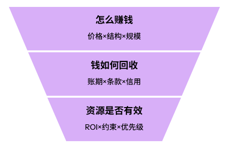
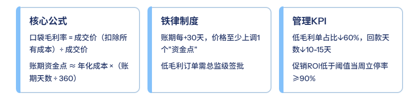
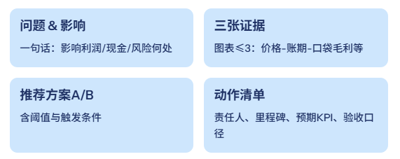
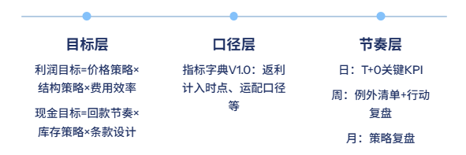

# 财务BP的三张底牌：能影响业务，才能走向管理岗

> 来源：微信公众号「数据熊」 · 作者 数据熊 · 发布于 2025-09-08 07:30  
> 原文链接：http://mp.weixin.qq.com/s?__biz=Mzg2MTg5OTgzNA==&mid=2247489739&idx=1&sn=4a56ee92338c18760f135486b5cf2c45&chksm=ce11459ef966cc888cb9fac8139f21f6062c9384ff2b4ab162c37847989ed0cbaa3517ed977a
> 摘要：管理岗位的“硬通货”，从来不是证书，而是把不确定变成规则，把争论变成对齐，把图表变成动作。

> 由于公众号推送机制调整，如您不想错过「数据熊」的文章，请务必
>
> 把我们设为星标
>
> ：点文章左上角
>
> 蓝色“数据熊”
>
>  → 主页右上角
>
> “…”
>
>  → 设为星标，这样每篇干货都能第一时间抵达你的订阅列表！

很多财务同学都有这种感受：证书不少、表也会做，但一到和业务对齐，方案总是“说不动”。管理岗位（财务BP/负责人）的底气，不是证书，而是：

能算清价格与账期、能把争论变对齐、能让决策落地

。

今天数据熊给大家的是一套可落地的方案，让你的能力更容易”可见“。
文末附详细方案。

---

## 从“做表”到“做结果”：财务BP的增量思维

做了几十页分析，老板只问一句：“所以，接下来怎么做？”

要回答的3个问题

：

 1）公司怎么赚钱（价格×结构×规模）；

 2）钱如何安全回收（账期×条款×信用）；

 3）资源是否有效（ROI×约束×优先级）。

管理岗的输出形态

：

一页结论＋动作单

，而不是几十页报表。

关键转变

：

关注

增量

（这次决策多赚/少亏了什么），而非只复述

存量

（历史数据）。

---

## 底牌一： 定价×账期×口袋毛利率

销售说“再给点折扣就能冲量”，你心里在盘算：现金会不会跟不上？

1）核心公式（写进你的定价规则卡）

- 口袋毛利率 =

    ÷ 成交价
- 账期资金点（%） ≈ 年化资金成本（%） ×（账期天数 ÷ 360）

2）铁律（放进制度）

- 账期每 +30 天，价格至少上调 1 个“资金点”

   （按公司 WACC 或边际融资成本取值）。
- 以价换量必须

   同步以价换期

   ；只换量不换期 = 毛利错觉。
- 低于口袋毛利红线的订单，需

   总监级

   签批并附

   回本路径

   。

3）业务话术（和销售对齐）

- “给你多 30 天账期没问题，但价格需上调资金点 X%，否则回本期拉长、现金周转下降。”
- “区域大促可以做，但补贴设置

   停损线

   ，低于阈值自动停止。”

4）一页模型

- 左：

   定价矩阵

   （客户等级×区域×账期段）
- 右：

   口袋毛利试算器

   （输入：价/量/返利/运配/售后/账期 → 输出：口袋毛利率、回本周期）
- 底：

   红线提示

   （低于阈值自动高亮）

5）管理KPI

- 低毛利单占比 ↓60%
- 回款天数 ↓10–15 天
- 促销 ROI 低于阈值的活动

   当周立停率

    ≥90%

---

## 底牌二：例外清单 & “只开例外会”

周例会从一小时拖到两小时，散会后却没人知道各自要做什么。

1）为什么

：会议易失焦、跨部门扯皮；管理岗要做

节奏与边界的设计者

。

2）三张对齐表

- 目标对齐表

   ：季度目标拆到关键动作与负责人。
- 口径对齐表

   ：指标定义统一（返利时点、运配口径等）。
- 节奏对齐表

   ：周节奏固定（报数–复盘–纠偏）。

3）例外清单（模板字段）

- 指标名称｜阈值｜本周偏差｜根因标签（价/量/款/费/售后/供应）｜责任人｜下周动作

4）会议机制

- 周例会

   只看例外

    与动作闭环，5–7 条即可；其余信息留在共享面板。

5）业务话术

- “先对齐口径，再讨论对策；

   结论前置

   ，本周只过偏差与动作单。”

效果

：跨部门等待时间明显下降，闭环率上升。典型改善是：**交付延误率从 22% → 9%**。

---

## 底牌三：决策卡（Decision Card）：一页结论落地

PPT 翻了 20 页，决策还没落地；一页有结论的卡片，反而能当场拍板。

1）结构（固定成模板）

- 问题 & 影响

   （一句话：影响利润/现金/风险何处）
- 三张证据

   （图表 ≤3：价格–账期–口袋毛利 / 客户结构 / 库存周转）
- 推荐方案 A/B

   （含阈值与触发条件）
- 动作清单

   （责任人、里程碑、预期 KPI、验收口径）
- 风控边界

   （条款红线、停损线）

2）展示原则

：

一图一数一结论

；能驱动动作的，才上图。

3）示例结论

- “A 方案：华东大客账期从 T+60 调整至 T+30，价格上调资金点 1.2%，预计回款天数 ↓12 天，现金缺口 ↓2000 万。”

4）验收口径（务必写清）

- 以

   回款天数

    与

   口袋毛利率

    为主指标；统计口径与数据源在页脚注明。

---

## 对齐三表：目标/口径/节奏一次对准

同一件事三条口径：财务一套、销售一套、供应又一套——吵半天吵口径。

1）目标层

：利润目标=价格策略×结构策略×费用效率；现金目标=回款节奏×库存策略×条款设计。

2）口径层

：把“返利计入时点、运配口径、售后口径、账期资金点算法”写成

指标字典 V1.0

。

3）节奏层

：

- 日

   ：T+0 关键 KPI（收现率、异常订单、低毛利预警）
- 周

   ：例外清单+行动复盘（AAR）
- 月

   ：策略复盘（价格带、客户结构、区域库存）

工具链建议

：SQL 取数 → Power Query 清洗 → DAX 建模 → Power BI 发布（自动刷新+异常预警）。

---

## 落地工具箱（可复用清单）

知道该做什么，但每次开工都像“先造轮子”；有一套空白模板，就能立刻起跑。

① 定价矩阵与账期资金点表

：客户等级×区域×账期段×资金点（%）。

② 口袋毛利试算器

：输入“价/量/返利/运配/售后/账期”，输出“口袋毛利率、回本期、停损提示”。

③ 合同条款红线清单

：返点/价保/退换/质保金/扣点/运保/账期审批层级。

④ 指标字典 V1.0

：定义＋口径＋来源＋负责人＋更新频率。

⑤ 例外清单模板

：偏差→根因→动作→里程碑→本周/下周状态。

⑥ 决策卡模板

：问题与影响/三张证据/AB 方案/动作单/风控边界/验收口径。

> 作品集建议
>
> ：把以上六件套做成
>
> 一页一资产
>
> （脱敏数据），简历首页放
>
> 二维码
>
> 。

---

### 数据熊说

管理岗位的“硬通货”，从来不是证书，而是

把不确定变成规则，把争论变成对齐，把图表变成动作

。先把“定价×账期×口袋毛利率”这张底牌落稳，你会发现：利润更真实、现金更可控、会议更短、执行更快。

文中工具及方案，

数据熊团队均可提供详细可落地的指导

，

加入数据熊的粉丝群

，与2300+财务精英共同提升职业竞争力。

#财务BP

#经营分析

#财务
