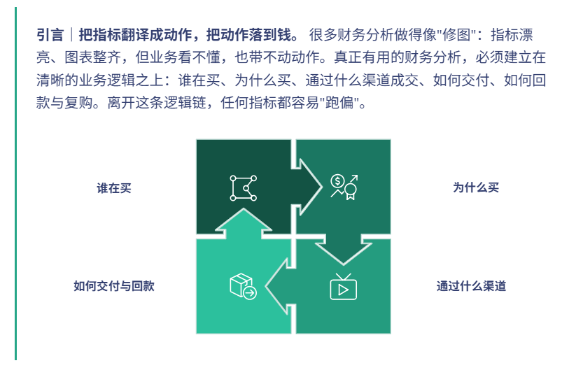
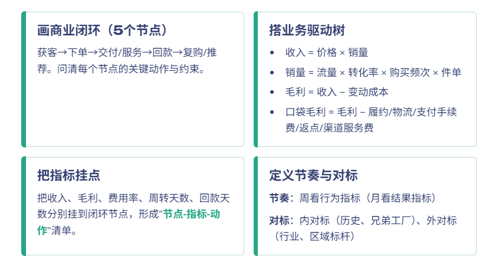
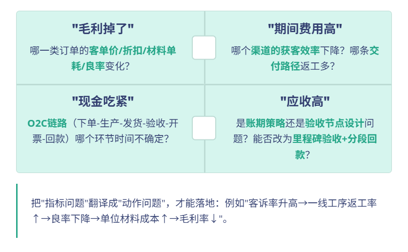
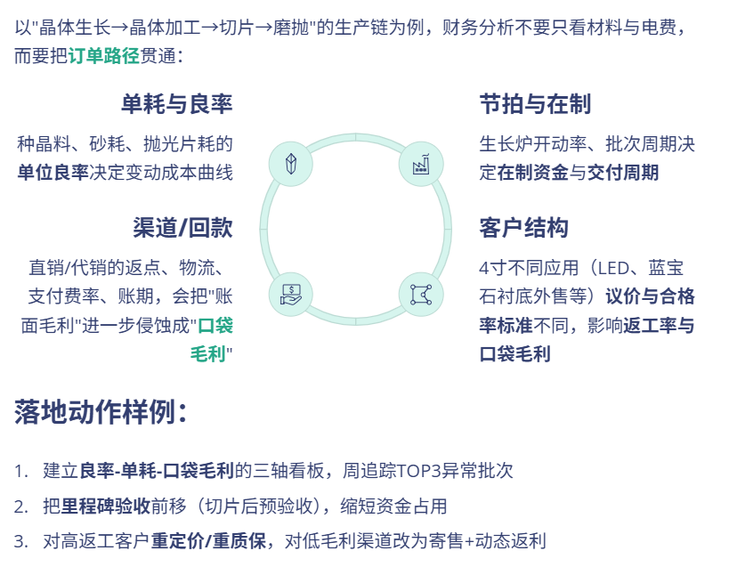
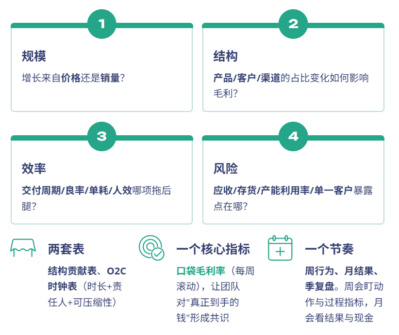

# 财务分析，不能脱离业务逻辑！

> 来源：微信公众号「数据熊」 · 作者 Data Bear · 发布于 2025-09-10 07:30  
> 原文链接：http://mp.weixin.qq.com/s?__biz=Mzg2MTg5OTgzNA==&mid=2247489782&idx=1&sn=2afd092c712733c0c55605142705c14f&chksm=ce1145a3f966ccb5885c3728af882a31ae8801eda716ed90284de01e2f811cc6501ad67cdf95
> 摘要：财务分析不是“算出来给你看”，而是“算明白、说清楚、做得成”。

---

## 一、为什么不少财务分析“看起来很专业，却没用”？

---

## 二、先画业务闭环，再放财务指标——四步搭框

---

## 三、三个典型“脱离业务”的错位与矫正

---

## 四、把财务语言翻译成业务语言（通用词典）

---

## 五、一套能带行动的分析框架（会开得起来、事落得下去）

会议目的

：从“复述报表”转向“决定动作”。

配套三张图

：

驱动树、结构贡献瀑布、O2C时钟图

。没有这三张图，不开会。

---

## 六、行业小例：蓝宝石衬底的“口袋毛利率”打法

---

## 七、行动工具箱：当场就能用

- 四问法（每次分析必问）

---

## 结语

---

## 【欢迎在评论区讨论】

点击左下角

阅读原文

，获取

《财务分析报告PPT模板》

不做孤独的财务人

加入数据熊的粉丝群

，与2300+财务精英共同成长。

PowerBI看板定制

，扫码加数据熊微信咨询。

