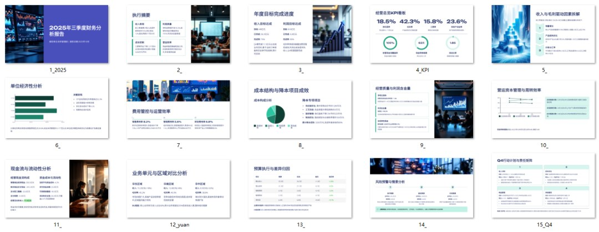

# 2025年三季度财务分析报告 PPT 模板

> 来源：微信公众号「数据熊」 · 作者 宋岳清 · 发布于 2025-10-11 07:30  
> 原文链接：http://mp.weixin.qq.com/s?__biz=Mzg2MTg5OTgzNA==&mid=2247490260&idx=1&sn=ccac95f061b14d66fe40a82dd88421e2&chksm=ce114781f966ce9793c9e05e9a3b5f5a11e3064ce2e40c9dca273916b822ac686d56ead0b49e
> 摘要：一到三季度财报季，老板最关心两件事：今年的“钱”到底挣在了哪里、四季度还能不能把目标拿下。

> 一到三季度财报季，老板最关心两件事：今年的“钱”到底挣在了哪里、四季度还能不能把目标拿下。

下面这套“可直接套用”的报告模板，按“目标—差距—原因—举措—责任—节奏”的闭环来写，开完会就能落地推进。

需要可编辑版本ppt模板的朋友可
前往文末获取下载方式
。

---

## 一、报告怎么讲：先定故事线，再排目录

先别急着做图，先想清楚“为什么而讲”。故事线决定目录，目录决定你需要的数据与图表。

建议故事线（电梯稿 30 秒）

- 目标完成：Q1–Q3 累计 vs 年度目标（完成率、缺口）
- 质量评价：利润与现金的匹配度（是否“增收不增利/增利不增现”）
- 核心驱动：价格、销量、结构、成本四象限各贡献多少
- 效率变化：费用效率、营运资本周转是红利还是拖累
- 风险与动作：两三条高影响因子 + 对应的责任人与时间表
- 展望 Q4：目标可达成性 + 三项关键抓手

---

## 二、标准目录（15–20 页，适配绝大多数集团/事业部）

目录是“骨架”，每页只回答一个问题，图表不超过 2 个。

1. 封面

    ：2025Q3 财务分析报告｜单位/部门｜报告人｜日期
2. 执行摘要

    （一页纸）：结论先行，6 行以内要点（KPI 仪表 + 关键举措条目）
3. 年度目标与进度

    ：收入/利润/现金目标 vs 累计完成（漏斗/甘特）
4. 经营总览 KPI 看板

    ：一利五率 + 现金转换周期（雷达/仪表）
5. 收入与毛利拆解

    ：价格×销量×结构×汇率桥图（瀑布/桥图）
6. 单位经济性

    ：口袋毛利率、贡献毛利、边际贡献（气泡/散点）
7. 费用与效率

    ：三费率/人均产出/费用 ROI（柱状 + 趋势线）
8. 成本与降本项目

    ：固定/变动分解 + 专项项目闭环（甘特 + 瀑布）
9. 经营质量

    ：净现比、利润含金量、非经常性影响（条形 + 说明）
10. 营运资本与周转

    ：应收/应付/存货天数与 CCC（折线 + 条形）
11. 现金与资金

    ：经营现金流、资金成本、流动性安全垫（桥图/表）
12. 业务单元/地区对比

    ：分 BU/区域矩阵（毛利×增速象限图）
13. 预算执行与差异归因

    ：预算差异树 + 口径说明（树图/表）
14. 风险预警与情景

    ：基准/乐观/保守三情景（区间带）
15. Q4 计划与责任清单

    ：动作—量化目标—责任人—节点（清单）
16. 数据与口径声明

    ：收入确认、税金口径、费用分摊、内部交易消除 （视需要添加：附件页｜项目复盘页｜审计或董事会问答备忘）

> 套用提醒
>
> ：每页标题写成“结论式命名”，如“费用率下降 0.8pct，核心来自人效提升与投放回收好转”。

---

## 三、数据口径与底表：先打地基，再盖楼

报告可信度的 80%，来自口径统一与底表可追溯。

必备底表（字段示例）

- 收入明细表

   ：客户/品类/地区/渠道/含税与未税/价格/折扣/汇率
- 毛利表

   ：标准成本/实际成本/采购价差/制造费用分摊规则ID
- 费用表

   ：科目三级 + 项目/活动/渠道 + 投放起止 + 归属规则
- 营运资本表

   ：账龄分段/回款计划/呆坏账标记；存货 ABC 与周转
- 资金表

   ：银行余额/受限资金/票据结构/融资成本与期限
- 预算表

   ：年初预算 + 调整版次 + 审批号 + 责任人
- 字典与口径表

   ：收入确认规则、税金归类、内部交易抵消、分摊方法

---

## 四、关键模块页面要怎么做（页级模板 + 图表建议）

把“分析问题—图表—话术”三件事捆在一起，现场才能讲得又快又准。

### 4.1 收入与毛利拆解（桥图模板）

这一页回答“增长/下滑的驱动是什么”。

- 图表

   ：本期毛利 vs 基期毛利的桥图（价格、销量、结构、汇率、成本）
- 口袋话术

   ：“结构拉动 +1.2pp 抵消价格下行 -0.9pp，净贡献 +0.3pp；其中高毛利 SKU 占比从 23%→28%。”
- 需要的字段

   ：SKU、品类、地区、单价、数量、毛利、汇率、基期标记

### 4.2 费用与效率（条形 + 趋势）

这一页回答“钱花在哪、值不值”。

- 图表

   ：销售/管理/研发三费率趋势 + 人均产出/投放 ROI
- 口袋话术

   ：“销售费用率下降 0.8pct，主要因渠道返利结构优化；投放 ROI 从 1.6 提升至 2.1。”

### 4.3 单位经济性（气泡图）

这一页判断业务“做大还是做强”。

- 图表

   ：贡献毛利（Y）× 增速（X），气泡=规模，颜色=口袋毛利率分组
- 决策

   ：右上象限扩大供给；左下象限谨慎收缩并做价格/成本试验

### 4.4 营运资本与周转（折线/条形）

现金是结果，更是约束。

- 图表

   ：DSO/DIO/DPO 与 CCC 趋势；逾期账龄热力图
- 动作

   ：前 20 大逾期客户专案、呆坏账覆盖率、压库专项与以销定产

### 4.5 现金与资金（桥图 + 表）

利润含金量看得见。

- 图表

   ：净利润 → 经营活动现金流桥图；资金成本台账（平均成本/久期）
- 动作

   ：票据与存款的组合收益；安全垫 = 预测 3 个月净现金缺口覆盖倍数

### 4.6 预算执行与差异归因（树图）

“达成/未达成”的直接证据。

- 图表

   ：收入/利润差异树（预算 → 实际）
- 说明

   ：明确“可控/不可控”比例，标注已执行举措与 Q4 影响量

---

## 五、不同业态的差异化页（按需加 2–4 页）

不是所有行业都该一把梭，差异化页更能打动业务负责人。

- 制造业

   ：产能利用率、OEE、良率、物料损耗、能耗单耗、产线边际
- 零售/商超

   ：客流/客单/转化率、动销率、折扣深度、坪效、损耗率
- ToB 项目型

   ：在手订单、在建项目现金曲线、WIP、回款风险清单
- 跨境

   ：汇率贡献、税退坡影响、物流时效与成本弹性

---

## 六、图表组件清单（拿来就用）

图表只是工具，选对就成功一半。

- 桥图/瀑布

   ：利润、现金的“从哪儿到哪儿”
- 帕累托

   ：20/80 的客户、SKU、问题清单
- 散点/气泡

   ：结构优化、单位经济性
- 热力矩阵

   ：区域/渠道健康度、账龄
- 区间带

   ：情景分析（P90/P50/P10）
- 甘特/清单

   ：专项降本与 Q4 行动台账

---

## 七、会前准备与会中话术（防“翻车”清单）

好内容也要好呈现，流程上补齐最后一公里。

- 会前

   ： 1）和业务一把手对齐 3 个结论；2）复核口径页；3）准备“追问备选页”（3–5 张）
- 会中

   ： 先讲结论，再给证据，最后落举措；拒绝“讲图”，只讲“业务真相与动作”
- 会后

   ： 责任人 + 指标 + 截止日期（RACI 表），每周 15 分钟跟进

---

### 想要更快？三档模板打包建议

- 轻量版（10–12 页）

   ：适合单体事业部的周例会
- 标准版（15–20 页）

   ：适配集团月/季度经营分析会（本文目录）
- 深度版（20–30 页）

   ：含专项复盘与审计/董事会 QA

点击

阅读原文

阅读

《

2025年Q3财务分析PPT模板

》

工作没思路，困惑没人问？

后台

私信

加入

数据熊的粉丝群

，与2300+财务精英共同成长。

PowerBI看板

定制添加数据熊微信：

往期推荐

2026年全面预算套表.xlsx

产品定价，七大经典模型（附excel模板）

财务分析，不能脱离业务逻辑！

财务高手是如何分析现金流量表的（附动态资金看板）

经营分析，不要做成了财务分析！（附PPT模板）
