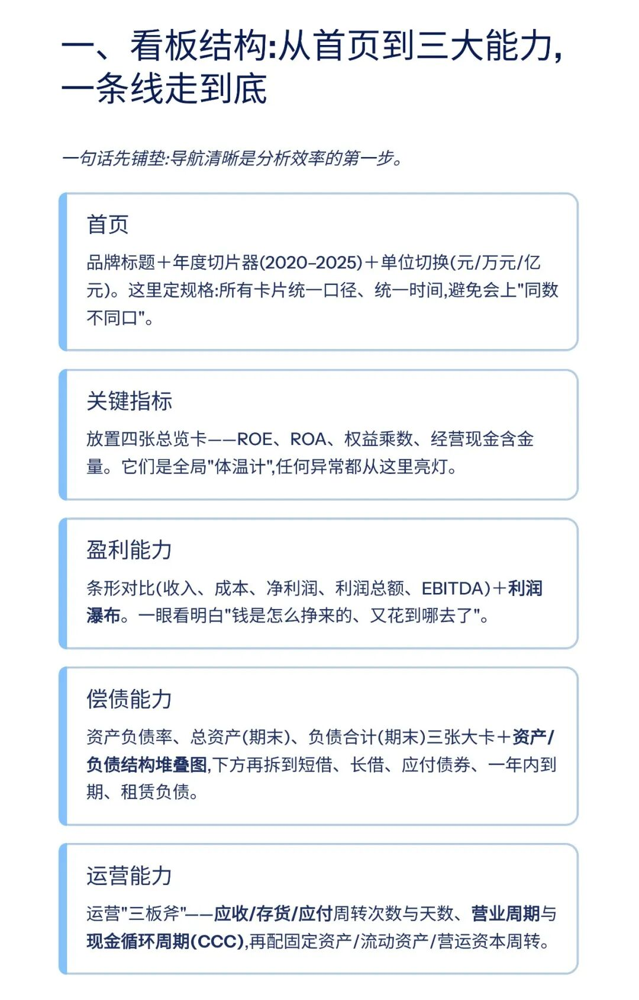
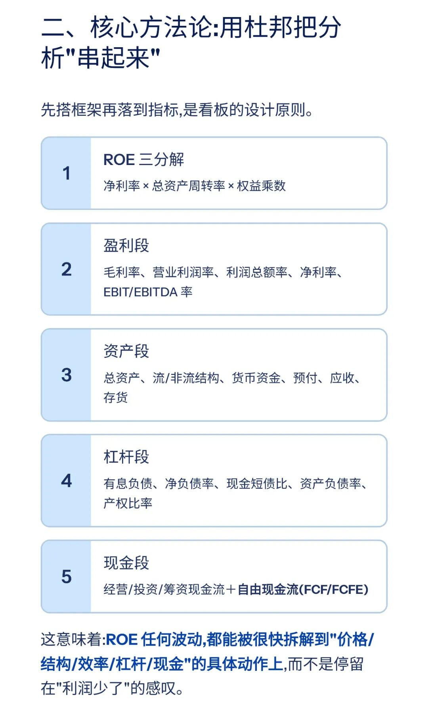
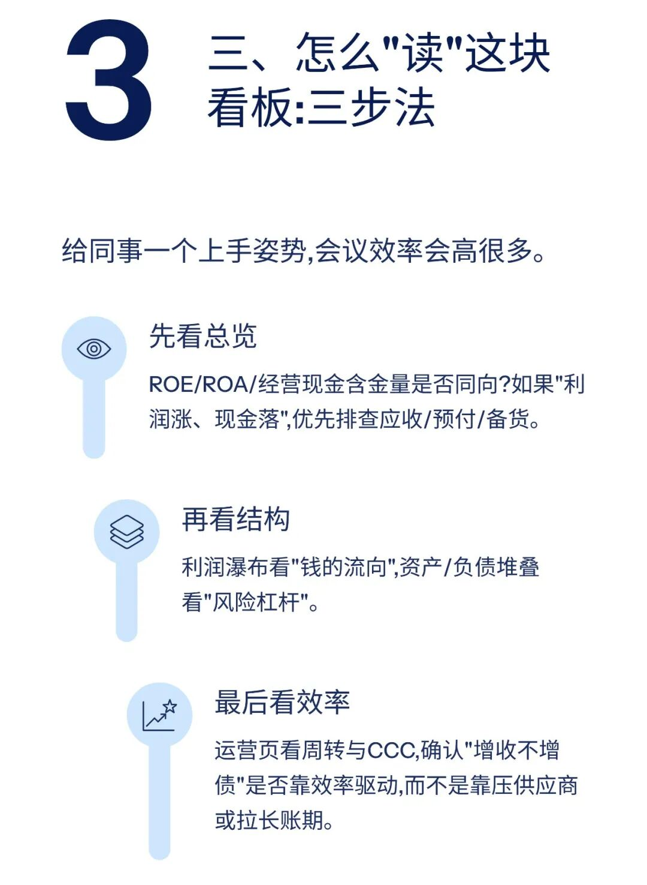
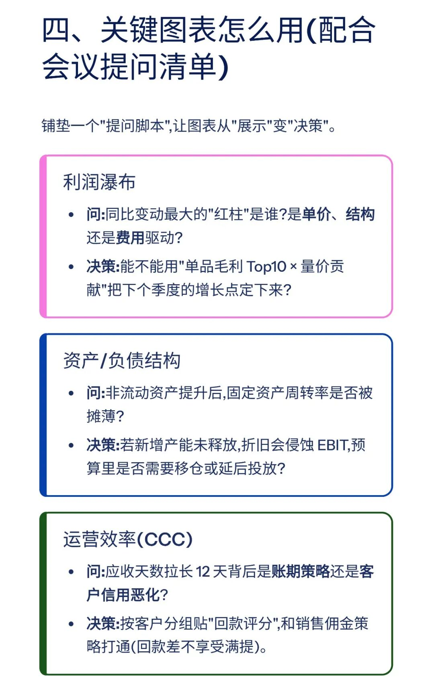
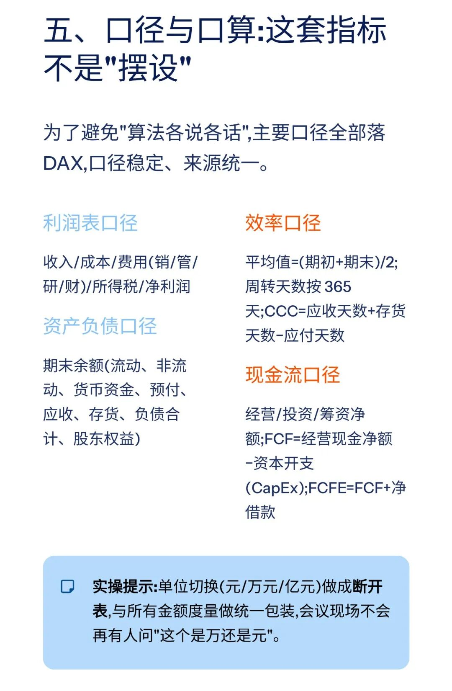
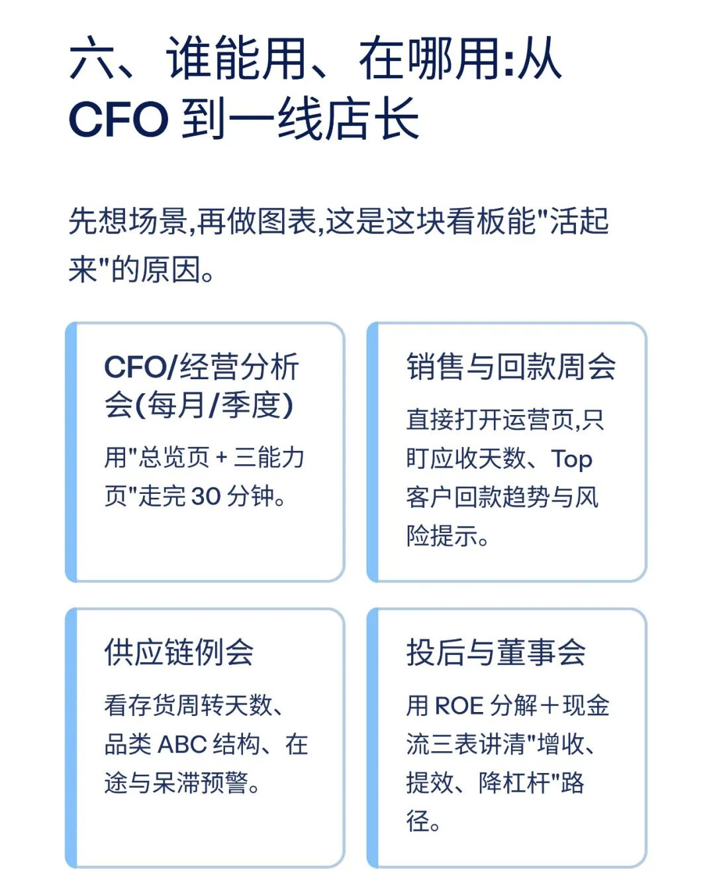
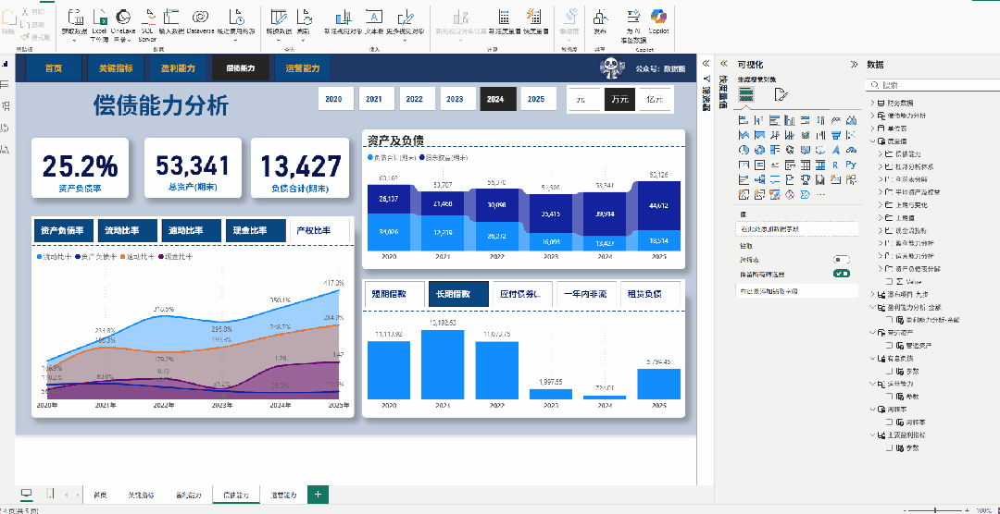

# 智能财务分析报告：一键生成精美看板

> 来源：微信公众号「数据熊」 · 作者 宋岳清 · 发布于 2025-11-03 07:30  
> 原文链接：http://mp.weixin.qq.com/s?__biz=Mzg2MTg5OTgzNA==&mid=2247491075&idx=1&sn=df7431068ccd4bc9fbf019447bf91e34&chksm=ce114356f966ca405021a18c61d770a8791d60fa87900795a4ca45d52efb1fdbb717dac15e17
> 摘要：模板即思路，点击阅读原文获取完整版《智能财务分析报告模板》。加入数据熊的财务精进营，与2600+财务精英共同成长。

模板即思路，点击
阅读原文
获取完整版《

智能财务分析报告模

板

》。

加入

数据熊的财务精进营

，与2600+财务精英共同成长。后台点击
「经典文章」阅读数据熊10W+爆文，
模板定制添加数据熊微信：

Daniel-songyq

点赞

和

转发

就是最大的支持，关注数据熊，工作更轻松。

