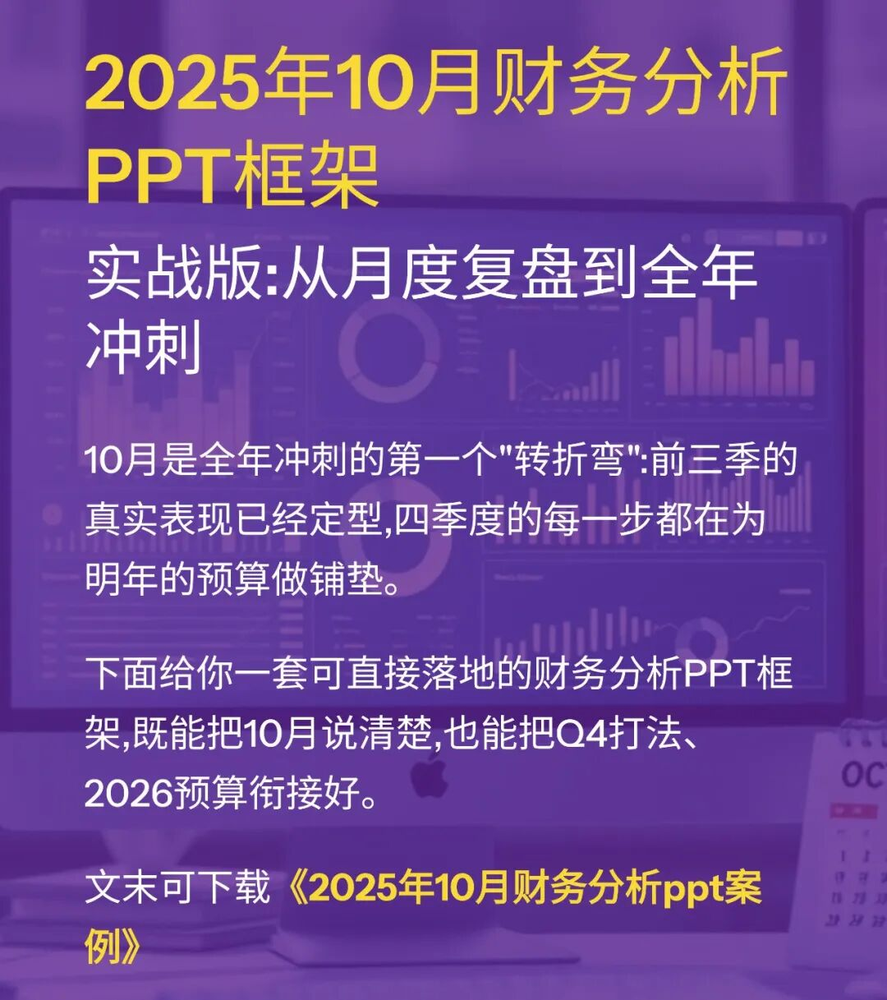
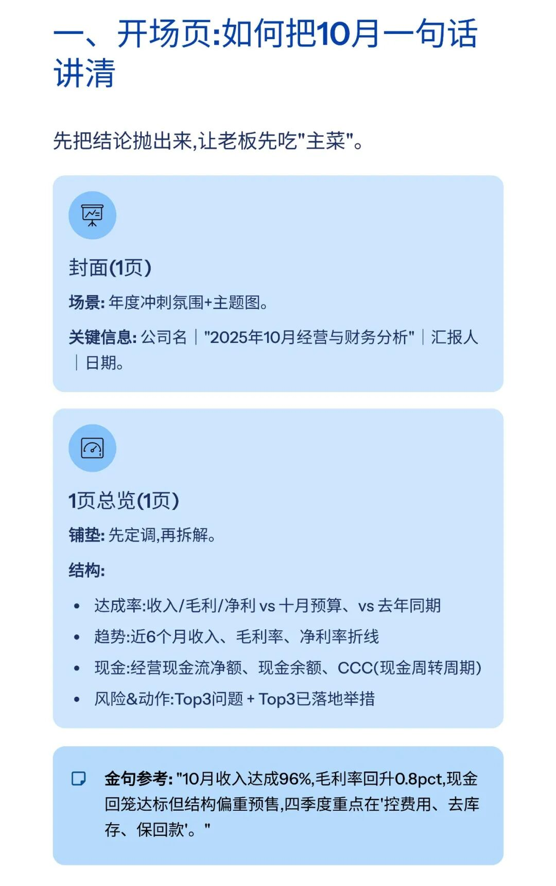
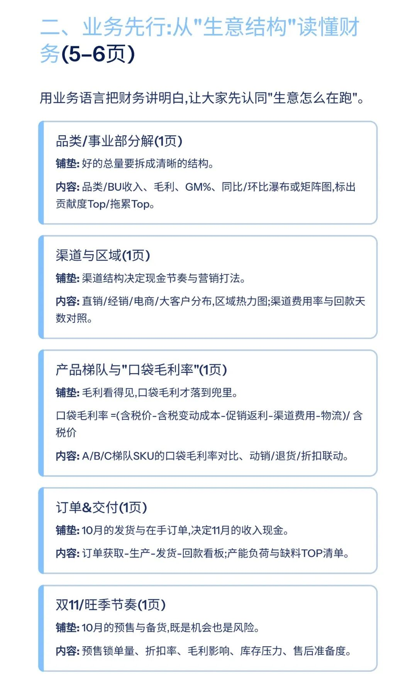
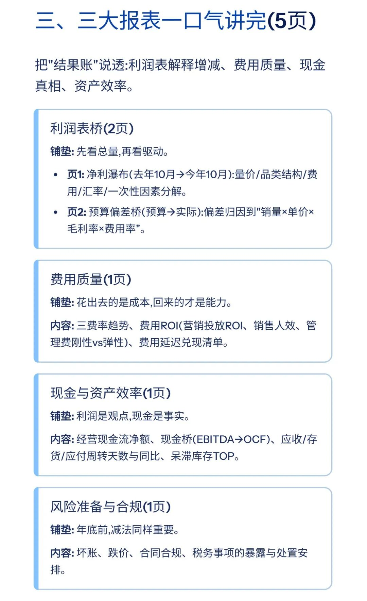
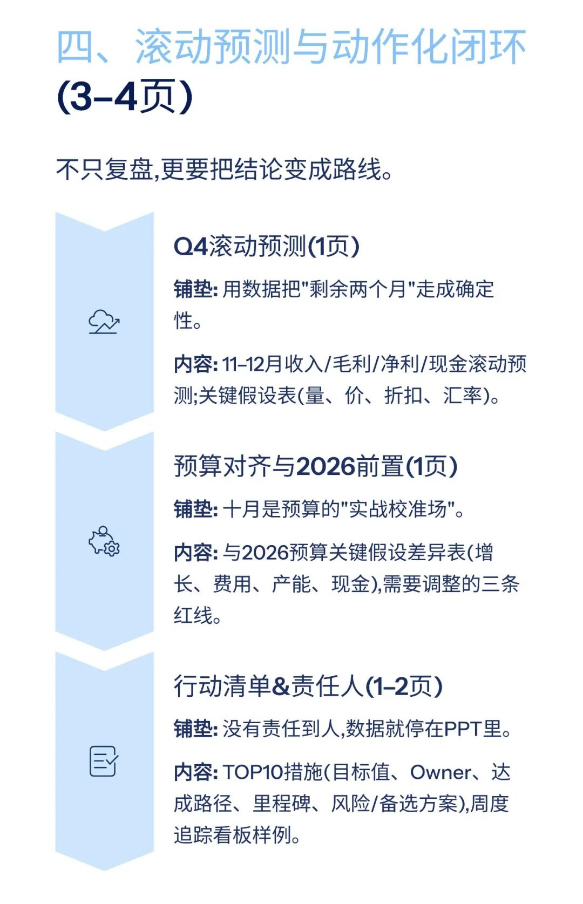
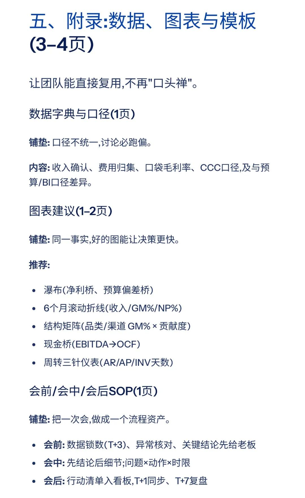
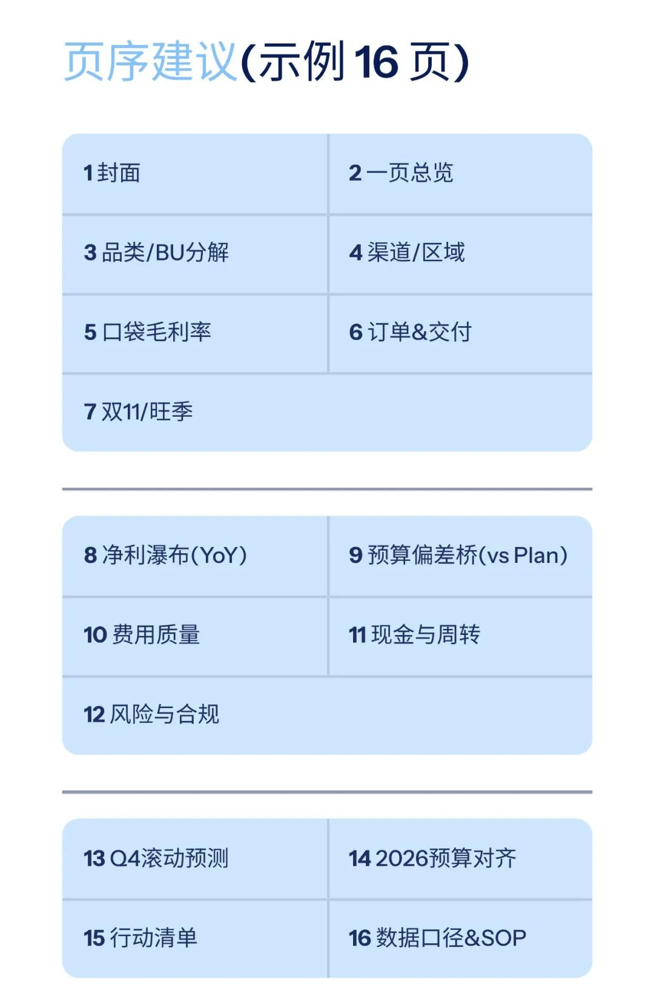
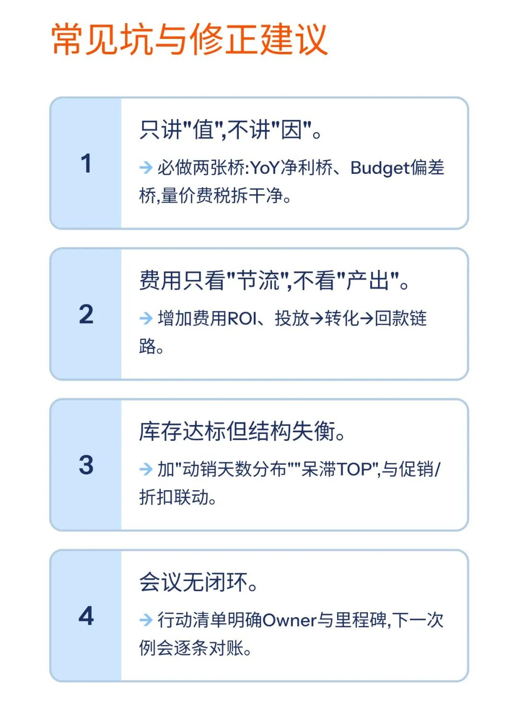

# 2025年10月财务分析PPT框架

> 来源：微信公众号「数据熊」 · 作者 宋岳清 · 发布于 2025-11-04 07:30
> 原文链接：http://mp.weixin.qq.com/s?__biz=Mzg2MTg5OTgzNA==&mid=2247491106&idx=1&sn=dc2a0ea915c264e7d9f3d0ebfa75508c&chksm=ce114377f966ca618ca7d224b64f082ca2dda6c25aa064538ae904a57a33d02d93014c5ddb91
> 摘要：10月是全年冲刺的第一个\x26quot;转折弯\x26quot;:前三季的真实表现已经定型,四季度的每一步都在为明年的预算做铺垫。

模板即思路，点击
阅读原文
获取完整版《

2025年10月财务分析PPT模板

》。

加入

数据熊的财务精进营

，与2600+财务精英共同成长。后台点击
「经典文章」阅读数据熊10W+爆文，
模板定制添加数据熊微信：

Daniel-songyq

点赞

和

转发

就是最大的支持，关注数据熊，工作更轻松。

