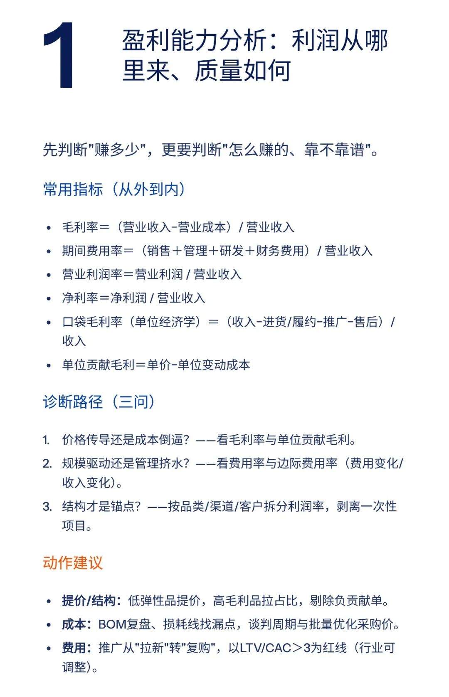
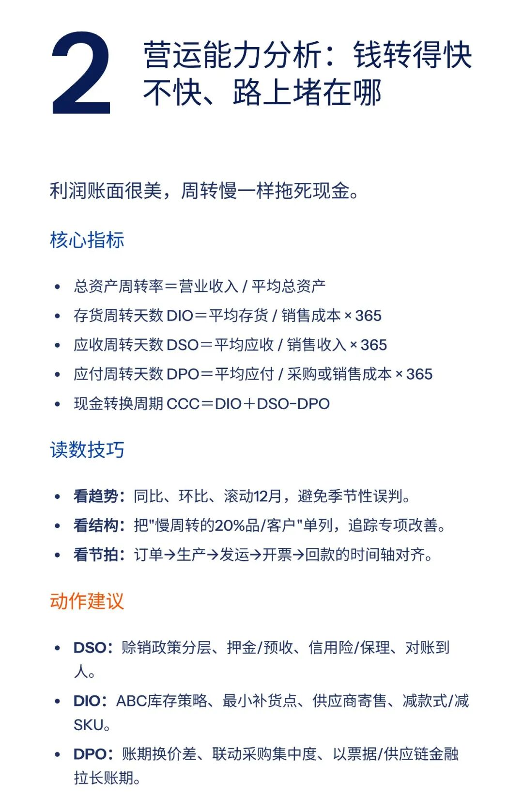
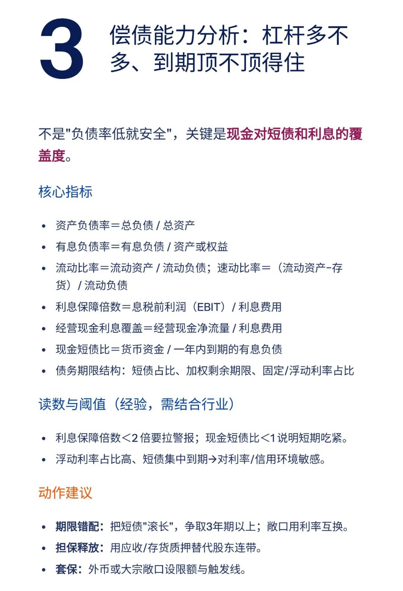
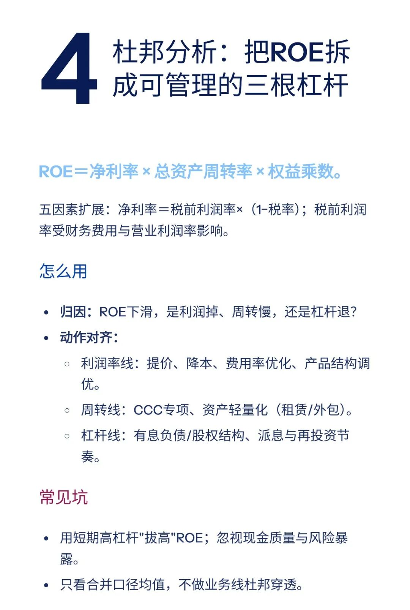
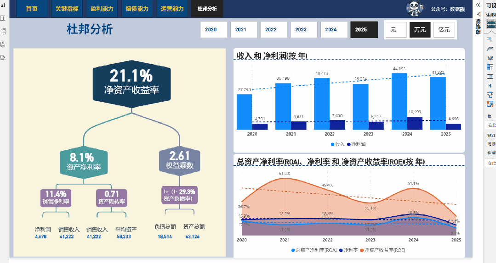
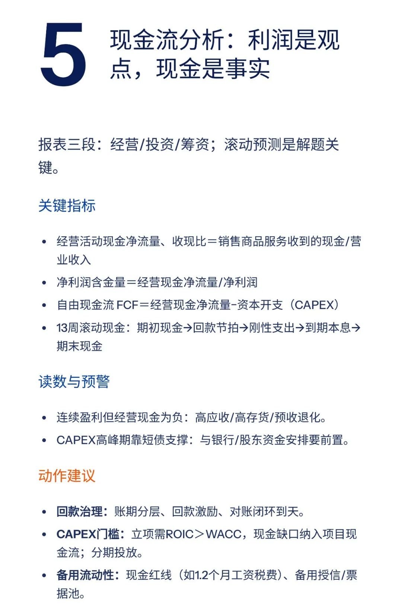
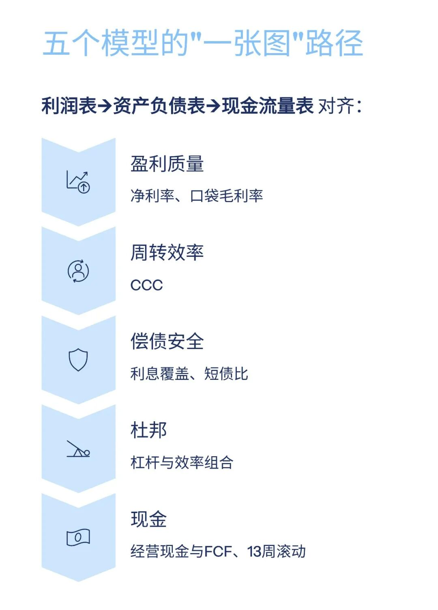

# 财务分析，必须要掌握的五大模型

> 来源：微信公众号「数据熊」 · 作者 宋岳清 · 发布于 2025-11-05 07:30
> 原文链接：http://mp.weixin.qq.com/s?__biz=Mzg2MTg5OTgzNA==&mid=2247491160&idx=1&sn=03782dcadde5de9908f098eb90883765&chksm=ce11430df966ca1b475740d7c7d0042b27321348646f7ee3054740cff1b634f0f3f8ef432ec8
> 摘要：模板板即思路，点击阅读原文获取完整版《财务分析看板》。

文末点击

阅读原文

，可下载上图模板。

模板即思路，点击
阅读原文
获取完整版《

财务分析看板

》。

加入

数据熊的财务精进营

，与2600+财务精英共同成长。后台点击
「经典文章」阅读数据熊10W+爆文，
模板定制添加数据熊微信：

Daniel-songyq

点赞

和

转发

就是最大的支持，关注数据熊，工作更轻松。

