# 盈亏平衡点的6大应用场景（附Excel模板）

> 来源：微信公众号「数据熊」 · 作者 宋岳清 · 发布于 2025-11-08 07:30  
> 原文链接：http://mp.weixin.qq.com/s?__biz=Mzg2MTg5OTgzNA==&mid=2247491353&idx=1&sn=6b1f03aede994db3c4192de3d77966bd&chksm=ce11424cf966cb5aa895c46865b3018a60c7defeb688901799e0cf4cc90b6e25d5ce9cc9374f
> 摘要：模板即思路，点击阅读原文获取版《盈亏平衡点Excel模板》。加入数据熊的财务精进营，与2600+财务精英共同成长。

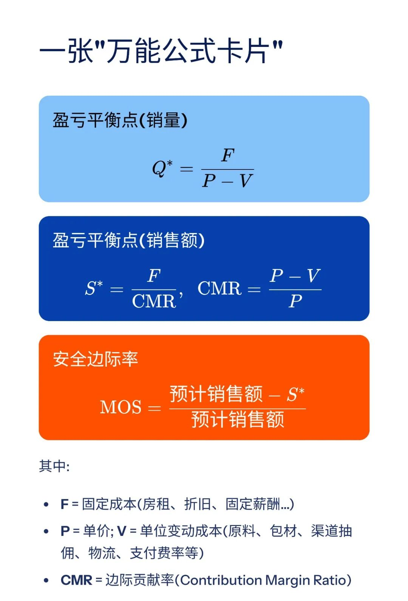

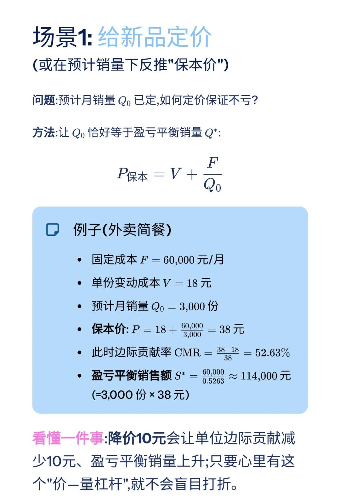

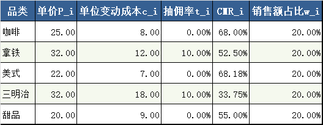

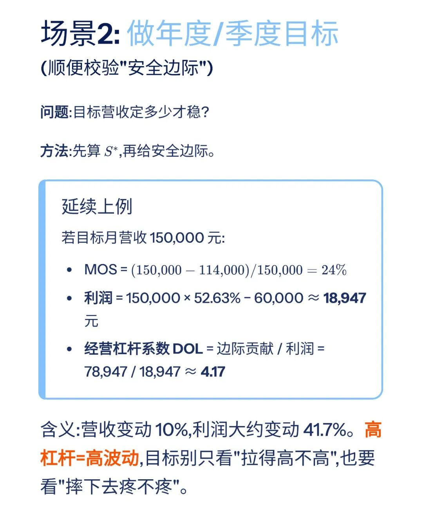

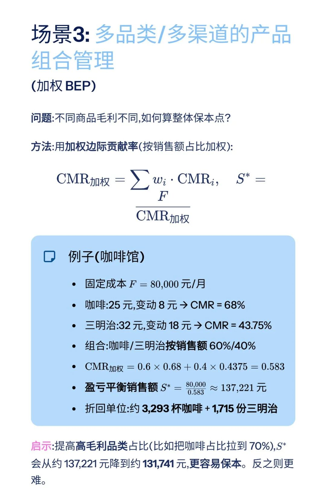

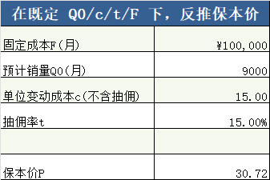

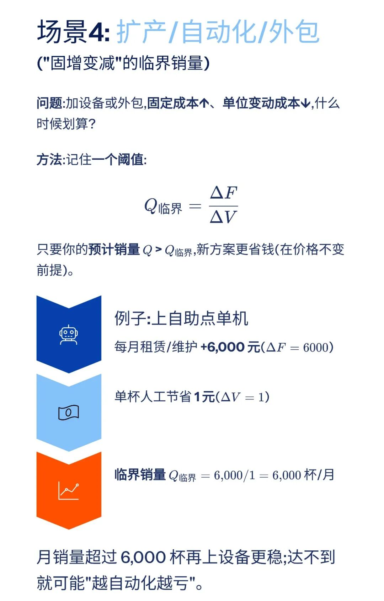

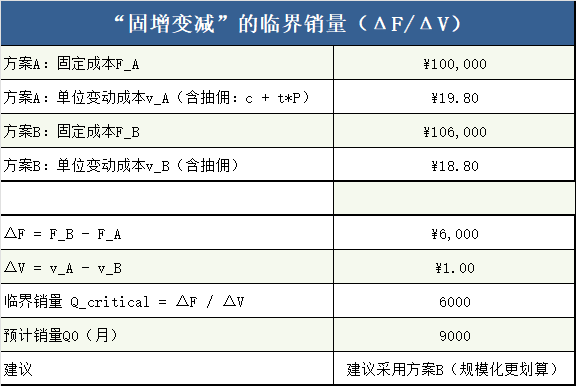

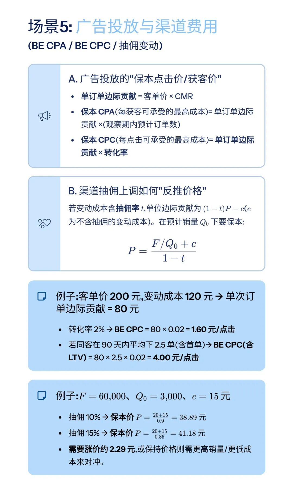

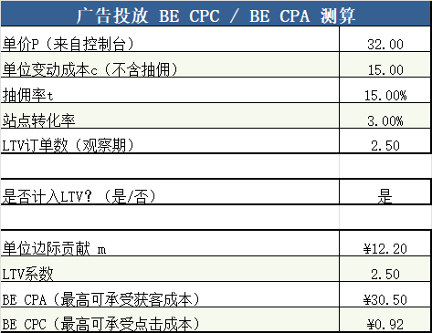

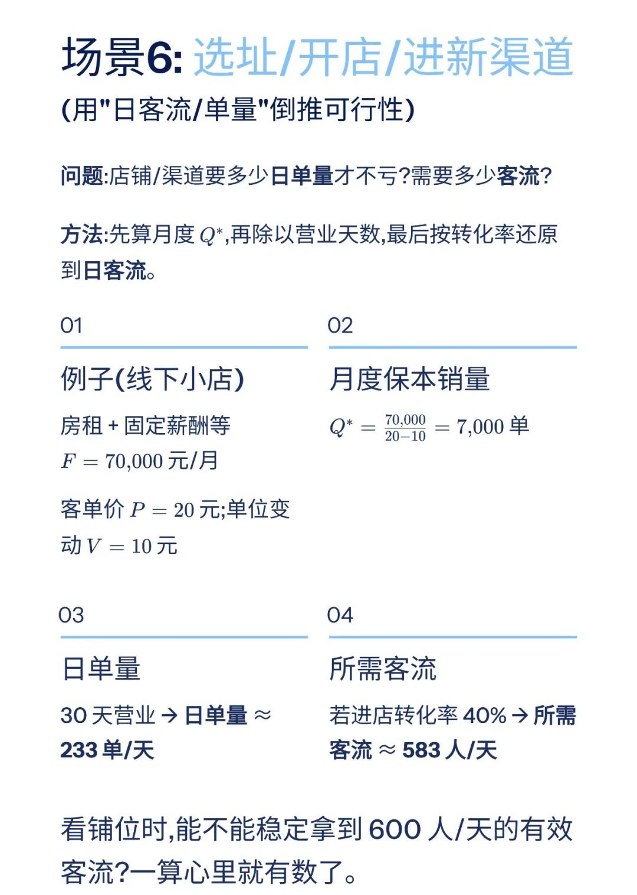

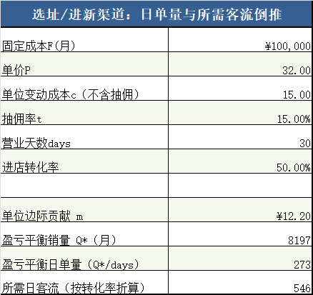

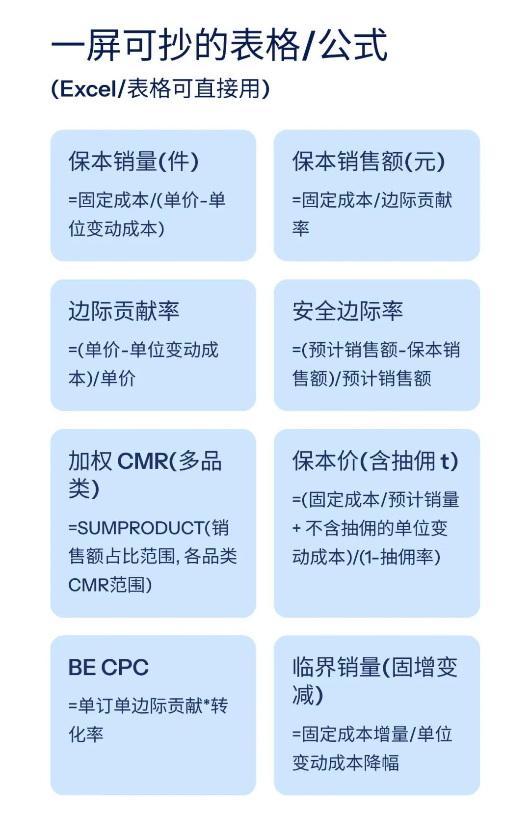

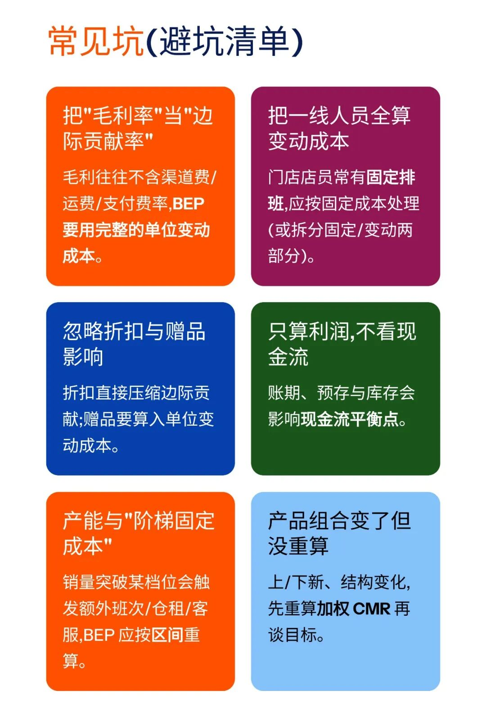

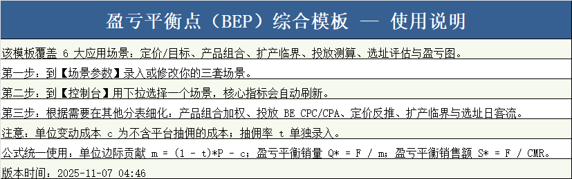

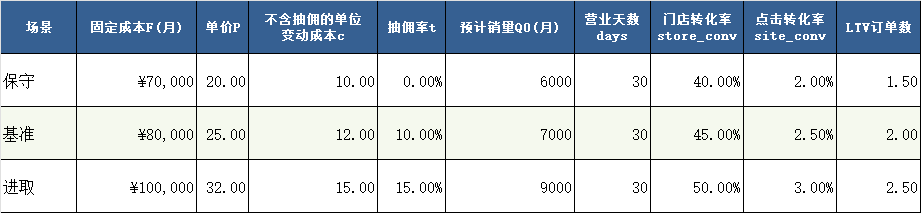

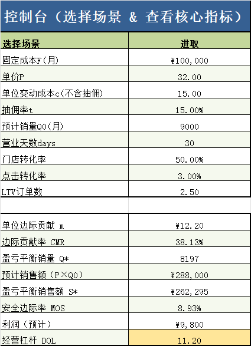

模板即思路，点击
阅读原文
获取版《

盈亏平衡点Excel模

板

》。

加入

数据熊的财务精进营

，与2600+财务精英共同成长。后台点击
「经典文章」阅读数据熊10W+爆文，
模板定制添加数据熊微信：

Daniel-songyq

点赞

和

转发

就是最大的支持，关注数据熊，工作更轻松。

