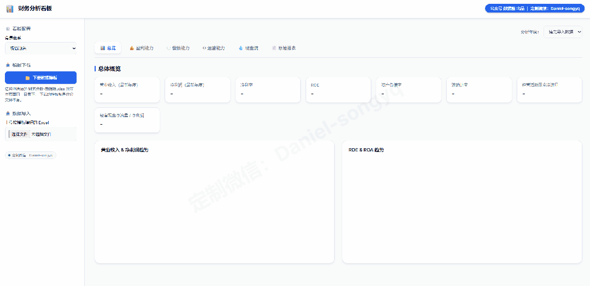
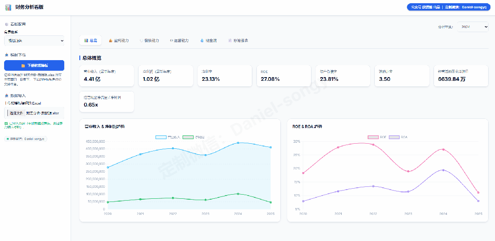
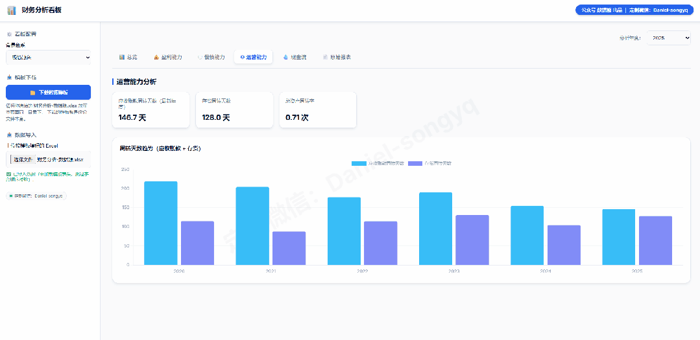
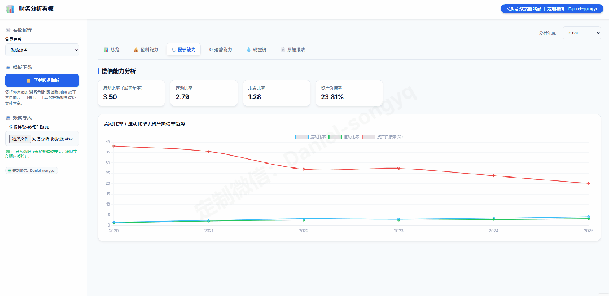

# 数据熊 | 财务分析模型：一键导入、自动计算、自动画图

> 来源：微信公众号「数据熊」 · 作者 宋岳清 · 发布于 2025-12-12 07:30  
> 原文链接：http://mp.weixin.qq.com/s?__biz=Mzg2MTg5OTgzNA==&mid=2247493137&idx=1&sn=e68646a6071ba4c0ac33380a452b2781&chksm=ce12bb44f9653252b5dfba95fc2dc49537ca4787223d35b0559ff54f9b39c3a023fc7abcbd6f
> 摘要：很多财务人跟我说： 报表做了一摞又一摞，但老板依然一句话——“我就想看重点，你帮我说人话”。

很多财务人跟我说： 报表做了一摞又一摞，但老板依然一句话——

“我就想看重点，你帮我说人话”

。

所以我干脆把这套思路做成了一个

可交互的财务分析看板

：从三大报表出发，一键导入数据、自动算指标、自动画图，你只负责讲故事就行。

---

## 01 只认一套 Excel：对标模板即可导入

传统问题是：

- 每家企业的科目结构不一样，
- 模板稍微一改，公式就乱套。

这套看板的做法是——

先定一份标准数据源模板

：

- 内置三张表：资产负债表、利润表、现金流量表；
- 栏位、行次全部固定好，你只需要把数据贴进对应行列；
- 在页面左侧「下载数据模板」，填完后「上传 Excel」，
- 看板会自动校验表头，一致才导入，

   确保口径不跑偏

   。

导入成功后，所有指标、图表、原始报表区都会同步刷新。

---

## 02 关键指标一屏看：盈利、偿债、运营、现金流

打开首页，你能看到一组财务人最关心的“硬指标”：

- 营业收入、净利润、净利率、ROE
- 资产负债率、流动比率
- 经营活动现金净流量
- 经营现金净流量 / 净利润（现金含金量）

再往下，是几组自动生成的趋势图：

- 收入&净利润多年度对比
- ROE & ROA 多年走势
- 毛利率 / 净利率 / ROE 组合曲线

不用再去翻 PIVOT、调图表，只要更新 Excel，趋势就自己跑出来。

---

## 03 指标算得清楚：特别是存货、应收这类“坑点”

这套看板里，

所有核心指标都显式写清逻辑

，尤其是容易算错的：

- 存货周转天数
- 应收账款周转天数
- ROE / ROA / 资产负债率 / 流动比率 / 速动比率 / 现金比率 / 现金含金量

你不需要肉眼去排查公式，看板帮你按照统一逻辑自动算好。

---

## 04 一键切换年度 & 主题：给老板演示更丝滑

做复盘会、月度例会的时候，两个细节很重要：

1. 按年度切换指标
2. 主题切换：适配不同场景

整个设计就是为了：

你只管讲逻辑，画面交给看板

。

---

## 05 原始报表不丢：三大报表随时“翻底稿”

底层数据永远是三大报表，所以我在最后专门留了一个「原始报表」页：

- 资产负债表 / 利润表 / 现金流量表
- 冻结首行首列、自动千分位、上下滚动不迷路

当老板问：“这行数据怎么来的？” 你可以直接切到对应报表行列，一眼对上原始金额。

---

## 06 如何获取这套看板？

这套

财务分析看板

，适合这样的人：

- 想把三大报表抽成一套经营分析体系的财务负责人；
- 需要经常给老板做月度/年度汇报的财务BP、经营分析岗；
- 有多家子公司、多年度报表，希望用统一口径做对标分析的集团财务。

> 想要这套看板源文件 + 数据源模板，
>
> 1、加微信：
>
> Daniel-songyq
>
>  备注【财务分析看板】来聊， 也可以根据你公司口径，做一版
>
> 定制指标 + 行业版模型
>
> 。
>
> 2、
>
> 文末点击
>
> 阅读原文
>
> ，可下载本模型

### 【加入数据熊会员群】

如果你希望系统性搭建：

- 经营分析体系、

- 成本核算与定价模型、
- 预算&资金测算工具、
- 各类可视化分析模板，

加入

数据熊

会员群

，与2900+精英共同成长。后台点击
「经典文章」阅读数据熊10W+爆文，
模板定制添加数据熊微信：Daniel-songyq

往期推荐

数据熊丨应收账款分析模型

「经营分析驾驶舱」终于做好了：一场会议看清收入、利润和现金流

现金流预测模型.xlsx

盈亏平衡点的六个应用场景（附Excel模板）

数据熊 | 产品定价模型：成本倒推、竞品锚定、动态调价

数据熊 | 2025版个税筹划智能计算器pro 正式发布

点赞

和

转发

就是最大的支持，关注数据熊，工作更轻松。

