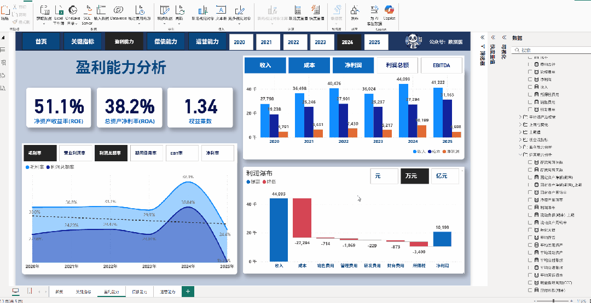
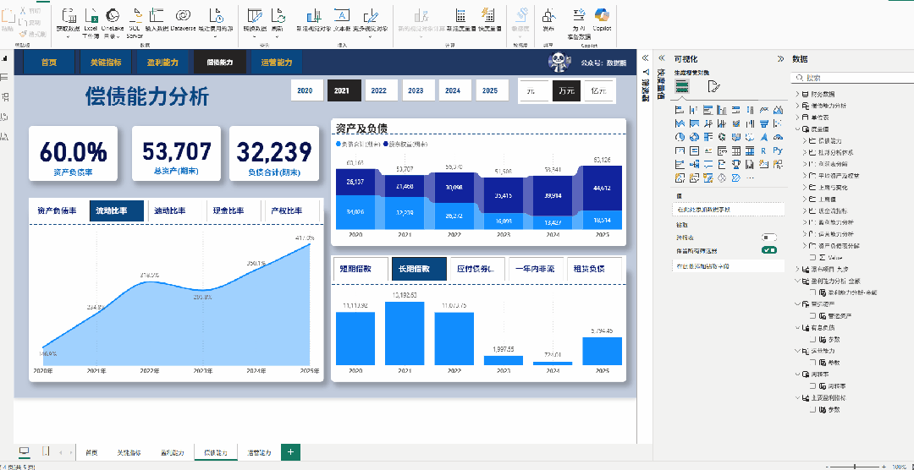
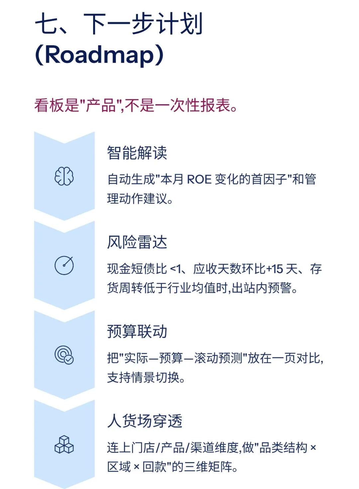

# 智能财务分析报告：一键生成精美看板

> 来源：微信公众号「数据熊」 · 作者 宋岳清 · 发布于 2026-03-23 16:30
> 原文链接：http://mp.weixin.qq.com/s?__biz=Mzg2MTg5OTgzNA==&mid=2247497690&idx=1&sn=3b7f199c3d242310eb3ee6e8d161ceef&chksm=ce12aa8ff9652399a3c3029ac1dabd4bfe1b8f86091e220b8ceef88a0504923f860982dc9711

模板即思路，点击
阅读原文
获取完整版《

智能财务分析报告模

板

》。

加入

数据熊的会员群

，与4800+财务精英共同成长。后台点击
「经典文章」阅读数据熊10W+爆文，
模板定制添加数据熊微信：

Daniel-songyq

点赞

和

转发

就是最大的支持，关注数据熊，工作更轻松。

