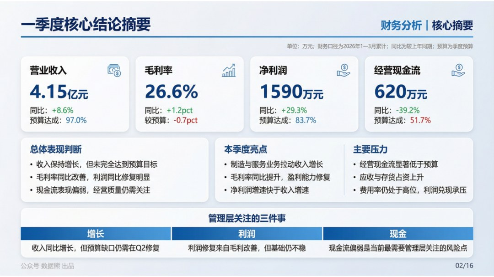
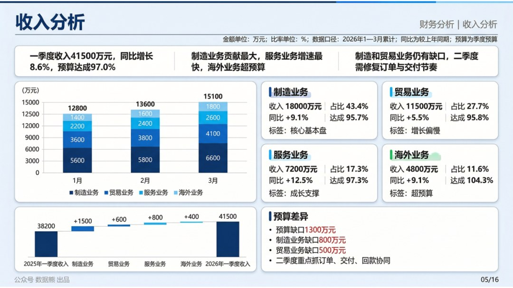
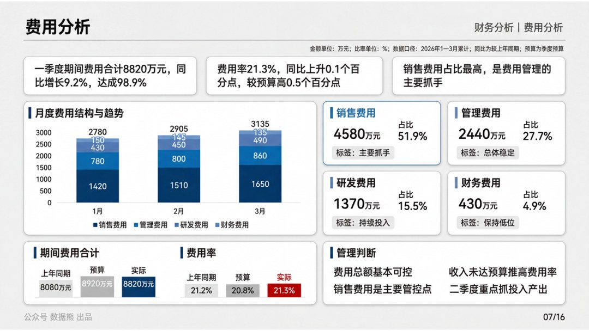
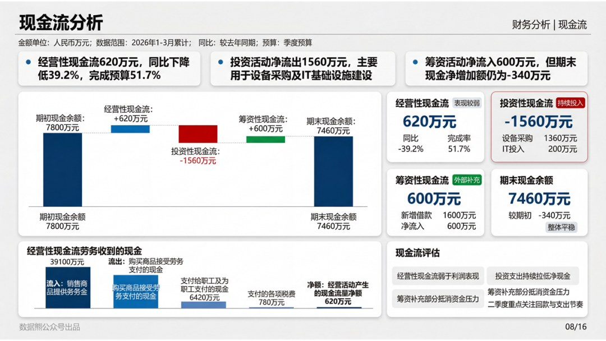
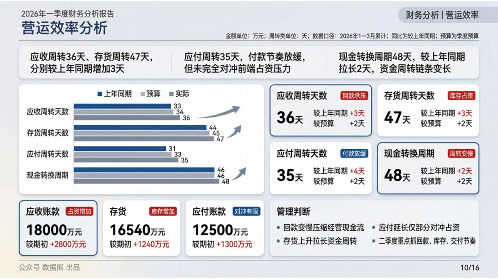

# 2026年1季度财务分析报告.pptx

> 来源：微信公众号「数据熊」 · 作者 宋岳清 · 发布于 2026-04-09 09:15  
> 原文链接：http://mp.weixin.qq.com/s?__biz=Mzg2MTg5OTgzNA==&mid=2247498215&idx=1&sn=abdce0eab95beceddb5017713e41a030&chksm=ce12a4b2f9652da4e1b13bd00008c32706d76b61711ac5d18f82fdf7da0df8fb08ea1725cdb0

财务人最大的短板不是专业，而是汇报，文末左下角点击
阅读原文
，下载完整版《2026年1季度财务分析报告.pptx》及Excel底表

往期推荐

2026年2月应收账款分析报告

2026年经营计划模板

2026年2月经营分析报告

详解美的集团经营分析体系

2026年1季度财务工作总结.pptx

2026年1季度经营分析报告

2026年1季度财务工作总结

