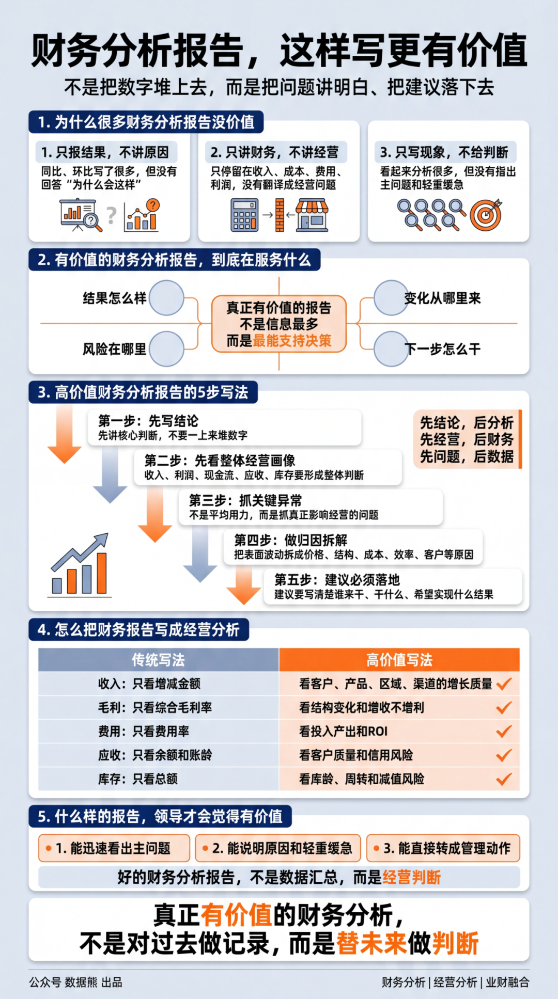
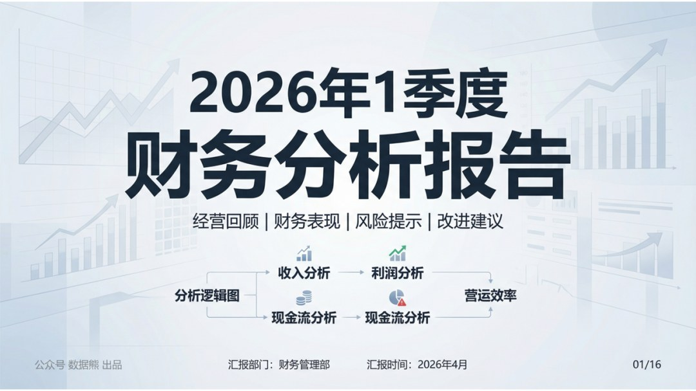
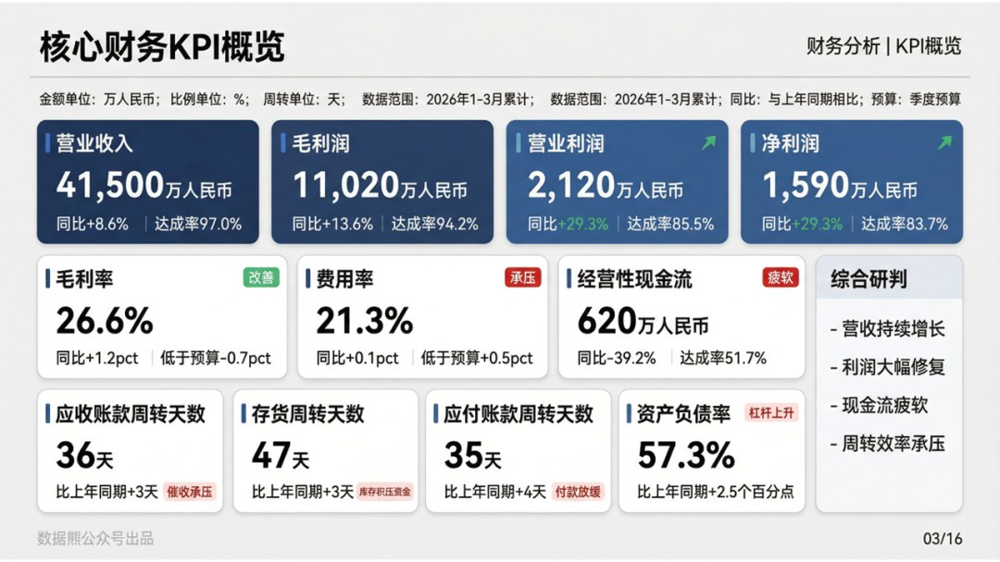
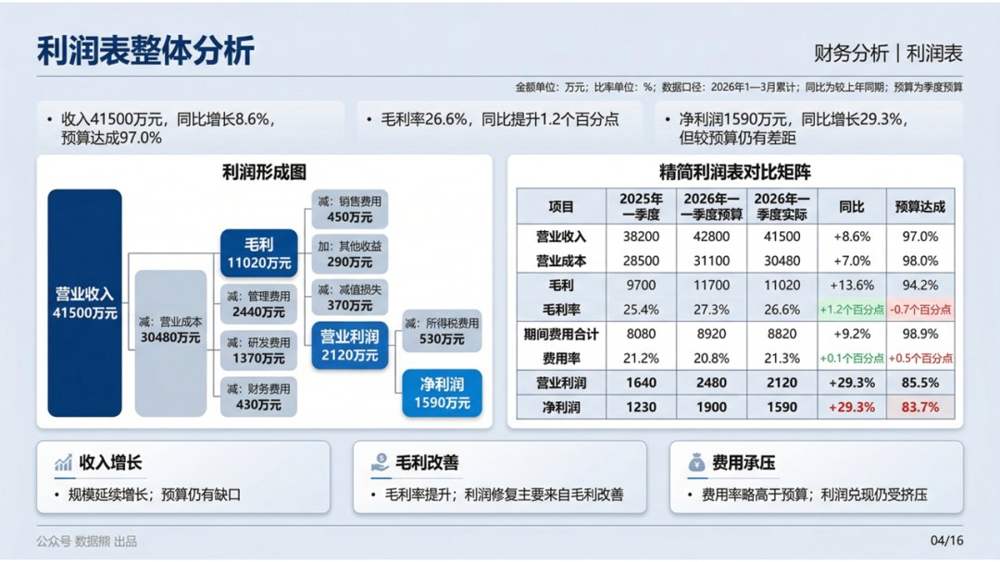
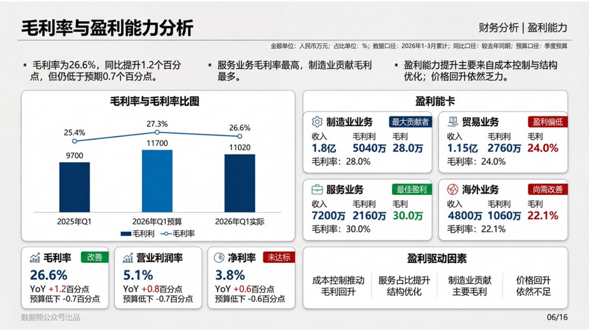
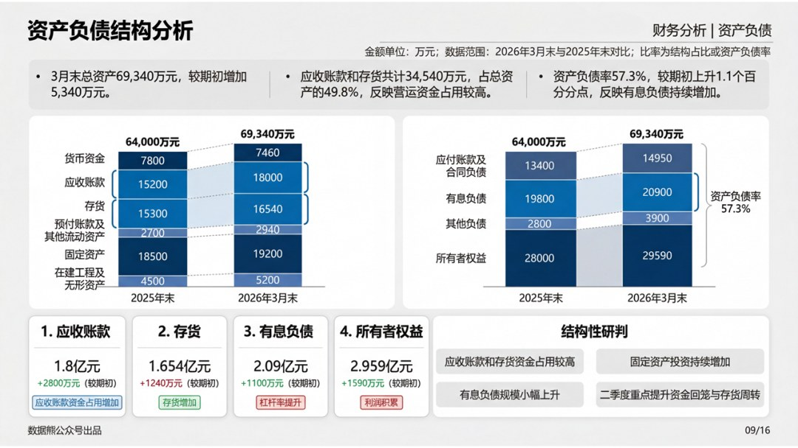

# 财务分析报告，这样写更有价值（附财务分析报告.pptx）

> 来源：微信公众号「数据熊」 · 作者 宋岳清 · 发布于 2026-04-21 09:15
> 原文链接：http://mp.weixin.qq.com/s?__biz=Mzg2MTg5OTgzNA==&mid=2247498482&idx=1&sn=58a9e7d370fd06772c5b5ce2a4f18f9e&chksm=ce12a7a7f9652eb1c09a8ecaa09751d9efefdb234b39f876a52fe0a274a8b87aef3703905bc8

财务人最大的短板不是专业，而是汇报，文末左下角点击
阅读原文
，下载完整版《2026年1季度财务分析报告.pptx》及Excel底表

往期推荐

2026年经营计划模板

详解美的集团经营分析体系

2026年1季度财务工作总结.pptx

2026年1季度经营分析报告

2026年1季度财务工作总结

2026年1季度存货分析报告.pptx

2026年1季度应收账款分析报告.pptx

2026年1季度资金与现金流分析报告

