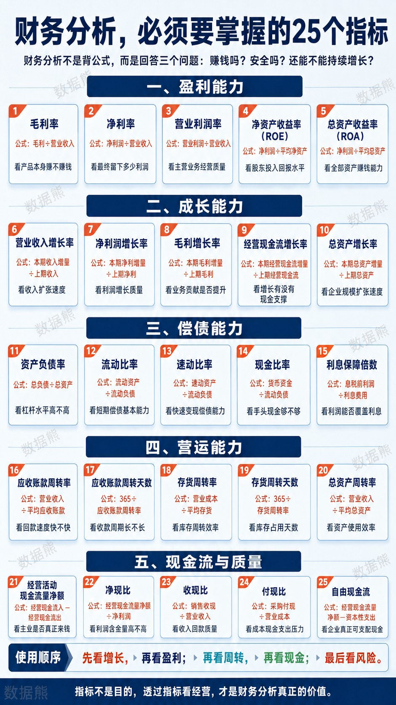
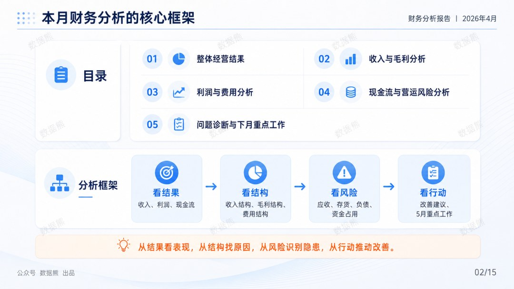
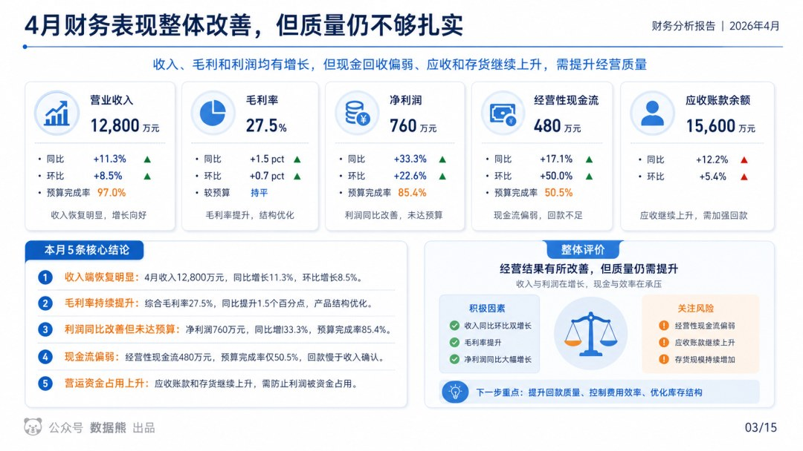
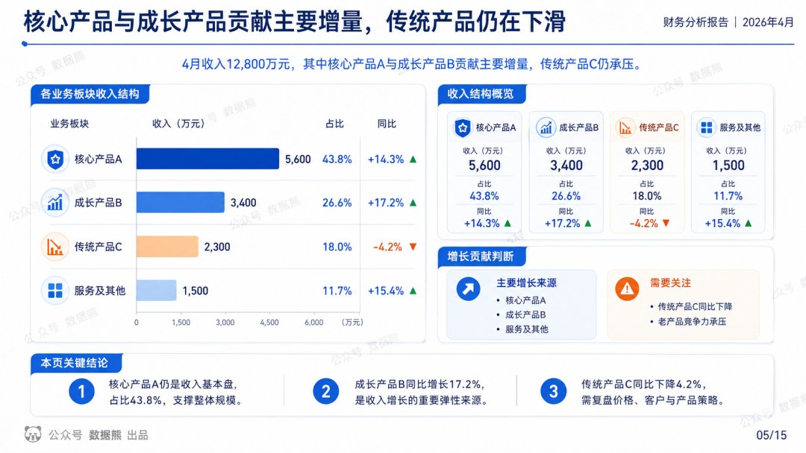
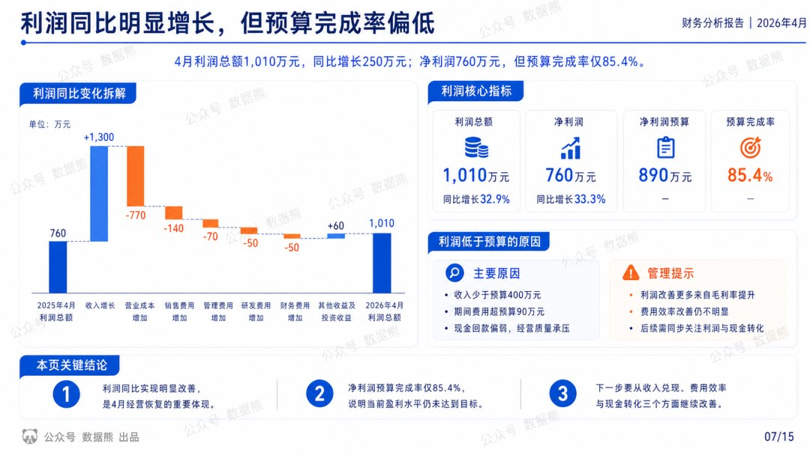
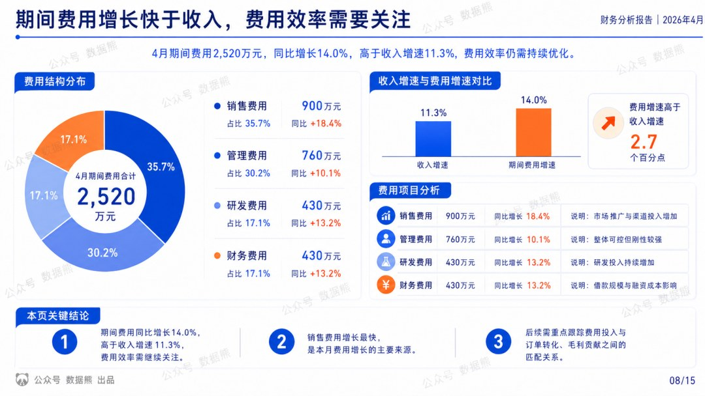
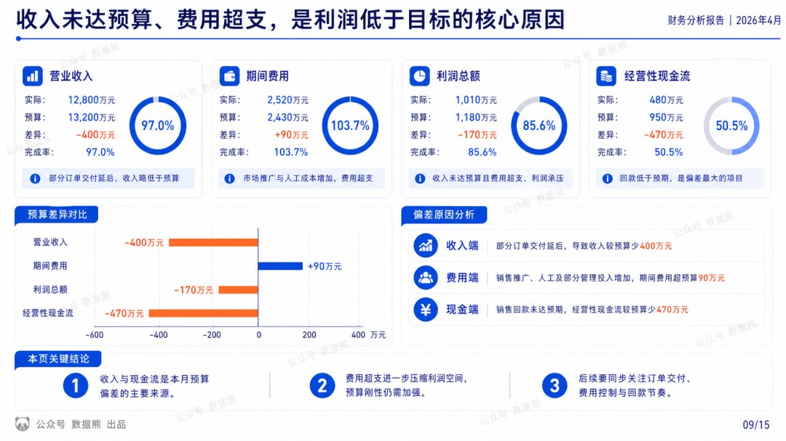
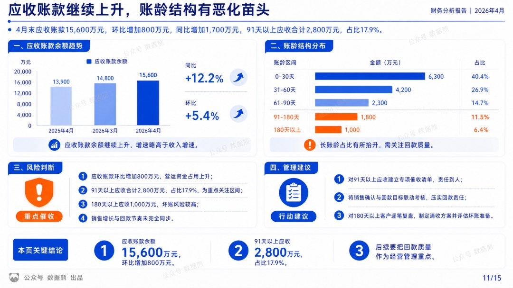
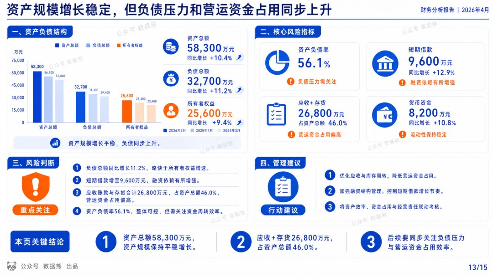

# 2026年4月财务分析报告

> 来源：微信公众号「数据熊」 · 作者 宋岳清 · 发布于 2026-04-26 09:15
> 原文链接：http://mp.weixin.qq.com/s?__biz=Mzg2MTg5OTgzNA==&mid=2247498593&idx=1&sn=5528af96670fb8fe15b72e4c57297dc4&chksm=ce12a634f9652f229de5070a2b20d2d93c52ef1e88ab03e1b767fcf2a6afe8f38f88316f0e39

汇报能力才是职场的顶级能力，文末左下角点击
阅读原文
，下载完整版《2026年4月财务分析报告》

