# 2026年5月财务分析报告

> 来源：微信公众号「数据熊」 · 作者 宋岳清 · 发布于 2026-05-31 08:43  
> 原文链接：http://mp.weixin.qq.com/s?__biz=Mzg2MTg5OTgzNA==&mid=2247499631&idx=1&sn=d805b38a5a736b811ffc744fd36be832&chksm=ce12a23af9652b2c1ade71f7eb3b31af57b3b064dda9c3a77743de28740dd13f7bdcab98f901
> 摘要：财务分析的真正价值，不在于把报表数字讲一遍，而在于把数字背后的业务逻辑讲清楚。

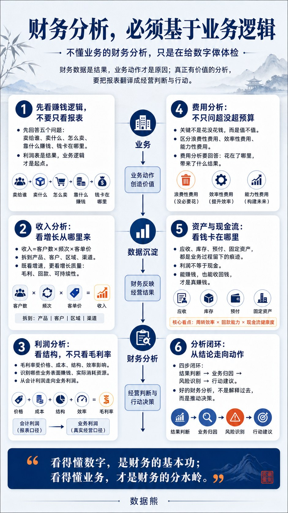

财务分析的真正价值，不在于把报表数字讲一遍，而在于把数字背后的业务逻辑讲清楚。

收入为什么增长，毛利为什么下降，费用花得值不值，现金为什么没有回来，

表面上看是财务指标变化，本质上都是客户、产品、渠道、价格、成本、效率和回款共同作用的结果。

只有沿着业务链条去拆解财务数据，财务分析才能从“解释过去”走向“推动决策”，从“报表汇报”升级为“经营判断”。

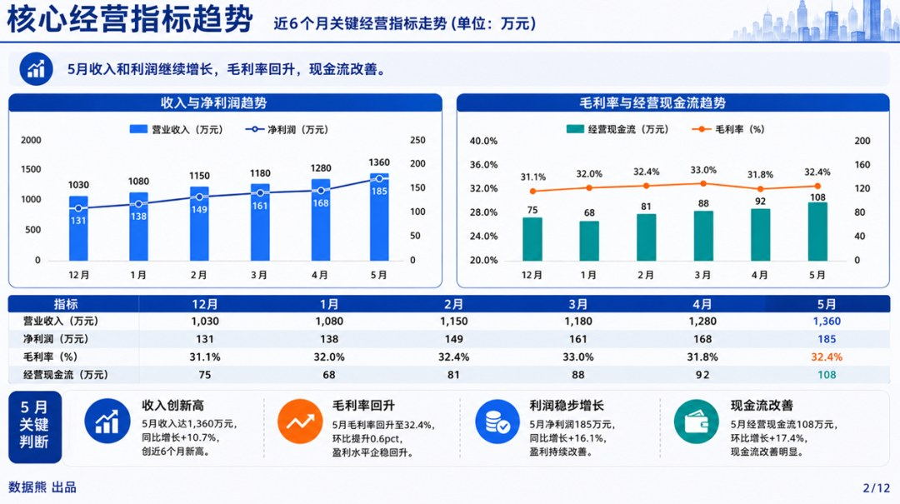

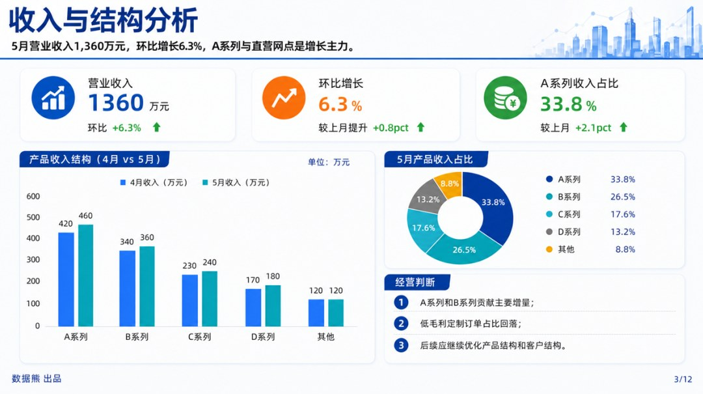

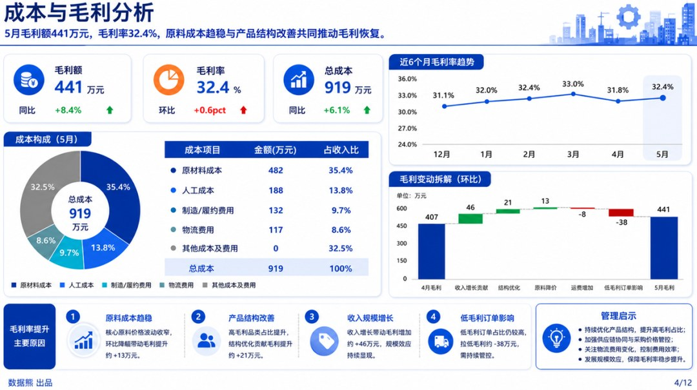

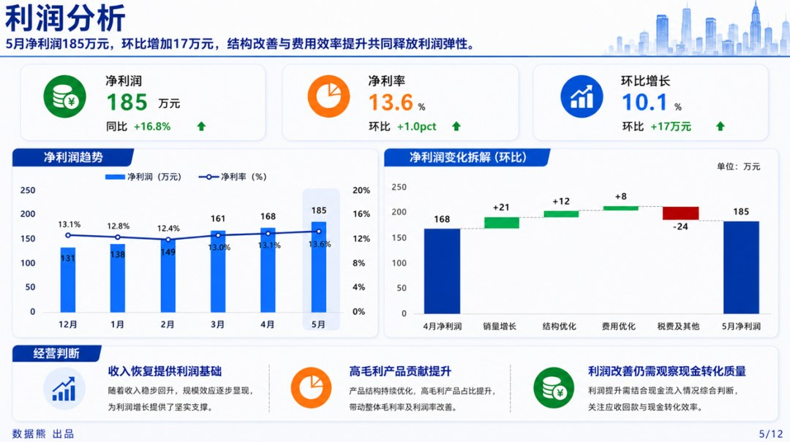

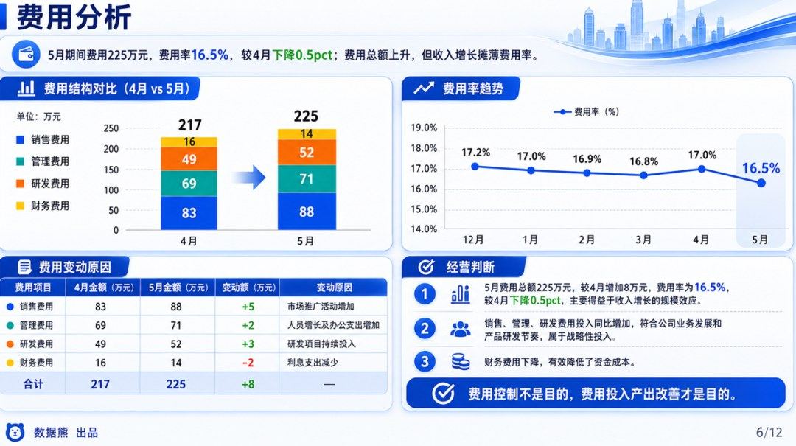

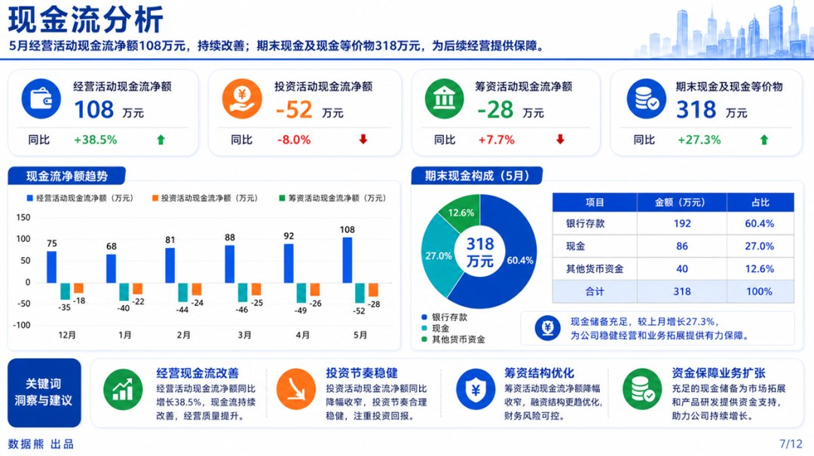

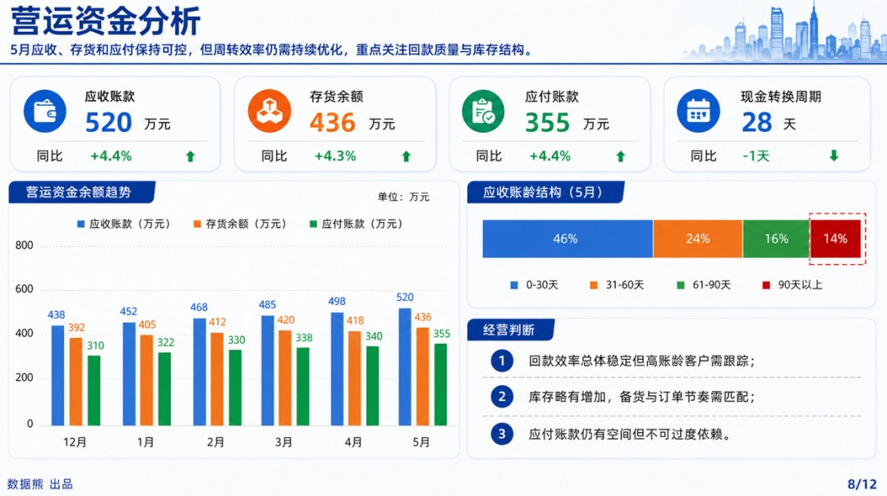

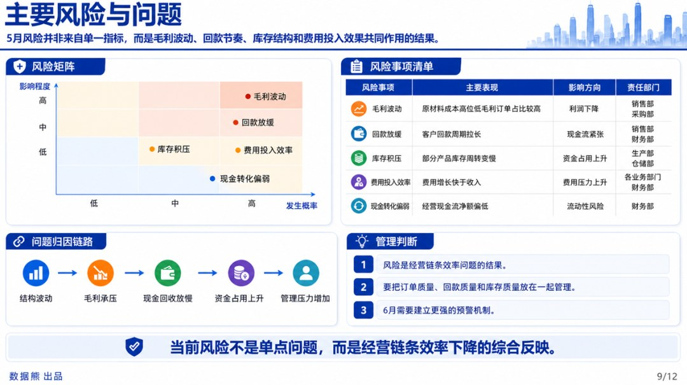

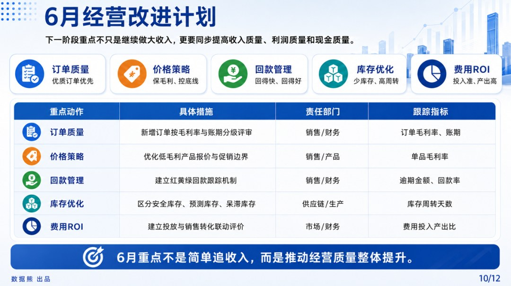

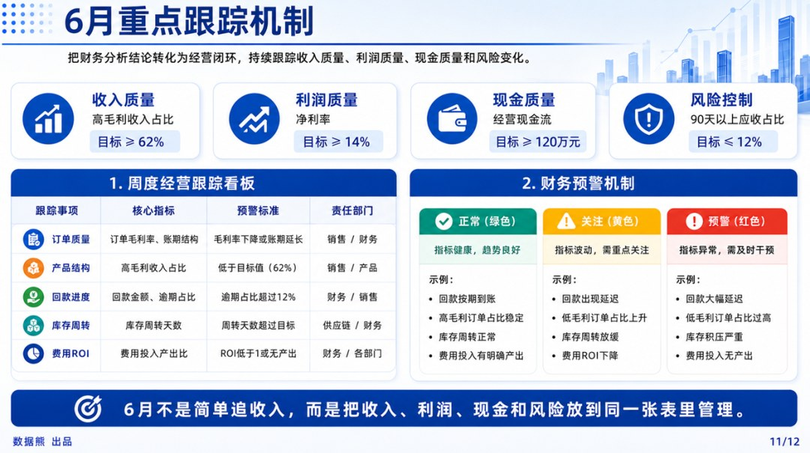

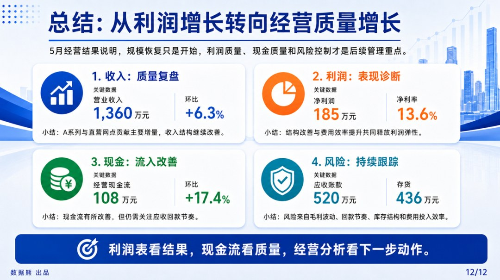
