# 2026年5月费用分析报告

> 来源：微信公众号「数据熊」 · 作者 宋岳清 · 发布于 2026-06-05 09:04  
> 原文链接：http://mp.weixin.qq.com/s?__biz=Mzg2MTg5OTgzNA==&mid=2247499733&idx=1&sn=fbe240c5a2e8af02da7ec36674216a32&chksm=ce12a280f9652b96b4c66b902d3c18dde25ae877291efc5575fa2d906a5481f38777f7bedf0d
> 摘要：你觉得一份费用分析报告，最难写透的是哪一块？

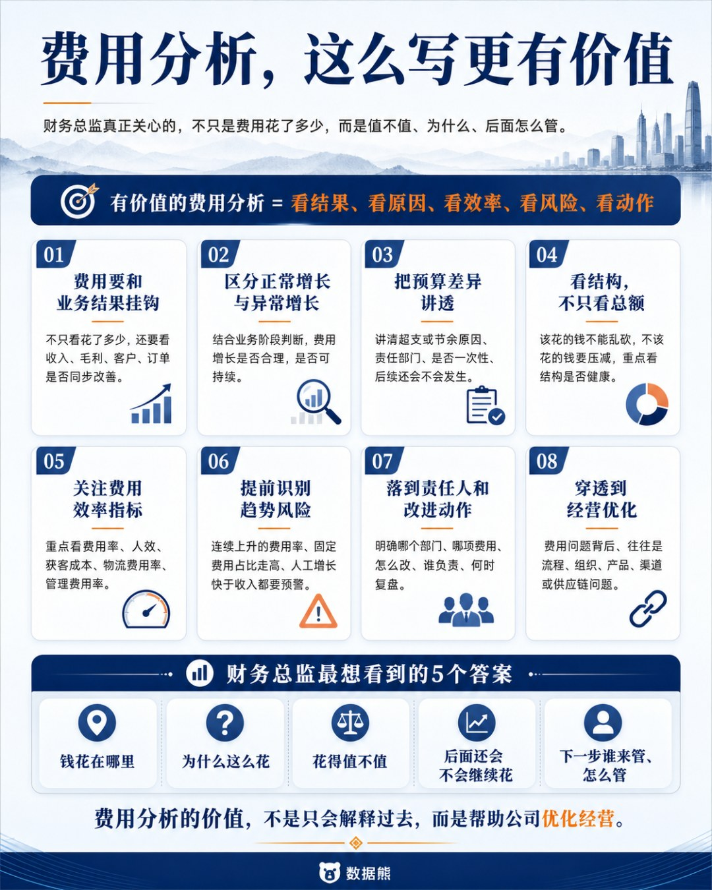

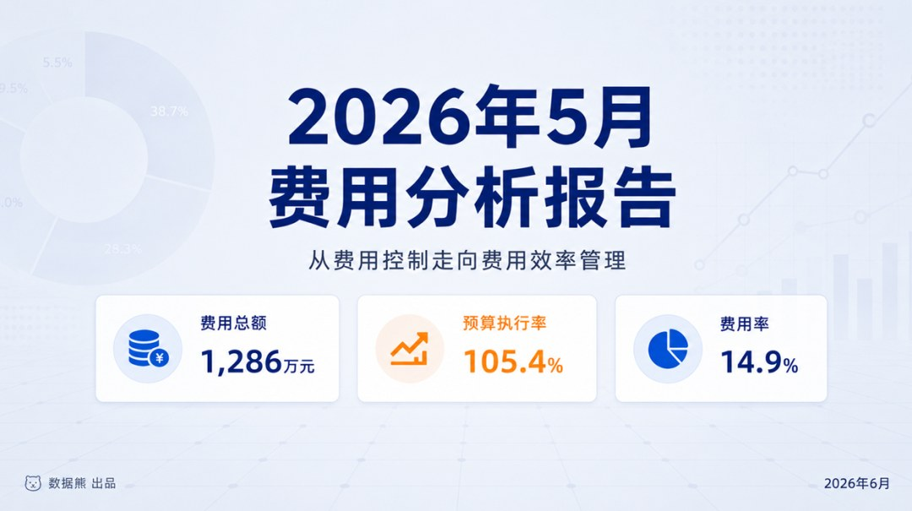

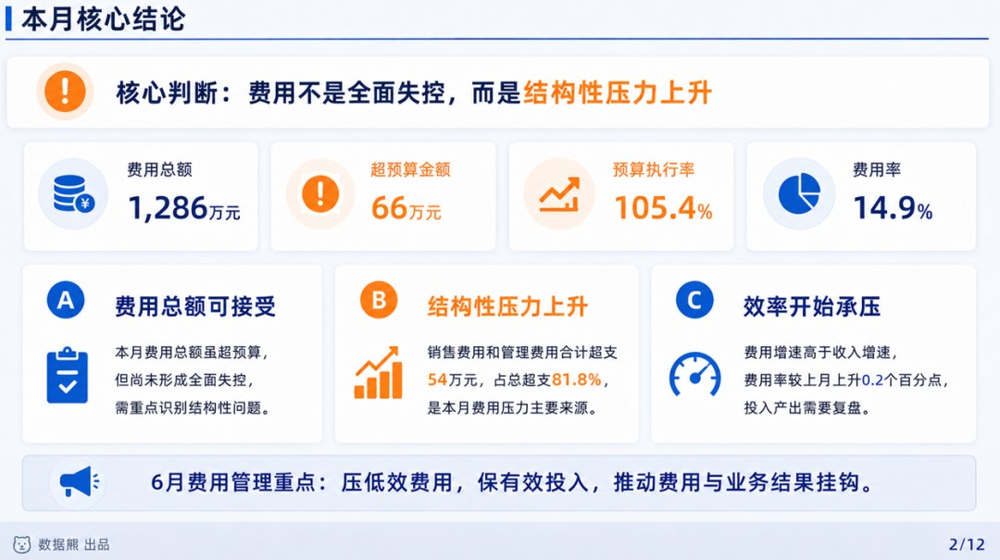

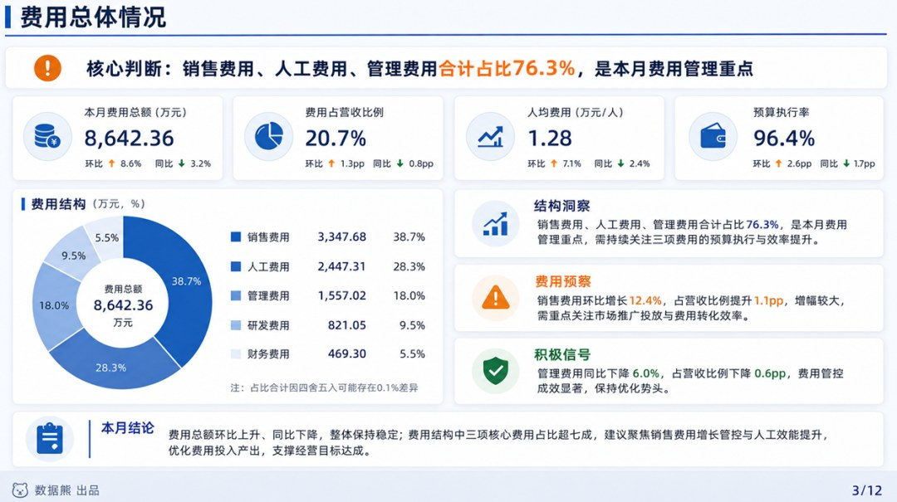

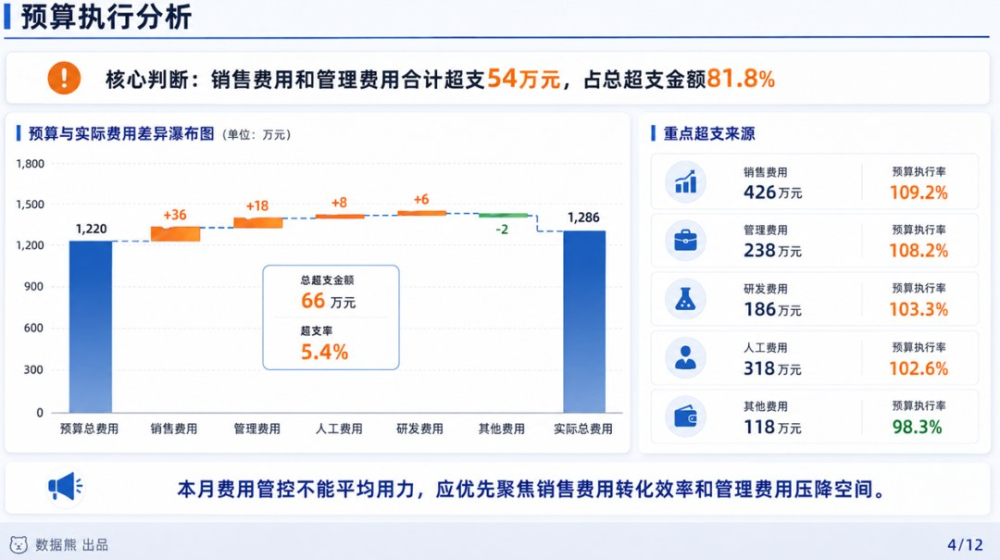

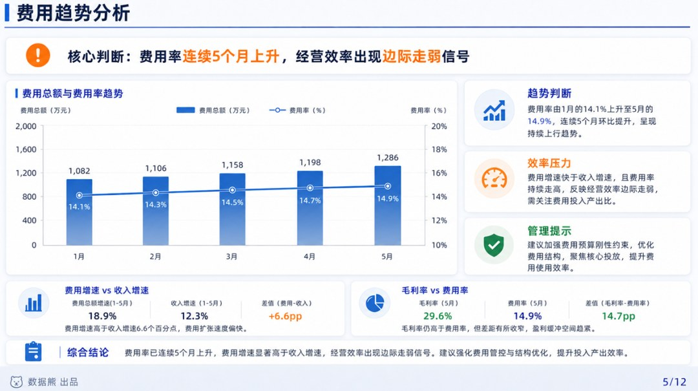

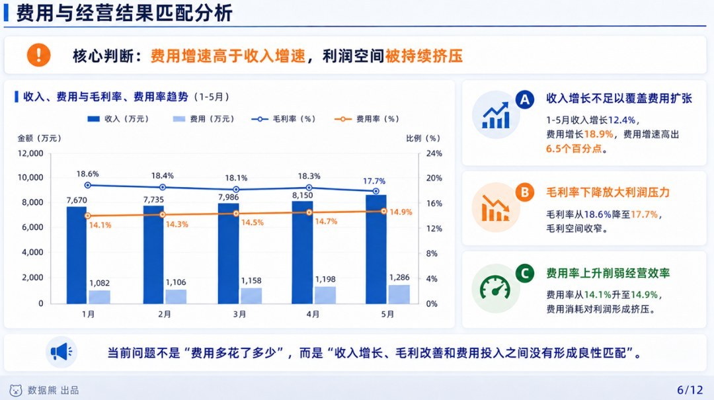

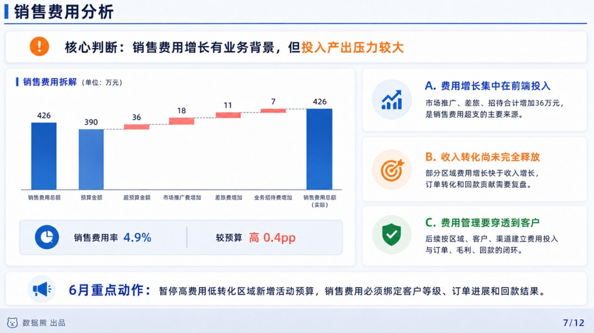

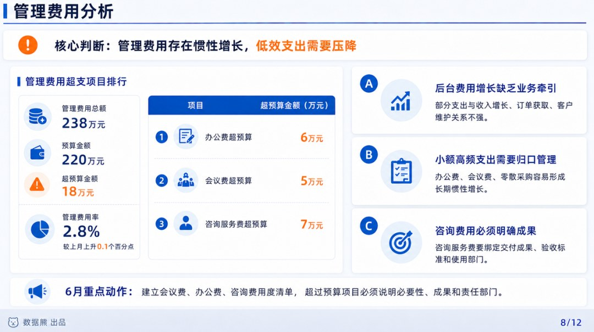

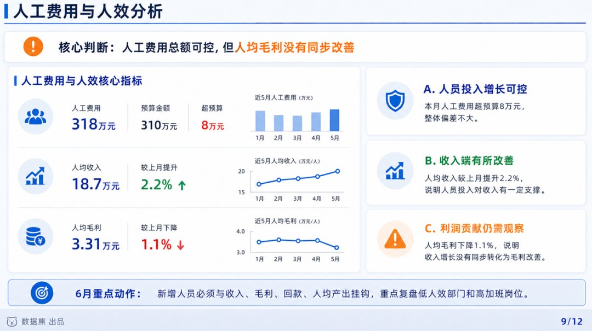

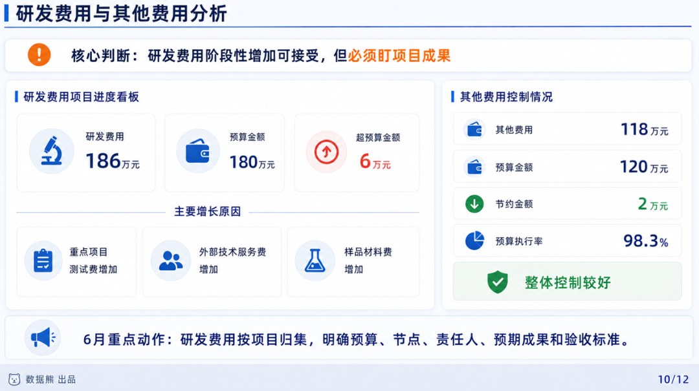

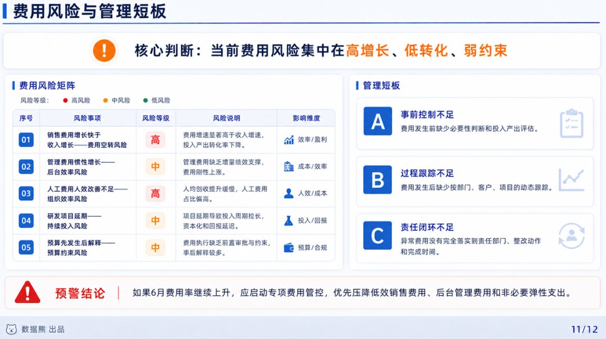

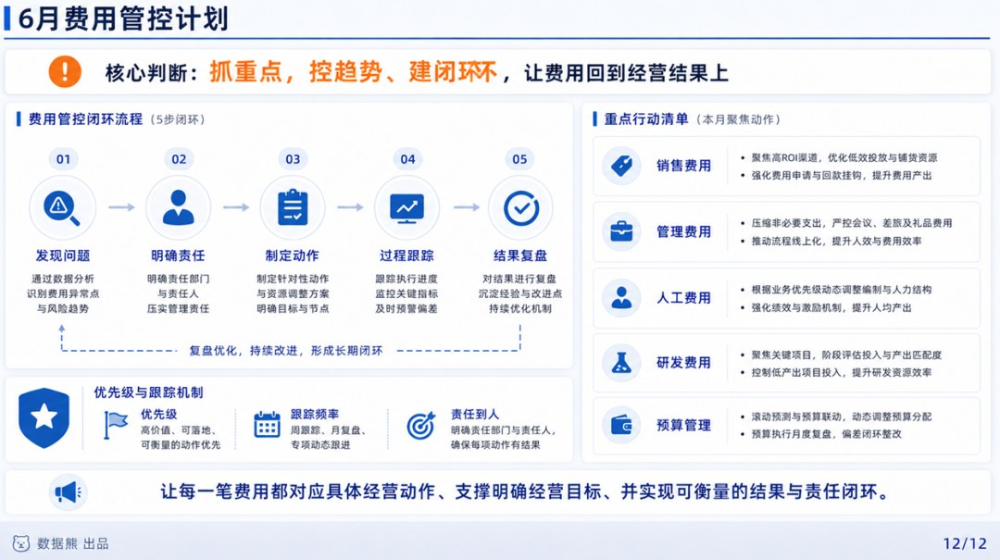

你觉得一份费用分析报告，最难写透的是哪一块？

1. 费用趋势看不清，不知道是短期波动还是长期失控
2. 预算差异说不清，只能写“超预算、低于预算”
3. 费用和业务结果挂不上，老板觉得分析没价值
4. 销售费用、管理费用、人工费用不知道怎么拆
5. 报告最后只会写“加强费用管控”，没有具体动作

你可以在评论区留言一个数字，也可以直接说说你们公司的真实困惑。

如果留言比较集中，后面我会专门写一篇：

《费用分析报告，怎么从流水账写成经营分析》
