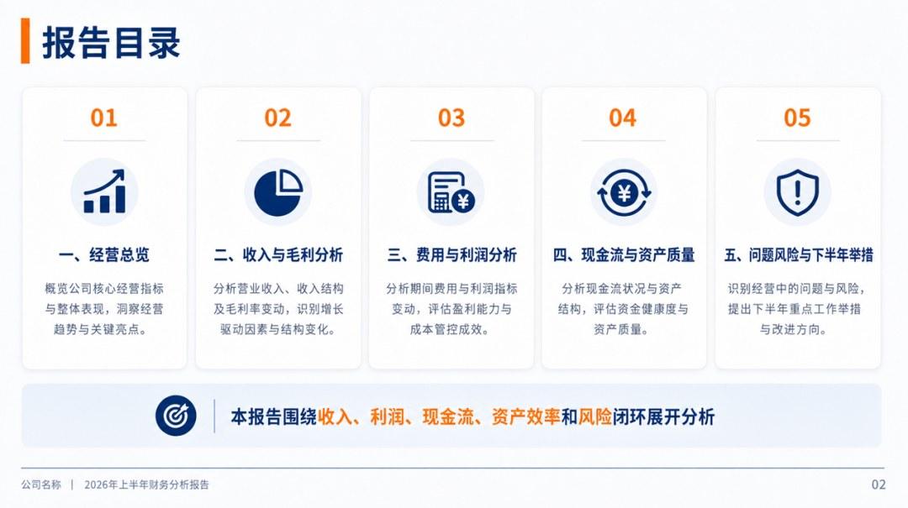
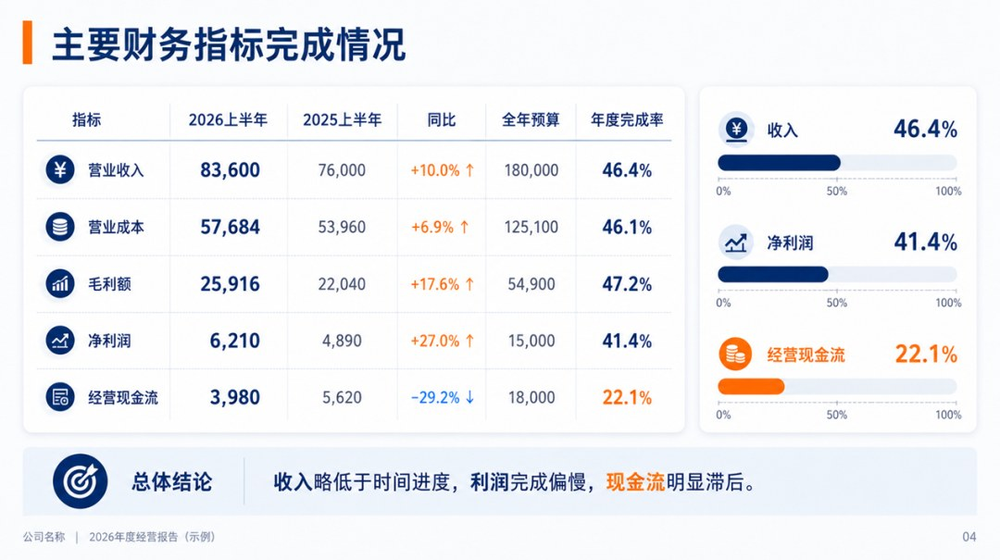
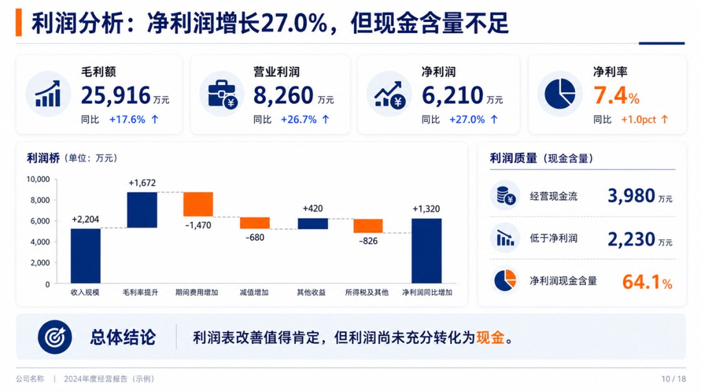
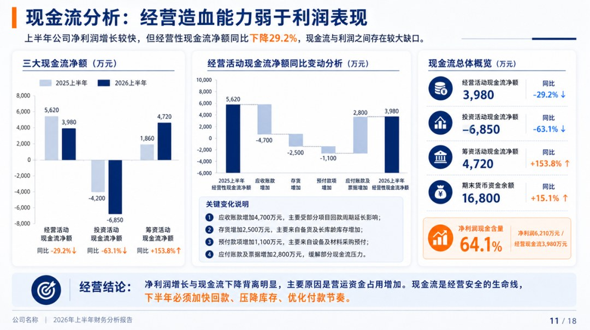
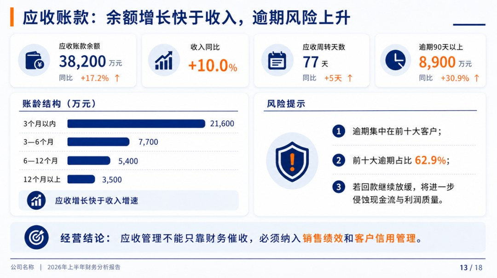

# 2026年上半年财务分析报告

> 来源：微信公众号「数据熊」 · 作者 宋岳清 · 发布于 2026-07-04 08:42  
> 原文链接：http://mp.weixin.qq.com/s?__biz=Mzg2MTg5OTgzNA==&mid=2247500291&idx=1&sn=f664318d73b07189bfd9ef324392b3d0&chksm=ce129f56f9651640a4628cbbca8e5ca8fe39cb0efe123ef572a1cea710023ac27ae389abfaf0

