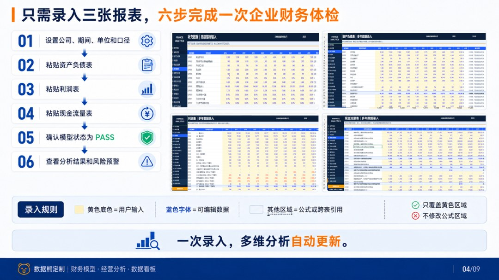
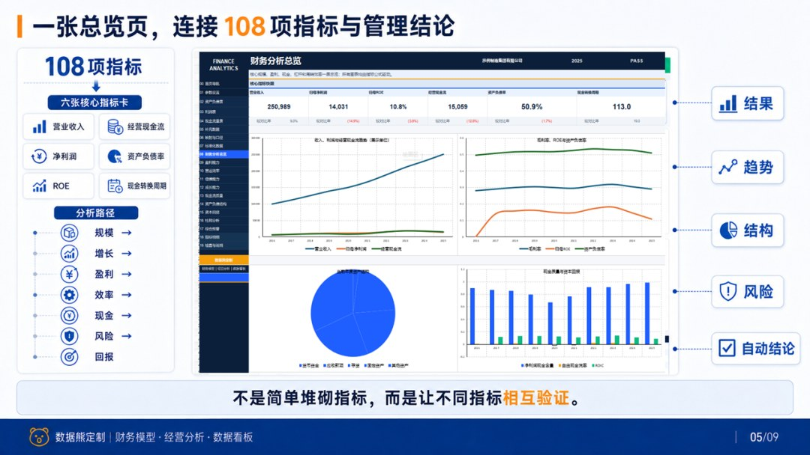
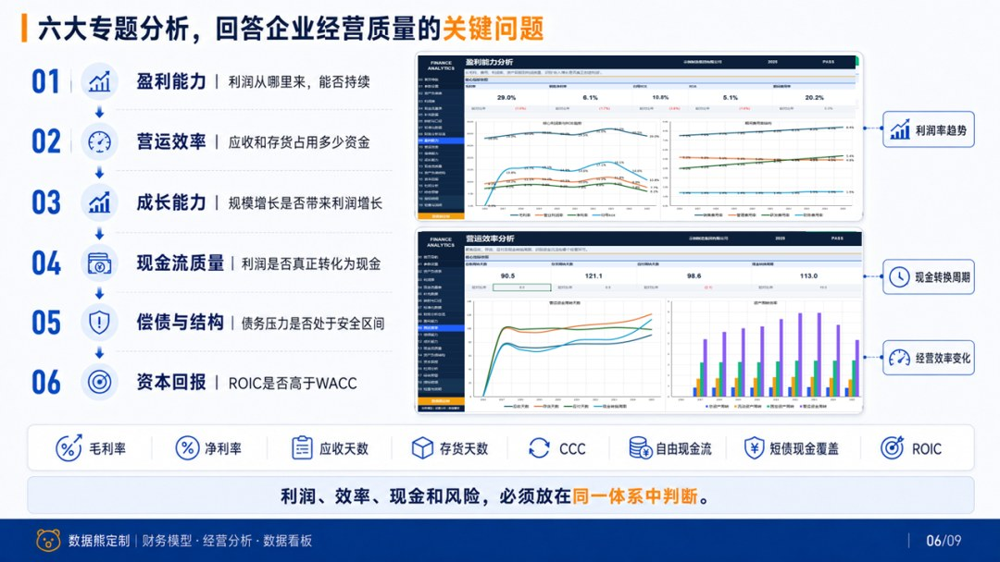
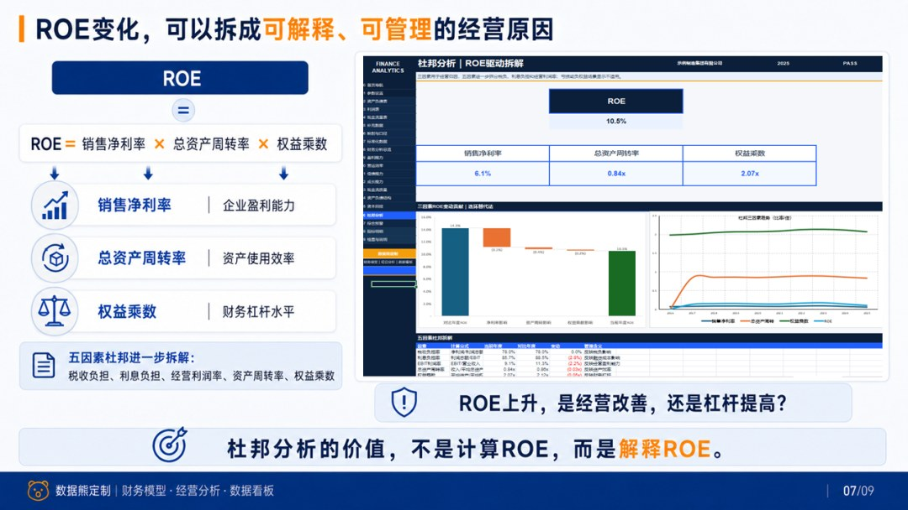

# 多年度财务分析模型.xlsx

> 来源：微信公众号「数据熊」 · 作者 宋岳清 · 发布于 2026-08-03 09:05
> 原文链接：http://mp.weixin.qq.com/s?__biz=Mzg2MTg5OTgzNA==&mid=2247500723&idx=1&sn=a2304ddecd399783e9cefdef945c4cef&chksm=ce129ee6f96517f0162aa8b429bfb855f80e827fda6ccbf603bc8733028fb8459669bc6fc489

