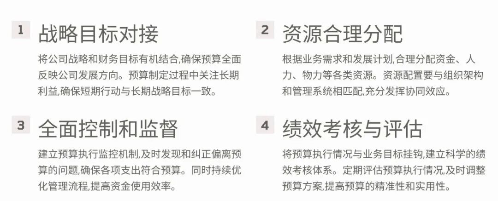

# 全面预算管理的实质

> 来源：微信公众号「数据熊」 · 作者 Data Bear · 发布于 2024-11-03 06:45  
> 原文链接：http://mp.weixin.qq.com/s?__biz=Mzg2MTg5OTgzNA==&mid=2247485140&idx=1&sn=a406f9c312aefca36b30350bc566dea8&chksm=ce115b81f966d297d6f0ef0e434275c3e9973fcaf8b4d8b075f7a91a1a3d88fcfce40a29714f

# 在企业管理中，全面预算管理（Comprehensive Budgeting Management）是一项至关重要的工作。它不仅是企业的“财务指南针”，还是一个推动战略落地、资源合理配置和控制成本的强大工具。今天，我们来解读全面预算管理的实质，帮助大家理解它在企业运作中的核心地位和作用。

一、什么是全面预算管理？

### **全面预算管理可以简单地理解为企业在每个层级、每个部门都建立起预算，并将这些预算有机地结合起来，形成一个覆盖全企业的预算体系。全面预算管理不仅仅是“分配资金”，它是一种将企业战略与各部门业务目标对接的方式，让整个公司在一个清晰的财务规划下共同运转。**

可以这么理解：全面预算管理是企业的“资源调度中心”，确保每一个部门的资源和行动都围绕公司战略目标有序推进。

二、全面预算管理的核心内容：四大要素

### **1. 战略目标对接**

企业的战略目标是全面预算管理的出发点。全面预算管理从企业的年度计划和长期战略出发，将其细化成具体的财务目标，然后再分配到各部门。这就好比一场“合奏”，每个部门是乐器，而全面预算管理则是指挥棒，确保每个部门都为同一个目标“演奏”。

比如，一家电子产品公司若要在新的一年中推出创新产品，研发、生产、营销等部门的预算将会与这一战略方向紧密挂钩。

### **2. 资源分配**

预算管理不仅是钱的分配，更是资源的合理调度。全面预算管理要求企业在制定预算时，考虑如何最大化利用资源，把资金、人员和时间分配到最重要的业务中去。

举个例子，一

家零售企业可能会将更多的预算分配到营销推广中，以刺激销售增长；而同时，也可能削减非核心领域的开支。这样的资源分配可以让企业资源利用率更高，产生最大的效益。

### **3. 控制与监控**

制定预算只是开始，全面预算管理的关键在于执行过程中的控制与监控。通过建立完善的控制机制，企业可以实时跟踪每个部门的预算执行情况，及时发现超支或不足的问题。

比如，在执行过程中，如果市场费用支出偏高，企业可以即时调整，防止预算超出预期。财务部门会定期分析数据，确保每一项开支都符合预算目标，避免不必要的浪费。

### **4. 绩效考核与评估**

全面预算管理的最终目标是实现企业绩效的提升，因此对各部门的预算执行结果进行评估非常重要。通过预算执行情况的评估，企业可以看到各部门的表现，分析每项投入的效果，确保预算花得值得。

例如，一家餐饮连锁公司可以通过预算执行情况，评估哪些门店表现优异、哪些广告策略最有效，并据此做出未来的预算分配优化。

## **三、全面预算管理的优势：连接战略与执行**

1. 使战略落地

全面预算管理的实质在于让战略目标不再停留在纸面上，而是落实到每个部门的实际行动中。它把公司的大目标分解成小目标，并通过预算的方式分配给各部门，使战略成为全员参与的行动计划。

举个例子，某制造业公司希望在未来三年内占领市场份额，为此将增加技术投入，完善生产线。这个战略可以通过研发、生产、营销等部门的预算安排来实现，从而确保各部门朝着同一方向努力。

### **2. 资源合理配置**

全面预算管理可以避免资源分配上的“头重脚轻”，确保公司资源用于最关键的业务上。它帮助企业判断资源的投入产出比，确保资金流向那些真正能带来价值的领域。

比如，一家快消品企业可能会通过全面预算管理，将更多资金投入到新产品研发中，以增加市场竞争力，同时优化库存管理，以减少存货成本。

### **3. 提高财务风险管控**

全面预算管理通过对企业各部门的支出情况进行监控，降低财务风险。预算的约束性可以防止不必要的开支，也让企业在不确定的市场环境中能够更稳健地运行。

比如，企业在预算中会对现金流设置一定的安全范围，如果某个月的收入未达到预算目标，企业会立即采取措施，比如削减非核心开支，防止出现资金链紧张。

## **四、全面预算管理的实施步骤：规划、执行、监控、调整**

### **1. 预算规划**

预算规划是全面预算管理的基础，企业需要根据战略目标制定各部门的预算。规划的核心在于合理预测收入、支出，确定各业务板块的资源需求。财务部门在制定预算时，需与各部门沟通，了解实际需求。

### **2. 预算执行**

各部门需按照既定预算进行执行，确保所有支出在预算范围内，避免不必要的超支。预算执行过程中的管理至关重要，财务部门可以定期检查各项预算的执行情况，确保资源利用高效。

### **3. 预算监控**

预算监控是全面预算管理的“保护网”，企业通过设立监控机制，实时跟踪各部门的支出情况。监控的目的是及时发现问题，比如超出预算、资源浪费等，以便立即调整。

### **4. 预算调整**

市场变化难以预料，企业在预算执行过程中可能遇到各种意外情况。全面预算管理允许企业根据实际情况进行预算调整，确保资源分配始终符合当前的业务需求。

## **五、全面预算管理的最终目标：让企业更具灵活性和抗风险能力**

全面预算管理的实质是提升企业的资源利用效率，确保所有部门都在一个协调一致的框架下工作。它不仅帮助企业将战略落实到具体的业务行动中，也通过过程中的控制和监控，确保企业的财务稳健和资源高效利用。在复杂多变的市场环境中，全面预算管理的优势愈加突出，帮助企业更好地应对变化和风险。

希望这篇文章

能够让你深入理解全面预算管理的本质。无论是管理者还是财务从业人员，掌握全面预算管理都将为企业发展提供强大的保障。

一个热爱数据科学的注册会计师，供职于大型企业总部，关注我，持续分享财务管理及数据分析知识。

经营分析和财务分析：分不清？我来帮你搞明白！

财务和会计有什么区别？——带你了解两个“管钱”的角色

如何通俗的看懂财务三大报表？
