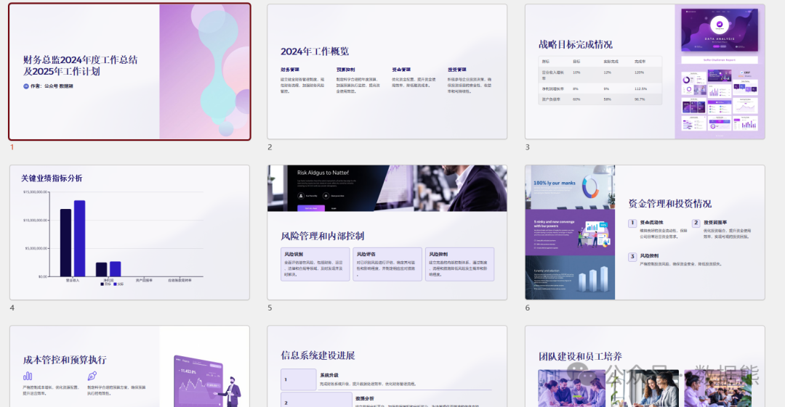

# 财务总监2024年度工作总结及2025年工作计划（经典模板）

> 来源：微信公众号「数据熊」 · 作者 Data Bear · 发布于 2024-12-22 07:00  
> 原文链接：http://mp.weixin.qq.com/s?__biz=Mzg2MTg5OTgzNA==&mid=2247486316&idx=1&sn=1c84bc8b0b590dd134b412e3a1ac911b&chksm=ce115639f966df2f94c131e4e56f6bd418f6af99abd841902e4d4fabc40055b25764f6b2a63a

#### **数据熊为财务伙伴们准备了经典的工作总结及计划模板，文末可领取精美PPT**

#### **一、2024年度工作总结**

2024年，公司进入“高质量发展、持续深化改革”的新阶段，财务管理作为公司战略支持的重要组成部分，始终紧扣集团发展目标，坚持降本增效与风险管控并重，为企业经营目标的实现提供了坚实保障。在董事会的指导下，我带领财务团队在以下方面取得了重要进展：

---

##### **1. 服务公司战略，提升决策支持能力**

- 全年参与XX项重大决策，包括投资项目、并购重组及资本运作等，提供详尽的财务分析与风险评估报告，为决策提供科学依据。
- 完成集团“十四五”规划财务测算工作，为未来业务布局和资金需求规划提供清晰路径。

---

##### **2. 推动降本增效，提升企业竞争力**

- 成功实施精细化成本管控措施，全年节约运营成本XX亿元，费用率同比下降XX%。
- 强化资金管理，融资结构进一步优化，全年融资XX亿元，综合资金成本降低XX个百分点。

---

##### **3. 强化内控与合规，筑牢经营安全防线**

- 全面升级内控体系，覆盖率提升至XX%，并完成XX项重点内控整改，成功通过外部审计和内控评估。
- 税务筹划方面争取优惠政策XX项，全年节约税费XX万元，税务合规率达100%。

---

##### **4. 推进财务数字化转型，赋能高效管理**

- 顺利完成财务数字化第一阶段目标，上线XX财务系统，实现财务数据实时共享与自动化核算，效率提升XX%。
- 开发智能分析平台，完成对集团财务指标的多维动态监测，为高管层决策提供更直观的支持。

---

##### **5. 打造高效团队，提升财务核心能力**

- 完成财务队伍专业化培训XX次，覆盖集团及下属企业财务人员XX人次，团队整体专业能力显著提升。
- 通过绩效管理改革和激励机制优化，激发财务团队的创造力和执行力。

---

#### **二、存在的问题和不足**

1. 数据分析深度与动态监测能力有待进一步提升，尚未完全满足复杂环境下的决策需求。
2. 跨部门协作效率需要加强，特别是在预算调整与执行的联动性上仍有改进空间。

---

#### **三、2025年工作计划**

展望2025年，公司将进入战略转型与业务扩展的重要节点，财务工作将紧扣“高质量发展”和“价值创造”两大主线，重点从以下几个方面展开工作：

---

##### **1. 支持战略升级，强化决策支撑**

- 优化财务决策模型

   开发更加智能化的财务分析模型，为投资决策、并购重组提供精准测算支持。
- 参与重点项目管理

   深度参与XX个战略项目的全流程管理，确保财务资源与业务目标的高效匹配。

---

##### **2. 深化降本增效，优化资源配置**

- 提升资金管理效率

   引入智能资金管理系统，实现资金流动态监控与实时预测，确保资金使用效率提升XX%。
- 推动成本优化

   启动全员成本意识提升项目，计划开展跨部门协作项目XX项，目标全年节约成本XX亿元。

---

##### **3. 强化内控与风控，确保合规稳健**

- 完善内控体系

   持续深化内控覆盖，计划新增覆盖环节XX个，实现100%覆盖关键业务流程。
- 升级风险预警系统

   建立动态财务风险监测机制，重点针对税务合规、资本运营及跨境交易等领域加强管控。

---

##### **4. 推动财务数字化转型，提升智能化水平**

- 数字化转型二期目标

   全面升级XX财务系统，实现预算、报表、资金管理与业务系统的深度整合，提高财务自动化率至XX%。
- 构建实时数据平台

   运用大数据和人工智能技术，实现对集团财务及运营数据的实时分析与可视化展示，为高管层提供更高效的决策支持工具。

---

##### **5. 提升队伍素质，打造财务精英团队**

- 深化专业能力培养

   计划全年开展专业技能培训XX场次，涵盖高级数据分析、国际税务筹划、资本运营等重点领域。
- 实施绩效提升计划

   完善薪酬激励机制和人才梯队建设计划，激发团队活力，打造更加专业化、国际化的财务管理团队。

---

#### **四、目标与预期成果**

- 经营目标
   ：支持公司实现营收同比增长XX%，利润率提升XX个百分点。
- 管理目标
   ：实现内控覆盖率100%，融资成本下降XX%，预算偏差率控制在XX%以内。
- 数字化目标
   ：完成财务系统二期建设，实现财务自动化率XX%，提升工作效率XX%。

---

#### **五、总结与展望**

2024年，财务工作在降本增效、融资支持、内控优化与数字化转型等方面取得了显著成效，但在适应复杂经营环境方面仍有提升空间。2025年，我将继续带领财务团队，聚焦高质量发展，深化财务管理改革，为公司实现战略目标贡献更大价值。

点赞、转发是最大的支持，关注数据熊，私信领取上图ppt模板。
