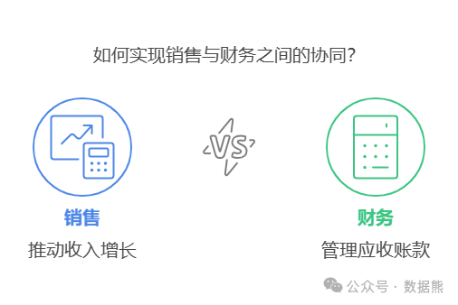

# 业务拼命卖，财务焦虑收：如何破解应收账款协同难题？

> 来源：微信公众号「数据熊」 · 作者 Data Bear · 发布于 2025-01-09 07:00
> 原文链接：http://mp.weixin.qq.com/s?__biz=Mzg2MTg5OTgzNA==&mid=2247486467&idx=1&sn=cda85e80c398ef609fecd80051a671fe&chksm=ce115156f966d8402750aeb2e04759cdfa4183c3700118e7db090f70d1a2dd82941dd3729d32
> 摘要：收账的路很难，但业务和财务携手同行，就能走得远！

在很多公司，业务和财务的关系像极了一对“塑料兄弟”：

- 业务部门
   ：甩开膀子冲业绩，大单小单全都接，客户说“赊账？”——“没问题，签了再说！”
- 财务部门
   ：捂紧小金库焦虑催收，“又赊了？账谁来收？”

结果呢？业务冲业绩，财务“背黑锅”，老板一看账本：账面是“赚钱”，口袋却空

空如也。

今天，我们就来聊聊这个“跨部门拉锯战”，如何从“对立”变“协同”，让应收账款真正实现“应收尽收”。

---

### **那些年，业务和财务互相吐槽的经典台词**

- 业务吐槽财务
   ：

   “你们财务怎么这么不懂客户啊！赊销是战略，客户关系比钱重要！”
- 财务吐槽业务
   ：

   “你们业务只管签单，管过钱回不回来吗？就知道扔给我们财务擦屁股！”

有没有觉得耳熟？这简直是每周例会的标配戏码。问题根源在于：
两部门的KPI冲突严重
。

- 业务KPI
   ：销售额、签单数；
- 财务KPI
   ：现金流、回款率；

这就像老公拼命踩油门（业务要增长），老婆拼命含慢点慢点（财务要控风险）。
这能不矛盾吗？

---

### **如何破解应收账款协同的难题？**

#### **1. 拉通数据，消灭“信息黑洞”**

业务和财务的矛盾，有一半是“信息不同步”造成的。

举个例子，客户已经连续两次逾期了，财务正打算“限制授信”；结果业务刚签了个50万的赊销订单……信息滞后，就像一场灾难。

解决办法
：

- 建立
   统一的应收账款管理平台
   ，让业务和财务共享数据。
- 客户信用档案
   ：记录客户的信用评分、付款历史和逾期情况，让业务部门心里有数。
- 实时监控指标
   ：比如逾期率、账龄分布等，财务和业务都能随时看到，谁也别玩“蒙的”。

> 就像家庭账本，老婆不能只看“收入”，老公不能只管“花销”，大家得有个“总账”！

---

#### **2. KPI绑在一根绳上，才有动力往一处拉**

业务只管签单，财务只管催款，这不叫协同，叫“推锅”。要解决这个问题，就得让大家有“共同利益”。

具体做法
：

- 在业务KPI里加上“回款率”“逾期率”等指标。比如：

   “你的单签得再多，逾期账款超标？提成打八折！”
- 在财务KPI里加入“支持销售增长”的指标，别只盯着风险，把业务憋坏了也不行。

> 这是在告诉业务，“签单不是你一个人的事，收钱我们一起加油！”

---

#### **3. 赊销可以做，客户得分级**

很多公司出事，都是因为对客户的信用没底数。
赊销可以做，但不是谁都能赊！

具体做法
：

- 客户信用评分
   ：用客户的付款历史、财务状况、行业口碑来打分，按分数设定授信额度。
- 动态调整
   ：表现好的客户，信用额度可以升；表现差的，坚决减。
- 分级管理
   ：把客户分成A、B、C三类：

> 客户分级就像追星，A类是“墙头粉”，B类是“理智粉”，C类是“黑粉”，资源要投给对的人。

---

### **小故事：业务与财务“修复关系”**

某家制造企业，曾因为业务“冲动签单”搞得财务焦头烂额。

- 问题
   ：账期长达150天，逾期率超过20%。
- 改革
   ：

结果
：

- 周转天数从150天降到80天；
- 逾期率降到5%。

   业务和财务不仅“和解”了，还一起在年会上领了“最佳团队奖”。

---

### **写在最后**

业务和财务的关系，就像夫妻过日子：
沟通不畅、目标不一致，只能天天吵架；而目标一致、步调一致，才能共创美好生活。

所以，别让“应收账款”成为你们之间的绊脚石！

点赞和转发就是最大的支持，关注数据熊，工作更轻松。
