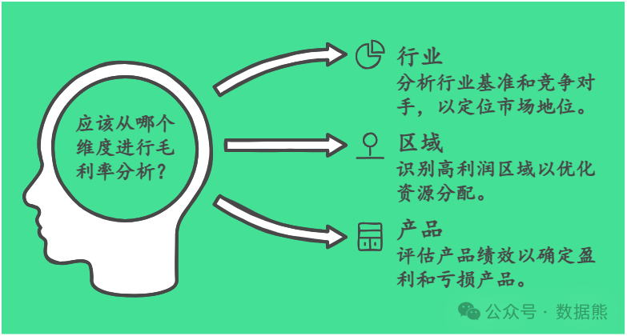
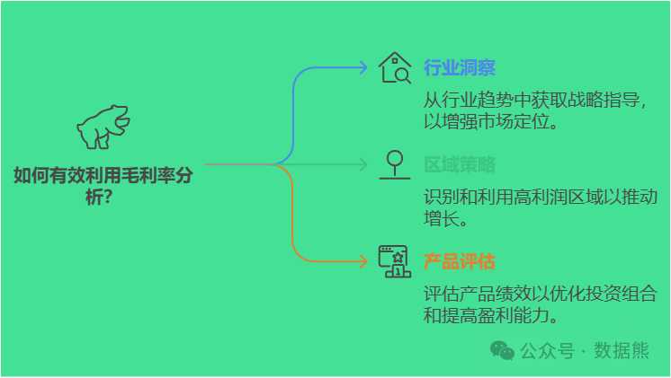

# 毛利率分析的三个维度：行业、区域和产品

> 来源：微信公众号「数据熊」 · 作者 Data Bear · 发布于 2025-01-10 07:00  
> 原文链接：http://mp.weixin.qq.com/s?__biz=Mzg2MTg5OTgzNA==&mid=2247486474&idx=1&sn=f4cb3f9632ed6e0390c88de531989802&chksm=ce11515ff966d84928e916a7eb5b81f43d39616a2e08f0ea7677f9d33d01050905e770f4392b
> 摘要：数据是最好的导师，分析是最优的工具，洞察是最大的力量！

### 大家好，我是数据熊，一名财务分析老司机。今天我们聊聊一个听起来高深但其实很接地气的话题——**毛利率分析**。

毛利率是企业经营的重要指标，就像是体检中的血压，能快速反映出公司健康状况。那么，怎么才能看透毛利率背后的真相呢？今天，我就带大家从
行业、区域和产品
三个维度来拆解毛利率分析。

---

#### **一、行业维度：定位你的江湖地位**

首先，我们得搞清楚行业里的毛利率水平是高是低。为什么？因为你得知道你的江湖地位！

- 行业均值对标
   ：拿自己的毛利率和行业均值一对比，是高人一筹还是拖后腿，一目了然。★ 比如，快消品行业的毛利率一般在20%-30%，如果你家还不到10%，那可得小心了。
- 行业周期性
   ：有些行业天生毛利率就低，比如零售业，但胜在规模；而有些行业，比如医药，毛利率高，但周期性波动大。
- 对标同行优秀企业
   ：除了行业均值，优秀企业的毛利率更有参考价值。多研究标杆企业的财报，看看人家毛利率高的原因，是成本控制到位还是议价能力强？

> 小提示
> ：别忘了动态看行业变化，比如新技术、新模式可能会冲击原有毛利率。

#### **二、区域维度：找到利润的增长极**

说完行业，再来看区域。

很多企业毛利率差异大，是因为不同区域的市场环境不一样。拿中国市场来说，东部和西部的消费水平、成本结构差距就很大。

- 区域毛利率分析
   ：
- 区域间的资源调配
   ：通过毛利率分析，你可以更科学地进行资源分配。比如，把广告预算、销售资源多投放到毛利率高的区域。
- 潜力市场挖掘
   ：毛利率低的区域，不一定没有机会。搞清楚原因后，通过调整策略，比如优化渠道、推出本地化产品，也许能让毛利率起飞。

> 案例分享
> ：某零售企业发现华东地区毛利率高但增长缓慢，而西南地区毛利率低但市场潜力大。通过优化供应链和增加本地化促销，成功提高了西南地区的毛利率。

#### **三、产品维度：搞清楚谁在赚钱，谁在拖后腿**

最后，也是最重要的——产品。企业的毛利率最终是由产品决定的。只有知道哪个产品在赚钱，哪个在拖后腿，你才能有的放矢。

- 产品分组分析
   ：
- 优化产品组合
   ：
- 毛利率驱动因素
   ：拆解影响毛利率的关键因素：

> 案例延伸
> ：某科技公司通过改进产品设计，将一款主打产品的生产成本降低了15%，同时因功能提升价格上涨了10%，毛利率由45%上升到55%。

> 小技巧
> ：用Power BI建立动态产品毛利率分析报表，一键生成高低毛利率产品列表，效率满分！

#### **结语**

毛利率分析并不只是财务部的事，它能帮公司在经营决策上看清方向。无论是从行业的高度、区域的深度，还是产品的颗粒度，搞清楚这些数据，你就是企业的价值放大器！

点赞和转发是最大的支持，关注数据熊，工作更轻松。
