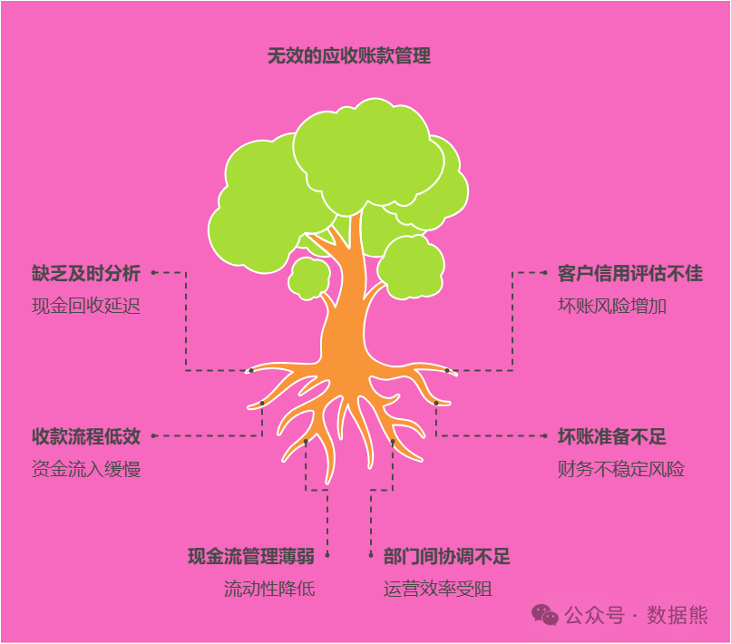
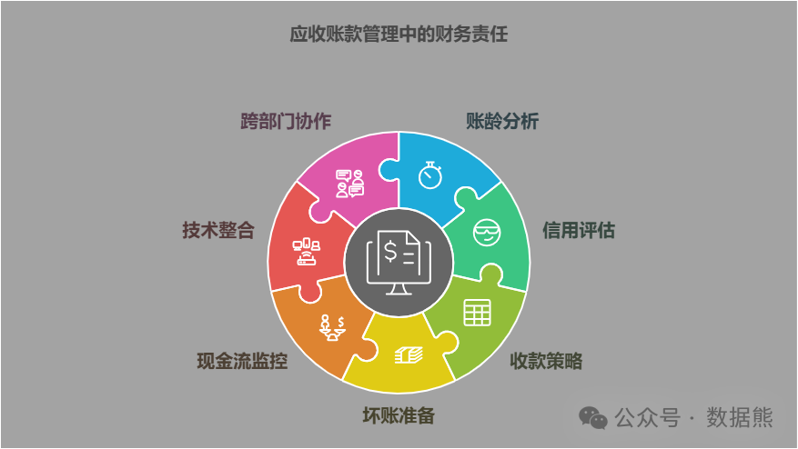

# 应收账款管理，财务部门应该承担哪些责任？

> 来源：微信公众号「数据熊」 · 作者 Data Bear · 发布于 2025-01-12 14:14
> 原文链接：http://mp.weixin.qq.com/s?__biz=Mzg2MTg5OTgzNA==&mid=2247486505&idx=1&sn=4822f84adec6e01d043f1da7c08df9b5&chksm=ce11517cf966d86a5a469f78cd6a93ca069ef9693817592cb192f51c03be8a51ef5d4bf95942
> 摘要：管理得当的每一笔账款，都是企业成功的基石。

应收账款作为企业的流动资产，直接影响着公司的资金周转和经营健康。对财务部门来说，如何高效管理应收账款，不仅关乎企业的现金流，还能确保资金安全与经营效率。那么，财务部门在应收账款管理中到底应该承担哪些责任呢？今天我们就来梳理一下这一关键问题。

---

#### 1. **账龄分析与管理：确保账款及时回收**

财务部门需要定期进行应收账款的账龄分析，及时识别出逾期账款。账龄分析可以帮助判断哪些账款已经到期，哪些账款存在坏账风险，从而为下一步的催收工作提供数据支持。财务部门要根据账龄分析结果，采取不同的催收策略，确保账款及时回笼。

责任表现：

- 定期进行账龄分析，按照账龄段（如30天、60天、90天等）划分账款。
- 对逾期账款进行特别关注，采取针对性的催收手段。
- 通过数据分析预测哪些账款可能成为坏账，并提前采取应对措施。

---

#### **2. 客户信用管理：减少坏账风险**

财务部门需要与销售部门合作，对客户的信用状况进行评估。合理的信用管理不仅能保障企业资金的安全，还能减少坏账的风险。财务部门要根据客户的信用评级和过往交易记录，设定相应的信用额度，避免过度放贷带来坏账风险。

责任表现：

- 对新客户进行信用评估，根据客户的信用状况设定信用额度。
- 对现有客户进行定期复审，及时调整信用政策。
- 在客户出现支付困难时，及时调整信用额度，避免增加债务风险。

---

#### **3. 账款催收：确保资金回流**

一旦应收账款逾期，财务部门需要及时启动催收流程。这不仅仅是简单的电话催促，更需要通过邮件、催款函，甚至法律途径进行催收。财务部门要确保催收工作高效进行，防止账款变成坏账。

注意：这里的催收有两层含义，首先是财务催业务，业务直接对接客户，有的企业是业务部门的财务BP负责日常催收；其次是业务催款失败就是正式的法律催收。之前的文章被很多人喷，这只是愤慨，实际操作中，业务部门专注于业务，很多杂活是扔给财务的，现状如此。很多小贷公司，还有专门的催收部门。

责任表现：

- 建立规范的催收流程，从友好提醒到正式催款步骤清晰。
- 在逾期账款达到一定时间后，启动后续的法律手段或第三方催收。
- 及时跟进催收进展，确保没有漏账或重复催收的情况。

---

#### **4. 坏账准备：预留资金风险**

财务部门需要根据应收账款的回收情况，合理计提坏账准备。这不仅是为了应对潜在的坏账风险，还能准确反映公司财务状况。坏账准备的合理计提能够提前对可能的损失进行缓解，保障企业财务的稳定。

责任表现：

- 根据账龄分析和客户信用评估情况，及时调整坏账准备。
- 定期评估坏账准备的充足性，确保企业的财务报表准确反映实际风险。
- 在发生坏账损失时，及时做账务处理，防止影响财务报表的真实呈现。

---

#### **5. 资金调度与现金流管理：保持资金流动性**

应收账款直接影响着企业的现金流。财务部门不仅要确保账款的及时回收，还要根据回收情况进行资金调度，确保公司在运营过程中保持充足的现金流。资金流的有效管理能够避免资金短缺，确保企业顺利开展各项业务。

责任表现：

- 根据回款情况，动态调整资金调度计划，确保资金流动性。
- 配合销售部门和采购部门了解客户的支付周期，提前预测资金需求。
- 在应收账款回收困难时，寻找合适的融资渠道，如应收账款融资等。

---

#### **6. 信息化管理：提高管理效率**

随着信息技术的发展，财务部门应当利用现代化的财务管理软件和ERP系统来管理应收账款。通过系统自动化管理，应收账款的状态、账龄、催收进度等信息都能实时监控，极大提升管理效率，减少人工操作的误差。

责任表现：

- 引入信息化管理工具，实时监控应收账款的动态变化。
- 通过系统生成报表和数据分析，快速发现潜在的风险。
- 确保数据的准确性和实时性，支持财务决策和催收工作。

---

#### **7. 跨部门协调与沟通：确保协作顺畅**

应收账款管理涉及多个部门的协作，尤其是财务、销售和客户服务等部门。财务部门需要与销售部门及时沟通，了解客户的付款计划和潜在风险，并根据需要调整信用政策。此外，财务部门还需要与客户服务部门合作，帮助解决客户可能遇到的付款问题。

责任表现：

- 与销售部门和客户服务部门保持密切沟通，共享客户付款信息。
- 协调各部门共同解决客户付款问题，确保应收账款的顺利回收。
- 在客户存在支付困难时，配合销售部门进行协商，寻找合适的解决方案。

### **结语**

应收账款管理是财务部门的一项核心职责，不仅关系到企业的资金周转和现金流，更影响到公司的财务健康。财务部门通过做好账龄分析、客户信用管理、催收工作、坏账准备、资金调度等方面的责任，能够有效降低坏账风险，提高资金使用效率，从而为企业的稳健发展保驾护航。

点赞和转发是最大的支持，关注数据熊，工作更轻松。
