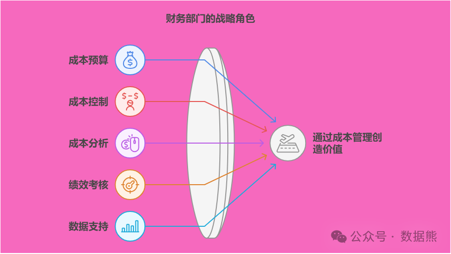
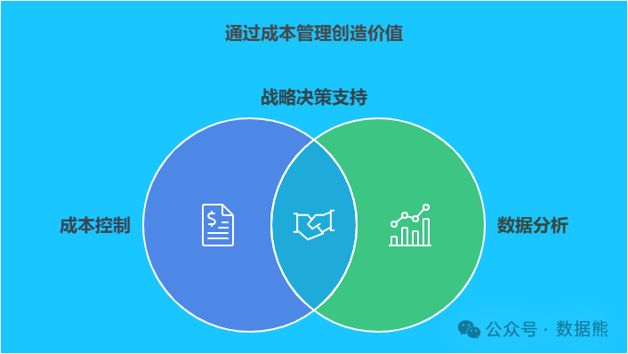

# 财务部如何通过成本管理为企业创造价值？

> 来源：微信公众号「数据熊」 · 作者 Data Bear · 发布于 2025-01-12 07:00  
> 原文链接：http://mp.weixin.qq.com/s?__biz=Mzg2MTg5OTgzNA==&mid=2247486496&idx=1&sn=b884df690253f4d2c8d10dde9989bcaa&chksm=ce115175f966d8635f85d55693c48029c20cc1c4ba84f103d6d20aaa9e56ba8a41432f9d9cca
> 摘要：成本管理不只关乎数字，更关乎如何为企业创造更大的价值！

大家都知道，企业要想盈利，除了销售收入外，成本管理可是一个“关键”的环节。很多企业的财务部门，除了日常的账务处理外，还肩负着一个重要任务——
成本管理
。那么，财务部门如何通过成本管理为企业创造更大的价值呢？让我们一起聊聊这个话题。

#### **一、成本管理的重要性：削减无效支出，提升盈利空间**

在日常运营中，企业的成本支出可以来自多个方面，比如生产成本、管理成本、销售费用等。而控制成本，不仅能帮助企业在收入不变的情况下提高盈利，还能让企业更具市场竞争力。

举个例子：

假设你是一个开餐厅的老板，菜单上有一道高毛利的招牌菜——
招牌红烧肉
。但由于食材浪费、员工操作不规范等原因，导致这道菜的成本不断攀升。你可能并没有意识到，自己正花费了太多的资源在这道菜上，反而影响了整体的盈利。

这时候，财务部门就要发挥作用了。通过对成本的精确分析，财务能够帮助餐厅管理层找出浪费点，减少不必要的开支，从而提升餐厅的整体利润。这就是财务部门通过成本管理为企业创造价值的一个典型例子。

#### **二、财务部如何进行有效的成本管理？**

想要通过成本管理创造价值，财务部需要具备一定的技能和方法。下面，我们就来看看财务部门如何通过几个简单有效的方式进行成本管控。

##### **1. 成本预算与成本控制：提前规划，防止过度支出**

财务部门要做的第一步，就是为公司设定合理的
成本预算
。这就像你个人理财时，会设定一个月的花销上限一样，企业也需要对每个部门的支出进行控制，确保成本不超支。

怎么做呢？

- 根据历史数据和市场状况，财务部门可以帮助各个部门制定合理的预算。例如，生产部门每月的原材料采购预算，营销部门的广告费用预算等等。
- 定期监控实际支出与预算的差距，发现问题及时调整。比如发现营销部门的广告费超过了预算，那么就要分析原因，是否是广告效果不好，或者是投入过多。

通过成本预算和控制，企业可以避免过度支出，并确保每一笔花销都符合公司的整体战略目标。

##### **2. 成本分析：找出隐性浪费，精准切割**

很多时候，企业的成本不只是显而易见的，比如员工工资、原材料采购等，更多的是隐性成本，比如过度库存、生产线的空闲时间等。

怎么做？

- 通过对各项成本的详细分析，发现那些不必要的浪费。例如，通过对供应链的成本分析，发现原材料采购频繁，但每次采购量较少，导致了较高的单次采购费用和运输费用。
- 通过对不同部门的运营数据分析，找到那些冗余的费用，及时纠正，比如多余的管理层级、过度的销售激励等。

通过成本分析，财务部门能够帮助企业发现潜在的浪费，优化各项支出，从而提高整体的利润空间。

##### **3. 绩效考核：通过成本控制激励各部门**

为了让每个部门都参与到成本管理中，财务部门可以根据各部门的成本控制情况，制定相应的绩效考核制度。

怎么做？

- 通过设立部门成本控制指标，让每个部门明确自己的成本管控责任。例如，生产部门可以根据单位产品成本控制来设定绩效，销售部门则可以根据“销售费用占比”来进行考核。
- 对于表现优秀的部门，给予适当的奖励；而对没有按预算执行的部门，可以提出改进建议，甚至采取措施进行调整。

通过绩效考核，能激励各部门主动参与到成本控制中，提高整体的运营效率。

##### **4. 提供数据支持：通过数据让决策更科学**

现代企业中的决策越来越依赖于数据，财务部门可以通过数据分析，提供更加科学的成本管理建议。

怎么做？

- 利用财务系统，定期生成详细的成本报表和分析报告。比如，制作各类成本的同比、环比分析，帮助管理层实时了解成本变化趋势。
- 利用大数据技术，对供应商、生产工艺、产品销售等环节的数据进行深入分析，找出最优的成本控制方式。

通过数据支持，管理层能做出更有根据的决策，避免盲目决策导致的成本过高。

#### **三、财务部通过成本管理为企业创造价值的案例**

案例一：某制造企业的成本管控

某制造企业的财务部门在对其生产成本进行分析时，发现原材料的采购成本较高，而且库存管理不当，造成了大量的浪费。经过财务部门的介入和分析，他们建议改进采购策略，减少库存量，并与供应商谈判以降低原材料的价格。

结果：

通过这一系列的措施，企业的生产成本降低了15%，直接提高了公司的毛利率。数据熊在一家汽车零部件企业做内审的时候通过数据分析发现某工厂的污水处理费用占比明显高于其他工厂，进一步分析发现是化学药剂使用比例不合理导致浪费，每年就为公司节省500万。

案例二：某零售企业的营销费用优化

某零售企业的财务部门发现，尽管营销投入不断增加，但广告效果并不明显。财务部门通过对广告投放渠道的分析，发现有些渠道的转化率低，投入产出不成正比。

结果：

财务部门建议减少低效广告渠道的投入，增加对高效渠道的预算，最终优化了营销费用的支出，提升了广告投入的回报率。数据熊就有自己做过的案例，有兴趣的可以交流。

#### **四、总结：成本管理是财务部的“必修课”**

通过成本管理，财务部门不仅能帮助企业控制支出，提升利润，还能通过精准的数据分析，提供管理决策支持，为企业创造更大的价值。财务部门的工作，不仅仅是“看账”这么简单，更是企业战略实施中的“无形力量”。

点赞和转发是最大的支持，关注数据熊，工作更轻松。
