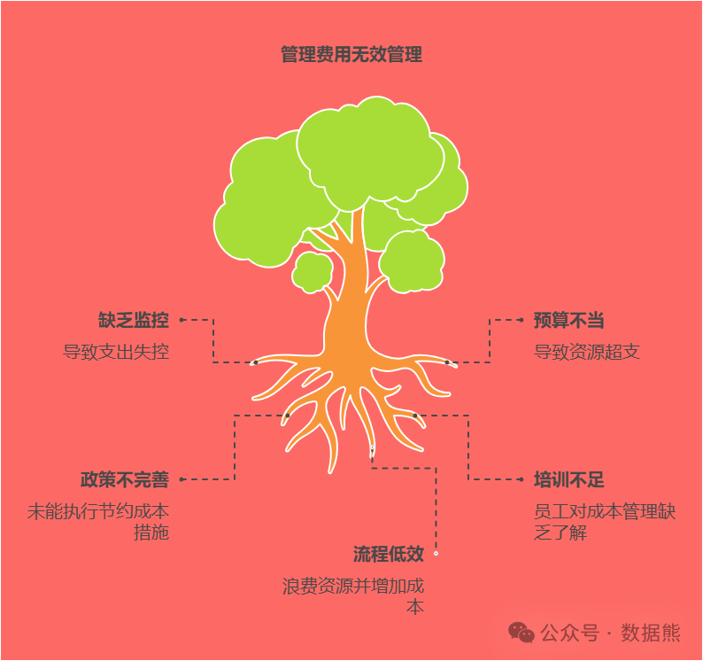
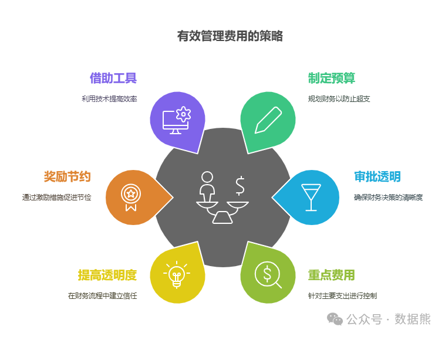
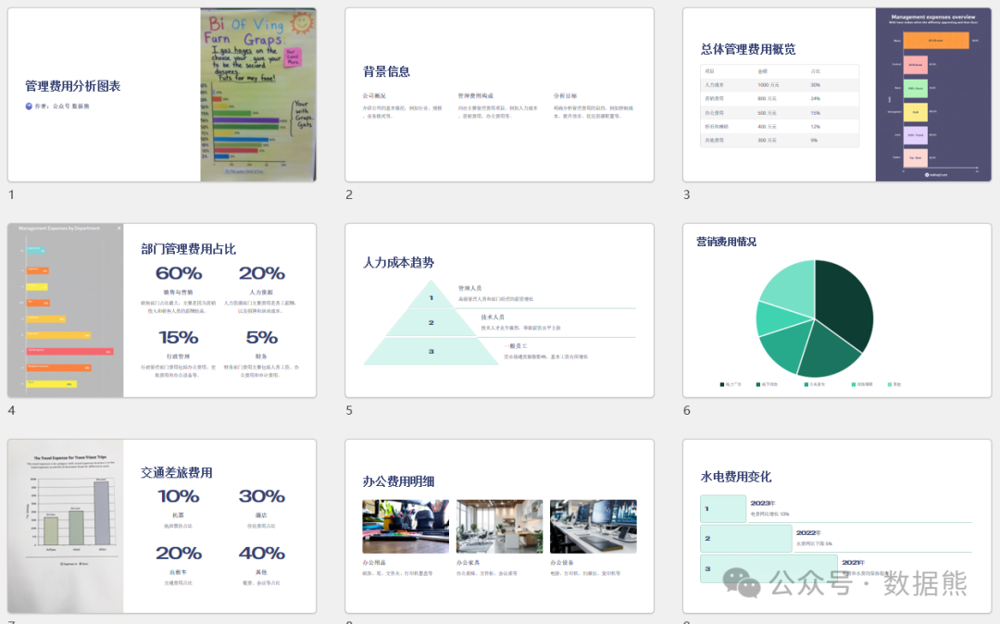
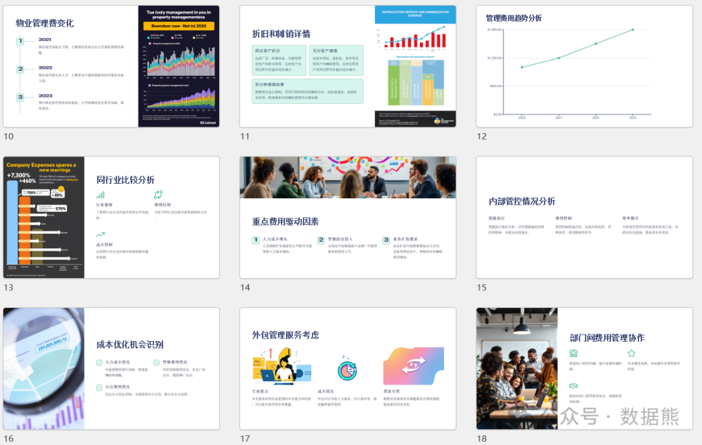

# 管理费用管控，关键要做好这几点

> 来源：微信公众号「数据熊」 · 作者 Data Bear · 发布于 2025-01-13 07:00  
> 原文链接：http://mp.weixin.qq.com/s?__biz=Mzg2MTg5OTgzNA==&mid=2247486525&idx=1&sn=a90f6a159b32b75ba2bbe950ef70aae3&chksm=ce115168f966d87eea676491b25791c26d7b5f7cc8dd2465531887e1969fd85d10b92c9903e6
> 摘要：合理管控管理费用，不是压缩，而是优化。

在任何企业里，管理费用是不可避免的支出，比如员工工资、办公费用、差旅费等等。如果这些费用不加以控制，可能会吞噬企业的利润，影响公司的整体健康。所以，如何管控管理费用，成为了每个企业必须重视的问题。其实，只要做好以下几个简单的方面，管理费用就能得到有效管控。文末有ppt模板，点击
阅读原文
获取。

#### **1. 先做好预算，确保不超支**

预算就像是企业的“钱袋子”
，它决定了我们有多少资金可以花，每一笔钱都要用得明明白白。每年年初，企业会制定一个年度预算，明确每项管理费用能花多少钱。之后，每个部门根据自己的需求，申请并审批这些费用，避免出现浪费。

- 关键点
   ：预算就像“限制卡”，帮助企业控制支出，防止过度消费。

---

#### **2. 确保每笔费用都有“来龙去脉”**

企业中的每一笔费用都要有明确的审批流程。这就像是每个花出去的钱，都需要一份“请示”——
谁花的，花了什么钱，为什么花
，都得说清楚。这样就能防止随意的花费，确保每一笔钱都花得其所。

- 关键点
   ：费用支出必须经过审批，确保“每分钱都有它的理由”。

---

#### **3. 从大项费用着手，做到精准管控**

管理费用中，最常见的几项是
人力成本、差旅费和办公费用
。这些通常占了大头，所以要特别注意。比如说，
办公费用
可以通过集中采购，选择更经济的供应商来节省开支；
差旅费
则可以通过控制出差频率、提前预定来减少支出；
人员成本
可以通过优化人员配置、提高工作效率来降低。

- 关键点
   ：管控高占比的费用，比如员工工资、差旅费用等，做好每一项支出优化。

---

#### **4. 让费用支出更加透明**

透明度
是管控费用的一个重要环节。企业可以通过
财务系统
或报销平台，实时查看每一项费用的支出情况。让费用的使用变得清晰，避免“暗箱操作”。而且，定期让公司内部人员看到费用报表，也能增强大家的节约意识，避免无意义的开支。

- 关键点
   ：费用支出要公开透明，确保大家都清楚钱花在哪儿了。

---

#### **5. 绩效挂钩，奖励节约**

管理费用的管控不仅仅是管理层的责任，
每个员工都应该参与其中
。企业可以通过设立奖惩机制，把节省费用与员工的绩效挂钩。例如，
某部门节省了差旅费，可以获得奖励
，通过这种方式，激励员工主动控制费用、提高工作效率。

- 关键点
   ：让员工知道节省费用也是他们的责任，奖励那些控制费用的团队。

---

#### **6. 用科技工具，让管理更高效**

如果没有好的工具，管理费用就像是“手捧沙子”，难以控制。现在有很多
财务管理软件
，可以自动化地帮助企业追踪和分析费用。例如，使用
Power BI
这样的工具，可以实时监控每一项费用，自动生成报表，让管理层快速了解费用的使用情况。

- 关键点
   ：借助现代科技工具，提高费用管理效率，避免人工操作的错误。

---

#### **7. 定期审查，调整优化**

费用管控不是一次性的任务，而是
持续的过程
。企业应该定期审查费用，看看有哪些地方可以做得更好。例如，哪些费用过高？哪些项目可能存在浪费？通过定期检查，不断优化管控策略，确保费用管理的高效性。

- 关键点
   ：定期检查费用情况，发现问题及时调整。

---

管控管理费用，并不是一件复杂的事情，关键是做好几个方面：
制定预算、审批透明、管控重点费用、提高透明度、奖励节约、借助工具、定期审查
。只要做好这些，管理费用就能得到有效控制，帮助企业节省成本、提升利润。

8.管理费用分析ppt模板分享

数据熊为大家准备一份精美的可编辑版本的管理费用ppt，点击左下角
阅读原文
获取。

点赞和转发是最大的支持，关注数据熊，工作更轻松。
