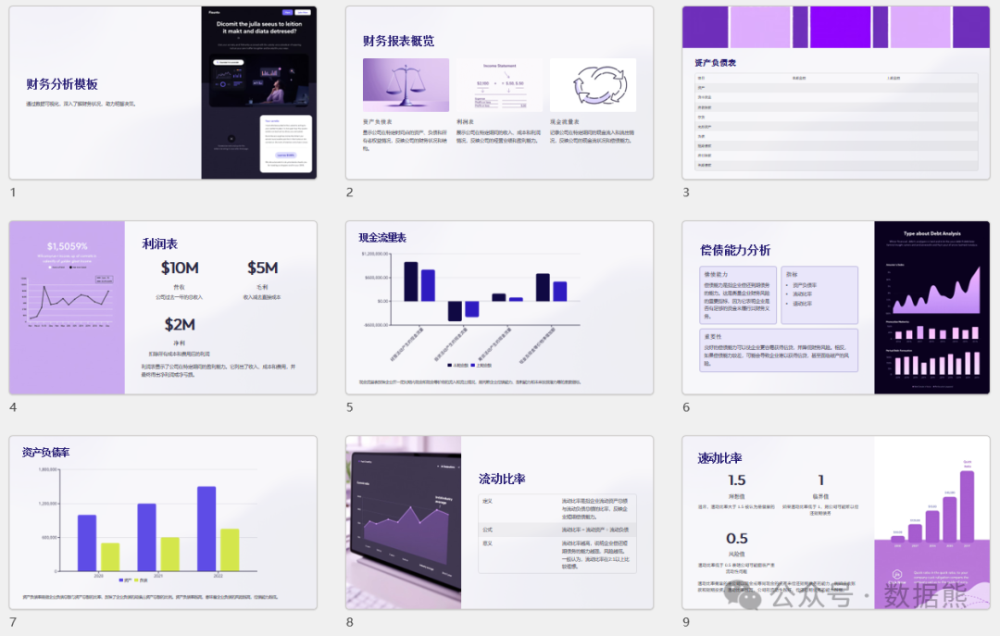

# 财务分析报告，如何做到信雅达？

> 来源：微信公众号「数据熊」 · 作者 Data Bear · 发布于 2025-01-14 07:00  
> 原文链接：http://mp.weixin.qq.com/s?__biz=Mzg2MTg5OTgzNA==&mid=2247486536&idx=1&sn=0c0fdd3cb61c9079552ee2ab9fd06203&chksm=ce11511df966d80b4fa7891444c8bc8c6bd27fb0c3f444733db46b7b92240d5225e7e56992a2
> 摘要：信，让人信服；\x0d\x0a雅，赏心悦目；\x0d\x0a达，直抵人心。

作为一名长期加班在财务战线上的“数据熊”，最近被不少人问到：“写财务分析报告，有没有什么秘诀？” 我的答案就三个字：信、雅、达！

这不是随口一说，而是一套让报告更有价值的原则。今天咱们就聊聊，如何让你的财务分析报告做到信雅达，既有数据支撑，又有逻辑美感，还能让人一目了然。（点击文末
阅读原文
获取word模板和可编辑PPT模板）

### **信：以事实为基础，让报告更可信**

1. 数据精准是底线

    财务报告的基础是数据，必须做到准确无误。别让客户发现你今天的毛利率是50%，明天变成了52%，否则信任感直接“扑街”。

    案例
    ：

    > 本季度应收账款周转天数下降了5天（从45天降到40天），表明客户回款速度加快，经营效率提高。

    这种表达方式能直接把数据与变化背后的原因联系起来，让人一目了然。
2. 结论有理有据

    财务分析报告不仅仅是列出数字，更要讲出数字背后的故事。例如，不要只说“公司经营效率提高”，还需要用具体的财务指标来证明。例如，提升效率要用
    应收账款周转天数
    或
    存货周转率
    来佐证。
3. 保持合规性

    财务报告不能是“故事会”，必须基于真实、合规的数据，避免夸大或隐瞒。例如，未决诉讼金额、资产减值等高风险事项都得如实披露。

    财务报告必须遵循财务报告准则和相关法律法规，确保透明性。

---

### **雅：用优雅表达，让报告有品位**

1. 语言简练，专业有力

    财务报告不是文学作品，不必使用华丽的辞藻。用词专业但不生僻，力求简洁、有力，让人一看就懂。避免过多的赘述，尤其是金融术语过多时，应该适度注释或简单翻译。

    普通版：

    > 本公司产品在市场上因价格偏高失去竞争优势，客户逐步流失。

    雅致版：

    > 产品价格偏高导致客户流失，市场占有率下降5%。

    通过简洁明了的表达，去除冗余信息，既突出了问题，又提升了报告的专业性。
2. 排版美观，图文并茂

    你是否曾经看过那些内容密密麻麻，满篇数字和表格的报告？这种报告，不仅增加了阅读的难度，也让报告看起来沉闷无趣。

    小贴士：

    案例
    ：

    > 收入趋势图——通过一张清晰的折线图，你可以轻松看出收入增长的趋势，比200字的文字解释更直观。
3. 注重逻辑流畅

    财务分析报告要像讲故事一样，层层递进，环环相扣。每一部分都需要有自然的过渡，让报告内容更具条理性。

    逻辑示例
    ：

    这种结构化的表达方式，不仅让报告更加有条理，还能使每一部分之间紧密相连，形成完整的逻辑链条。

---

### **达：清晰表达，让人一目了然**

1. 开篇就要点明结论

    写报告不是讲悬疑小说，不要让老板翻到最后才知道结果。开头就用一句话总结核心结论。让读者一开始就清楚报告的重点，避免反复翻阅。

    例子
    ：

    > 2024年公司销售收入增长15%，但毛利率下降2个百分点，需关注原材料价格波动。

    这种写法，避免了复杂的介绍部分，直接呈现出最重要的结论，节省了时间，提升了阅读效率。
2. 分清主次，聚焦核心

    写报告时，很多人有一个误区——想写什么就写什么，最后导致报告内容过于冗杂，且焦点不明确。财务报告应聚焦在
    核心问题
    上，简洁明了地表达出来。

    聚焦核心：
3. 复杂问题，简化呈现

    在处理复杂问题时，尽量避免使用过多的专业术语。对于专业问题，可以通过图表等方式进行简化呈现，让读者更加容易理解。

    案例
    ：

    > 用饼图展示成本构成，用柱状图对比月度销售额，清晰直观，让人看得明明白白。

---

### 

点击左下角
阅读原文
获得财务分析word和PPT模板。

点赞和转发是最大的支持，关注数据熊，工作更轻松。
