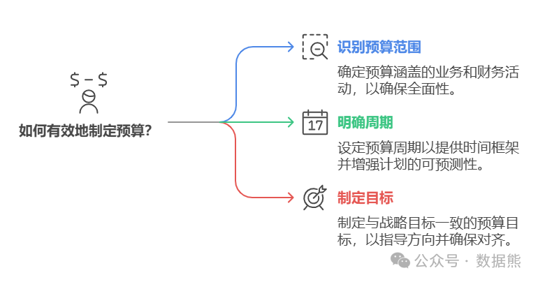
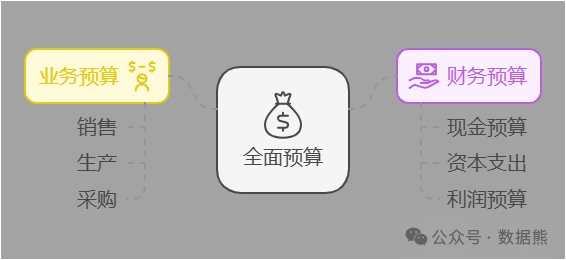
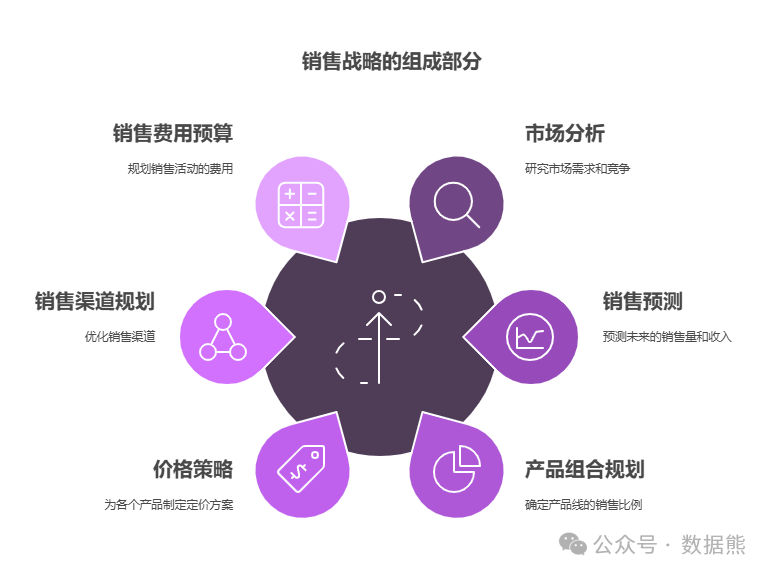
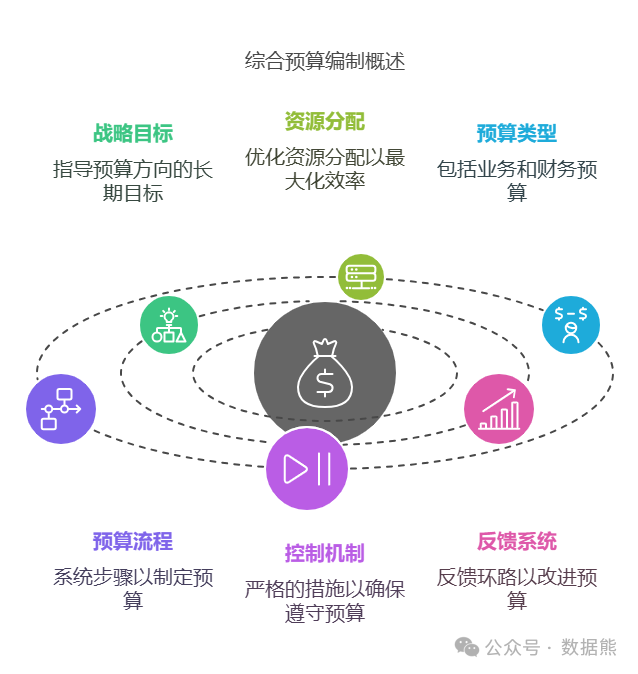
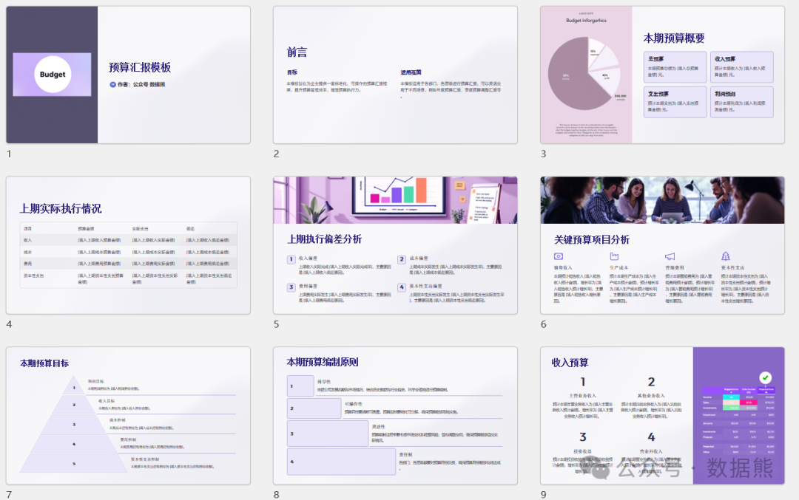

# 从业务预算到财务预算：详解全面预算编制流程（后附详细案例、预算PPT模板）

> 来源：微信公众号「数据熊」 · 作者 Data Bear · 发布于 2025-01-16 07:00
> 原文链接：http://mp.weixin.qq.com/s?__biz=Mzg2MTg5OTgzNA==&mid=2247486595&idx=1&sn=077f31af55b314ea796e8a07b79e6cc2&chksm=ce1151d6f966d8c029a10d0ff4356debf589aa3a99ddc75e59fabe16601161ecef6b7d5ef187
> 摘要：工作最后的汇报和总结才是检验成果的关键。

之前写的预算编制步骤详解，由于文章太长、完读率太低，导致被腾讯判定为低质文章，公众号流量被掐断。为平衡读者体验和公众号流量，经过几天的修改，形成了简化版供大家参考。文末为大家提供了完整版的
预算编制案例
、
预算汇报PPT
。

## **一、全面预算概述**

### **1. 什么是全面预算？**

全面预算是企业在一定时期内对其所有业务活动和财务活动进行的系统性规划和预测。它涵盖企业的各个部门和职能，确保各项计划和资源配置与企业的战略目标一致。

### **2. 业务预算与财务预算的区别**

业务预算和财务预算是全面预算的两个主要组成部分，各自侧重不同的管理领域，协同作用以实现企业的整体目标。

- 业务预算
   ：规划业务发展和运营安排。
- 财务预算
   ：确保财务健康和资金有效管理。

## **二、全面预算编制流程**

全面预算编制是一个系统化的过程，涉及多个步骤和部门的协同工作。以下是全面预算编制的主要流程步骤。

编制步骤：

1. 战略目标设定
    ：明确企业的长期和短期战略目标，为预算编制提供方向。
2. 业务预算编制
    ：各业务部门根据战略目标制定详细的业务预算。
3. 财务预算编制
    ：财务部门根据业务预算，制定相应的财务预算。
4. 预算整合与调整
    ：整合各部门的预算，进行协调和调整，确保整体预算的合理性和可行性。
5. 预算审批与实施
    ：高层管理层审批预算，正式启动预算执行。
6. 预算控制与反馈
    ：在预算执行过程中，进行监控和反馈，及时调整偏差。

## **三、业务预算编制详解**

业务预算是全面预算的基础，涵盖企业各项业务活动的计划和预测。以下以销售预算和生产预算为例，详细说明业务预算的编制过程。

### **1. 销售预算**

销售预算是企业收入预测的基础，涉及市场分析、销售预测、产品组合、定价策略、销售渠道和销售费用的规划。以下是销售预算的主要组成部分。

### **2. 生产预算**

生产预算涉及根据销售预测确定生产量，计算原材料需求，规划生产能力，预算生产成本，并管理库存。

## **四、财务预算编制详解**

财务预算基于业务预算，涵盖企业的资金需求和使用计划。以下以现金预算和利润预算为例，详细说明财务预算的编制过程。

### **1. 现金预算**

现金预算是企业现金流入和流出的预测，确保企业在预算期间内的资金链稳定。它包括现金收入预测、现金支出预测以及现金流量表的编制。

编制步骤：

- 现金收入预测
   ：根据销售预算，预测现金流入。
- 现金支出预测
   ：包括生产成本、运营费用、资本支出等。
- 现金流量表编制
   ：整理现金收入和支出，预测期末现金余额。

### **2. 利润预算**

利润预算是企业预期利润的预测，涉及收入预测、成本费用预测、税费预测以及利润计算。

## **五、预算整合与调整**

编制说明：
预算整合与调整是将各部门的业务预算和财务预算汇总，协调资源分配，确保整体预算的合理性和可行性。这一过程需要识别预算冲突，并进行相应的调整。

六、预算审批与实施

预算审批与实施是将整合后的预算提交高层管理层或董事会审批，通过后正式启动预算执行。实施过程中需要严格按照预算控制支出，确保预算目标的实现。

编制步骤：

### **1. 预算审批**

- 提交预算报告
   ：将整合后的预算提交给高层管理层或董事会审查。
- 审查与反馈
   ：高层管理层审查预算的合理性和可行性，提出修改意见。
- 最终批准
   ：董事会批准预算，明确各部门的资金使用权限和责任。

### **2. 预算实施**

- 执行预算计划
   ：各部门根据批准的预算执行各项计划。
- 监控支出
   ：严格按照预算控制支出，避免超预算。
- 调整执行策略
   ：根据实际情况，必要时调整执行策略，确保预算目标的实现。

## **七、预算控制与反馈**

预算控制与反馈是确保预算有效执行的重要环节，通过定期监控和反馈机制，及时发现并纠正预算执行中的偏差，优化下一期预算编制。

### **1. 预算控制**

- 定期对比
   ：定期将实际执行情况与预算进行对比，监控各项指标的偏差。
- 偏差分析
   ：分析偏差原因，找出预算执行中的问题。
- 纠正措施
   ：针对偏差，采取相应的纠正措施，确保预算目标的实现。

### **2. 预算反馈**

- 总结经验
   ：总结预算执行中的成功经验和失败教训。
- 优化预算编制
   ：根据反馈，优化下一期预算的编制方法和内容。
- 知识共享
   ：在企业内部分享预算管理的经验，提升整体预算编制和执行能力。

附件：

1、案例文件：
从业务预算到财务预算：全面预算编制详解（详细案例版）https://t.zsxq.com/r9OHP

2、预算汇报PPT：2025年度预算汇报模板。https://t.zsxq.com/VI1e5

扫描二维码或点击文末左下角
阅读原文

阅读案例文章、获取

预算汇报ppt模板

。

点赞和转发就是最大的支持，关注数据熊，工作更轻松。
