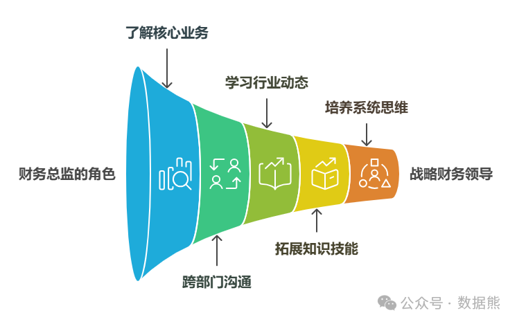

# 为什么优秀的财务总监一定是精通业务的？

> 来源：微信公众号「数据熊」 · 作者 Data Bear · 发布于 2025-01-18 07:00  
> 原文链接：http://mp.weixin.qq.com/s?__biz=Mzg2MTg5OTgzNA==&mid=2247486641&idx=1&sn=4ee93009d8e3df8f59e8db2d3473a74d&chksm=ce1151e4f966d8f271899ff48eaff3865ae6f35a57baf72672ad28b49bc410f811e8b330f18d
> 摘要：财务总监不仅是企业的“守财奴”，更是企业发展的“智囊团”。只有不断提升自己的综合能力，才能应对快速变化的商业环境，并引领企业走向成功的未来。

为什么优秀的财务总监一定是精通业务的？

很多人都觉得财务总监的工作就是“算钱、看报表”，每天做做预算，算算利润。其实，财务总监的角色远不止这些，尤其是现在这个竞争激烈的市场环境中，财务总监如果不懂业务，真的很难带领公司走得更远。

那么，
为什么财务总监一定要懂业务
呢？今天我们就来聊聊这个话题。

（文末有财务总监能力矩阵、财务总监能力手册领取。）

#### **1. 财务决策不能脱离业务**

咱们经常说，财务是“公司的大脑”，但“大脑”也得了解身体的情况，才能做出合理的决策。如果财务总监只会盯着报表，却不懂业务，那可就麻烦了。

比如，销售部门说需要资金支持，可你根本不了解他们的业务背景，怎么知道这个需求是合理的？更别说判断这个投资是不是值得了。懂业务的财务总监就能看得更清楚，知道每一笔资金投入能带来什么样的回报，做出的决策才更靠谱。

#### **2. 能发现潜在的风险**

财务数据能反映企业的“健康状况”，但财务总监如果不了解业务，可能无法预见到潜在的风险。比如，销售额突然下降，财务报表上看不出什么，但如果你懂业务，就能知道是市场环境变化，还是产品本身的问题，甚至还能提前制定应对措施。

总之，懂业务的财务总监，能够更早地识别风险，避免企业陷入危机。

#### **3. 跨部门沟通更顺畅**

我们都知道，财务部门和业务部门的关系，常常就像“远距离恋爱”。业务部门需要资金支持，财务部门得审核；财务部门觉得某些花费不合理，业务部门又不理解。懂业务的财务总监可以打破这种隔阂，把财务语言和业务语言结合起来，沟通起来更顺畅。

如果你能理解销售部门在说什么，知道他们的痛点在哪，跟他们沟通的时候就能“零距离”，不容易发生误解。

#### **4. 精准资源配置**

每个公司都有有限的资源，如何分配，直接决定了公司能否更好地发展。如果财务总监了解公司的业务运作，知道哪块业务最需要资金支持，哪块业务可能需要调整，那资源就能用在刀刃上。相反，如果只靠财务数据做决策，可能就会导致资金浪费，错过关键的投资机会。

#### **5. 提升战略眼光**

财务总监的眼光不能只停留在“短期内的数字”上，还得放远点，看到公司未来的发展方向。懂业务的财务总监，能够在参与公司战略规划时，提供更有价值的财务意见。比如，市场拓展、产品研发等方向的资金分配，都需要财务总监提供意见。如果财务总监只懂数字，不懂市场，那他对公司的战略支持就会很有限。

---

### **那财务总监到底要怎么做才能精通业务？**

精通业务并不是一蹴而就的事情，它需要时间积累、不断学习和与团队的深入沟通。以下是一些切实可行的步骤，帮助财务总监提升自己在业务方面的能力：

#### **1. 深入了解公司核心业务**

作为财务总监，你需要深入了解公司所在行业的运营模式、市场趋势、竞争格局以及客户需求。这不仅有助于财务决策的科学性，还能帮助你更好地参与到公司的战略规划中。

- 参与产品设计与开发过程
   ：了解公司的核心产品或服务如何产生价值，财务如何支持研发和市场推广。
- 掌握生产或运营流程
   ：了解产品的生产过程、供应链管理、库存管理等。对这些环节的深入了解有助于你从财务角度评估生产效率和成本控制。

#### **2. 与其他部门保持密切沟通**

财务总监需要和销售、营销、生产等部门建立良好的沟通渠道，参与到各部门的会议和决策中，了解他们的目标和挑战。只有这样，财务总监才能更好地为各部门提供财务支持，优化资源分配。

- 定期与各部门交流
   ：每月或每季度与各部门进行业务回顾和财务分析，了解他们的运营情况。
- 跨部门合作
   ：和业务部门一起制定预算、预测现金流、评估投资回报等，帮助业务团队实现目标的同时，保证财务目标的实现。

#### **3. 学习行业动态和市场趋势**

作为财务总监，掌握行业动态是提升业务敏感度的重要途径。你需要关注行业内的新闻、趋势和技术变化，评估这些外部因素对公司财务状况的潜在影响。通过了解外部环境，你可以为公司提供更具前瞻性的财务建议。

- 参加行业会议与培训
   ：定期参与行业论坛、研讨会等活动，了解行业最新动向。
- 分析行业报告
   ：阅读行业分析报告，跟踪市场需求变化、技术创新及竞争者动态。

#### **4. 培养跨领域的知识和技能**

财务总监不仅仅要精通财务，更要具备一定的运营和战略视野。因此，不断拓展自己的知识领域也是非常必要的。

- 了解基本的营销知识
   ：知道如何评估市场营销的效果，理解市场活动对财务的影响。
- 掌握供应链管理基础
   ：了解采购、库存管理等流程的财务成本如何影响公司整体运营。
- 关注数字化转型
   ：在信息化时代，财务总监还应关注数据分析、自动化工具和ERP系统等数字化手段如何提高财务管理效率。

#### **5. 培养系统化思维**

精通业务的财务总监通常具备良好的系统化思维，他们能够从全局的角度分析和解决问题。在面对复杂的业务问题时，他们不仅考虑财务数据，还能够考虑到其他业务因素，综合评估后给出解决方案。

- 了解各环节的相互作用
   ：从财务角度理解供应链、市场营销、产品研发等环节的协同作用。
- 关注整体战略目标
   ：不局限于短期的财务目标，要将财务管理与公司长期战略紧密结合，促进战略目标的实现。

---

### **总结**

财务总监懂业务
，其实是公司能否持续发展、走向成功的关键。只有理解业务，财务总监才能更好地支持决策、发现风险、优化资源配置，最终帮助公司实现更长远的目标。

要做到这一点，财务总监需要多和业务部门沟通，参与决策，学习业务知识，从数据中挖掘价值，并建立跨部门合作机制。只有这样，才能真正打破财务与业务之间的隔阂，成为公司发展的重要推手。

数据熊为大家准备了财务总监能力手册及PPT，供各位财务总监、准财务总监学习，点击左下角
阅读原文
获取。

点赞或转发就是最大的支持，关注数据熊，工作更轻松。
