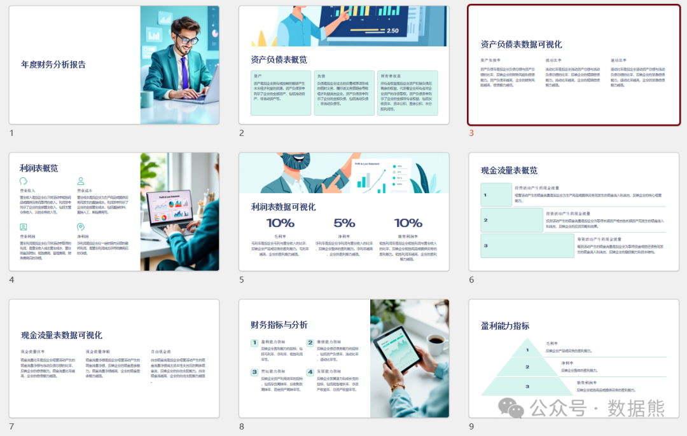
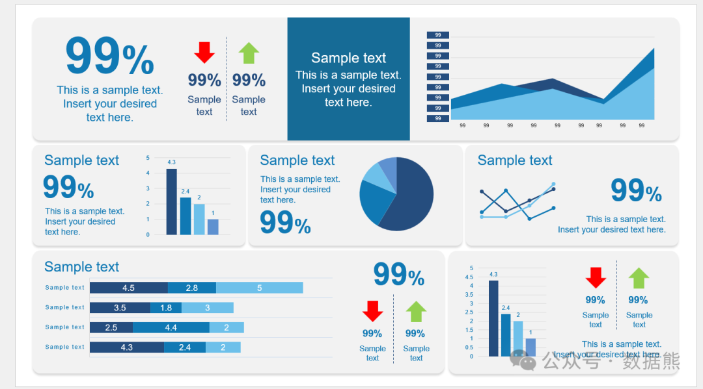

# 财务人员千万不要输在工作汇报上！（含精美PPT模板、数据图表）

> 来源：微信公众号「数据熊」 · 作者 数据熊 · 发布于 2025-01-19 07:00  
> 原文链接：http://mp.weixin.qq.com/s?__biz=Mzg2MTg5OTgzNA==&mid=2247486652&idx=1&sn=668ab0cf6b9cf73afc3ab4e8bccadfde&chksm=ce1151e9f966d8ff793cd508fac29e47a3396e5715c4fe231352b1a3425eec1fe0d61066813e
> 摘要：“汇报的目的不是展示数据，而是让数据讲述故事。” — 安妮·D·希尔顿 (Annie D. Hilton)

（文末

可下载PPT模板、数据图表）

大家好，今天来聊聊一个大家都有过痛点的事——汇报。没错，就是那个让你头疼的PPT、让你夜深人静加班加点完成的“财务报告”，而一汇报，领导就开始发愁的那一刻。

你有没有过这样的经历？你辛辛苦苦做了一个月的财务分析，数据分析得明明白白，结论清清楚楚，报告写得像小说一样有逻辑。可是，当你一打开PPT开始汇报的时候，领导就开始摇头、翻白眼，甚至开始翻手机了……

别以为只有你有这种“苦”，几乎所有财务人员都曾经经历过“为啥我的报告没人听”的困扰。今天就给大家聊聊，作为财务人员，为什么
汇报这件事，不能随便糊弄
，它直接决定了你能不能“打败”那些不如你能干的同事！

### **财务汇报，为啥不能“随便做做”**

你说做账、审计、报表这些财务工作你做得好，辛辛苦苦搞了几天几夜的账目，领导最后一句“这数据我能看得懂么？”就能把你累得崩溃。是的，这就是职场痛点：
财务工作做得好不代表报告好，报告做得不好，一切都白费！

#### **1. 汇报不清，决策受影响**

财务数据就是“真理”，但如果你不能清楚、简洁地展示出来，那决策层根本没法快速把握重点，反而浪费时间搞不明白你的分析。你花了几天时间做的财务数据，最终可能被认为“只是个数字”，根本没人看得懂。
领导急着做决策，你的报告拖延了他们的时间，你还能得心应手地安慰自己“下次改进”吗？

#### **2. 不会讲故事，数据就成了无聊的“死物”**

大家都知道财务数据堆得多了，谁看得下去。你是不是有时候也陷入“数字好像好多，但不知如何讲清楚”的困境？记住，
数据必须能讲故事
。不只是简单堆砌表格和数字，你要让它“活”起来。没有图表的PPT，你敢信？

### **财务人员如何从“晕头转向”到“汇报王”？**

OK，咱们直入主题，既然汇报如此重要，如何才能避免自己“输在汇报上”？别急，给大家几个
秒变汇报达人
的关键技巧。

#### **1. 讲清楚“结果是什么”**

想象一下，你在汇报时说“这个季度财务状况较好”，然后默默放了一个堆满数字的表格出来，
“领导是不是有点懵？”

没错！你不是在向老板报数字，而是在向老板报
结果
！所有的财务分析都必须明确一个结论：“这次利润提升了10%是怎么回事？”而不是：
“这个表格我们收入增长了10%。”

财务汇报不是枯燥的数字堆砌，它应该告诉你的领导：这个数据意味着什么？我们下一步该做什么？

#### **2. 数据可视化：让数字跳起来！**

请原谅那些“喜欢写满满一页PPT”而不给图表展示的财务小伙伴。想问你一句：你看过多少PPT的“饼图、柱状图”？你自己觉得是不是经常被这种信息量超载的PPT虐到懵逼？

所以，
让数据说话，少写字，多画图！

柱状图、折线图、饼图这些可以让你的数据变得直观，帮助领导一眼看到重点。想想看，
用一张清晰的趋势图替代一堆数字
，简直就是给领导做了个“财务快餐”，省时又省力！

#### **3. 结构清晰，简洁才是王道**

有个好朋友告诉我，他汇报时最怕的就是老板看到一堆“信息过载”的内容后，直接翻了个白眼：**“这个PPT我看得懂啥？”**我忍不住想笑——你真的准备好了那个PPT吗？

让我们为领导准备好一份清晰、简洁的报告。
汇报先告诉领导结论，再解释数据背景，最后提建议
。比如：“今年第一季度我们收入增长10%，主要是因为新产品销售增长，预计下半年会保持这一趋势。”简短几句话就能给领导传递完整信息。

#### **4. 不同的听众，不同的报告**

“老板看PPT，你能猜到他关心什么吗？”这个问题我问过很多财务小伙伴，他们的回答大致是：“关心数字，关心结论，关心下一步怎么办？”

所以，
调整汇报内容，量体裁衣
。不同的听众关注点不同，比如向CFO汇报，你的重点可能是成本控制；向CEO汇报，你可能要分析宏观趋势和长期规划。记住，做PPT的时候要清楚领导的需求，
不扯空话，直奔主题
。

### **工具帮你大大加分**

最后，别忘了利用工具让你的汇报更专业、炫酷。
Power BI
能帮助你实现数据可视化，让数据和图表互动，好的
PPT模板
能帮你做出高大上的演示效果。通过这些工具，不仅能让数据传递更清晰，还能增加你报告的表现力！

数据熊帮大家做了一个精美的PPT模板供大家参考，同时还有炫酷的数据图表模板，点击左下角

阅读全文

下载可编辑版本的PPT。

点赞和转发就是最大的支持，关注数据熊，工作更轻松。
