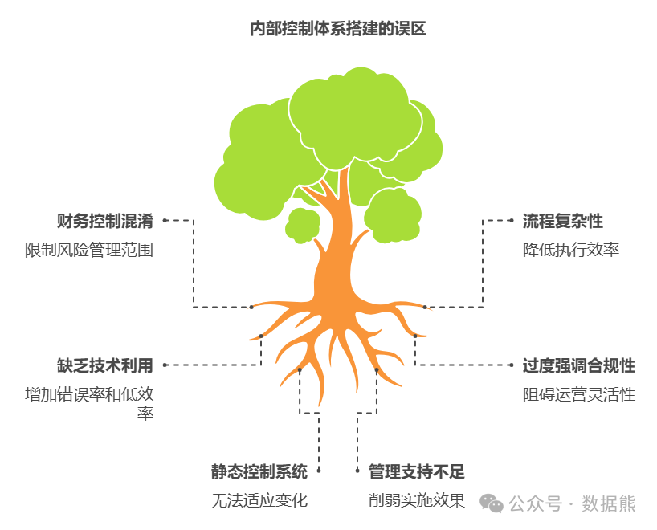
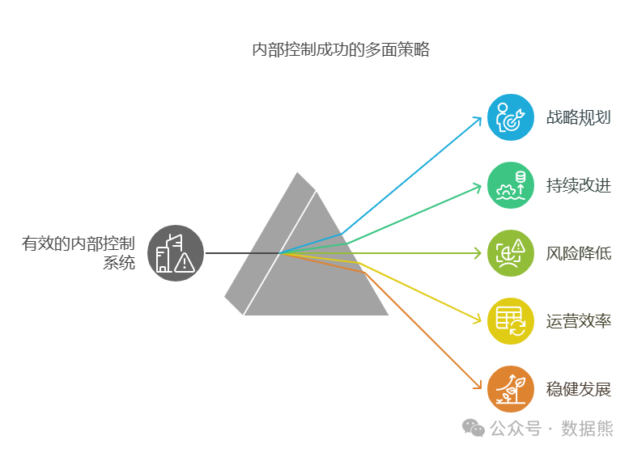
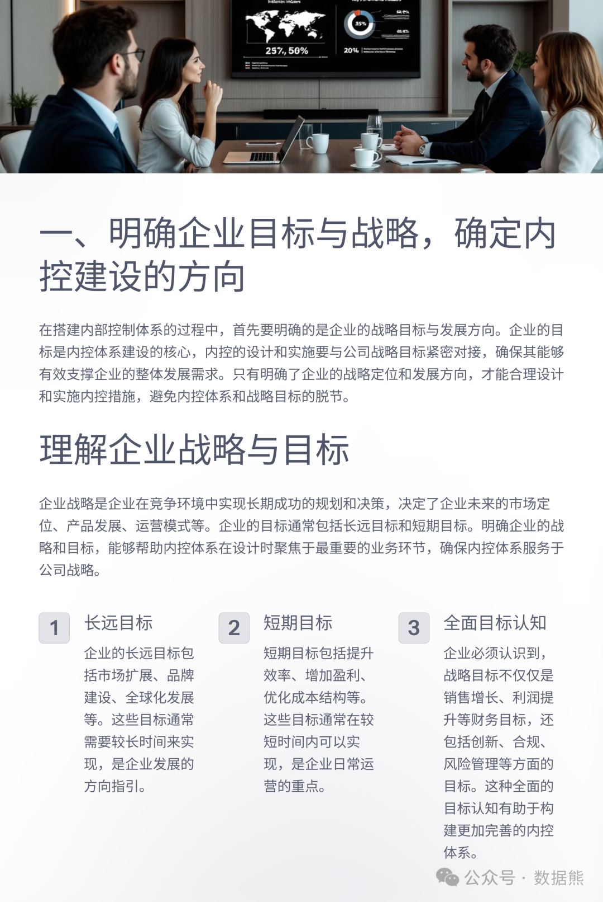

# 构建内部控制体系的几个常见误区

> 来源：微信公众号「数据熊」 · 作者 Data Bear · 发布于 2025-01-20 07:00  
> 原文链接：http://mp.weixin.qq.com/s?__biz=Mzg2MTg5OTgzNA==&mid=2247486670&idx=1&sn=918870280d0b2ea7350d860d952df7b0&chksm=ce11519bf966d88d7620ffea4b1a9c6a486c4b583bbac80b1d1c46061cbe7bf38262754b42ef
> 摘要：没有强有力的内部控制，企业的战略执行将如空中楼阁。

随着企业规模的扩大与管理的复杂性提升，构建一个高效的内控体系变得越来越重要。内控不仅仅是防范风险、提高效率的工具，它更是企业可持续发展的保障。然而，在实际操作过程中，很多企业在构建内控体系时常常犯一些误区，导致内控体系的效果大打折扣。今天，我们将重点分析这些常见误区，并为大家提供解决方案，帮助企业构建更高效的内控体系。

（付费会员可在文

末下载
《
内部控制体系搭建操作手册》

电子书）

1. 内控等同于财务控制

很多企业在初期构建内控体系时，常常将内控和财务控制等同起来，认为内控工作就是“财务部门的事”，只需对账务、资金流、财务报表等环节进行控制。实际上，内控体系的目标远不止财务领域，它应当涵盖公司各个方面，特别是在日益复杂的业务环境下，内控应该涵盖到运营、信息系统、合规等多个领域。

误区分析
：

将内控局限于财务控制，容易忽略其他业务领域的风险。例如，采购、库存管理、生产等领域的潜在风险，如果没有相关控制措施，可能导致运营效率低下甚至经营风险暴露。

正确做法
：

内控体系应覆盖整个企业的运营和管理活动，从业务流程到管理层决策，从战略目标的实现到日常运营的管理，都是内控体系的构建范围。企业应当设计跨部门、全方位的内控措施，使其成为整个组织的共同责任。

2. 内控体系过于复杂或繁琐

为了确保内控的严密性，很多企业在设计内控体系时倾向于将流程和控制措施设计得过于复杂、繁琐。尽管这种方式看起来能够细化管理、强化控制，但在实际操作中，往往导致执行难度加大，甚至影响效率，无法达到预期的效果。

误区分析
：

复杂的流程设计往往让员工感到不堪重负，尤其是操作层面的员工，可能会因工作量过大而忽略或篡改某些环节，从而影响内控体系的效果。此外，过于繁琐的内控措施会使得公司无法快速应对变化的市场环境。

正确做法
：

内控体系应追求“简洁性”和“高效性”，确保每一项控制措施都能实现其目标，但不至于繁琐、冗长。简洁高效的内控流程能够让员工更加容易理解并执行，同时也能灵活应对市场变化。

3. 忽视技术工具的支持

传统的手工操作和流程记录已经无法满足现代企业内控体系的要求，尤其是在信息化时代，很多企业仍然依赖手工操作进行内控管理，导致效率低下且容易出错。

误区分析
：

没有充分利用信息技术工具，企业的内控体系可能无法实时监控和分析业务数据。手动的审核和检查容易受到人为错误、疏忽或造假行为的影响，且无法做到实时反馈。

正确做法
：

企业应借助现代信息技术（如ERP系统、数据分析工具、自动化审计工具等）提升内控体系的自动化、智能化水平。通过信息技术的支持，可以实现业务流程的实时监控，数据分析和预警，减少人为操作的风险，从而提高内控效率和准确性。

4. 内控只重视“合规”而忽视“效能”

许多企业在构建内控体系时，往往过分强调合规性，专注于确保每项操作都符合法律法规的要求，而忽视了内控的核心目标之一——提高运营效率和效果。过度合规的内控体系可能导致企业在操作过程中显得过于呆板，影响灵活性和创新。

误区分析
：

过分强调合规性容易导致“过度控制”现象，内控变得僵化、复杂，从而影响了企业的业务敏捷性。企业可能会为了规避风险而丧失机会，或是陷入管理层指令过多、执行过于复杂的局面。

正确做法
：

内控体系不仅要确保合规性，更要注重运营效率和效果。控制措施的设立应关注提高工作流程的效率、降低不必要的复杂度，同时还能有效地管控风险。例如，在确保财务合规的基础上，可以设计灵活的审批流程，提高决策效率。

5. 内控体系静态不变

很多企业在构建内控体系后，往往未能及时对其进行调整和优化。随着市场环境、技术发展和企业战略的变化，原有的内控体系可能会变得不适应，甚至会成为企业发展的绊脚石。

误区分析
：

没有进行定期评估和调整，企业内控体系很可能会出现“陈旧化”的问题。企业可能会错过新的风险点，甚至对已经发生的风险反应迟缓，导致损失的扩大。

正确做法
：

内控体系必须是动态的，定期进行评估和优化。企业应关注内控环境的变化，适时对内控流程进行调整，以应对新的法律法规、市场环境变化或技术革新。通过定期的风险评估、内部审计、员工反馈等手段，及时发现问题并进行改进。

6. 缺乏高层管理支持

内控体系的成功不仅仅依赖于执行层的努力，更需要高层管理者的支持和推动。如果高层管理者对内控工作缺乏足够的重视和支持，内控措施往往难以落实到位，效果大打折扣。

误区分析
：

高层管理者若将内控视为“低层次的操作性工作”，或者认为内控工作只是财务部门的责任，忽视了其对企业全局的重要性，最终可能导致内控实施过程中缺乏足够的资源支持和政策保障。

正确做法
：

高层管理者应当在企业战略层面明确内控的重要性，强调内控是实现企业战略目标、保障公司可持续发展的重要保障。管理层要通过充分的资源投入、制度支持以及亲自参与，推动内控体系的全面落地。

7. 忽视员工的内控意识培养

内控体系的设计和执行，最终取决于每个员工的执行力。如果员工没有足够的内控意识，即使内控制度再完善，也无法真正发挥作用。

误区分析
：

企业很多时候只关注制度设计和流程搭建，却忽视了对员工内控意识的培养。这导致员工对内控缺乏认同感，甚至有意或无意地规避某些内控措施，影响了内控的执行效果。

正确做法
：

企业应定期开展内控意识培训，让员工了解内控的意义和作用，确保他们在日常工作中自觉遵守内控规范。同时，激励员工积极反馈和提出改进建议，增强内控体系的适应性和执行力。

总结

构建一个高效的内控体系并非一蹴而就，它需要企业从整体层面进行战略规划，同时注重执行层面的持续改进。在构建内控体系时，避免上述常见误区，才能最大化内控的效果，降低企业风险，提高运营效率，确保企业的稳健发展。只有不断优化和完善内控体系，才能帮助企业更好地应对外部变化，迎接挑战，实现长期成功。

数据熊为付费会员准备了精美的《内部控制体系搭建操作手册》电子书，共37页，点击左下角
阅读全文
下载。

点赞和转发是最大的支持，关注数据熊，工作更轻松。
