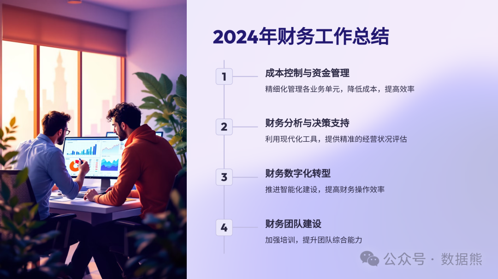
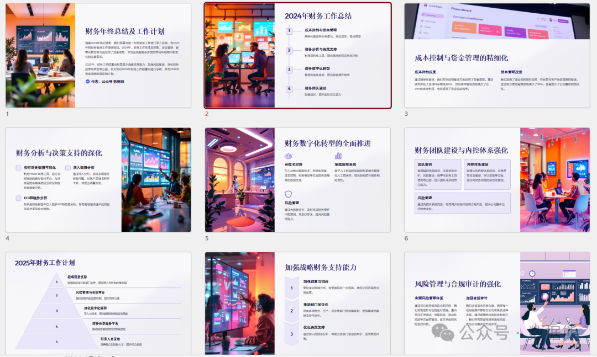
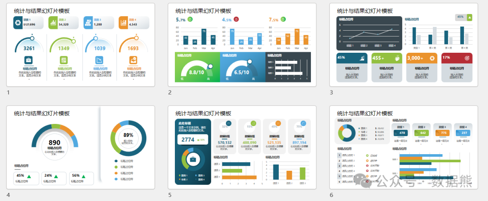

# 财务年终总结及工作计划（含可编辑PPT）

> 来源：微信公众号「数据熊」 · 作者 Data Bear · 发布于 2025-01-22 07:00  
> 原文链接：http://mp.weixin.qq.com/s?__biz=Mzg2MTg5OTgzNA==&mid=2247486691&idx=1&sn=11dc157bb2687bc9619759cda832201d&chksm=ce1151b6f966d8a0340a7957dd9bda0351dd07f224ae754b5386f53e6edc3a9058c9cf41e7e7
> 摘要：好的汇报，是工作成功的一半。

2024年，财务工作在成本控制、资金管理、数字化转型等方面取得了显著成效，但也面临着复杂多变的市场环境和不断变化的监管要求。2025年，财务工作的重点将是提升战略支持能力、加强风险管理、深化财务数字化转型等方面。
（文末可下载可编辑PPT、word)

一、2024年财务工作总结

1. 成本控制与资金管理的精细化

2024年，我们在成本控制和资金管理上取得了显著进展。具体来说，成本控制工作侧重于各业务单元的精细化管理。通过对成本数据的细分和对比分析，我们识别出了一些潜在的成本过高领域，并针对性地提出了优化方案。

例如，在供应链管理方面，我们通过与供应商的重新谈判，成功降低了原材料采购成本5%。此外，优化库存管理流程，也帮助我们减少了近10%的库存积压，从而有效提高了资金流动效率。对于资金管理，我们加强了现金流的实时监控，尤其是对客户回款周期的管理，减少了30%的逾期款项，提升了公司整体的流动性。

2. 财务分析与决策支持的深化

随着管理层对数据需求的增加，我们在财务分析与决策支持方面做出了重要改进。我们利用Power BI等现代化工具，建立了实时的财务数据可视化平台，及时向决策层提供精准的经营状况和财务健康度评估。

通过对财务数据的深入分析，我们能够及时发现潜在的财务问题。例如，在分析收入和成本的关系时，我们发现某一产品线的毛利率逐年下降，经过进一步剖析后，发现问题的根源在于原材料采购成本的上涨。基于这一数据，我们迅速提出调整方案，成功避免了毛利率的进一步压缩。

此外，我们还在季度财务报告中引入了更多的KPI和趋势分析，让管理层能够更快地识别财务风险，并采取措施应对。

3. 财务数字化转型的全面推进

数字化转型依旧是2024年的重点工作之一。在这一年中，我们在财务数字化建设上取得了积极进展。除了已经完成的财务报表自动化生成外，我们还进一步深化了财务分析的智能化。通过引入AI和大数据技术，我们在财务预算、成本控制、税务筹划等方面，提供了更为精准的数据支持。

例如，基于人工智能的智能报税系统，使得我们能够在税务申报过程中大幅度降低人工错误率，提高了报税的合规性和时效性；通过大数据分析，我们能够及时发现财务操作中的漏洞，并加以修正。

4. 财务团队建设与内控体系强化

2024年，我们加强了财务团队的培训与建设，提升了团队成员的综合能力。我们定期组织内部培训，内容涉及财务分析、风险管理、数字化财务工具使用等方面，确保财务人员能够适应数字化时代的需求。

同时，我们还加强了公司内控体系的建设，尤其是在资金管理、审计监督等方面，强化了对财务流程的规范化管理，减少了财务风险和合规风险。

二、2025年财务工作计划

1. 加强战略财务支持能力

随着公司业务规模的不断扩大，财务部门不仅仅是传统的账务处理和成本管控角色，更多地要承担起支持公司战略决策的重要任务。2025年，我们将进一步加强财务与业务部门的合作，提供更加深入的财务分析和决策支持。

计划通过以下几方面强化战略财务支持能力：

- 加强预算与预测的精细化管理
   ：未来我们将采取滚动预算的方式，每季度更新一次预算，并根据实际情况进行调整，确保公司资源的合理配置。
- 推动部门间协作
   ：在销售、生产、研发等部门的战略规划中，财务将更深度地参与其中，提供精准的数据支持与分析，帮助业务部门优化决策。

2. 风险管理与合规审计的强化

在全球经济环境日益复杂的背景下，财务风险管理将是2025年的核心任务之一。我们将进一步加强财务风险的监控机制，尤其是汇率波动、信用风险、流动性风险等方面的管理。

具体计划包括：

- 建立全面的风险管理体系
   ：通过对公司关键风险点的评估，制定针对性的应对措施。
- 加强合规审计
   ：加大内审力度，确保每一项财务操作都符合公司政策及法律法规，避免财务违规风险。

3. 深化财务数字化转型

财务数字化转型将进入更加深入的阶段。我们计划在现有基础上，进一步引入AI技术，提高数据处理的智能化程度，全面推进智能财务管理。

- 智能预算编制与财务分析
   ：利用大数据分析工具，进一步提升预算编制的准确性与高效性，同时加强财务数据的预测分析能力，帮助管理层做出更为科学的决策。
- 引入区块链技术
   ：在财务报表、税务申报等环节，探索区块链技术的应用，提高财务数据的透明度和安全性。

4. 财务共享服务平台的建设

在2025年，我们将推动财务共享服务平台的建设，推动公司财务管理的集约化和规范化。通过共享服务平台的搭建，我们将整合各部门财务工作，标准化财务操作流程，减少重复工作，提高工作效率。

计划在以下几个方面进行深入探索：

- 集中处理核心财务事务
   ：如财务报表、账务核算、报销管理等，统一标准，降低管理成本。
- 共享财务信息系统
   ：确保各部门之间数据的实时共享，提高数据透明度。

5. 财务人员的持续发展

未来，我们将继续注重财务人员的专业能力提升，并进一步培养财务管理的复合型人才。除了继续开展专业知识的培训外，我们还将引导财务人员向数据分析、数字化财务等领域发展，提升其综合素质和适应能力。

三、结语

2024年，财务工作在多个领域取得了令人满意的成绩，但也面临着许多挑战。在2025年，我们将继续紧跟时代步伐，加强财务管理的战略性、数字化和精细化，进一步提升财务工作的价值，为公司创造更多的战略性支持。

作为财务人员，我们不仅要继续扎实做好本职工作，还要通过不断学习和创新，提升自己的综合素质，为公司的长远发展贡献力量。

数据熊为大家准备了精美的PPT，点击文末左下角

阅读原文

可下载。

点赞和转发是最大的支持，关注数据熊，工作更轻松。
