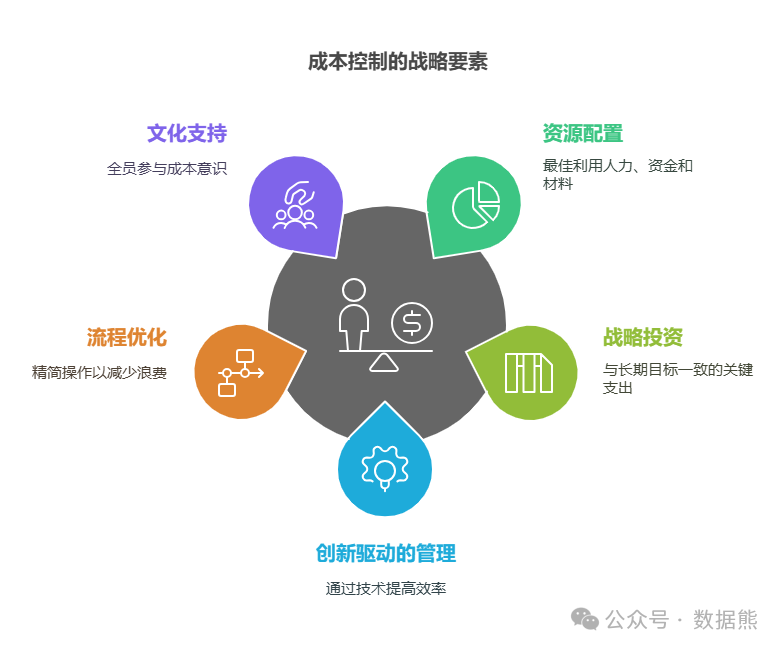
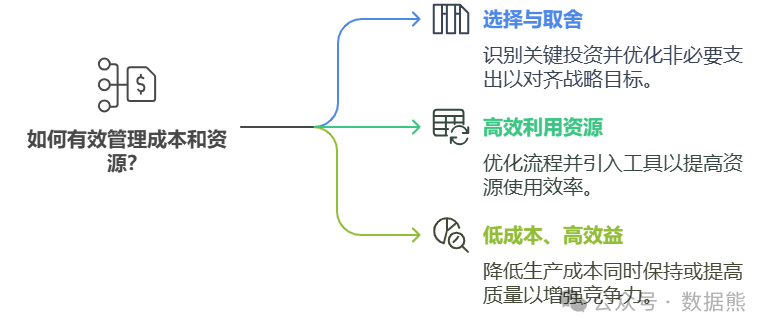
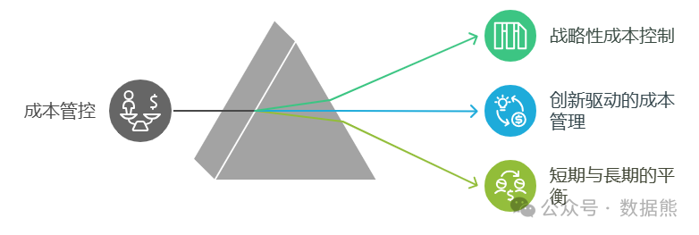
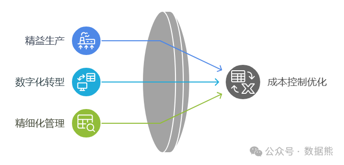
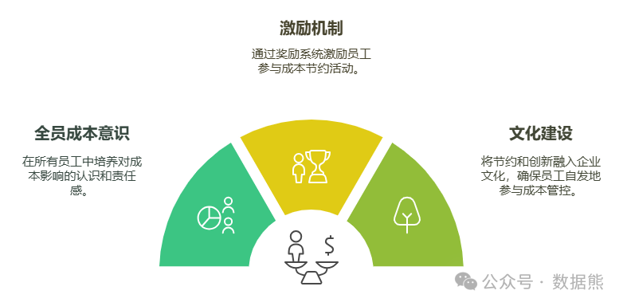
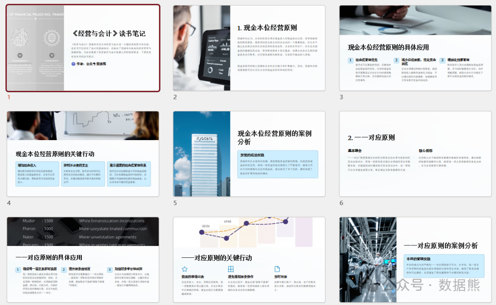

# 成本管控的底层逻辑——如何从“节流”到“创效”

> 来源：微信公众号「数据熊」 · 作者 Data Bear · 发布于 2025-01-23 07:00  
> 原文链接：http://mp.weixin.qq.com/s?__biz=Mzg2MTg5OTgzNA==&mid=2247486702&idx=1&sn=40b11736c9e37ece796b0aad176fcc07&chksm=ce1151bbf966d8addcffe232ddfd6546d2d7323e89b781fb4d1b5ead964c96f2cfb7dff88a7f
> 摘要：企业必须认识到，真正的成本管控不仅是短期的节省，更是长期的价值创造。通过系统的成本管控，企业能够实现低成本高效益，为未来的成功奠定坚实的基础。

很多人听到成本管控，可能会第一时间想到“节省开支”，但实际上，成本管控的底层逻辑远不止于此。它不仅仅是减少支出，更是通过精细化的管理、合理的资源配置和创新的手段，提升企业整体效益，创造更大的价值。

今天，我们就来聊聊成本管控背后的核心逻辑。
（文末可下载稻盛和夫《经营与会计》读书笔记）

### **一、成本管控的核心：资源配置**

从根本上讲，成本管控的核心在于“资源配置”。不论是人力、资金，还是原材料，企业的每一笔支出，都是在某种程度上配置了资源。那么，如何用有限的资源创造最大的效益，才是企业成本管控的关键。

#### **1. 选择与取舍**

企业永远面临资源有限的问题。如何在众多支出中做出取舍，是成本管控的首要挑战。哪些投资对企业未来发展至关重要，哪些支出可以优化或减少？这需要根据企业的战略目标来判断。

例如，

初创公司可能需要把资金投入到市场拓展和研发上，而对日常运营支出则可以适当压缩。随着企业发展，资源配置的重心也会发生变化，逐步向技术创新、品牌建设等领域倾斜。

#### **2. 高效利用资源**

成本管控的目标不仅仅是“省钱”，更重要的是让每一分钱都花在刀刃上。通过优化内部流程、引入先进的管理工具、减少不必要的浪费，企业可以提升资源的使用效率，进而降低成本。

例如，

采用自动化生产线、优化库存管理、提升员工工作效率等，都是提高资源利用率的有效方式。

#### **3. 低成本、高效益**

“低成本高效益”是企业经营中的理想状态。通过合理的资源配置和精细化管理，企业可以在保持甚至提升质量的同时，降低单位生产成本，从而增强市场竞争力。

例如，

提升生产效率、减少生产周期、降低原材料浪费，都是实现低成本高效益的具体路径。

### **二、成本管控的本质：价值创造**

很多人把成本管控等同于“节省开支”，但实际情况是，真正的成本管控是为了“创造价值”。企业在控制成本的过程中，最终目的是提升盈利能力、增强竞争力。

#### **1. 战略性成本控制**

企业的成本管控不能脱离整体战略，必须紧密结合企业的长期目标。短期内看似增加投入的支出（如研发、品牌建设等），长期来看往往能为企业带来更多回报。

比如，

企业在技术创新或市场拓展方面的投入，虽然短期内增加了成本，但它们为未来的增长提供了动力。因此，真正的成本管控，是在保障战略性投资的同时，优化不必要的开支。

#### **2. 创新驱动的成本管理**

创新是提升效率、降低成本的有效手段。企业通过技术创新、管理创新等方式，既可以提高产品和服务的质量，又能减少不必要的成本。

比如

，通过引入自动化设备、采用智能生产线、利用数据分析等手段，企业可以提高生产效率、优化资源配置，进而降低整体成本。

#### **3. 短期与长期的平衡**

成本管控不仅是考虑短期的盈利，更是要平衡短期效益与长期投资的关系。在追求短期盈利的同时，不能忽视长期发展所需的投入。

例如，

研发费用、人才培养、品牌建设等，虽然短期内可能增加成本，但它们是企业持续增长的基石。因此，成功的成本管控不仅是为了省钱，更是为了企业的长期健康发展。

### **三、流程优化与成本管控**

精细化的流程管理是成本管控中非常重要的一环。通过优化企业内部流程，消除浪费，提升效率，企业能够在不增加成本的情况下，提升整体效益。

#### **1. 精益生产**

精益生产强调消除一切不必要的浪费，提高生产效率。通过优化生产过程、减少不必要的工序、提高设备利用率等方式，企业能够降低生产成本，提高生产效率。

例如，减少库存占用资金、缩短生产周期、提高设备利用率，都是精益生产的核心内容。

#### **2. 数字化转型**

随着信息技术的进步，数字化转型已成为成本管控的重要手段。通过引入ERP系统、智能制造设备、数据分析平台等工具，企业可以实时监控成本、分析各项支出，并根据数据及时进行调整。

例如，

通过智能化生产线减少人工干预、提高生产效率，从而降低生产成本。

#### **3. 精细化管理**

精细化管理是通过对每个环节的精细化控制，减少资源浪费，提高效率。企业可以通过数据分析、流程再造等手段，对每个环节进行优化，降低成本。

例如，

在库存管理、采购管理、供应链管理等方面，精细化管理能够帮助企业在提高效率的同时降低不必要的开支。

### **四、文化驱动：全员参与成本管控**

成本管控不仅仅是高层的责任，更需要全员参与。企业文化的建设对于成本管控至关重要。只有全员都认识到成本管控的重要性，才能在日常运营中发挥更大作用。

#### **1. 全员成本意识**

企业应当在全员中培养成本管控意识。通过培训、沟通，让每个员工都明白自己对企业成本的影响。

例如，

销售人员可以通过合理的库存管理减少资金占用，生产人员可以通过优化工艺流程减少资源浪费，管理人员可以通过优化决策减少不必要的开支。

#### **2. 激励机制**

为了激发员工参与成本管控的积极性，企业可以设立奖励机制。

例如，

针对提出优化建议或节约成本的员工给予奖励。这种利益共享机制不仅能激励员工参与成本管控，还能增强他们的责任感和归属感。

#### **3. 文化建设**

企业要通过文化建设，使节约和创新成为每个员工的自觉行为。

例如，

可以通过定期的成本管控培训、分享优秀的成本管控案例等方式，让员工在潜移默化中树立节约的意识，推动成本管控成为企业文化的一部分。

### **五、总结**

成本管控的底层逻辑不仅仅是“节省”开支，而是通过合理的资源配置、精细化的流程管理、创新的手段以及全员参与，实现更高效的运作和更大的价值创造。通过有效的成本管控，企业不仅能降低成本、提高盈利能力，还能增强市场竞争力和长期发展潜力。

稻盛和夫在《经营与会计》一书中也提到了成本管理，数据熊为大家准备精美的读书笔记，点击

阅读原文

可下载阅读。

点赞和转发就是最大的支持，关注数据熊，工作更轻松。
