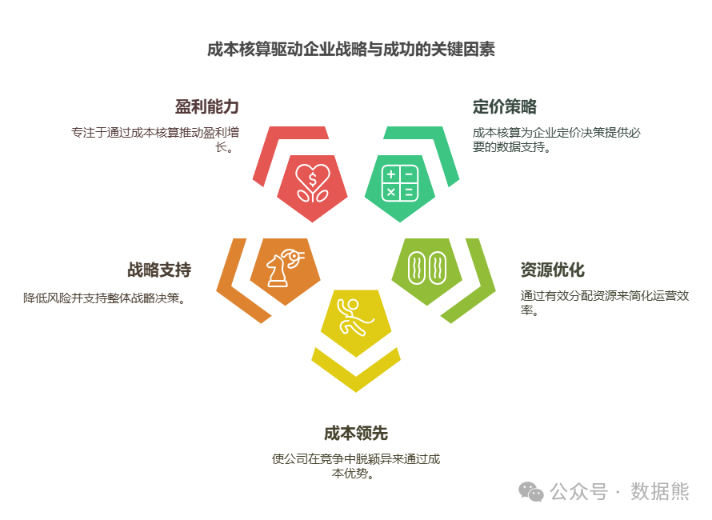
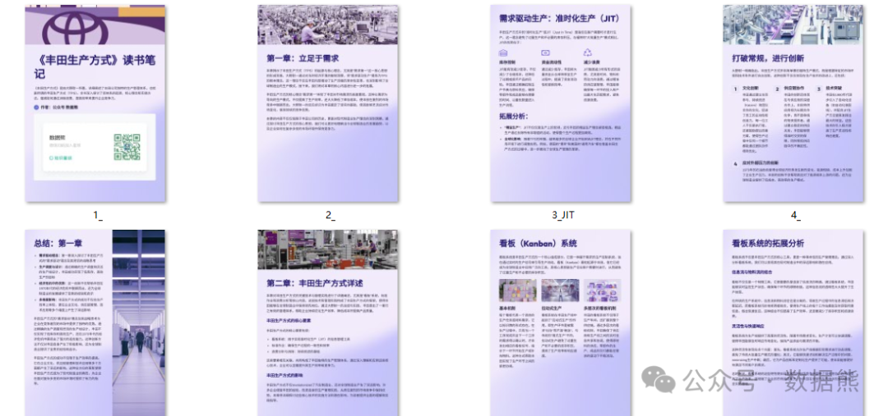

# ​成本核算如何影响公司战略

> 来源：微信公众号「数据熊」 · 作者 Data Bear · 发布于 2025-01-24 07:00  
> 原文链接：http://mp.weixin.qq.com/s?__biz=Mzg2MTg5OTgzNA==&mid=2247486711&idx=1&sn=a1ef7b650b7186bb5bf5c00c786403c0&chksm=ce1151a2f966d8b44592ae3374af5923c4c652ecef2480d5858653d55e8a20a68eec8015512c
> 摘要：无论是创业公司还是行业巨头，成本核算都是实现公司战略目标不可或缺的基石。未来，随着技术的不断发展，成本核算将更加精细化、智能化，帮助企业在日益复杂的市场环境中稳步前行。

在企业的日常运营中，成本控制和核算是至关重要的管理工具。无论是小型初创企业，还是大型跨国公司，成本核算的精准性都会直接影响到企业的战略方向和决策执行。今天，我们就来探讨一下成本核算在公司战略中的重要作用，看看它是如何成为企业成功的核心驱动力之一。
（文末可下载精美《丰田生产方式》读书笔记）

1. 成本核算为定价策略提供数据支持

定价是任何公司战略中的一个关键决策。为了在竞争激烈的市场中保持竞争力，企业必须为产品或服务设定合理的价格。精确的成本核算能够清晰地展现每个产品或服务的生产成本，进而帮助公司制定合适的定价策略。

通过了解各项成本构成，企业能够：

- 评估现有定价策略是否覆盖了成本并带来合理的利润。
- 设定更具竞争力的价格，在确保盈利的同时满足市场需求。
- 针对不同市场需求调整定价，从而灵活应对市场波动。

精准的成本核算不仅有助于优化定价，还能为企业在进行市场扩展、定制化服务或开发新产品时提供强有力的数据支持。

#### **2. 优化资源配置，提升运营效率**

一个清晰的成本核算体系可以帮助企业识别哪些资源消耗过高，哪些环节效率低下，从而对资源进行优化配置。特别是在企业扩展或转型的过程中，成本核算提供的数据能够帮助高层管理者做出决策。

例如，通过成本分析，企业能够：

- 发现生产线中的瓶颈或低效环节，并通过技术升级或流程优化加以改进。
- 评估各个部门、产品线或项目的盈利能力，进而对非核心业务进行剥离或精简。
- 调整人员配置或技术投入，最大化资源利用率。

通过对资源的合理配置和有效利用，企业能够在确保高效运营的同时，降低运营成本，增强市场竞争力。

#### **3. 成本领先战略：在竞争中脱颖而出**

在市场竞争中，低成本战略往往是企业获得竞争优势的重要武器之一。如果企业能够实现成本领先，就能在价格上占据优势，从而获得更大的市场份额。

精准的成本核算帮助企业：

- 实现生产或服务的低成本化，确保在同行中保持价格竞争力。
- 精细化管理每个环节的成本，避免浪费，并不断追求更高效的生产方式。
- 聚焦高利润、低成本的产品或业务，以最大化利润率。

成本领先战略不仅适用于生产型企业，对于服务型企业和科技公司等也同样有效。通过成本核算，企业能够在保持质量的前提下，提供具备市场竞争力的价格，打败竞争对手。

#### **4. 支持战略决策，降低企业风险**

战略决策往往伴随着较高的风险，尤其是在公司进行并购、投资或市场扩展时。精准的成本核算可以为这些决策提供数据支持，帮助高层管理者评估不同选项的成本效益，降低风险。

例如，在考虑新市场拓展时：

- 企业可以通过对不同市场的成本进行预测，分析其潜在收益与风险。
- 根据成本数据，评估是否值得进行大规模的资本投入。
- 分析并购或合作中可能涉及的整合成本，确保兼并后的协同效应。

通过有效的成本核算，企业能够减少决策中的盲目性，确保战略决策更加科学合理。

#### **5. 推动盈利能力提升，确保可持续发展**

企业要想在激烈的市场竞争中立足并实现长远发展，必须保证持续的盈利能力。成本核算不仅是短期经营的工具，也是实现长期战略目标的关键支持。

通过精准的成本核算，企业能够：

- 清楚地了解哪些业务或产品贡献了最高的利润，哪些则可能导致资金流失。
- 提升对盈利模式的掌控，优化核心产品和业务，减少低效投资。
- 在扩张时控制不必要的成本，确保资金的合理流动。

更重要的是，精细化的成本管理能够为企业打造可持续的盈利模式，使其在变动的市场环境中依然能够保持竞争力和盈利能力。

#### **6. 结语**

成本核算不仅仅是财务部门的工作，它是企业战略层面的核心组成部分。精准的成本数据帮助企业优化定价策略、提高资源利用效率、实施低成本战略、支持战略决策以及提升盈利能力。通过科学的成本核算，企业能够做出更为明智和精准的决策，从而在竞争中占得先机。

数据熊为大家精心准备了《丰田生产方式》读书笔记，点击文末左下角

阅读原文

或扫描二维码

下载。

点赞和转发

是最大的支持，
关注数据熊
，工作更轻松。
