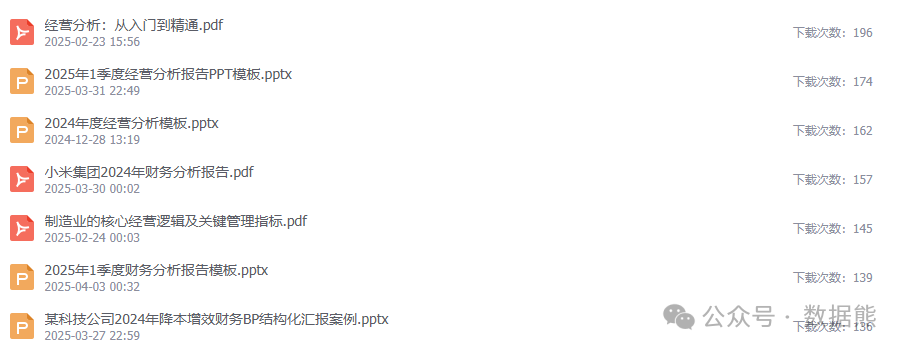

# 资产负债表，真的很简单！

> 来源：微信公众号「数据熊」 · 作者 Data Bear · 发布于 2025-04-14 07:00  
> 原文链接：http://mp.weixin.qq.com/s?__biz=Mzg2MTg5OTgzNA==&mid=2247487872&idx=1&sn=be6e6b3b527890e3001e3aabca82af3f&chksm=ce114cd5f966c5c3cd839b893bd359d55b7236c804445914d56ba06eb78b7b78a92d059e1553
> 摘要：资产负债表，就像一张展示公司在某个特定时间点“财富状况”的照片，反映的是公司的财务健康程度。

你是不是每次看到资产负债表，就头疼得不行？满眼的专业名词，总觉得像天书一样？其实，资产负债表真的很简单！今天，我就用最接地气、最容易理解的方式，给你讲清楚资产负债表里各科目到底在说些什么。

资产负债表，

就像一张展示公司在某个特定时间点“财富状况”的照片，反映的是公司的

财务健康程度

。

它由三大部分组成：

- 资产

   ：公司拥有的资源
- 负债

   ：公司欠别人的钱
- 所有者权益

   ：属于股东的那部分财富

---

## 一、资产类科目

### 1. 流动资产（短期内可变现）

- 货币资金

   ：公司账户里的现金和存款

   就像你钱包里的钱和银行卡余额
- 应收账款

   ：卖东西还没收到的钱

   类似你借钱给别人还没要回来
- 预付账款

   ：提前付款，等待货到

   就像你网购时的预付款
- 应收票据

   ：商业汇票或银行票据

   别人给你的一张未来可兑付的支票
- 存货

   ：商品、原材料等库存

   你家里囤的物资
- 其他应收款

   ：各种零散应收款

   如押金、备用金
- 存出投资款

   ：临时存入的投资款

   你临时投出去的钱，还没正式变为投资
- 待摊费用

   ：已支付但尚未享受的费用

   比如预付的房租或保险

---

### 2. 非流动资产（长期持有）

- 固定资产

   ：房子、设备、汽车等

   类似你买的房和车
- 累计折旧

   ：固定资产的“旧”值

   像你车子用了几年后的折旧
- 在建工程

   ：还在建设中的项目

   正在装修的新房
- 无形资产

   ：商标、专利等

   你自己的技能或品牌
- 长期股权投资

   ：对其他企业的长期投资

   你买了朋友公司的股份
- 递延所得税资产

   ：未来可抵扣的税

   像你将来能省下的税钱

---

## 二、负债类科目

### 1. 流动负债（一年内需偿还）

- 短期借款

   ：一年内需还的贷款

   比如你的信用卡或朋友短期借款
- 应付账款

   ：欠供应商的钱

   买了东西但还没结账
- 应付票据

   ：以票据形式欠的钱

   像你签了一张支票
- 预收账款

   ：提前收客户的钱但还没发货

   你开网店收到预付款
- 应付职工薪酬

   ：员工工资奖金

   你请人干活还没结工资
- 应交税费

   ：已经产生但未缴的税

   像你该交但还没交的个人所得税
- 应付利息

   ：贷款的利息

   你欠银行的利息
- 应付股利

   ：还没发放的股东分红

   像你答应分红还没给出的钱
- 其他应付款

   ：其他零散应付项目

   你欠别人的各种“杂账”

---

### 2. 非流动负债（超过一年偿还）

- 长期借款

   ：超过一年偿还的贷款

   如房贷、车贷
- 应付债券

   ：公司发行的债券

   你借了别人的钱，还给了欠条
- 长期应付款

   ：长期要还的钱

   像分期付款的大额债务
- 预计负债

   ：预期会发生的损失

   比如预估的赔偿或诉讼费用
- 递延所得税负债

   ：将来可能要交的税

   像你“未来要补交”的税

---

## 三、所有者权益（属于股东的“净资产”）

- 实收资本（股本）

   ：股东最初投入的资金

   类似你创业投入的本金
- 资本公积

   ：超出股本部分的额外投入

   额外赞助的钱
- 盈余公积

   ：历年提取的利润留存

   你存下的“家庭应急基金”
- 未分配利润

   ：累计未分红的利润

   你存在账上的积蓄
- 其他综合收益

   ：非经营性收益或损失

   像汇率变动引起的财产增减

---

## 四、资产负债表的核心公式

资产 = 负债 + 所有者权益

这个公式说明：

公司拥有的资产 = 借来的钱（负债） + 自己的投入和盈利（所有者权益）

换句话说：

公司所有的资源，要么是借来的，要么是自己赚来的。

看懂资产负债表，就像在看公司的一张X光片，不仅能看它“有多少钱”，还能看它“欠多少钱”和“真正属于股东多少钱”。

点击

阅读原文

，获

取《

小米集团2024年财务分析报告

》及其他更多精彩案例。

往期推荐

财务三大报表的勾稽关系，看这篇就够了！

2025年一季度财务分析报告模板（附PPT模板）

2025年1季度经营分析报告模板（含ppt模板）

预算的关键从来不是准不准确

如何通俗的看懂财务三大报表？
