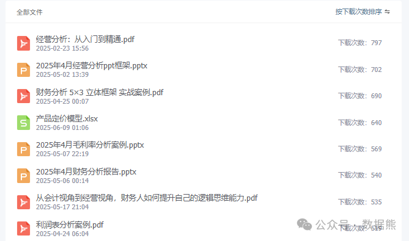

# 利润黑洞：应收账款和存货的主要风险点与控制措施

> 来源：微信公众号「数据熊」 · 作者 Data Bear · 发布于 2025-07-13 07:00
> 原文链接：http://mp.weixin.qq.com/s?__biz=Mzg2MTg5OTgzNA==&mid=2247488591&idx=1&sn=ecd1a9a9e56fb7160c7bea1d2d0e662d&chksm=ce11491af966c00c2157fca0df83bdfbdc38c6d98d96653b8bba678bf9c06a555eaabd8a3020
> 摘要：真正的勇士，敢于直面呆坏账与过季品，也敢于正视枯燥的盘点。

> 由于公众号推送机制调整，如您不想错过「数据熊」的文章，请务必
>
> 把我们设为星标
>
> ：点文章左上角
>
> 蓝色“数据熊”
>
>  → 主页右上角
>
> “…”
>
>  → 设为星标，这样每篇干货都能第一时间抵达你的订阅列表！

---

前段时间，接触了一个师兄的芯片进口公司，扫了一眼资产负债表，未分配利润是正很多的，资产负债结构看着挺正常，但当深入了解了他的应收款和存货后，我直接了当的告诉他：

师兄，你在亏损。

他的表情很复杂，也许是不愿意面对现实，很着急的对我的结论做了反驳，我也再未争论，我知道他心里是有底的，只是很难有勇气去承认，我也知道这个环境下比任何时候更需要信心和信念。

我的判断主要基于两点： 1、

芯片库龄两年以上的占比过多

，其实受摩尔定律影响，芯片的生命周期很多，基本1年半后就可能会有30%以上的价格降幅，这块其实有很大的一个减值； 2、

应收款账龄过长

，且碍于情面，没有进行有效的催收，很多是已经过了诉讼时效的。

其实，师兄的这种情况，在企业很常见，看似赚了很多钱，都沉淀在了存货和应收上，没有进行有效的管理和准确的核算，

最终被表面的利润迷惑

，持续做出错误的决策，等损失兑现到现金流的时候已经为时已晚。

那么，我们是否有办法对应收和存货进行管理呢？答案是肯定的，下面我们就来聊聊怎么来管理这两个利润黑洞。

---

## 一、为什么说它们是“黑洞”？

- 体量大

   ：在多数公司里，应收和存货占用了 40% 以上的流动资产。
- 链条长

   ：一个在前端，一个在后端，跨越销售、采购、仓储、生产等多个环节。
- 信息杂

   ：任何一个环节数据失真，都可能让利润凭空“蒸发”。

---

## 二、应收账款：六大风险点与对策

| 风险点 | 具体表现 | 关键控制措施 |
|---|---|---|
| **1. 信用风险** | 客户资质不清、授信过度 | 建立**白名单+黑名单**制度；引入第三方征信；采用分层授信与动态额度 |
| **2. 账龄失控** | 逾期账款久拖不收 | 制定 **T+X 天自动预警**；逾期分级催收；引入律师函与保全措施 |
| **3. 票据/合同缺陷** | 发票、合同不匹配或缺失 | 统一合同模板，签前法务审查；使用**电子合同系统**锁定关键条款 |
| **4. 价格与折扣争议** | 销售随意打折、对账困难 | 建立**折扣审批流**；系统自动比价锁价；月度对账——销售、财务双确认 |
| **5. 资金占用无感** | 只看收入不看现金 | 财务推送 **DSO（平均收款天数）排行榜**，让业务“有痛感”；对超标团队扣减绩效 |
| **6. 内外部舞弊** | 虚假销售、恶意坏账 | CRM 与 ERP 全链路对接；**交叉复核**（销售、物流、财务三方）；每年滚动审计 |

> 小贴士
>
> - 设计
>
>    “最后一公里”
>
>     责任制：明确谁对款项最终回收负责。
> - 逾期 90 天就要启动“止损模式”——考虑转让、诉讼或计提坏账，别让坏账拖成死账。

---

## 三、存货：五大风险点与对策

| 风险点 | 具体表现 | 关键控制措施 |
|---|---|---|
| **1. 呆滞与减值** | 周转慢、市场价格倒挂 | **ABC 分类 + 安全库存**；滚动需求预测；季度减值测试 |
| **2. 盘亏与损耗** | 账实差异、报废高企 | 定期**循环盘点**；WMS 条码追踪；异常差异必须责任到人 |
| **3. 记录不准** | 手工录入、多系统不一致 | 采购、仓储、生产全流程**扫码入库**；ERP 单一数据源 |
| **4. 成本核算混乱** | 多计/少计成本 | 采用**移动加权平均或批次管理**；月结前锁账、严禁倒冲 |
| **5. 供应链中断** | 断料、急单频现 | 双供应商策略；**安全库存 + 弹性产能**；与关键供应商签 SLA |

> 小贴士
>
> - 关注
>
>    库存周转率
>
>     与
>
>    存货天数
>
>    ，将指标分解到 SKU 级。
> - 用
>
>    Power BI 仓储仪表盘
>
>     自动亮红灯——坏消息先到，决策才来得及。

---

## 四、数字化让控制更“聪明”

1. 自动预警

    ：应收逾期、库存超储即时提醒。
2. 数据可视化

    ：Power BI、Tableau 等工具让风险“会说话”。
3. 流程机器人

     (RPA)：自动抓取发票、催收邮件、生成盘点差异报告。
4. AI 预测

    ：基于历史行为预测收款概率或销量，提前调度现金与产能。

---

## 五、打造稳健的风险文化

- “一把手”工程

   ：逾期与呆滞情况进入月度经营例会。
- 跨部门共管

   ：销售、采购、生产、仓储、财务成立

   风险联席小组

   。
- 绩效绑定

   ：把 DSO、周转天数纳入 KPI，与奖金挂钩。
- 持续迭代

   ：每半年复盘流程与指标，紧跟业务节奏。

---

## 六、结语

利润黑洞不可怕，可怕的是你没有一束探照灯。把应收和存货的“黑暗角落”照亮，你就能守住企业的现金脉搏，也能为利润添上一层坚固的护盾。

点击
阅读原文
获取完整版《

财务分析报告PPT模板

》。

加入

数据熊的财务精进营

，与1800+财务精英共同成长。后台点击
「经典文章」阅读数据熊10W+爆文，数据熊微信：

Daniel-songyq。

点赞

、

转发和在看

就是最大的支持，关注数据熊，工作更轻松。

