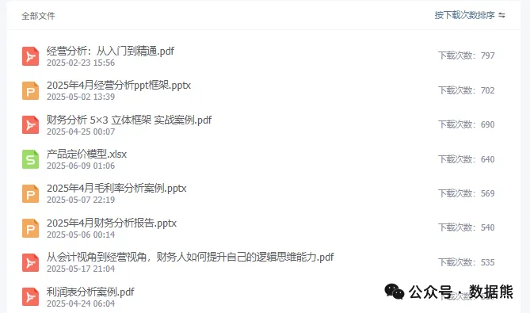

# 库存管理，结构才是问题所在

> 来源：微信公众号「数据熊」 · 作者 Data Bear · 发布于 2025-07-20 07:00
> 原文链接：http://mp.weixin.qq.com/s?__biz=Mzg2MTg5OTgzNA==&mid=2247488652&idx=2&sn=01e93ea7e46ef9ab7039cc89ff70f5be&chksm=ce1149d9f966c0cf6d47038d14c24c766fb0dc1da167cf743ada201130a54ec4ff11320f663b
> 摘要：结构优化，才是解决库存问题、提高企业盈利能力的根本所在。

> 由于公众号推送机制调整，如您不想错过「数据熊」的文章，请务必
>
> 把我们设为星标
>
> ：点文章左上角
>
> 蓝色“数据熊”
>
>  → 主页右上角
>
> “…”
>
>  → 设为星标，这样每篇干货都能第一时间抵达你的订阅列表！

在数据熊多年的财务管理经历中，经常听到企业老板抱怨：“库存量已经降得很低了，为什么还是现金流紧张？”其实，这背后最核心的问题往往不是库存总量，而是库存结构出了问题。

今天，我们就来好好聊聊库存管理中的“结构”问题。

## 一、库存结构失衡，问题究竟在哪？

库存结构问题主要表现为：

- 畅销品缺货

   ：导致客户满意度降低，错失市场机会。
- 滞销品积压

   ：占用大量资金，仓储成本和折旧成本居高不下。
- 周转率不平衡

   ：整体库存周转看似正常，实际存在严重偏差。

这些问题看似简单，却在无形中蚕食企业利润，削弱竞争力。

## 二、造成库存结构问题的原因

数据熊总结了以下几种常见原因：

### （一）需求预测不精准

很多企业在预测销售时，习惯于简单套用历史数据，忽视了市场变化、季节性波动、客户需求转移等因素，造成产品库存错配。

### （二）缺乏库存分类管理

没有对库存进行ABC分类管理，无法精准掌控每种产品的库存策略，结果往往是畅销品紧缺，滞销品积压。

### （三）反应速度慢

市场需求变化快，库存管理如果反应迟缓，就容易导致库存结构失衡，无法及时调整策略。

## 三、如何解决库存结构问题？

针对库存结构问题，数据熊提出三点建议：

### （一）精准分类，差异管理

将产品分为：

- A类

   ：销量高、周转快，应确保稳定供应。
- B类

   ：适中销量，合理库存即可。
- C类

   ：销量低，应严格控制库存，尽量实现零库存或低库存。

分类明确，管理更有效率。

### （二）建立预测模型，提升预测精准度

结合大数据技术和市场趋势分析，建立动态需求预测模型，实时更新库存策略，避免结构性偏差。

### （三）构建库存预警机制

针对重点产品建立库存预警机制，当库存达到预设阈值时自动触发调整措施，确保畅销产品持续供应，滞销产品及时消化。

## 四、结构优化后的效果

库存结构优化不仅能解决资金占用问题，还能：

- 提升客户服务水平

   ，避免客户流失。
- 降低库存资金占用

   ，提高现金流效率。
- 提高企业抗风险能力

   ，经营更稳健。

## 数据熊有话说

库存管理的本质，不仅仅是降低库存量，更重要的是优化库存结构。结构优化，才是解决库存问题、提高企业盈利能力的根本所在。

#财务BP

#经营分析

#财务

#业财融合

#财务分析

#财务总监

#述职报告

#PPT模板

点击
阅读原文
阅读

《

美的集团成本管理体系

》。

加入

数据熊的财务精进营

，与1900+财务精英共同成长。后台点击
「经典文章」阅读数据熊10W+爆文，数据熊微信：

Daniel-songyq。

点赞

、

转发和在看

就是最大的支持，关注数据熊，工作更轻松。

