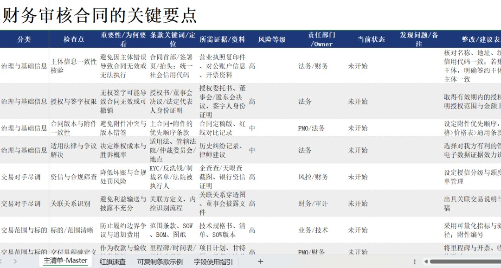

# 财务审核合同的关键要点清单

> 来源：微信公众号「数据熊」 · 作者 数据熊 · 发布于 2025-10-05 08:00
> 原文链接：http://mp.weixin.qq.com/s?__biz=Mzg2MTg5OTgzNA==&mid=2247490163&idx=1&sn=cd6815c8385b5d84ccf986b8fd7f5cdc&chksm=ce114726f966ce30e012ef647751ea81c2387f77f4cf9700921b40036c35e696295d6d436ad9
> 摘要：很多企业“利润在报表、风险在合同”。对合同风险把关不严，可能最终导致严重的财务风险，这样的事，数据熊经历过多次，数额高达数亿元。

很多企业“利润在报表、风险在合同”。对合同风险把关不严，可能最终导致严重的财务风险，这样的事，数据熊经历过多次，数额高达数亿元。

财务不是法务的替身，但财务视角能更早识别现金流与税务风险，把好合同入口关，避免“执行阶段救火”。

文末有excel版的审核要点清单，有需要的可前往下载。

## 一、合同审核的目标与定位

在动笔前要统一“财务为什么看”。目标越清，标准越稳。

要点：

- 风险前置

   ：在签署前控制资金、税务、内控、合规风险。
- 价值导向

   ：确保毛利模型、现金流节奏与预算匹配。
- 分工协同

   ：法务审法律效力与权利义务，财务补位价格、发票、结算、资金安全。
- 留痕与可审计

   ：形成可追溯链条，便于稽核与内控评价。

## 二、签署前置资料清单（进入审核的“门槛”）

没有材料，谈不上审核；先把“门槛”立住。

必备清单：

1. 立项/报价审批单、预算匹配证明（含毛利测算）。
2. 交易对手资信材料（营业执照、实控人、纳税/风控记录、黑名单筛查）。
3. 业务方案与SOW/技术规格/BOM/服务边界。
4. 价格构成、税率、发票类型与开票节奏说明。
5. 付款计划、保证金/预付款担保安排。
6. 交付、验收与售后方案；里程碑与证据模板。
7. 关联交易说明（如适用）及内部定价底稿。
8. 特殊合规：数据/隐私、出口管制、资质许可等（视行业）。

## 三、财务必看的核心条款（逐条“扣风险”）

逐项检查能减少遗漏，以下从现金流→利润→合规三条主线切。

### 1. 交易对手与范围

先确认“和谁、做什么”。

- 对手信息

   ：名称一致性、资质有效期、授权签字人。
- 合同范围

   ：标的清晰、数量/规格/服务边界明确；附件优先级与冲突条款。

### 2. 价格与税费模型

利润从价格结构开始泄露。

- 含/不含税

   ：写清税率与税负变化分担。
- 调价机制

   ：原材料联动条款、汇率/指数调整、封顶/底价。
- 价税分离

   ：避免“价外费用”；运输、安装、保险等费用归属。

### 3. 付款与资金安全

现金流是生命线。

- 付款条件

   ：分期与里程碑（预付款→进度款→尾款），与验收/发票/保函挂钩。
- 保障工具

   ：预付款保函、履约保函、保理/信用证/见索即付保函。
- 逾期利息

   ：明确标准与起算点；设置冲抵权。

### 4. 交付、验收与售后

没有验收标准，风险全在执行端。

- 验收标准

   ：客观可测、样机/样品/测试报告、第三方检测。
- 证据链

   ：到货单、安装调试记录、联调报告、用户签字。
- 售后边界

   ：质保期、响应时效、易耗件与人力费用归属。

### 5. 违约、赔偿与限责

把“最坏情况”写在纸上。

- 违约情形

   ：延迟交付/付款、质量不合格、擅自转让。
- 赔偿范围

   ：间接损失排除与总赔偿上限（如合同总额的X%）。
- 不可抗力

   ：定义、通知、证据、责任分担。

### 6. 发票与税务合规

税务问题往往“后知后觉”，要前置约定。

- 发票类型

   ：专票/普票、开票抬头、税号、开票时间节点。
- 发票与收款/验收的勾连

   ：先票后款/先款后票，抵扣风险。
- 代扣代缴

   ：跨境服务、个税、印花税、环保税等提示。

### 7. 结算、对账与资料留存

对账做不好，坏账概率倍增。

- 对账周期与方式

   ：月/季/单项目，逾期不异议视为确认。
- 结算资料

   ：对账单、发货/完工/验收/服务单证据模板。
- 电子签章与存档

   ：原件/电子件等同性与查验方式。

### 8. 保密、知识产权与数据合规

技术与数据是资产。

- IP归属

   ：成果权、使用许可、侵权责任与第三方权利保证。
- 保密范围与期限

   ：涉密级别、例外情形、违约责任。
- 数据合规

   ：个人信息、跨境传输、数据分级与审计权。

### 9. 担保、抵押与履约工具

用条款把“信用”变成“资产”。

- 担保方式

   ：连带/一般保证、抵质押物清单、估值与处置。
- 触发机制

   ：哪些情况可调用保函/担保？
- 交叉违约

   ：与其他合同联动条款。

### 10. 争议解决与适用法律

争议条款决定“维权成本”。

- 管辖

   ：被告所在地/仲裁委员会；地点与语言。
- 取证便利

   ：证据规则、电子数据的效力确认。

## 四、不同合同类型的专项关注点

不同类型，不同雷区。

- 采购合同

   （原材料/设备）：价格联动、质量标准、到货验收、保修与备件、供应商评审与绩效。
- 销售合同

   （分销/直销）：信用期与授信边界、退换货与回购、价格保护、渠道合规。
- 服务合同

   （咨询/维保/物流）：SLA指标、人天计费与核算、成果物交付、涉税身份与代扣。
- 工程/施工

   ：清单计价、变更签证、进度款与安全文明施工费、质保金比例与释放条件。
- 租赁

   （房屋/设备/融资租赁）：租金递增、税率与发票、维修责任、提前解约违约金、IFRS/准则影响。
- 软件/SaaS/授权

   ：账户数/并发/节点限制、版本升级、数据迁移、停服与数据取回。
- 关联交易框架

   ：转移定价方法、可比性分析、成本加成率、信息披露与董事会/股东会审批。
- 跨境合同

   ：汇率条款、税收协定、代扣税、外汇收支与合规申报。

## 五、十个高频红旗（出现任一项，需升级评审）

红旗是“停一停”的信号，而不是“硬上车”。

1. 对手资质可疑、授权不清或签字人无权。
2. 价格“含糊”或价外费用多、调价无边界。
3. 预付款高于行业惯例但无保函/抵押。
4. 验收标准不量化、证据链缺失。
5. 付款与发票约定相互矛盾或不可执行。
6. 违约责任单边苛刻且无上限。
7. 跨境代扣安排缺失；税率写错或留空。
8. 数据/IP归属不清，成果可被对方自由再授权。
9. 对账机制缺失、对账周期过长。
10. 重大变更/转包未经甲方书面批准。

## 六、常见风险场景与处理建议

把坑列给你，看见就能绕开。

- “先款后票但发票长期不开”

   ：设置最长期限与违约金，逾期可暂停履行/抵销。
- “样机验收不清导致尾款卡死”

   ：引入第三方测试/性能阈值，里程碑达成即视为通过。
- “项目变更口头约定”

   ：必须书面变更单+价格调整+进度顺延。
- “渠道压货与价格保护”

   ：设定库存周转目标与返利条件；价格保护以书面通知触发。
- “只约定‘开专票’，未写税率”

   ：明确适用税率与政策变化分担原则。
- “质保金释放无条件”

   ：与最终验收/无缺陷期绑定；允许以保函替代现金占用。

## 七、流程与留痕（落地操作怎么做）

流程做对，风险自然降。

- 分级审批

   ：按金额、交易类型、风险等级设置授权矩阵。
- 并行评审

   ：业务、法务、财务、技术四线并行，缩短周期。
- 版本控制

   ：仅评审“定稿版”，统一留痕（红线对比、变更记录）。
- 归档规范

   ：合同正本、盖章页、附件、往来邮件、对账/验收/开票/收付款凭证一并归档。
- 复盘与黑名单

   ：违约或重大争议纳入供应商/客户分级管理。

## 八、财务审核结论模板（可直接套用）

让意见标准化，沟通更高效。

模板示例：

- 结论

   ：通过/限条件通过/不通过。
- 主要风险点

   ：逐条列示（付款、发票、验收、违约、税务、数据/IP）。
- 整改要求

   ：对应条款修改建议与替代表述。
- 跟踪事项

   ：谁在何时前完成（含保函、资质补充、里程碑证据模板）。
- 保留意见

   ：如对手信用、行业政策不确定性等。

## 九、随文工具包（迷你检查清单）

临签前快速过一遍，心里更有底。

- 税率/发票类型/开票节点一致且可执行。
- 付款节点与验收/对账/发票三点闭环。
- 验收标准可量化、有样例或第三方报告。
- 违约限责有上限，不承担间接/连带损失（除非业务争取）。
- 预付款/质保金有保函或对冲条款。
- 变更需书面签署并匹配价格与进度。
- 数据/IP归属明确，停服可取回数据。
- 争议解决与适用法、管辖地对我方更有利。
- 归档材料清单完整，可追溯。

---

## 数据熊说

合同是经营的“骨架”，利润与现金流是“血液”。财务把好合同关，不是替别人挑刺，而是替公司护城。用清单化、模板化与证据化，才能把“经验主义”变成“体系能力”。

点击

阅读原文

获取

excel版预算套表

工作没思路，困惑没人问？赶快加入

数据熊的粉丝群

，与2300+财务精英共同成长。

PowerBI看板

定制添加数据熊微信：

