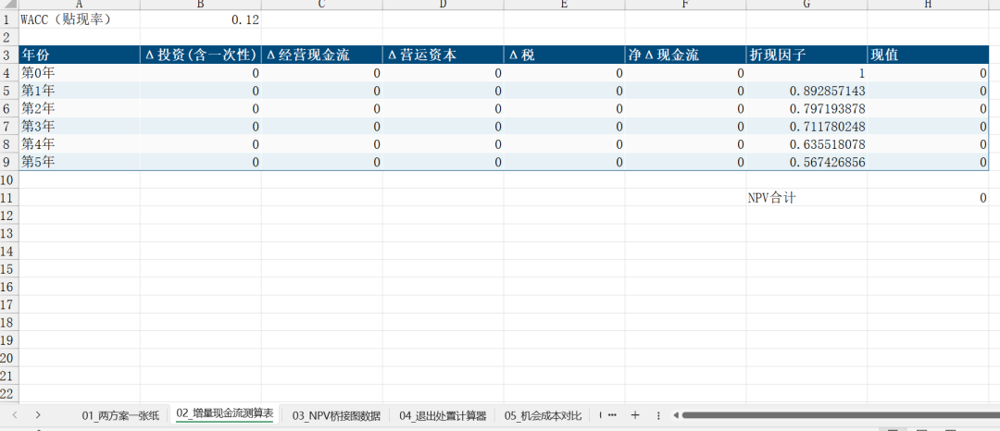

# 沉没成本，不能参与重大决策！

> 来源：微信公众号「数据熊」 · 作者 宋岳清 · 发布于 2025-10-06 07:30
> 原文链接：http://mp.weixin.qq.com/s?__biz=Mzg2MTg5OTgzNA==&mid=2247490172&idx=1&sn=b789ac297cedcc35b889d12390e07a45&chksm=ce114729f966ce3f083b468b45d2b669abf721094842bb0b207801d9b607c0a5988c555fe96e
> 摘要：很多企业不是“不会算账”，而是不肯从今天重新开始算。重大决策，只看未来的增量价值；过去花掉的，最多写进复盘。

很多企业不是“不会算账”，而是

不肯从今天重新开始算

。重大决策，只看未来的增量价值；过去花掉的，最多写进复盘。

数据熊也见过很多决策者，深陷沉没成本陷阱，背后更多的是不敢去面对失败，承认错误。

今天，数据熊就和大家一起看下，如何避免成本成本影响重大决策。文末有

《反沉没成本决策工具包.xlsx》下载方式，有需要的朋友可以前往获取。

---

## 1｜把话说直白点：什么该算沉没，什么不该算（附口袋辨别法）

别让术语挡路，先把边界划清楚。

- 沉没成本

   ：已发生、不可收回（历史研发费、一次性实施费、安装调试、培训、已支出的前期咨询）。

   一律不进新决策表。
- 可避免成本

   ：因“做/不做”而改变的未来支出（追加采购、增员、续费、再营销）。

   必须纳入。
- 机会成本

   ：把资源转投到下一最佳方案的可得净现值。

   同样必须纳入。
- 一句话版

   ：从“今天”起点，只比较

   未来增量现金流

   （含机会成本），其他历史项全部剔除。

口袋辨别法（进会前30秒自测）

拿起每一笔成本问三句：

1. “

    钱已花了吗？

    ” 已花=候选沉没。
2. “

    能退吗？

    ” 不能退=沉没。
3. “

    我今天不做了，这笔还要付吗？

    ” 还要付=非沉没；不要付=沉没。 连续“是—否—否”，基本可判为沉没。

微案例｜备件呆料处置

- 备件入库成本200万（历史），当前二手处置净回收80万，处置费用5万；若继续持有，预计两年后可能用上，等值现金流折现后仅60万。
- 比较

   ：处置NPV=80-5=75万；持有NPV=60万 → 当场拍板：处置。200万入库价只在复盘里讨论，不进今天的计算。

---

## 2｜为什么总被坑：四个真实心理拉扯（附拆招）

数字之外，人心最难改。先认出偏误，再对症下药。

1. 承诺升级

    ：“都投了这么多，再坚持一下吧。”
2. 损失厌恶

    ：承认错误像“疼痛”，于是拖延。
3. 拥有感

    ：摸过的设备、搭过的团队，容易“护犊子”。
4. 沉没谬误

    ：把历史投入当未来收益的“保险”。

微对话｜会上一分钟破局

- 话术： “把已发生当作历史照片，我们从

   今天这帧

   开始算：再投1块钱，稳回几毛？不如把人和产能给B项目，那里每块钱能回0.4的NPV。”

---

## 3｜三个现场小案例：把你拉进决策室（带数字+走心细节）

不讲抽象，直接进入会场。

案例A｜产线二期要不要上

工艺经理急：“一期都装好了，二期再顶一下。”

- 已投入：模具/安装/培训

   1,000万（沉没）
- 继续二期：再投

   500万

   ；五年新增自由现金流（折现）

   400万
- 退出：二手处置净回收

   300万
- 算式

   ：NPV(继续)=400−500=

   −100万

   ；NPV(退出)=

   +300万
- 决定

   ：退出。董事长的原话：“不让一笔错账套住未来五年的现金流。”
- 复盘要点

   ：需求假设过于乐观、单体良率爬坡曲线被低估、外包工治具交付节拍失真——这些写进

   假设库

   ，别写进“再投理由”。

案例B｜营销投放“要不要加码”

市场说：“上季度烧了300万，这季度不加码等于白烧。”

- 上季300万=

   沉没
- 新投

   100万

    → 新增净现金流（折现）

   120万

    → 增量NPV

   +20万
- 但渠道B：同样100万能出

   +40万
- 决定

   ：优先B，A可做小额AB试验。
- 落地

   ：把“

   每100万投放的增量NPV

   ”写进渠道周报，不再说“曝光”“转化率”的空话。

案例C｜并购后系统去留

IT部提案：“既然上了，就续费+二开。”

- 续费+二开：三年总成本

   260万

   ，效率价值（折现）

   180万

    → NPV

   −80万
- 统一切换SaaS：一次性切换

   90万

    + 三年订阅

   120万

   ，效率价值

   240万

    → NPV

   +30万
- 决定

   ：切换。
- 附加收益

   ：流程统一缩短MRO采购周期2天，释放周转金约

   1,500万×2/365≈82万/年

    的财务费用节省（按8%测算）。

---

## 4｜一张“增量现金流判定卡”：5问快决策（附简易算式）

贴在会议室门口，进门先过一遍。

1. 从零开始还会做吗？

    （如果答案是否，80%该停）
2. 边际收益 vs. 边际成本？
3. 下一最佳方案的吸引力？
4. 退出一次性成本 vs. 持有拖延成本？
5. 风险调整后还划算吗？

微案例｜研发止损闸门

- 里程碑M1：样机效率≥目标的85%，单元良率≥92%（未达标即停）。
- 里程碑M2：试产1000小时MTBF≥X，材料毛利≥Y（未达标即停或小改款再评审）。
- 每过一门再投一次钱，

   每次只买“下一个里程碑的试错权”

   。

---

## 5｜怎么跟老板说：三段式对话稿（附“不同风格上级”的改写）

把抽象翻成白话，减少情绪摩擦。

> 第一句（重置时点）
>
> “把已发生当作历史照片，我们从今天这帧开始算：接下来每1块钱值不值得投。”

> 第二句（摆出选项）
>
> “A继续：再投X，折现回收Y；B退出：回收Z，把人/产能转到B项目（NPV更高且周期更短）。”

> 第三句（给判定线）
>
> “按WACC=K%，B的NPV高出A
>
> Q万元
>
> ，且风险更可控。建议
>
> 本周内
>
> 完成退出与复盘。”

针对不同上级的改写

- 偏稳健型

   ：“B方案现金回收更快，账上流动性立即改善。”
- 偏进攻型

   ：“退出后，我们能把产能投向毛利更高的B项目，三个月内拉升整体GM 1.2pt。”
- 数据控

   ：附一页“ΔNPV桥接图”和“里程碑-止损线”。

---

## 6｜别靠记性：把“反沉没”写进机制（附模板清单）

一次识别，不如

机制固化

。

- 制度条款（可直接抄）

   > “任何延续性投入的立项评审，须提交
   >
   > 仅含未来增量现金流
   >
   > 的测算表与
   >
   > 机会成本说明
   >
   > ；凡引用历史投入作为续投理由者，一律退回修改。”
- 评审材料硬要求
- 止损触发器
- 周/月度看板

   （三行就够）
- 复盘只做两件事

   ：

简易模板｜“两方案一张纸”

项目：________  决策日：______

WACC：__%

方案A（继续）    方案B（退出/替代）

Δ投资：_____      一次性成本：_____

Δ经营CF：____     现金回收：_____

Δ营运资本：____   资源再配NPV：____

Δ税：_____        Δ税：_____

NPV(A)：_____     NPV(B)：_____

结论：选择____，理由（≤60字）：________________

里程碑/止损线：指标___ 日期___ 责任人___

---

## 结语｜数据熊说

会做加法不稀奇，会做减法才见功力。别让一笔错账拴住未来，

勇敢从今天这一帧重算

，把钱和人用在净现值更高的地方。

往期推荐

酒店全面预算管理套表.xlsx

2026年全面预算套表.xlsx

2026年预算编制方案（附Excel套表）

盈亏平衡分析：案例与excel模板

资金预测：核心流程与常见方法（附Excel模型）

点击

阅读原文

获取

《反沉没成本决策工具包.xlsx》

工作没思路，困惑没人问？赶快加入

数据熊的粉丝群

，与2300+财务精英共同成长。

PowerBI看板

定制添加数据熊微信：

